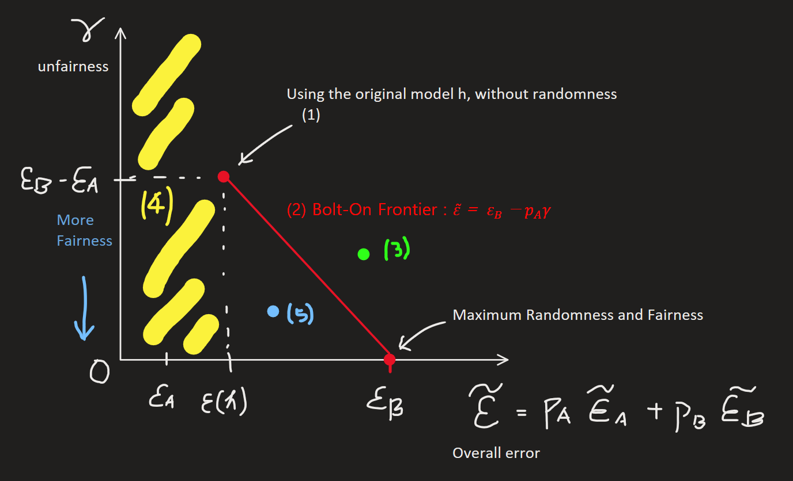
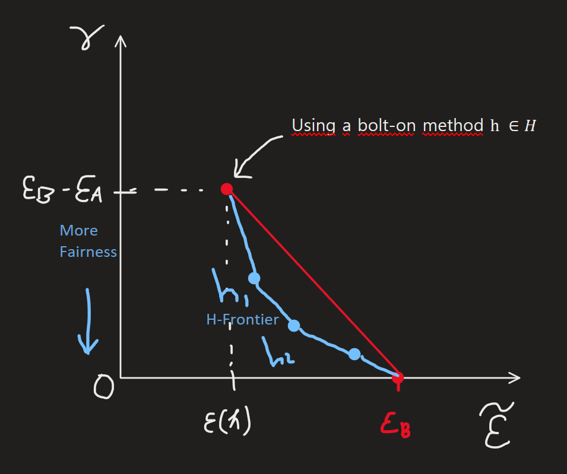

[Back to Main](../main.md)

# 3. Science of Fair ML: Models and Algorithms
Bias Mitigation

 

### Concept) Causes of Biases (Ways things can go wrong)
- Domain Specific Problems
  - Types)
    - Have much less data on some subgroup(s)
      - According to the [Fundamental Thm of ML](01.md#thm-fundamental-theorem-of-machine-learning), estimated error will not be close to the actual error from the true distribution.
      - Case when distribution between subgroups are different, and have plenty of data on certain subgroups, then the estimation cannot represent the whole population.
    - Features (missing features) favor/disfavor certain groups
      - e.g.) After school activity can reveal racial, financial status
      - Sol.) Add features
    - Some subgroups might be inherently harder to predict.
      - e.g.) 
        - First face recognition models were trained only with white male image data. 
        - Thus, it didn't work for black females.
    - Data might be biased in first place.
  - Prop)
    - Above problems can be exacerbated by the training process itself.
- Problem with model it self.
  - Model (training process) can somehow mitigate those domain specific problems.
- Feedback loop
  - e.g.) California used a system that send more police to area with high criminals. Then, due to the increased officers, more things are found.

 

### Concept) Fairness in ML
- Def.)
  - "Fairness" is typically a property of a **model**.
    - Here, the model refers to the result of the training process.
- Multiple types of fairness
  - [Group Fairness](#concept-group-fairness) (most common and covered in this class)
    - e.g.)
      - error in certain group
      - FPR, TPR in certain group
  - Individual Fairness (mainly philosophical)
    - e.g.) If similar input is given, similar output should come out.
      - $`\vert h(x_1) - h(x_2) \vert \le c\cdot d(x_1, x_2), \forall x_1,x_2\in\mathcal{D}`$
        - where $`c\in\mathbb{R}`$, $`d(x_1, x_2)`$ is a distance between two points.
          - Problems)
            - How to define $`d(x_1, x_2)`$ : philosophical and statistics cannot explain much
            - If $`d(x_1, x_2)`$ for $`\forall x_1, x_2`$ is added as the constraint to the optimization problem, complexity become $`O(n^2)`$. Too expensive.
  - Interpolations between groups and individuals
    - Although the model is fair by certain groups or individuals, it may not be fair for the mixture of those.
      - e.g.) Hispanic women earning 10K annually living in Philly...
  - Causal definition of Fairness
    - e.g.) Why certain group is underestimated?
    - Problem) Hard to prove the causal relationship. Cannot control!
  - Fair representation

 

### Concept) Group Fairness
- Desc.)
  - In this class we use **group fairness**!
- e.g.) Similar errors between the groups that we set up.
  - Problem with this)
    - To achieve group fairness, more constraint must be given to the optimization.
    - Then, some possible models that we could have achieved may be discarded due to the constraints.
    - We may discard possible models that are best for the global error.
      - e.g.) Consider the college admission among two groups.   
        
        - Settings)
          - Two groups colored in red and green.
          - In each group O denotes the students who should get admitted, and X are the opposite.
        - Resulting Classifiers)
          - Global optimum classifier but biased against green group.
          - Another one accomplishes the Group fairness but more error than global optimum
        - Sol.)
          - Best way to solve this is adding features that differentiate two groups.
          - But in social justice, the disclosure of some background information is regulated.
            - e.g.) Race

#### Concept) Giving randomness
- How)
  - Suppose we are classifying with flip coin, 0.5 probability.
    - if $`y=0`$ then false negative is 0
    - if $`y=1`$ then 0.5 chance of false negative.
      - i.e.) $`P(\hat{y}=0\vert y=1) =0.5`$
- e.g.) Lottery
  - This is tolerable because people are indifferent about the result of the lottery.
- In CS, algorithms utilize randomness for reasons.
  - Faster speed or security algorithms.
  - i.e.) they are valuable.
    - But would people allow this?

 

### Tech.) Bolt-on Mitigation with Selective Randomness
- Desc.)
  - Assume the trained model is given.
  - [Give randomness](#concept-giving-randomness) to mitigate the bias in the model and promote fairness.
- Settings)
  - Given trained classifier $`\hat{y} = h(x)`$ 
    - "bolt-on" fairness, post-processing 
      - i.e.) This model didn't care about fairness at first, and fix the fairness issue afterwards.
  - $`A, B`$ : two subgroups
    - Mutual exclusiveness : $`A\cap B = \emptyset, A\cup B = \mathcal{X}`$
    - $`\epsilon_A, \epsilon_B`$ : Given classification error of the trained model $`h`$ on $`A,B`$.
      - i.e.) $`\epsilon_i(h) = \text{Pr}[h(x)\ne y \vert x\in i], i\in\{A,B\}`$
  - Unfairness in the existing model
    - $`\epsilon_A \lneq \epsilon_B \lneq 0.5`$
      - $`\lneq`$ means strictly less than
      - $`h`$ is unfair on the point that $`\epsilon_A \lneq \epsilon_B`$
- Derivation)
  - Use [selective randomization](#tech-selective-randomization) to give randomness to the model.
  - Apply [fairness constraint](#tech-applying-fairness-constraints) depending on the goal.
  - Calculate the overall error $`\tilde{\epsilon}`$ given the unfairness metric $`\gamma`$.
    - Analysis) [Trade-off between overall error and fairness](#analysis-trade-off-between-overall-error-and-fairness) on $`\tilde{\epsilon}-\gamma`$ plane
  - Derive the [H-Frontier](#concept-h-frontier).
- Application)
  - Using other metrics than the error rate: [False Positive](#application-using-other-metrics--false-positive)
  - [Hardt et al. in this setting](#application-hardt-et-al-in-this-framework)

 

#### Tech.) Selective Randomization $`\tilde{h}(x)`$
- Why doing this?)
  - The classifier was given!
  - Only thing we can do is improving it by adding some randomness.
- New error rates after the randomization
  - Subgroup $`B`$
    - No randomness
      - i.e.) $`x\in B`$, use $`\hat{y} = h(x)`$
      - Thus, $`\widetilde{\epsilon_B} = \epsilon_B`$
  - Subgroup $`A`$
    - Apply randomness with the probability $`q_A`$.
      - How) If $`x\in A`$, 
        - $`\tilde{h}(x) = \begin{cases} 0.5 & \text{with prob. } q_A \\ h(x) & \text{with prob. } 1-q_A \end{cases}`$
          - i.e.) with the probability of $`q_A\in[0,1]`$, $`\hat{y} = \text{flip coin} = 0.5`$
    - Thus,   
      $`\begin{aligned}
        \widetilde{\epsilon_A} &= q_A \cdot (\text{flip coin}) + (1-q_A) \cdot \epsilon_A \\
        &= q_A \cdot 0.5 + (1-q_A) \cdot \epsilon_A \\
      \end{aligned}`$ 

#### Tech.) Applying Fairness Constraints
- $`\widetilde{\epsilon_B} = \widetilde{\epsilon_A}`$ : equalizing the error rate among groups
  - Then, we can get the optimal probability of applying randomness to the subgroup $`A`$ given the existing model $`h`$.
    - $`\displaystyle q_A^* = \frac{\epsilon_B - \epsilon_A}{0.5-\epsilon_A}`$
      - e.g.)
        - $`\epsilon_A = 0.05, \epsilon_B = 0.2`$
          - $`q^* = 0.33`$
        - $`\epsilon_A = 0.1, \epsilon_B = 0.2`$
          - Bigger the gap $`(\gamma)`$ between two subgroups, bigger fraction $`(q_A)`$ is needed for the equalization.
  - This is equivalent to $`\gamma = 0`$ in the below setting.
- $`\widetilde{\epsilon_A} = \widetilde{\epsilon_B} - \gamma, \; \exists\gamma\gt0`$ (Weakening the fairness demand)
  - $`\gamma = \widetilde{\epsilon_B} - \widetilde{\epsilon_A} \in [0, \epsilon_B-\epsilon_A]`$ denotes the unfairness, allowed difference between the groups
    - $`\gamma = 0`$ : absolute (maximum) fairness
    - $`\gamma = \epsilon_B - \epsilon_A`$ : no fairness ($`\widetilde{\epsilon_A} = \epsilon_A`$)
  - Then $`\displaystyle q^* = \frac{\epsilon_B - \gamma - \epsilon_A}{0.5-\epsilon_A}`$
    - Analysis) Flipping coin less compared to the equal error case.
    - $`\displaystyle \frac{\partial q^*}{\partial \gamma} \lt 0`$

 

#### Tech.) Calculating the Overall Error
- Suppose the population of the subgroups are $`p_A, p_B`$.
  - $`p_i = P_x(x\in i), i\in\{A,B\}`$
  - $`p_A + p_B = 1`$ (normalized!)
- Consider the above setting that uses $`\gamma`$ to denote the unfairness,
  - $`\widetilde{\epsilon_A} = \epsilon_B - \gamma`$
- Then the overall error goes   
  $`\begin{aligned}
    \widetilde{\epsilon} &= p_A \widetilde{\epsilon_A}+p_B \widetilde{\epsilon_B} \\
    &= p_A (\epsilon_B - \gamma)+p_B \epsilon_B & (\because \widetilde{\epsilon_A} = \epsilon_B - \gamma, \widetilde{\epsilon_B} = \epsilon_B) \\
    &= -p_A \gamma + (p_A + p_B)\epsilon_B \\
    &= -p_A \gamma + \epsilon_B & (\because p_A + p_B=1) \\
  \end{aligned}`$
  - e.g.)
    - $`\epsilon_A = 0.05, \epsilon_B = 0.2, p_A = 0.7, \gamma = 0.03`$
      - $`q^* = \frac{0.2-0.05-0.03}{0.5-0.05} \approx 0.267`$
      - $`\tilde{\epsilon} = 0.2 - 0.7\cdot0.03 = 0.179`$

 

#### Analysis) Trade-off between overall error and fairness
- Plotting this on the $`\tilde{\epsilon}-\gamma`$ plane
  - Recall that $`\begin{cases} \tilde{\epsilon} = p_A \widetilde{\epsilon_A} + p_B \widetilde{\epsilon_B} \\ \gamma = \widetilde{\epsilon_B} - \widetilde{\epsilon_A} \end{cases}`$
  - Axes
    - $`\tilde{\epsilon}`$ : overall error
    - $`\gamma`$ : unfairness
  - Linear trade-off between $`\gamma`$ and overall error rate.
  - This line is called the "Pareto Frontier" between overall error and fairness 
    - Each model has different plots.
    - If a line of a model is closer to the origin, we can achieve the pareto improvement by changing into that model.
  - Each rule corresponds to each point on the frontier.
  - This is a bolt-on frontier.
    
    - Analyses
      - Slope : $`\displaystyle\frac{\epsilon_B - \epsilon_A}{\epsilon_B - \tilde{\epsilon}}`$ : given by the model $`h`$
      - (1) Point $`\gamma = \epsilon_B - \epsilon_A`$ : Overall error minimization point
      - (2) Line "Bolt-on frontier" : Randomization adjusted with $`q_A^*`$ shown as the $`\gamma`$
      - (3) Points on right, top of the "Bolt-on Frontier" : Pareto inferior points
      - (4 Yellow) Empty Area : Under the assumption that $`\epsilon`$ is the optimal error, no model can reach that area
      - (5) Points on left, bottom of the "Bolt-on Frontier" : Some models in $`H`$ that may obtain Pareto superior result.
        - These points dominate the points on "Bolt-on frontier"
        - Refer to [H-Frontier]

 

#### Concept) H-Frontier
- Hypothetical Optimal models in a model class $`H`$
  - Convex curve the connects the vertices.
  - Not available in reality.
  - $`H`$-frontier
    
    - Some possible selections that can be pareto improved.
- Finding/Computing the $`H`$-Frontier
  - Have to revisit the training process. 
    - Change is needed!
    - (Bad News) Remember that even finding the error-optimal model in simple $`H`$ in generally intractable.
      - $`h_1, h_2`$ on the $`H`$-frontier!
      - Hypothetical!
      - NP Complete : Cannot guarantee that the current model is the global optimum.
    - (Good News) But we seem to have a very effective(practical) heuristics for non-fair error optimization.
      - These work pretty well on the real world data.
      - One way to do this : Reduction/Oracle Approach
  - Reduction/Oracle Approach
    - Assumption
      - We have an algorithm(subroutine) $`L`$ for learning $`h\in H`$ that minimizes $`\epsilon(h)`$
        - i.e.) Finding the upper-left model on $`H`$-frontier
        - Prop.) This is like a black box model
    - Goal)
      - Given $`L`$, we can design an efficient algorithm for finding slope of $`H`$-Frontier
    - Ideation)
      - Usual ML optimization problem goes $`\displaystyle\arg\min_{h\in H} \epsilon(h)`$
        - No fairness, only error minimization.
      - But to adopt fairness concept, objective constrained optimization is needed.
        - $`\displaystyle\arg\min_{h\in \Delta H} \epsilon(h)`$ subject to (constraint)
          - where $`\Delta H`$ denotes the probability distribution of $`\forall h\in H`$. 
            - All combinations of $`\forall h\in H`$ is in $`\Delta H`$
          - e.g.) Constraints
            - Two Groups Case
              - $`\vert \epsilon_A(h) - \epsilon_B(h) \vert \le \gamma, \exists \gamma \in [0,1]`$
            - Multiple Subgroup Case   
              $`\begin{cases}
                \vert \epsilon_A(h) - \epsilon_B(h) \vert \le \gamma \\\vert \epsilon_B(h) - \epsilon_C(h) \vert \le \gamma \\
                \vert \epsilon_A(h) - \epsilon_C(h) \vert \le \gamma \\
                \vdots
              \end{cases}`$
        - These constraints reduce the model space.
        - This may discard the optimal model $`h\in H`$ that minimizes the overall error!
    - Optimization)
      - Game-Theoretic Formulation
        - e.g.) Rock-Paper-Scissors
          - 1/3 for each shot is the best strategy.
        - Settings)
          - Two Players 
            - $`L`$ : the learner
            - $`R`$ : the regulator
          - Action Spaces
            - $`L`$ : models in $`H`$
            - $`R`$ : fairness constraints
          - This is a one shot game that there is only one choice for each player.
        - Dynamics)
          - If $`L`$ picks $`h\in H`$, $`R`$ picks a pair of groups (e.g. $`A,B`$).
          - Zero Sum Game
            - Then the payoff to $`R`$ goes
              - $`\epsilon(h) + \max(0, \vert \epsilon_A(h) - \epsilon_B(h) \vert - \gamma)`$
            - The payoff to $`L`$ goes
              - $`-(\epsilon(h) + \max(0, \vert \epsilon_A(h) - \epsilon_B(h) \vert - \gamma))`$
      - Classic Theorem (Friend & Schapire)
        - Settings)
          - $`L,R`$ play iteratively.
        - Dynamics)
          - `for t= 1 ... T`
            - $`L`$ chooses $`h_t\in H`$ that minimizes
              - $`\epsilon(h_t) + \max(0, \vert \epsilon_i(h_t) - \epsilon_j(h_t) \vert - \gamma)`$ 
                - This reduces to non-fair learning.
                - i.e.) balancing
                  - $`\epsilon(h)`$ and
                  - violation of $`\vert\epsilon_i(h) - \epsilon_j(h)\vert \le\gamma`$
            - $`R`$ maintains distribution over $`(i,j)`$ pairs and draw the next pair.
              - No regret update.
        - Output)
          - $`\displaystyle\frac{1}{T}\sum_{t=1}^T h_t \in \Delta H`$ : the mixture model
            - What is this?)
              - A point on the H-Frontier with the given value of $`\gamma, T`$
              - By running this for multiple $`\gamma`$s we can get teh H-Frontier
            - This output is the approximation to the global optimum given by the loosen bound of $`\displaystyle \le \gamma +\frac{1}{\sqrt{T}}`$ instead of $`\le \gamma`$
            - Dot's on the phase diagram are the in the arithmetic mean form.
        - Analysis)
          - After $`T`$ rounds, the mixture model $`\frac{1}{T}\sum_{t=1}^T h_t`$ is within $`\frac{1}{\sqrt{T}}`$ of the optimal solution to the original constrained optimization problem
            - which means $`\vert \epsilon_i(h) - \epsilon_j(h) \vert \le \gamma + \frac{1}{\sqrt{T}}, \forall i,j`$ ($`\because`$ No-Regret)
            - Since we introduced the slack variable, the bound became large.
      - Then for each parameter $`\gamma, T`$, the black box algorithm may return certain model $`\hat{h}`$ which is a point on the H-Frontier
        - the red curve
  - Additional Randomness to Connect the suboptimal models
    - Given two classifiers $`h_1(x), h_2(x) \in\Delta(H)`$
      - define $`g(x)\in\Delta(H)`$ s.t.
        - $`g(x) = \begin{cases} h_1(x) & \text{with prob. } \alpha \\ h_2(x) & \text{with prob.} 1-\alpha \end{cases}`$ : New randomization!
      - The linear combination of points $`h_1, h_2`$
      - These lines form the polygon : $`H`$-frontier
    - Then the error rates go   
      - Overall : $`\epsilon(g) = \alpha\cdot\epsilon(h_1) + (1-\alpha)\cdot\epsilon(h_2)`$
      - Subgroup $`i\in\{A,B\}`$ : $`\epsilon_i(g) = \alpha\epsilon_i(h_1) + (1-\alpha)\epsilon_i(h_2)`$
    - Thus, the unfairness statistics goes    
      $`\begin{aligned}
        \gamma &= \epsilon_B-\epsilon_A \\
        &= \alpha(\epsilon_B(h_1) - \epsilon_A(h_1)) + (1-\alpha)(\epsilon_B(h_2) - \epsilon_A(h_2))
      \end{aligned}`$
- Analyses)
  - $`H`$-frontier is convex.
    - Recall that the Bolt-on Frontier was linear.
    - Then the trade-off between the unfairness and the overall error was proportional.
    - However, in this case there are some points that reducing one may cause huge sacrifice of the other.

 

#### Application) Using Other Metrics : False Positive
- False Positive
  - $`\epsilon_i^{FP} = \text{Pr}_{\langle x,y\rangle\sim P}\left[ h(x)=1 \vert x\in A, y=0 \right]`$
- False Positive in this setting $`(FP_A)`$
  - $`FP_A(h) = P(h(x)=1\vert y=0, x\in A)`$
  - Suppose $`FP_{A} \lneq FP_B \leq 0.5`$
  - Same $`\tilde{h}`$ as above.
  - Then $`\widetilde{FP_A} = (1-q)FP_A + q\cdot 0.5`$
  - Rule : $`\widetilde{FP_A} = FP_B`$
    - Then $`\displaystyle q^* = \frac{FP_B - FP_A}{0.5 - FP_A}`$
    - Using this $`q^*`$, the overall error rate can be calculated as
      - $`\tilde{\epsilon} = p_A((1-q)\epsilon_A + q\cdot 0.5) + p_B \epsilon_B = p_A \epsilon_A + p_B \epsilon_B + p_A q (0.5-\epsilon_A)`$
      - Intuition)
        - Trying to equalize the FP resulted in rasing the overall error rate.
          - Recall that $`\epsilon = FP+FN`$
        - In case we do not know the subgroup and we try to equalize the false positive rate, other measures such as **false negative rate** or overall error rate will increase.

#### Application) Hardt et al. in this Framework
- [Hardt et al.](../readings/03/04.md) in this framework.
  |Existing Estimation / Group|A|B|
  |:-:|:-:|:-:|
  |$`h(x)=0`$|$`r`$|$`s`$||
  |$`h(x)=1`$|$`t`$|$`u`$||
  - Above is the amount of randomness we will take for each situation. (not a confusion matrix)
  - $`\widetilde{h}(x)`$ : given $`x`$, compute $`h(x)`$ for each $`x\in A, x\in B`$
    - With $`p\in\{r,s,t,u\}\subset[0,1]`$ (just like $`q_A`$ above)
      - use $`h(x)`$ with the probability $`1-p`$
      - flip coin with the probability $`p`$
    - For each rule, we may get $`r^*,s^*,t^*,u^*`$

 

### Concept) Intersectional Groups (Fairness Gerrymandering)
- Desc.)
  - Suppose we ask for group fairness but on many overlappings.
    - e.g.) Fairness 
      - $`\vert\epsilon_i(h) - \epsilon_j(h) \vert \le \gamma`$
  - We will **NOT** get fairness on combinatorial.
    - i.e.) This will get the higher error rate when we make combinations on the subgroups.
      - e.g.) Hispanic women age over than 65
- Problem Applying the **Game Theoretical** Approach on this.
  - There are exponentially many combinations of the subgroups.
  - Thus, the regulator $`R`$ has to many $`(i_1, \dots, i_k)`$ to choose : $`2^k`$
  - Instead, run the algorithm on the marginal single attribute group.
    - The blue curve
      - i.e.) Marginal group features
        - the red curve : considering every constraints
- Problem)
  - Previous Problem) Pairwise Error Rate
    - $`\displaystyle\arg\min_{h\in\Delta(H)}\{\tilde{\epsilon}(h)\} \text{ s.t. } \vert \tilde{\epsilon}_i(h) - \tilde{\epsilon}_j(h) \vert \le \gamma, \;\forall i,j`$
      - Vulnerable to the Fairness Gerrymandering
  - New Approach)
    - $`\displaystyle\arg\min_{h\in\Delta(H)}\{\tilde{\epsilon}(h)\} \text{ s.t. } \tilde{\epsilon}_i(h) \le \alpha, \;\forall i`$
      - Prop.)
        - Procedure)
          - If $`\alpha`$ is too small, there can be no sol.
          - Thus, choose large $`\alpha`$ and decrease it.
          - Decrease until $`\exists i \text{ s.t. } \tilde{\epsilon}_i(h) = \alpha`$.
            - In this case, some groups may have got lower error rate.
        - Practical. Mostly used in the industry.
    - Minimax representation)
      - $`\displaystyle \min_{h\in\Delta(H)}\max_{g}\{\tilde{\epsilon}(h)\}`$
  - Another approach?)
    - How to?)
      - For data $`\langle x_1, y_1 \rangle`$, $`\langle x_2, y_2 \rangle`$
        - ask
          - if $`x_1`$ gets loan, should $`x_2`$ get one?
            - $`h(x_1 = 1) \Rightarrow h(x_2 = 1)`$
          - if $`x_2`$ gets loan, should $`x_1`$ get one?
            - $`h(x_2 = 1) \Rightarrow h(x_1 = 1)`$
      - Use the above as the constraint on the optimization problem.
    - Prop.)
      - Individual Fairness problem.

  

[Back to Main](../main.md)