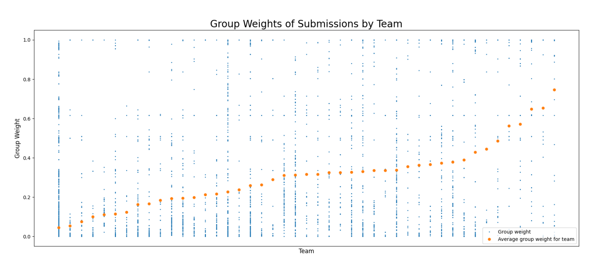
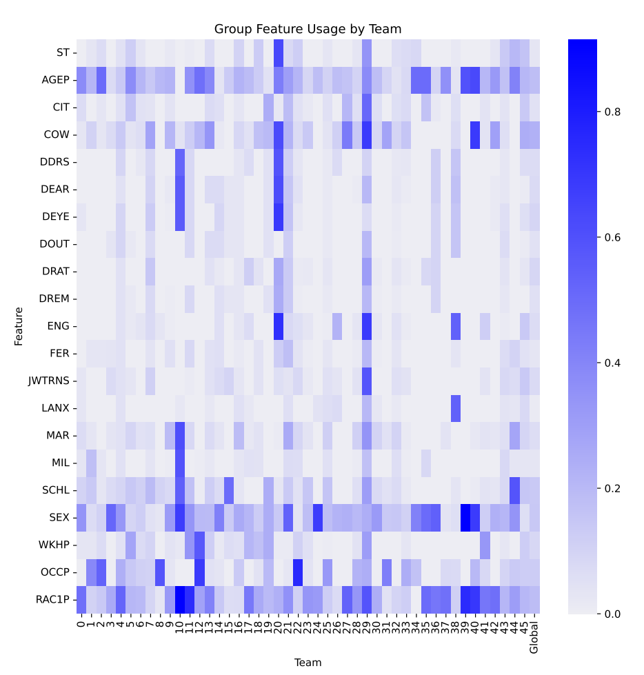

[Back to Main](../main.md)

# 4. ML Fairness via "Bias Bounties"
- Ideation)
  - Idea 1)
    - Invite the crowd to find "bug" (demographic bias) in a trained ML model.
    - How?)
      - Provide $`\langle x, y, f(x) \rangle`$.
      - Let them find a **subgroup** that the model $`f`$ underperforms.
    - Limit)
      - Finding an underperformed subgroup does not guarantee that it will improve $`f`$.
      - Hard to evaluate the improvement on the new data.
        - e.g.) Blurry images
  - Idea 2)
    - Ask participants to find and submit pairs $`\langle g, h \rangle`$ s.t. $`\widetilde{\epsilon_g}(h) \lneq \widetilde{\epsilon_g}(f)`$ where $`g`$ is a group and $`h`$ is a model.
    - A model $`h`$ that has lower on a specific group $`g`$ compared to the existing $`f`$.
    - Limit)
      - It's hard to derive $`g`$ that specifies the underperformed groups.
    - Procedure)
      - Starting model $`f_1(x)`$.
      - Given $`\langle g_1, h_1 \rangle`$
        - $`\epsilon_{g_1}(h_1) = \text{Pr}_{\langle x,y \rangle\sim P}\left[ h_1(x) \ne y \vert g_1(x)=1 \right]`$
          - the error rate of the model $`h_1`$ on the subgroup $`g_1`$
            - s.t. $`\epsilon_{g_1}(h_1) \lneq \epsilon_{g_1}(f_1)`$
      - Set $`f_2(x) = \begin{cases} h_1(x) & \text{if } g_1(x) = 1 \\ f_1(x) & \text{if } g_1(x) = 0 \end{cases}`$
      - Putting $`\Delta = \epsilon_{g_1}(f_1) - \epsilon_{g_1}(h_1)\gneq 0`$
        - This is the improvement made by $`h_1`$
        - Prop.)
          - **Punchline 1** :$`\epsilon_{g_1}(f_2) = \epsilon_{g_1}(h_1)`$
            - the error rate on $`g_1`$
          - **Punchline 2** :$`\epsilon_{g_1}(f_2) = \epsilon_{g_1}(f_1) - w_1\Delta_1`$
            - $`w_1 = \text{Pr}_{\langle x,y \rangle\sim P}\left[  g_1(x)=1 \right]`$
            - It reduces the global error without the cost!
              - cost : 
      - Analysis)
        - Previous problems added the fairness conditions to achieve the fairness.
          - In this case $`f_1, f_2`$ could be in the different model space.
      - Limit)
        - Overfitting : $`h_i`$ may be too complex
        - What if $`g_i`$ becomes infinitesimal
          - Sol.) Put a lower bound on the improvement $`w_i\Delta_i`$
            - $`w_i`$ will be really small in such case
            - This can also limit the number of models preventing the overfitting

 

- US Census Data
  
  - Desc.)
    - Rich demographic features
      - e.g.) Race, gender, age, etc.
    - Good for the "Bias Bounty" approach thanks to various $`g`$s
    - Didn't really work in reality.
      - Sequence of $`h`$s matter in this case.
      - Earlier submissions shows improvements while the later ones didn't improve that much.
  - Image)
    - x axis : teams
    - blue dots : submitted pairs
      - number of dots : number of pair submissions
    - y axis : weight $`w_i`$
    - red dots : the mean of $`w_i`$

 

- Same data, same competition
  
  - Image)
    - blue : how many pairs used that feature
    - some features were used more seen by more blue
    - some teams used features that other teams did not.

  

[Back to Main](../main.md)