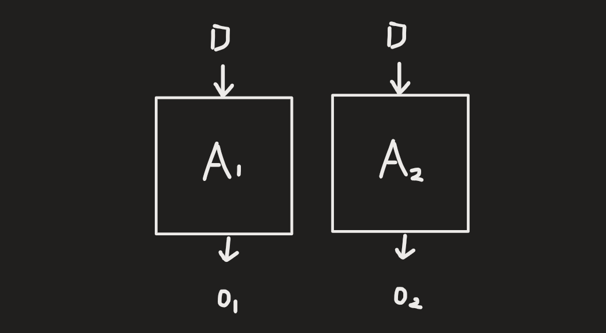
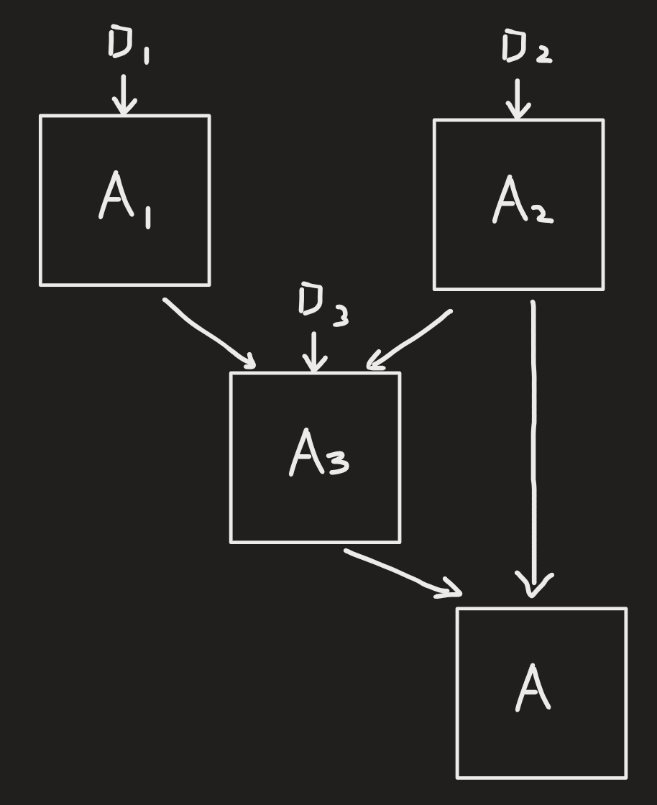

[Back to Main](../main.md)

# 5. Security and Privacy
#### Brainstorming) What is Privacy?
- Right to be forgotten
  - cf.) What about a model trained on your data?
    - Membership Inference Attack
- Control of access
- My data not sold for profit
  - e.g.) Google, Facebook
    - Advertising : Business model that may sell data outside
  - e.g.) Apple
    - Consumer Electronics : Not selling data outside
  - e.g.) Amazon
    - Cloud
    - Consumer Service
- Anonymity (Personally Identifiable Information, PII)
- Encryption (Secrecy)
  - e.g.)
    - Privacy of existence of communication
- Consent to minors
- Transparency of data usage / exchange / dissemination
  - Opt in/out
- Privacy jurisdiction / laws

 

--

 

### Concept) Security
- Def.) 
  - Control of access to "raw" data
- Prop.)
  - Largely the domain of cryptography
    - e.g.) locks and keys

 

### Concept) Privacy
  - Def.) 
    - Allow certain uses of data but control inferences & exfiltrations 
  - Prop.)
    - Largely the domain of [anonymization](#concept-anonymization-technologies) & [differential privacy](#concept-differential-privacy-dp)
    - Used to be highly concentrated in anonymization in the past...
      - But vulnerable...
        - whack a mole game : offense vs defense
- Toy Example)
  - Sensitive / private database (my data is a row.)
    - Security Concern) 
      - Control access (i.e. keep locked!)
  - Suppose we used this data to train a disease prediction model.
    - i.e.) Derivative byproduct of the data.
  - Then, suppose we share this model in public.
    - Privacy Concern) 
      - What might the model leak about the data?

 

### Concept) Cryptography
- Prop.)
  - Indistinguishable with the random
  - Only the legitimate party can decrypt.
- Models)
  - [One-time Pad](#model-one-time-pad-long-time-ago) (Long time ago...)
  - [Public Key Cryptography](#model-public-key-cryptography-late-1970s) (late 1970's)

#### Model) One-time Pad (Long time ago...)
- Desc.)
  - Suppose I want to send you a 1-bit message, $`a\in\{0,1\}`$
  - We meet beforehand and choose a random bit $`b\in\{0,1\}`$ with the prob. of 50%.
    - Here, $`b`$ is the randomly generated key that will be shared.
    - We will encrypt $`a`$ using $`b`$ as $`c= \underbrace{a\oplus b}_{\text{XOR}} = \begin{cases} 0 & a=b \\ 1 & a\ne b \end{cases} = (a+b) \text{ mod } 2`$
  - Later, I send you $`c = \underbrace{a\oplus b}_{\text{XOR}} = \begin{cases} 0 & a=b \\ 1 & a\ne b \end{cases} = (a+b) \text{ mod } 2`$.
    - This $`c`$ seems to be a perfectly random bit due to $`b`$.
  - You can decrypt $`a`$ with $`c\oplus b = (a\oplus b)\oplus b = a \oplus (b\oplus b) = a\oplus 0 = a`$
- Advantage)
  - Provable
  - Absolute Secrecy
- Drawbacks)
  - Keys must have same length as messages.
  - Cannot be reused.
    - Suppose we had already used $`a\oplus b`$.
    - We want to send a new message using $`a'\oplus b`$.
    - In adversary's perspective, they may get
      - $`(a\oplus b)\oplus(a'\oplus b) = (a\oplus a')\oplus(b\oplus b) = (a\oplus a')\oplus 0 = a\oplus a'`$
        - They know the relation between $`a, a'`$.
        - If $`a`$ already happened, the adversary can use this info and guess $`a'`$.
  - Every message requires fresh pad and key pair.
  - Every pair of communicating individual require a separate key.

 

#### Model) Public Key Cryptography (late 1970's)
- Idea.)
  - Pseudo random generator
    - short string input -> long string output
      - e.g.) $`2^{100}\rightarrow 2^{200}`$, the ratio goes $`\frac{1}{2^{100}}`$ : almost random due to the lack of the computational power, although it is deterministic.
    - Longer the key, more safe!
- Desc.)
  - Separate key into...
    - public encryption key $`(e)`$
      - Encryption Function $`f_e(x)`$ where $`x`$ is the message.
        - Prop.)
          - Here $`f_e(x)`$ is indistinguishable to the random string to the 3rd party with the bounded computational power!
          - Not a perfect security, but the computational complexity allows that.
    - private decryption key $`(d)`$
      - Decryption Function $`g_d(f_e(x)) = x`$ 
- e.g.)
  - Prime number multiplication
    - Easy one
      - Given prime numbers, return the multiplication of them.
    - Hard one
      - Given a long integer, get prime numbers that are the divisors.

  

## Concept) Three Notions of Privacy
1. [Anonymization Technologies](#concept-anonymization-technologies)
2. [No Harm Whatsoever](#concept-no-harm-whatsoever-privacy)
3. [Differential Privacy](#concept-differential-privacy-dp)

 

#### Concept) Fingerprints
- Prop.)
  - Uniquely identifies an individual.
- e.g.)
  - CD's in 80s
    - Series of length of songs can work as the unique key for the index.
  - Fonts in Browsers
    - The sequence of fonts with the time that are downloaded
  - Geolocation data

 

#### Concept) Triangulations
- Desc.)
  - Combine other data to crash the anonymity of the given dataset.
  - Linkage attack
- e.g.)
  - Latanya Sweeny
    - Combined anonymized the MA medical data with other data and targeted the Governor William Well(?)
  - Netfilx Prize
    - Combining the anonymized playlist DB with the IMDb, researchers matched a row of a user with the IMDb id.

 

#### Concept) ? (Question Mark)
- e.g.)
  - Strava app
    - Clustered records in Afghanistan
      - Soldiers in the secret military base.
  - Golden State Killer
    - A serial killer in Sacramento, CA.
    - Police had the DNA but no match.
    - Uploaded this DNA to the 23andMe and found cousins.
      - Although the killer's data was not on the DB, it shared props with others!
      - Not exclusive data of an individual is exposed but disclosed!

 

### Concept) Anonymization Technologies
- Problem Setting)
  - Not private enough, but "too" useful
    - Not enough privacy, too much utility case!
- Basic Idea)
  - $`\mathcal{D}`$ : some sensitive/private dataset
    - cf.) Assume to be a tabular data structure.
  - $`\mathcal{D}'`$ : the anonymized version of $`\mathcal{D}`$.
    - The transformation $`\mathcal{D}\rightarrow\mathcal{D}'`$ is achieved by two operations:
      - Redaction : remove/delete entire columns (e.g. [Personally Identifiable Information (PII)](#concept-privacy))
      - Coarsening : reducing the resolution/accuracy of a column
        - e.g.) Bucket information
          - 28 years old -> 20-29 range.
- Props.)
  - This technique is useful but cannot be 100% trusted!
- Goal)
  - The goal of this is suggested by multiple people
  - e.g.)
    - K-anonymity
      - Desc.)
        - Use reduction/coarsening until $`\mathcal{D}'`$ has property that any row of $`\mathcal{D}'`$ has $`\ge K`$ copies.
      - Limit)
        - If not enough redaction/coarsening is done, it is vulnerable to **triangulation**.
        - If too much is made, the data becomes useless.
- Drawback) The Myth of Anonymization
  - Incredibly brittle
  - Pretends $`D`$ only dataset ever
  - No meaningful semantics
    - No concrete definition like fairness
  - Demonstrably vulnerable to reidentification/denonymization attacks
    - e.g.) Triangulation

 

### Concept) No Harm Whatsoever Privacy
- Problem Setting)
  - Too private enough, not so useful
- Ideation)
  
  - Attempt 2) Compare...
    - Situation 1)
      - Desc.)
        - Suppose you are a row in a tabular database.
          - i.e.) $`\text{(you)}\in\mathcal{D}`$
        - $`\mathcal{D}`$ is input of $`A`$ that gets a result.
        - That result affects you.
    - Situation 2)
      - Desc.)
        - Not doing anything like Situation 1).
        - No likelihood of harm will be here.
    - e.g.) Smoking
      - 1950s where everybody was smoking.
      - Research : The correlation btwn smoking and lung cancer was found.
      - It was not an individual smoker's data that affected the finding.
      - Now a smoker is affected by the fact that he is smoking.
        - Harm : increase in the insurance premium
      - Deletion of the smoker's data does not affect the finding.
      - There would have been no harm if there was no research!
    - If $`A`$ is not made due to Situation 2, world cannot figure out the result.
  - Attempt 3) (Deriving [the Differential Privacy](#concept-differential-privacy-dp)) Compare...
    - Situation 1)
      - Desc.)
        - Suppose you are a row in a tabular database.
          - i.e.) $`\text{(you)}\in\mathcal{D}`$
        - $`\mathcal{D}`$ is input of $`A`$ that gets a result
          - resulting in $`r`$
    - Situation 2)
      - Desc.)
        - $`\mathcal{D}'`$ : a dataset that my data is deleted.
        - $`\mathcal{D}'`$ is input of $`A`$ that gets a result
          - resulting in $`r'`$
    - Comparing 1 and 2
      - If $`r`$ and $`r'`$ are [indistinguishable](#concept-indistinguishability)...
        - The deletion of your data will not affect the outcome of $`A`$ that much.

#### Concept) Indistinguishability
- Intuition)
  - We want an observer/adversary who already knows $`\mathcal{D}`$ and $`\mathcal{D}'`$.
  - And it looks only at the result of $`A`$, $`r, r'`$.
  - It cannot tell whether the input was $`\mathcal{D}`$ or $`\mathcal{D}'`$
- What we want to prevent)
  - e.g.) Numerously distinct.
    - If $`r=0.293427`$ and  $`r'=0.293426`$, the adversary can differentiate $`\mathcal{D}`$ and $`\mathcal{D}'`$ with the reverse computation.
  - e.g.) The myth of privacy by aggregation.
    - Consider the average salary.
    - If a new employ is added, by comparing $`\frac{1}{n}\sum_{i=1}^n C_i`$ and $`\frac{1}{n+1}\sum_{i=1}^{n+1} C_i`$, we can get $`C_{n+1}`$
- Sol.)
  - Randomized algorithm & Probabilistic Indistinguishability
    - e.g.) [Randomized Response (1965)](#concept-randomized-response)

  

### Concept) Differential Privacy (DP)
- Goal)
  - Strong privacy, strong utility
  - Between [Anonymization](#concept-anonymization-technologies) and [No harm whatsoever](#concept-no-harm-whatsoever-privacy)
- Problem Setting)
  - $`A`$ : a randomized algorithm with the output space $`\mathcal{O}`$
    - The algorithm has the privacy property, not the data like the [anonymization](#concept-anonymization-technologies)!
    - The output of $`A`$ is the probability distribution.
      - i.e.) $`A(\mathcal{D})`$ is stochastic.
  - Neighboring datasets $`\mathcal{D} \ne \mathcal{D}'`$ 
    - They differ in a single row!
    - These datasets are deterministic.
  - When $`\mathcal{D}, \mathcal{D}'`$ are inputted into $`A`$, we want the resulting probability distributions of them to be $`\epsilon`$-close in the output space $`\mathcal{O}`$
- Def.) $`\epsilon`$ - Differential Privacy
  - $`\epsilon - \text{DP}`$ if for any neighboring datasets $`\mathcal{D}, \mathcal{D}'`$ 
      - For any subset $`\mathcal{S}\subseteq\mathcal{O}`$   
        $`\begin{aligned}
          & \frac{1}{e^\epsilon} \cdot \text{Pr}[A(\mathcal{D}')\in\mathcal{S}] \le \text{Pr}[A(\mathcal{D})\in\mathcal{S}] \le e^\epsilon \cdot \text{Pr}[A(\mathcal{D}')\in\mathcal{S}] \\
          \Leftrightarrow & \frac{1}{e^\epsilon} \le \frac{\text{Pr}[A(\mathcal{D})\in\mathcal{S}]}{\text{Pr}[A(\mathcal{D}')\in\mathcal{S}]} \le e^\epsilon \\
        \end{aligned}`$
          - cf.) $`\frac{1}{e^{\epsilon}}\approx 1-\epsilon`$
  - Pointwise Notation)
    - If the output space $`\mathcal{O}`$ is finite, we may put
    - Also,
      - $`\displaystyle\text{Pr}[A(\mathcal{D})\in\mathcal{S}]  = \sum_{o\in S} \text{Pr}[A(\mathcal{D}) = o]`$
    - Thus, the $`\epsilon`$-DP goes
      - $`\displaystyle \frac{1}{e^\epsilon} \text{Pr}[A(\mathcal{D}')= o] \le \text{Pr}[A(\mathcal{D}) = o] \le e^\epsilon \text{Pr}[A(\mathcal{D}') = o],\; \forall o\in\mathcal{O}`$
- Prop.)
  - $`\epsilon`$ is the input parameter for getting the corresponding algorithm $`A`$.
    - Trade-off between privacy and the usefulness of $`A`$
      - $`\epsilon = 0`$ : LHS = RHS
        - Privacy is secured perfectly.
        - But the output is not useful, too noisy!
      - Large $`\epsilon`$ means the privacy is not guaranteed.
    - $`A`$ should apply stronger noise to achieve low $`\epsilon`$. The result would be meaningless.
  - DP is [immune to post-processing attacks](#prop-dps-immunity-to-post-processing-attacks).
    - cf.) [Anonymization](#concept-anonymization-technologies) was vulnerable.
- Limits)
  - Due to the universal identifiers $`\forall`$, this definition is not suitable for the auditing.
    - It holds for $`\forall \mathcal{D}, \mathcal{D}', \forall S\in\mathcal{O}`$
    - Certain results cannot guarantee whether the condition is satisfied.
  - There is a the allowed dataset $`\mathcal{D}`$ and $`\mathcal{D}'`$.
    - This fact itself can disclose the private data.

 

### Concept) Randomized Response
- Desc.)
  - A proposal of how you can incentivize the public to truthfully answer embarrassing questions.
- e.g.) Have you deliberately violated social distancing guidelines during COVID?
  - Problem) 
    - The fraction of the population you want to know is the ones that violated, but they will lie.
  - Sol.) Adopt randomization protocol
    - How?)
      - Allow the participants of the survey to answer by...
        - Flip a coin
          - 50% answer truthfully
          - 50% flip a coin again
              - 50% answer "yes"
              - 50% answer "no"
    - Privacy Guarantee) 
      - Plausible deniability
        - Some may say "yes" truthfully thanks to the guaranteed privacy.
    - The Utility of this protocol)
      - $`\text{Pr}[\text{(Answered yes)} \vert \text{(Actually yes)}] = 0.5 + 0.5\times0.5 = 0.75`$
      - $`\text{Pr}[\text{(Answered yes)} \vert \text{(Actually no)}] = 0 + 0.5\times0.5 = 0.25`$
      - Put $`p`$ be the fraction of true violators.
      - Then $`\text{Pr}[\text{(Answer yes)}] = p\cdot0.75 + (1-p)\cdot0.25 \quad\cdots (A)`$
      - By doing the survey, we can get $`\text{Pr}[\text{(Answer yes)}]`$.
      - Thus, we can estimate $`p`$ by solving $`(A)`$.
        - i.e.) $`\displaystyle p = \frac{\text{Pr}[\text{(Answer yes)}] - 0.25}{0.5}`$
    - Algorithm)   
      |Input vector $`(\mathcal{D})`$|y|n|$`\cdots`$|y|
      |:-:|:-:|:-:|:-:|:-|
      |Randomization Algorithm $`(A)`$|$`\downarrow`$|$`\downarrow`$|$`\cdots`$|$`\downarrow`$|
      |Output from Algorithm  $`(A(\mathcal{D}))`$|"y"|"y"|$`\cdots`$|"n"|
      - If we change a datapoint in the input vector, it will change the "distribution" of the output.
        - This change cannot reveal the info of the change in input data!
        - Indistinguishability!!!
    - Leads to the [Differential Privacy](#concept-differential-privacy)
- Prop.)
  - Randomized Response satisfies the [$`\epsilon`$-Differential Privacy](#concept-differential-privacy-dp)
    - Pf.)
      - Let $`o_i\in\{"y", "n"\}`$ be the randomized response $`\text{(RR)}`$ output of the $`i`$-th participant among $`N`$ participants.
      - For any fixed output vector $`[o_1,\cdots,o_i,\cdots,o_N]\in\{"y", "n"\}^N`$
        - $`\displaystyle \text{Pr}_{\text{RR}}[o = [o_1,\cdots,o_i,\cdots,o_N]] = \prod_{i=1}^N \text{Pr}_{\text{RR}}[o_i] \quad (\because \text{ Each answer is independent})`$
      - There can be two cases   
        $`\begin{cases}
          \text{Pr}_{\text{RR}}[o_i] = \text{Pr}["y"\vert y] \\
          \text{Pr}_{\text{RR}}[o_i'] = \text{Pr}["y"\vert n] \\
        \end{cases}`$ or $`\begin{cases}
          \text{Pr}_{\text{RR}}[o_i] = \text{Pr}["y"\vert n] \\
          \text{Pr}_{\text{RR}}[o_i'] = \text{Pr}["y"\vert y] \\
        \end{cases}`$
        - Why?)
          - We only care the answer yes.
          - One must be truthful "yes", and the other is "yes" due to the flipping coin.
      - Back to our example
        - $`\text{Pr}["y"\vert y] = 0.75`$
          - $`\text{Pr}["n"\vert y] = 0.25`$ (sum to 1)
        - $`\text{Pr}["y"\vert n] = 0.25`$
          - $`\text{Pr}["n"\vert n] = 0.75`$
      - For the neighboring dataset $`\mathcal{D}'`$ of $`[o_1,\cdots,o_v,\cdots,o_N]\in\{"y", "n"\}^N`$
        - $`\displaystyle \text{Pr}_{\text{RR}}[o = [o_1,\cdots,o_i',\cdots,o_N]] = \text{Pr}_{\text{RR}}[o_1]\cdots\text{Pr}_{\text{RR}}[o_i']\cdots \text{Pr}_{\text{RR}}[o_N]`$
      - Using the def. $`\frac{1}{e^\epsilon} \le \frac{\text{Pr}[A(\mathcal{D})\in\mathcal{S}]}{\text{Pr}[A(\mathcal{D}')\in\mathcal{S}]} \le e^\epsilon`$, we have
        - $`\displaystyle\frac{\text{Pr}[A(\mathcal{D})\in\mathcal{S}]}{\text{Pr}[A(\mathcal{D}')\in\mathcal{S}]} = \frac{\prod_{i=1}^N \text{Pr}_{\text{RR}}[o_i]}{\text{Pr}_{\text{RR}}[o_1]\cdots\text{Pr}_{\text{RR}}[o_i']\cdots \text{Pr}_{\text{RR}}[o_N]} = \frac{\text{Pr}_{\text{RR}}[o_i]}{\text{Pr}_{\text{RR}}[o_i']}`$ or
        - $`\displaystyle\frac{\text{Pr}[A(\mathcal{D})\in\mathcal{S}]}{\text{Pr}[A(\mathcal{D}')\in\mathcal{S}]} = \frac{\text{Pr}_{\text{RR}}[o_1]\cdots\text{Pr}_{\text{RR}}[o_i']\cdots \text{Pr}_{\text{RR}}[o_N]}{\prod_{i=1}^N \text{Pr}_{\text{RR}}[o_i]}=\frac{\text{Pr}_{\text{RR}}[o_i']}{\text{Pr}_{\text{RR}}[o_i]}`$
      - Back to our example
        - $`\displaystyle 3=\frac{0.75}{0.25} \ge \frac{\text{Pr}_{\text{RR}}[o_i']}{\text{Pr}_{\text{RR}}[o_i]} \ge \frac{1}{3}`$
      - Putting $`\epsilon = \ln(3)\approx 1.1`$, 
        - RR satisfies the $`\epsilon`$-DP.
- $`q`$-Randomized Response
  - Desc.)
    - Using a biased coin of probability of $`q, 1-q`$ for the first split.
  - How?)
    - Allow the participants of the survey to answer by...
      - Flip a coin
        - $`q`$ answer truthfully
        - $`1-q`$ flip a coin again
            - 50% answer "yes"
            - 50% answer "no"
    - Then the results go...
      - $`\text{Pr}["y"\vert y] = q + \frac{1-q}{2} = \frac{1+q}{2}`$
      - $`\text{Pr}["y"\vert n] = 0 + \frac{1-q}{2} = \frac{1-q}{2}`$
    - Thus, we may get the ratio of $`\frac{1+q}{1-q}`$.
    - Hence, we get the $`\epsilon = \ln\left(\frac{1+q}{1-q}\right)`$
  - Analysis)
    - $`q\rightarrow0 \Rightarrow \epsilon\rightarrow0`$ : more privacy
    - $`q\rightarrow1 \Rightarrow \epsilon\rightarrow\infty`$ : less privacy

  

### Concept) Laplace Mechanism
- Desc.)
  - A general tool for the [Differential Privacy](#concept-differential-privacy-dp).
- Settings)
  - Consider(restrict) the dataset to $`\mathcal{X}=[x_1,\cdots,x_n]\in[0,1]^n`$
    - i.e.) every value $`x_i\in[0,1]`$
    - the size is $`n`$.
  - We want to compute the [Differential Privacy](#concept-differential-privacy-dp) for some function $`f(X)=f(x_1,\cdots,x_n)\in\mathbb{R}`$
    - What is DP here?
      - If we change a single input $`x_i`$, the output $`f(X')`$'s probability distribution should not change much.
    - To make $`f`$ stochastic, we need some randomness.
- Algorithm)
  - Compute $`v=f(X)`$ deterministically.
  - Get $`v+r`$ where $`r`$ is the noise.
    - The variance of $`r`$ will determine the level of randomness.
  - Define the sensitivity of $`f(X)`$, 
    - $`\displaystyle\Delta f(X) \triangleq \max_{\text{all neighbors } x,x'} \vert f(x) - f(x') \vert`$
    - e.g.)
      - Suppose $`f`$ is getting the average.
        - Then $`\Delta f = \frac{1}{n}`$
          - Why?) 
            - $`\forall x\in[0,1]`$.
            - Thus, the maximum increase is $`0\rightarrow1`$, increasing $`f`$ by $`\frac{1}{n}`$
          - Prop.)
            - If the data size $`n`$ grows, the sensitivity decreases.
      - Suppose $`f`$ is the standard deviation.
        - i.e.) $`f(X) = \sqrt{\frac{1}{n} \sum_i (X_i-\mu)^2}`$
        - Then $`\Delta f = \frac{1}{\sqrt{n}}`$ is the maximum increase.
      - Suppose $`f`$ is the maximum function.
        - i.e.) $`f(X) = \max(X)`$
          - min, median all have $`\Delta f = 1`$
        - $`\Delta f = 1`$ when 
          - $`x=\{0,\cdots,0,\underbar{0}\}`$
          - $`x'=\{0,\cdots,0,\underbar{1}\}`$
        - The sensitivity is large and independent with $`n`$.
          - Bad property!
      - Suppose $`f`$ is the median function.
        - i.e.) $`f(X) = \text{median}(X)`$
        - $`\Delta f \ge \frac{1}{2}`$ when 
          - $`x=\{0,\underbar{0},1\}`$
          - $`x'=\{0,\underbar{1},1\}`$
    - Prop.)
      - More sensitivity means more variance, more distinguishability in output.
        - Thus, more randomness is needed for $`f`$ to satisfy the DP.
      - Low sensitivity means that two individual points become very similar, i.e. indistinguishable.
        - Thus, does not require much noise.

  

### Concept) Laplace Distribution
- Desc.)
  - Similar bell shape like Gaussian but...
  - We randomly choose value $`v\in\mathbb{R}`$ with probability $`\displaystyle \frac{1}{2b}e^{-\vert v \vert / b}`$
    - If $`\vert v \vert`$ gets bigger, lower chance that $`v`$ will be chosen.
    - Peak at $`v=0`$.
    - Of course satisfies $`\displaystyle\int_{-\infty}^\infty \frac{1}{2b}e^{-\vert v \vert / b} = 1, \forall b`$
    - $`b`$ is a parameter
      - $`b\rightarrow\infty`$ : the distribution goes flat
      - $`b\rightarrow0`$ : the distribution becomes sharper at (or peaking the distribution over) $`v=0`$.
    - Variance is $`2b^2`$

  

### Concept) Laplace Mechanism Algorithm (LM)
- Procedure)
  - Compute $`f(X)`$
  - Draw $`v`$ from [Laplace Distribution](#concept-laplace-distribution) with $`\displaystyle b = \frac{\Delta f}{\epsilon}`$
  - Output $`f(X) + v`$
- Prop.)
  - Smaller $`\epsilon`$ (more privacy), bigger $`b`$, bigger variance.
    - i.e.) More noise is added!
- Theorem) 
  - Thm.)
    - LM satisfies $`\epsilon`$-DP
  - Pf.)
    - Let 
      - $`x,x'\in[0,1]^n`$ be neighbors.
      - $`p_{x}, p_{x'}`$ denote the output distribution over $`\mathbb{R}`$.
    - Then, $`\forall o\in\mathcal{O}`$
      - $`\displaystyle \frac{p_{x}(o)}{p_{x'}(o)} = \frac{\frac{1}{2b}e^{-\vert f(x) - o \vert / b}}{\frac{1}{2b}e^{-\vert f(x') - o \vert / b}} = e^{\frac{\vert f(x') - o \vert -\vert f(x) - o \vert}{b}}`$.
    - Here, $`\vert f(x') - o \vert -\vert f(x) - o \vert \le \vert f(x') - f(x) \vert`$
      - Pf.)
        - Case 1) $`f(x) \lt v \lt f(x')`$
        - Case 2) $`v \lt f(x) \lt f(x')`$
    - Thus,   
      $`\begin{aligned}
        \frac{p_{x}(o)}{p_{x'}(o)} &= e^{\frac{\vert f(x') - o \vert -\vert f(x) - o \vert}{b}} \\
        &\le e^{\frac{\vert f(x') - f(x) \vert}{b}} \\
        &\le e^{\frac{\Delta f}{b}} & (\because \Delta f = \vert f(x') - f(x) \vert) \\
        &= e^{\frac{\Delta f}{\Delta f / \epsilon}} = e^\epsilon 
      \end{aligned}`$
- Utility / Accuracy of LM
  - e.g.) $`\Delta f = \frac{1}{n}`$ (e.g. $`f`$ is mean.)
    - Then $`b = \frac{\Delta f}{\epsilon} = \frac{1}{\epsilon n}`$
      - cf.) $`\frac{1}{\epsilon \sqrt{n}}`$ for std. dev.
    - Assuming $`\epsilon`$ is fixed and $`n\rightarrow\infty \Rightarrow b\rightarrow 0`$
      - i.e.) As the data size grows, we can set $`\epsilon`$ be small (high privacy)
    - Suppose we have to choose $`\epsilon`$.
      - Then, if the data size $`(n)`$ is large, then we can choose small $`\epsilon`$ which means smaller noise added to the value for satisfying the differential privacy.

  

### Concept) Exponential Mechanism
- Desc.)
  - General tool for DP
- Settings)
  - Complex input/output space.
    - Def.)
      - $`I`$ : input space
      - $`O`$ : output space
    - E.g)
      - e.g)
        - Input : tabular dataset
        - Output : ML model trained
          - e.g.) Decision Tree, Neural Network
      - e.g.)
        - Input : social network (graph data structure)
        - Output : the clustering into communities
      - e.g.) election
        - Input : vote
        - Output : outcome
  - Utility (Quality)
    - Def.)
      - $`\forall x\in I, \forall o\in O`$, we measure the utility (quality)
        - $`u(x, o) \in\mathbb{R}`$
    - e.g.)
      - $`x`$ is the dataset, $`o`$ is a neural network model,
        - $`u(x,o)`$ : the accuracy of $`o`$ on $`x`$.
  - Generalized Sensitivity of $`u`$
    - Def.)
      - $`\displaystyle\Delta u = \max_{\text{neighboring } x,x'\in I} \max_{o\in O} \vert u(x,o) - u(x',o) \vert`$
    - e.g.)
      - For ML model, $`\Delta u\le\frac{1}{n}`$ for the data size $`n`$
        - Why) Since $`x`$ and $`x'$ are [neighbors](), they differ only in one row.
- Ideation)
  - When we ignore privacy, we want to find
    - $`\displaystyle o^* = \arg\max_{o\in O} u(x,o)`$
  - To consider the privacy...
    - add noise to $`o`$ to satisfy the privacy and make it to be closer to the $`o^*`$ of the deterministic case above.
- Exponential Mechanism)
  - Def.)
    - On input $`x\in I`$ and output each(any) $`o\in O`$
      - with **probability** $`\displaystyle \frac{e^{\epsilon u(x,o) / 2\Delta u}}{z(x)}`$
        - where 
          - $`\epsilon`$ is the parameter for the DP
          - $`\displaystyle z(x) = \sum_{o\in O} e^{\epsilon u(x,o) / 2\Delta u}`$ : the normalization factor to put the value in $`[0,1]`$
  - Intuition)
    - $`u(x,o)`$ increases $`\Rightarrow`$ the probability increases
    - $`\Delta u`$ (sensitivity) decreases $`\Rightarrow`$ the probability increases (amplifies!)
    - We tend to select the model $`o`$ that is close to $`o^*`$ with the largest utility of $`u(x,o^*)`$
  - Drawback)
    - Drawing sample from the probability is computationally expensive.
    - Even calculating the normalization factor $`z(x)`$ is expensive.

  

### Prop.) DP's Immunity to Post-processing Attacks
- cf.)
  - [Anonymization](#concept-anonymization-technologies) was vulnerable to the post-processing attaks.
- Settings)
  - $`x`$ : input
  - $`A`$ : an algorithm that satisfies $`\epsilon`$-DP
    - then the output $`A(x)`$ will be stochastic.
  - $`B`$ : an arbitrary algorithm that...
    - gets $`A(x)`$ as the input
    - outputs $`o'\in O'`$
    - cf.) You can think $`B`$ is the Membership Inference Attack (MIA) model.
      - We want to show that even though $`B`$ knows $`\mathcal{D}, \mathcal{D}'`$, they still output the $`\epsilon`$-DP output.
- Claim)
  - $`B(A(x))`$ is also $`\epsilon`$-DP.
    - i.e.) $`B`$ does not degrade the privacy of $`A`$
      - cf.) Assuming $`B`$, $`B`$ is just making the random guess.
- Pf.)
  - For the simplicity, let's assume that $`B`$ is deterministic. (Not necessary!)
  - Let $`x,x'`$ be neighboring inputs.
  - Fix $`o'\in O'`$.
  - Define $`T = \{o\in O \mid B(o)=o'\in O'\}`$.
    - Meaning)
      - Given the output $`o'`$, $`T`$ is the preimage
        - i.e.) all the possible output of $`A`$, $`A(x)`$, given $`o'`$
  - Then $`\text{Pr}[B(A(x)) = o'] = \text{Pr}[A(x)\in T]`$
    - Why?) $`B, x, o'`$ are all determined at this point.
  - Since $`A`$ satisfies $`\epsilon`$-DP, by definition,
    - $`\text{Pr}[A(x)\in T] \le e^\epsilon \text{Pr}[A(x')\in T]`$
  - Consider that $`\text{Pr}[A(x')\in T] = \text{Pr}[B(A(x')) = o']`$
  - Therefore, $`\text{Pr}[B(A(x)) = o'] \le e^\epsilon \text{Pr}[B(A(x')) = o']`$ (QED)
- Special Case)
  - Membership Inference Attacks (MIA)
    - Settings)
      - Neighboring inputs $`x,x'`$
    - Assume that the attacker already knows $`x,x'`$
    - Then the output space $`O'`$ of $`B`$ would be
      - $`\{"\text{Guess input was } x", "\text{Guess input was } x'"\}`$
    - Let $`p = \text{Pr}[B \text{ guess } x \mid x \text{ was the input to } A]`$ ($`B`$ correct)
      - Then $`1-p = \text{Pr}[B \text{ guess } x' \mid x \text{ was the input to } A]`$ ($`B`$ incorrect)
    - Let $`q = \text{Pr}[B \text{ guess } x' \mid x' \text{ was the input to } A]`$ ($`B`$ correct)
      - Then $`1-q = \text{Pr}[B \text{ guess } x \mid x' \text{ was the input to } A]`$ ($`B`$ incorrect)
    - $`p+q`$ is bounded by $`\displaystyle\frac{2 e^\epsilon}{1+e^\epsilon}`$, $`\displaystyle\left(\text{i.e. }p+q \le \frac{2 e^\epsilon}{1+e^\epsilon}\right)`$
      - Why doing this?)
        - If the attacker makes perfect guess, $`p+q`$.
        - If $`p+q\lt 2`$ it means that the attacker failed to guess correctly on either $`p`$ or $`q`$
      - cf.)
        - We may set $`p+q \ge 1`$.
          - Why?) Flipping coin can output $`0.5+0.5 = 1`$
      - Pf.)
        - By definition of $`\epsilon`$-DP
          - $`p\le e^\epsilon (1-q)`$
          - $`q\le e^\epsilon (1-p)`$
        - Thus,    
          $`\begin{aligned}
            p+q &\le e^\epsilon (1-q) + e^\epsilon (1-p) \\
            &= e^\epsilon (2-p-q)
          \end{aligned}`$
        - Hence, $`\displaystyle p+q \le \frac{2 e^\epsilon}{1+e^\epsilon}`$.
      - Prop.)
        - $`\epsilon = 0`$ (Perfect privacy)
          - $`p+q = 1`$ : satisfied.
            - cf.) What if $`p=1, q=0`$.
              - Although the attacker made a perfect guess for the case that $`x`$ was the input, it perfectly failed for the case that $`x'`$ was the input.
        - $`\epsilon \rightarrow \infty \Rightarrow p+q \rightarrow 2`$ 
          - But this setting is the worst case where the attacker already knows what $`x,x'`$ are. 
          - This worst case cannot possibly take place in reality.
          - Additionally, the setting of the DP of $`\forall \mathcal{D}, \mathcal{D}'`$ and $`\forall o,o'\in O`$ was unrealistic!
          - Thus, we may assume that DP is safe enough.

  

### Concept) Multiple (Parallel) DP Computation

- Setting)
  - $`A(\mathcal{D}) = (A_1(\mathcal{D}), A_2(\mathcal{D}))`$
    - where
      - $`\mathcal{D}`$ : dataset
      - $`A_i`$ : an algorithm with $`\epsilon_i`$-DP and outputs $`o_i`$ given the dataset $`\mathcal{D}`$
  - Think of $`A_1, A_2`$ are in the parallel structure.
    - Thus, they are independent.
- Claim
  - $`A`$ is $`\epsilon_1 + \epsilon_2`$ - DP
- Pf.)    
  $`\begin{aligned}
    p_\mathcal{D}^A(o_1, o_2) &= p_\mathcal{D}^{A_1}(o_1) \cdot p_\mathcal{D}^{A_2}(o2) & (\because \text{indep.}) \\
    &\le e^{\epsilon_1}p_\mathcal{D}^{A_1}(o_1) \cdot e^{\epsilon_2}p_\mathcal{D}^{A_2}(o_2) & (\because \text{Def. of DP}) \\
    &= e^{\epsilon_1 + \epsilon_2} p_\mathcal{D}^{A_1}(o_1) \cdot p_\mathcal{D}^{A_2}(o2) \\
    &= e^{\epsilon_1 + \epsilon_2}  \cdot p_\mathcal{D}^A(o_1, o_2)
  \end{aligned}`$

  

### Concept) DP under Arbitrary Composition

- cf.)
  - The above case was the parallel case.
  - In this case, we cannot say that they are independent.
  - Still,
- Claim)
  - If there are $`K`$ datasets and $`K`$ $`\epsilon`$-DP algorithms, the entire composition is $`K\cdot\epsilon`$-DP ($`\sqrt{K}\cdot\epsilon`$-DP as more safe condition)

  

## Readings Preview)
- [Broken Promises of Privacy: Responding to the Surprising Failure of Anonymization.](https://www.cis.upenn.edu/~mkearns/teaching/EADSpring25/#:~:text=Broken%20Promises%20of%20Privacy%3A%20Responding%20to%20the%20Surprising%20Failure%20of%20Anonymization.)
  - Not really needed. (Law journal)
  - About the limit of anonymization technique
- (V) [Differentially Private Query Release Through Adaptive Projection](https://www.cis.upenn.edu/~mkearns/teaching/EADSpring25/#:~:text=Differentially%20Private%20Query%20Release%20Through%20Adaptive%20Projection.)
  - will be [covered](#reading-2-differentially-private-query-release-through-adaptive-projection)
- (V) [Confidence-ranked reconstruction of census microdata from published statistics](https://www.pnas.org/doi/epdf/10.1073/pnas.2218605120)
  - will be covered
- [Differential Privacy Overview](https://www.apple.com/privacy/docs/Differential_Privacy_Overview.pdf)
  - Briefly explained in class
  - Apple's brag about using DP
- [How One of Apple's Key Privacy Safeguards Falls Short](https://www.wired.com/story/apple-differential-privacy-shortcomings/)
  - Summary of the next one
- [Privacy Loss in Apple's Implementation of Differential Privacy on MacOS 10.12](https://arxiv.org/abs/1709.02753)
  - Technical paper
  - Disassembled the ios and figured out that $`\epsilon=5`$ which is not valid
- [Implementing Differential Privacy: Seven Lessons From the 2020 United States Census](https://hdsr.mitpress.mit.edu/pub/dgg03vo6/release/6)
  - Traditional Census used techniques like anonymization
  - In 2020, they started use DP
- [See how your community is moving around differently due to COVID-19](https://www.google.com/covid19/mobility/)
  - Google 
  - Geolocation of the Android devices
    - Hot places
  - Used DP

 

### Reading 2) Differentially Private Query Release Through Adaptive Projection
- Desc.)
  - Generating Synthetic data
    - An algorithm $`A`$ that satisfies $`\epsilon`$-DP
      - input : $`D`$
      - output : $`\tilde{D}`$ s.t. have same schema as $`D`$
        - we want $`\tilde{D}`$ to be similar to $`D`$.
          - Similarity : inference made by $`\tilde{D}`$ should be similar to the one by $`D`$'
      - How?)
        - We may calculate the target statistics and add Laplace noise to them.
        - We want $`A`$ to output dataset that satisfies them.
- Graph)
  - Error-$`\epsilon`$ planes
    - error rate : the portion of data in $`\tilde{D}`$ s.t. does not satisfy the $`\epsilon`$-DP on stats above
    - $`\epsilon`$ : the parameter for the $`\epsilon`$-DP (privacy!)

  

[Back to Main](../main.md)