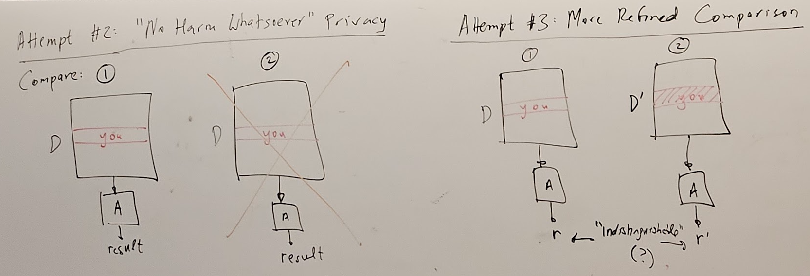

[Back to Main](../main.md)

# 5. Security and Privacy
#### Brainstorming) What is Privacy?
- Right to be forgotten
  - cf.) What about a model trained on your data?
    - Membership Inference Attack
- Control of access
- My data not sold for profit
  - e.g.) Google, Facebook
    - Advertising : Business model that may sell data outside
  - e.g.) Apple
    - Consumer Electronics : Not selling data outside
  - e.g.) Amazon
    - Cloud
    - Consumer Service
- Anonymity (Personally Identifiable Information, PII)
- Encryption (Secrecy)
  - e.g.)
    - Privacy of existence of communication
- Consent to minors
- Transparency of data usage / exchange / dissemination
  - Opt in/out
- Privacy jurisdiction / laws

 

---

 

### Concept) Security
- Def.) 
  - Control of access to "raw" data
- Prop.)
  - Largely the domain of cryptography
    - e.g.) locks and keys

 

### Concept) Privacy
  - Def.) 
    - Allow certain uses of data but control inferences & exfiltrations 
  - Prop.)
    - Largely the domain of anonymization, differential privacy
    - Used to be highly concentrated in anonymization in the past...
      - But vulnerable...
        - whack a mole game : offense vs defense
- Toy Example)
  - Sensitive / private database (my data is a row.)
    - Security Concern) 
      - Control access (i.e. keep locked!)
  - Suppose we used this data to train a disease prediction model.
    - i.e.) Derivative byproduct of the data.
  - Then, suppose we share this model in public.
    - Privacy Concern) 
      - What might the model leak about the data?

 

### Concept) Cryptography
- Prop.)
  - Indistinguishable with the random
  - Only the legitimate party can decrypt.
- Models)
  - [One-time Pad](#model-one-time-pad-long-time-ago) (Long time ago...)
  - [Public Key Cryptography](#model-public-key-cryptography-late-1970s) (late 1970's)

#### Model) One-time Pad (Long time ago...)
- Desc.)
  - Suppose I want to send you a 1-bit message, $`a\in\{0,1\}`$
  - We meet beforehand and choose a random bit $`b\in\{0,1\}`$ with the prob. of 50%.
    - Here, $`b`$ is the randomly generated key that will be shared.
    - We will encrypt $`a`$ using $`b`$ as $`c= \underbrace{a\oplus b}_{\text{XOR}} = \begin{cases} 0 & a=b \\ 1 & a\ne b \end{cases} = (a+b) \text{ mod } 2`$
  - Later, I send you $`c = \underbrace{a\oplus b}_{\text{XOR}} = \begin{cases} 0 & a=b \\ 1 & a\ne b \end{cases} = (a+b) \text{ mod } 2`$.
    - This $`c`$ seems to be a perfectly random bit due to $`b`$.
  - You can decrypt $`a`$ with $`c\oplus b = (a\oplus b)\oplus b = a \oplus (b\oplus b) = a\oplus 0 = a`$
- Advantage)
  - Provable
  - Absolute Secrecy
- Drawbacks)
  - Keys must have same length as messages.
  - Cannot be reused.
    - Suppose we had already used $`a\oplus b`$.
    - We want to send a new message using $`a'\oplus b`$.
    - In adversary's perspective, they may get
      - $`(a\oplus b)\oplus(a'\oplus b) = (a\oplus a')\oplus(b\oplus b) = (a\oplus a')\oplus 0 = a\oplus a'`$
        - They know the relation between $`a, a'`$.
        - If $`a`$ already happened, the adversary can use this info and guess $`a'`$.
  - Every message requires fresh pad and key pair.
  - Every pair of communicating individual require a separate key.

 

#### Model) Public Key Cryptography (late 1970's)
- Idea.)
  - Pseudo random generator
    - short string input -> long string output
      - e.g.) $`2^{100}\rightarrow 2^{200}`$, the ratio goes $`\frac{1}{2^{100}}`$ : almost random due to the lack of the computational power, although it is deterministic.
    - Longer the key, more safe!
- Desc.)
  - Separate key into...
    - public encryption key $`(e)`$
      - Encryption Function $`f_e(x)`$ where $`x`$ is the message.
        - Prop.)
          - Here $`f_e(x)`$ is indistinguishable to the random string to the 3rd party with the bounded computational power!
          - Not a perfect security, but the computational complexity allows that.
    - private decryption key $`(d)`$
      - Decryption Function $`g_d(f_e(x)) = x`$ 
- e.g.)
  - Prime number multiplication
    - Easy one
      - Given prime numbers, return the multiplication of them.
    - Hard one
      - Given a long integer, get prime numbers that are the divisors.

  

## Concept) Three Notions of Privacy
1. [Anonymization Technologies]()
2. [Differential Privacy]()
3. [No Harm Whatsoever]()

 

#### Concept) Fingerprints
- Prop.)
  - Uniquely identifies an individual.
- e.g.)
  - CD's in 80s
    - Series of length of songs can work as the unique key for the index.
  - Fonts in Browsers
    - The sequence of fonts with the time that are downloaded
  - Geolocation data

 

#### Concept) Triangulations
- Desc.)
  - Combine other data to crash the anonymity of the given dataset.
  - Linkage attack
- e.g.)
  - Latanya Sweeny
    - Combined anonymized the MA medical data with other data and targeted the Governor William Well(?)
  - Netfilx Prize
    - Combining the anonymized playlist DB with the IMDb, researchers matched a row of a user with the IMDb id.

 

#### Concept) ? (Question Mark)
- e.g.)
  - Strava app
    - Clustered records in Afghanistan
      - Soldiers in the secret military base.
  - Golden State Killer
    - A serial killer in Sacramento, CA.
    - Police had the DNA but no match.
    - Uploaded this DNA to the 23andMe and found cousins.
      - Although the killer's data was not on the DB, it shared props with others!
      - Not exclusive data of an individual is exposed but disclosed!

 

### Concept) Anonymization Technologies
- Problem Setting)
  - Not private enough, but "too" useful
    - Not enough privacy, too much utility case!
- Basic Idea)
  - $`\mathcal{D}`$ : some sensitive/private dataset
    - cf.) Assume to be a tabular data structure.
  - $`\mathcal{D}'`$ : the anonymized version of $`\mathcal{D}`$.
    - The transformation $`\mathcal{D}\rightarrow\mathcal{D}'`$ is achieved by two operations:
      - Reduction : remove/delete entire columns (e.g. [PII](#concept-privacy))
      - Coarsening : reducing the resolution/accuracy of a column
        - e.g.) Bucket information
          - 28 years old -> 20-29 range.
- Props.)
  - This technique is useful but cannot be 100% trusted!
- Goal)
  - Suggested by multiple people
  - e.g.)
    - K-anonymity
      - Desc.)
        - Use reduction/coarsening until $`\mathcal{D}'`$ has property that any row of $`\mathcal{D}'`$ has $`\ge K`$ copies.
      - Limit)
        - If not enough reduction/coarsening is done, it is vulnerable to triangulation.
        - If too much is made, the data becomes useless.
- The Myth of Anonymization
  - Incredibly brittle
  - Pretends $`D`$ only dataset ever
  - No meaningful semantics
    - No concrete definition like fairness
  - Demonstrably vulnerable to reidentification/denonymization attacks

 

### Concept) No Harm Whatsoever Privacy
- Problem Setting)
  - Too private enough, not so useful
- Ideation)
  
  - Attempt 1) Compare...
    - Situation 1)
      - Desc.)
        - Suppose you are a row in a tabular database.
          - i.e.) $`\text{(you)}\in\mathcal{D}`$
        - $`\mathcal{D}`$ is input of $`A`$ that gets a result
    - Situation 2)
      - Desc.)
        - Not doing anything like Situation 1).
        - No likelihood of harm will be here.
    - e.g.)
      - 1950s where everybody was smoking.
      - Research : The correlation btwn smoking and lung cancer was found.
      - It was not an individual smoker's data that affected the finding.
      - Now a smoker is affected by the fact that he is smoking.
        - Harm : increase in the insurance premium
      - Deletion of the smoker's data does not affect the finding.
      - There would have been no harm if there was no research!
    - If $`A`$ is not made due to Situation 2, world cannot figure out the result.
  - Attempt 2) (More refined...) Compare...
    - Situation 1)
      - Desc.)
        - Suppose you are a row in a tabular database.
          - i.e.) $`\text{(you)}\in\mathcal{D}`$
        - $`\mathcal{D}`$ is input of $`A`$ that gets a result
          - resulting in $`r`$
    - Situation 2)
      - Desc.)
        - $`\mathcal{D}'`$ : a dataset that my data is deleted.
        - $`\mathcal{D}'`$ is input of $`A`$ that gets a result
          - resulting in $`r'`$
    - Comparing 1 and 2
      - If $`r`$ and $`r'`$ are [indistinguishable](#concept-indistinguishability)...
        - The deletion of your data will not affect the outcome of $`A`$ that much.

#### Concept) Indistinguishability
- Intuition)
  - We want an observer/adversary who already knows $`\mathcal{D}`$ and $`\mathcal{D}'`$.
  - And it looks only at the result of $`A`$, $`r, r'`$.
  - It cannot tell whether the input was $`\mathcal{D}`$ or $`\mathcal{D}'`$
- What we want to prevent)
  - e.g.) Numerously distinct.
    - If $`r=0.293427`$ and  $`r'=0.293426`$, the adversary can differentiate $`\mathcal{D}`$ and $`\mathcal{D}'`$ with the reverse computation.
  - e.g.) The myth of privacy by aggregation.
    - Consider the average salary.
    - If a new employ is added, by comparing $`\frac{1}{n}\sum_{i=1}^n C_i`$ and $`\frac{1}{n+1}\sum_{i=1}^{n+1} C_i`$, we can get $`C_{n+1}`$
- Sol.)
  - Randomized algorithm & Probabilistic Indistinguishability
    - e.g.) Randomized Response (1965)
      - Desc.)
        - A proposal of how you can incentivize the public to truthfully answer embarrassing questions.
      - e.g.) Have you deliberately violated social distancing guidelines during COVID?
        - Problem) The fraction of the population you want to know is the ones that violated, but they will lie.
        - Sol.) Adopt randomization protocol
          - How?)
            - Allow the participants of the survey to answer by...
              - Flip a coin
                - 50% answer truthfully
                - 50% flip a coin again
                    - 50% answer "yes"
                    - 50% answer "no"
          - Privacy Guarantee) 
            - Plausible deniability
              - Some may say "yes" truthfully thanks to the guaranteed privacy.
          - The Utility of this protocol)
            - $`\text{Pr}[\text{(Answered yes)} \vert \text{(Actually yes)}] = 0.5 + 0.5\times0.5 = 0.75`$
            - $`\text{Pr}[\text{(Answered yes)} \vert \text{(Actually no)}] = \times0.5 = 0.25`$
            - Put $`p`$ be the fraction of true violators.
            - Then $`\text{Pr}[\text{(Answer yes)}] = p\cdot0.75 + (1-p)\cdot0.25 \quad\cdots (A)`$
            - By doing the survey, we can get $`\text{Pr}[\text{(Answer yes)}]`$.
            - Thus, we can estimate $`p`$ by solving $`(A)`$.
          - Algorithm)   
            |Input vector|y|n|$`\cdots`$|y|
            |:-:|:-:|:-:|:-:|:-|
            |Randomization Algorithm|$`\downarrow`$|$`\downarrow`$|$`\cdots`$|$`\downarrow`$|
            |Output from Algorithm|"y"|"y"|$`\cdots`$|"n"|
            - If we change a datapoint in the input vector, it will change the "distribution" of the output.
              - This change cannot reveal the info of the change in input data!
              - Indistinguishability!!!
          - Leads to the [Differential Privacy](#concept-differential-privacy)

 

### Concept) Differential Privacy (DP)
- Problem Setting)
  - Strong privacy, strong utility
- Def.)
  - $`A`$ : a randomized algorithm
    - Algorithm has the privacy property, not the data like the [anonymization](#concept-anonymization-technologies)!
    - The output of $`A`$ is the probability distribution.
  - $`\epsilon - \text{DP}`$ if for any neighboring datasets $`\mathcal{D} \ne \mathcal{D}'`$ 
    - Here, the neighboring dataset means the difference in a single row between the datasets.
  - When $`\mathcal{D}, \mathcal{D}'`$ are inputted into $`A`$, we want the resulting probability distributions of them to be $`\epsilon`$-close in the output space $`\mathcal{O}`$
    - Def.) $`\epsilon`$-close
      - For any subset $`\mathcal{S}\subseteq\mathcal{O}`$
        - $`\text{Pr}[A(\mathcal{D})\in\mathcal{S}] \le e^\epsilon \cdot \text{Pr}[A(\mathcal{D}')\in\mathcal{S}]`$
        - $`\text{Pr}[A(\mathcal{D})\in\mathcal{S}] \ge \frac{1}{e^\epsilon} \cdot \text{Pr}[A(\mathcal{D}')\in\mathcal{S}]`$
      - Prop.)
        - $`\epsilon = 0`$ : LHS = RHS
          - Privacy is secured perfectly.
          - But the output is not useful, too noisy!
        - Large $`\epsilon`$ means the privacy is not guaranteed.
        - $`\epsilon`$ is the input parameter for getting the corresponding algorithm $`A`$.
          - Trade-off between privacy and the usefulness of $`A`$
          - $`A`$ should apply stronger noise to achieve low $`\epsilon`$. The result would be meaningless.

  

[Back to Main](../main.md)