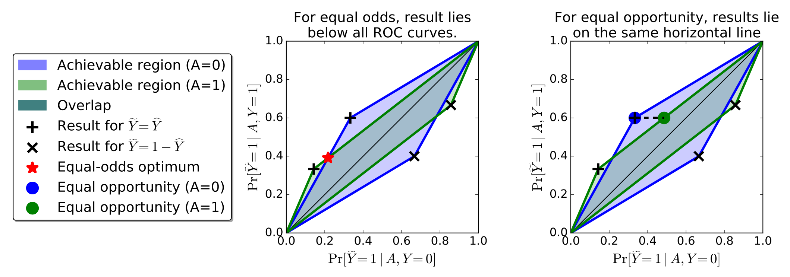
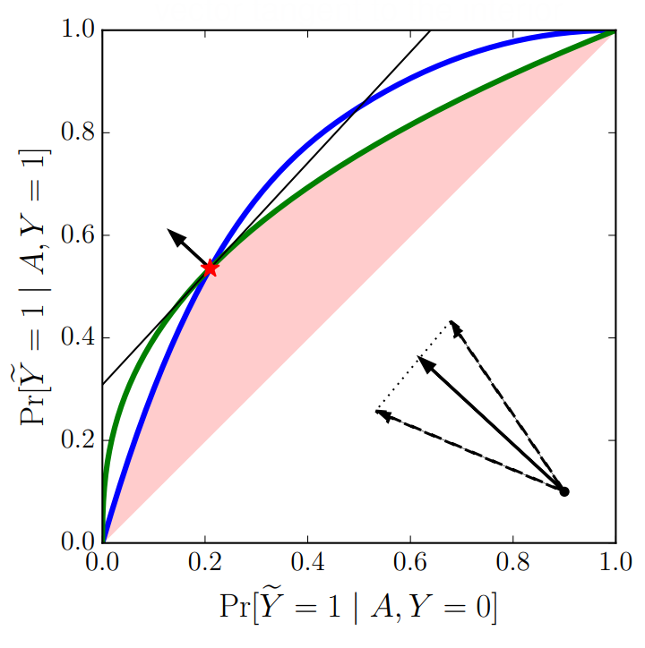

# 4. Equality of Opportunity in Supervised Learning

- Target
  - Avoiding discrimination against protected attributes in machine learning
- Existing Solutions
#### Sol.1) Fairness through unawareness
- How?)
  - Ignore all protected attributes such as race, color, religion, gender, disability, or family status.
- Problem)
  - Ineffective due to the existence of redundant encodings
#### Sol.2) Demographic Parity
- How?)
  - A decision be independent of the protected attribute.
    - i.e.)
      - For a binary protected attribute $`A\in\{0,1\}`$
        - set constraint : $`\text{Pr}\left[\hat{Y}=1\vert A = 0\right] = \text{Pr}\left[\hat{Y}=1\vert A = 1\right]`$
      - Membership in a protected class should have no correlation with the decision
- Problem)
  - Does not ensure fairness
    - Why?)
      - Accepting qualified applicants in $`A=0`$ and unqualified ones in $`A=1`$, so long as the percentages of acceptance match.
  - Often far from maximum utility.

### Goal)
- Non-discrimination from the perspective of supervised learning
- Predict a true outcome $`Y`$ from features $`X`$ based on labeled training data
  - while ensuring they are “non-discriminatory” with respect to a specified protected attribute $`A`$.
- Assumptions)
  - Access to labeled training data (including $`A`$)
    - Samples from the joint distribution $`p(X, A, Y)`$
    - Predictor : $`\hat{Y}(X)`$ or $`\hat{Y}(X, A)`$
      - This predictor can be accurate, i.e. $`\hat{Y} = Y`$
  - Obliviousness
    - $`\hat{Y}`$ is based only on the joint distribution $`p(X, A, Y)`$.
    - It does not evaluate the features in $`X`$ nor the functional form of the predictor $`\hat{Y}(X)`$.

### What the author achieved.
- An easily checkable and interpretable notion of avoiding discrimination based on protected attributes.
  - Our notion helps to incentivize the collection of better features, that depend more directly on the target rather then the protected attribute, and of data that allows better prediction for all protected classes.
- the **Bayes optimal non-discriminating (according to our definition) classifier** is the classifier derived from any Bayes optimal (not necessarily non-discriminating) regressor using our post-processing step. 
- Inherent limitations of this approach
  - Different dependency structures with possibly different intuitive notions of fairness cannot be separated based on any oblivious notion or test.

  

## 2. Equalized Odds and Equal Opportunity
### Def. 2.1) Equalized Odds
A predictor $`\hat{Y}`$ satisfies equalized odds w.r.t. protected attribute $`A`$ and outcome $`Y`$, if $`\hat{Y}`$ and $`A`$ are independent conditional on $`Y`$, i.e. $`P(\hat{Y}, A\vert Y) = P(\hat{Y}\vert Y) \cdot P(A\vert Y)`$
- Meaning)
  - $`\hat{Y}`$ depends on $`A`$ only through $`Y`$.
    - cf.) For the [demographic parity](#sol2-demographic-parity), $`\hat{Y}`$  depends on $`A`$ regardless of $`Y`$.
  - Thus, $`\hat{Y}`$ directly predicts $`Y`$, while prohibiting abusing $`A`$ as proxy for $`Y`$
- Prop.)
  - $`Y`$ and $`A`$ can take space, including binary, multi-class, continuous, or structured settings.
    - This paper will cover the binary case.
  - Non-discriminative on the protected attribute $`A`$.
    - In the binary setting, the equalized odds can be described as
      - $`P(\hat{Y}=1 \vert A=0, Y=\mathcal{y}) = P(\hat{Y}=1 \vert A=1, Y=\mathcal{y}), \quad \forall \mathcal{y}\in\{0,1\}`$
        - i.e.) Given $`Y`$, $`\hat{Y}`$ is independent of $`A`$.
        - Meaning)
          - For the outcome $`Y=\mathcal{y}=1`$, $`\hat{Y}`$ has equal TPRs across the two demographics $`A=0, A=1`$.
          - For the outcome $`Y=\mathcal{y}=0`$, $`\hat{Y}`$ has equal FPRs across the two demographics $`A=0, A=1`$.
            - i.e.) non-discriminative on $`A`$.
- Drawback)
  - It enforces that the accuracy is equally high (i.e. non-discriminative) in all demographics.
    - Punishing models that perform well only on the majority.

 

### Def. 2.2) Equal Opportunity
- Ideation)
  - [Equalized odds](#def-21-equalized-odds)'s problem 
    - It is too strong that it may reject the optimum that could have been achieved by performing well on the majority (but may discriminating on $`A`$).
  - Can't we relax [equalized odds](#def-21-equalized-odds)?
  - Consider that $`Y=1`$ is the **advantaged outcome**.
    - e.g.) not defaulting on a loan, admission to college, receiving promotions, etc
    - i.e.) What we care!
  - Then, let's require non-discrimination only within the **advantaged outcome** group.
- Def.) Equal Opportunity
  - $`\hat{Y}`$ satisfies equal opportunity w.r.t. $`A`$ and $`Y`$, if $`P(\hat{Y}=1 \vert A=0, Y=1) = P(\hat{Y}=1 \vert A=1, Y=1)`$
    - i.e.) We only care $`Y=1`$.

 

### Concept) Real-Valued Scores (R)
- Desc.)
  - A real valued predictive score $`R = f(X, A)\in\mathbb{R}`$
  - Even if the target is binary, $`R`$ can be used.
    - How?) Using a threshold $`t`$, we may judge $`\hat{Y}=\mathbb{I}(R\gt t)`$.
      - Notation) $`\hat{Y}=\mathbb{I}(R\gt t) \Leftrightarrow \hat{Y}=1`$ if $`R\gt t`$
      - Prop.) Varying this threshold changes the trade-off between sensitivity (TPR) and specificity (TNR).

 

### Def. 2.3) Oblivious Measures
- Def.)
  - A property of a predictor $`\hat{Y}`$ or score $`R`$ is said to be oblivious, if it only dependes on the joint distribution of $`(Y, A, \hat{Y}) \text{ or } (Y, A, R)`$ respectively.
- Why using this?)
  - As a consequence of being oblivious, all the information we need to verify our definitions is contained in the joint distribution $`(\hat{Y}, A, Y)`$
  - And, we can assume that we **know** the $`(\hat{Y}, A, Y)`$.
    - Why?)
      - For the binary case, when $`A, Y`$ are reasonably balanced, $`(\hat{Y}, A, Y)`$ is determined by 8 parameters  that can be estimated to very high accuracy from samples.

  

## 4. Achieving Equalized Odds and Equality of Opportunity
- Goal) Post-processing / Bolt-on Method!
  - How to find an equalized odds or equal opportunity predictor $`\tilde{Y}`$ derived from an existing binary predictor $`\hat{Y}`$ or a existing score $`R`$.
    - Here, $`\hat{Y}`$ and $`R`$ can possibly be discriminatory
- Two approaches
  - 4.1) [Deriving from a Binary Predictor](#41-deriving-from-a-binary-predictor)
  - 4.2) [Deriving from a Score Function](#42-deriving-from-a-score-function)

#### Def. 4.1) Derived Predictor
A predictor $`\tilde{Y}`$ is **derived** from a random variable $`R`$ and the protected attribute $`A`$ if it is a possibly randomized function of the random variables $`(R, A)`$ alone. In particular, $`\tilde{Y}`$ is independent of $`X`$ conditional on $`(R, A)`$.
- Desc.)
  - $`\tilde{Y}`$ should depend only on $`R`$ and $`A`$ though it may introduce additional randomness.
  - The formulation of $`\tilde{Y}`$ depends on the joint distribution $`(R, A, Y)`$.
    - Why?)
      - $`(R, A, Y)`$ was needed when training $`\hat{Y}`$.
      - Using this $`\hat{Y}`$, we are constructing $`\tilde{Y}`$.
  - But on the prediction time, we only have access to $`(R, A)`$.
    - No further data about the underlying features $`X`$, nor their distribution is required.

 

#### Concept) Loss Minimization
- Loss Function)
  - $`\ell : \{0, 1\}^2 \rightarrow \mathbb{R}`$
    - input : a pair of a prediction and the actual label $`(\hat{y}, y)`$
    - output : a real number which indicates the loss of predicting $`\hat{y}`$ when the correct label is $`y`$.
- Optimization Problem)
  - Find $`\tilde{Y}`$ s.t. $`\displaystyle \tilde{Y} = \arg\min_{\tilde{Y}} \mathbb{E} \ell(\tilde{Y}, Y)`$

 

### 4.1) Deriving from a Binary Predictor
- Desc.)
  - Following is an intuitive geometric solution in the case where we adjust a binary predictor $`\hat{Y}`$ and $`A`$ is a binary protected attribute.
  - The proof generalizes directly to the case of a discrete protected attribute with more than two values.

#### Settings) 
- $`\gamma_a (\hat{Y}) \triangleq \left( \underbrace{P\left\{ \hat{Y}=1 \vert A=a, Y=0 \right\}}_{\text{FPR}}, \; \underbrace{P\left\{ \hat{Y}=1 \vert A=a, Y=1 \right\}}_{\text{TPR}} \right)`$
  - i.e.) the pair of FPR and TPR of $`\hat{Y}`$ given $`A=a`$.
    - Since we assumed the binary class $`A`$, $`A=\{0,1\}`$.
  - Prop.)
    - We can calculate $`\gamma_a(\hat{Y})`$ using the joint distribution $`(\hat{Y}, A, Y)`$
  - Then, we can derive the conditions [equalized odd](#def-21-equalized-odds) and [equal opportunity](#def-22-equal-opportunity) using $`\gamma_a(\hat{Y})`$ as follows.
    - [equalized odd](#def-21-equalized-odds) $`\Leftrightarrow \gamma_0(\hat{Y}) = \gamma_1(\hat{Y})`$
    - [equal opportunity](#def-21-equalized-odds) $`\Leftrightarrow \gamma_0(\hat{Y})_2 = \gamma_1(\hat{Y})_2`$
      - where $`\gamma_a(\hat{Y})_2`$ denotes the second component ([advantaged outcome](#def-22-equal-opportunity)) of $`\gamma_a(\hat{Y})`$
    - [Lemma 4.2](#lemma-42) uses this condition to describe $`\hat{Y}`$ satisfying the above conditions.
- $`P_a(\hat{Y}) \triangleq \text{convhull} \left\{ (0,0), \gamma_a (\hat{Y}), \gamma_a (1-\hat{Y}), (1,1)\right\}`$
  - i.e.) A two-dimensional convex polytope defined as convex hull of four vertices (꼭짓점):
    - $`(0,0), \gamma_a (\hat{Y}), \gamma_a (1-\hat{Y}), \text{ and } (1,1)`$
      
      - Desc.)
        - A convex hull is composed of two ROC curves.
          - Upper one with $`+`$ vertex : ROC curve for $`\hat{Y}`$
          - Lower one with $`\times`$ vertex : ROC curve for $`1-\hat{Y}`$
        - Two convex hulls denote for each protected attribute value $`a\in A`$
          - Blue : $`a=0`$
          - Green : $`a=1`$

#### Lemma 4.2) 
$`\hat{Y}`$ satisfies:   
1. [equalized odd](#def-21-equalized-odds) iff. $`\gamma_0(\hat{Y}) = \gamma_1(\hat{Y})`$
2. [equal opportunity](#def-21-equalized-odds) iff. $`\gamma_0(\hat{Y})_2 = \gamma_1(\hat{Y})_2`$
   

#### Lemma 4.3)
$`\tilde{Y}`$ is derived iff. we have $`\gamma_a (\tilde{Y}) \in P_a(\hat{Y})`$, $`\forall a\in A`$
- Pf.)
  - Recall that a [derived predictor](#def-41-derived-predictor) $`\tilde{Y}`$ can only depend on $`(\hat{Y}, A)`$.
    - $`\tilde{Y} = P(\hat{Y}=1 \vert \hat{Y}=\hat{y}, A=a)`$ 
      - where $`\hat{y}, a \in \{0,1\}`$
        - i.e.) Four choices of $`(\hat{y},a)`$ correspond to the four vertices of two convex hulls $`P_a(\hat{Y}), \forall a\in \{0,1\}`$
  - $`\gamma_a (\tilde{Y}) \in P_a(\hat{Y})`$ means that $`\gamma_a (\tilde{Y})`$ is a point on the convex hull $`P_a(\hat{Y})`$

#### Equalized Odds Optimization Problem
- Optimization Problem)
  - $`\displaystyle \min_{\tilde{Y}} \mathbb{E} \ell(\tilde{Y}, Y)`$
    - s.t.
      - $`\forall a \in \{0,1\} : \gamma_a(\tilde{Y}) \in P_a(\hat{Y})`$ (gamma definition)
      - $`\gamma_0(\hat{Y}) = \gamma_1(\hat{Y})`$ ([equalized odds](#def-21-equalized-odds) definition)
- Sol.)
  - Consider that the loss function can be written as   
    $`\displaystyle \mathbb{E} \ell(\tilde{Y}, Y) = \sum_{y, y' \in \{0,1\}} \ell(y, y') \cdot P(\tilde{Y} = y', Y = y)`$
  - Here, the probability $`P(\tilde{Y} = y', Y = y)`$ can be derived as   
    $`\begin{aligned}
      P(\tilde{Y} = y', Y = y) &= P(\tilde{Y} = y', Y = y \vert \tilde{Y} = \hat{Y})P(\tilde{Y} = \hat{Y}) + P(\tilde{Y} = y', Y = y \vert \tilde{Y} \ne \hat{Y})P(\tilde{Y} \ne \hat{Y}) \\
      &= P(\hat{Y} = y', Y = y \vert \tilde{Y} = \hat{Y})P(\tilde{Y} = \hat{Y}) + P(\hat{Y} = 1-y', Y = y \vert \tilde{Y} \ne \hat{Y})P(\tilde{Y} \ne \hat{Y}) \\
      &= \underbrace{P(\hat{Y} = y', Y = y)}_{\text{Computable with}(\hat{Y}, A, Y)} \cdot \underbrace{P(\tilde{Y} = \hat{Y})}_{\text{lin. func.}} + \underbrace{P(\hat{Y} = 1-y', Y = y)}_{\text{Computable with}(\hat{Y}, A, Y)} \cdot \underbrace{P(\tilde{Y} \ne \hat{Y})}_{\text{lin. func.}} & (\text{Why?})\\
    \end{aligned}`$
    - Then, we can compute the probability...
      - directly from the joint distribution $`(\hat{Y}, A, Y)`$ for...
        - $`P(\hat{Y} = y', Y = y)`$ 
        - $`P(\hat{Y} = 1-y', Y = y)`$
      - Using a linear function of the parameters that specify $`\tilde{Y}`$ for
        - $`P(\tilde{Y} = \hat{Y})`$
        - $`P(\tilde{Y} \ne \hat{Y})`$
          - Refer to the [oblivious measure above](#def-23-oblivious-measures).
  - Depicted as the red star on the left graph of the [above image](../../images/readings/03_04_001.png).

#### Equal Opportunities Optimization Problem
- Optimization Problem)
  - $`\displaystyle \min_{\tilde{Y}} \mathbb{E} \ell(\tilde{Y}, Y)`$
    - s.t.
      - $`\forall a \in \{0,1\} : \gamma_a(\tilde{Y}) \in P_a(\hat{Y})`$ (gamma definition)
      - $`\gamma_0(\hat{Y})_2 = \gamma_1(\hat{Y})_2`$ ([equal opportunity](#def-22-equal-opportunity) definition)
- Sol.)
  - Depicted as the round points on the right graph of the [above image](../../images/readings/03_04_001.png).

  

### 4.2) Deriving from a Score Function
- Desc.)
  - Now we consider $`R\in[0,1]`$.
  - The decision is made by setting a threshold and evaluating whether the predicted value is over the threshold.
  - We may achieve higher utility, compared to [the method working with the binary predictor](#41-deriving-from-a-binary-predictor) $`\hat{Y}`$.
- Assumption)
  - A “protected attribute blind” way of deriving a binary predictor from $`R`$ would be to threshold it.
    - i.e.) $`\hat{Y} = \mathbb{I}\{R \gt t\}`$
  - If $`R`$ satisfies [equalized odds](#def-21-equalized-odds), then so will such a predictor $`\hat{Y}`$ and the optimal threshold $`t`$ should be chosen to balance FPR and TPR so as to minimize the expected loss $`\mathbb{E}\ell(\hat{y}, y)`$
    - When $`R`$ does not already satisfy [equalized odds](#def-21-equalized-odds), we might need to use different thresholds $`t_a`$ for each $`a\in A`$
      - i.e.) $`\tilde{Y} = \mathbb{I}\{R \gt t_a\}`$ 
  - ROC Curve is used.
    - Def.) $`A`$-conditional ROC Curve
      - $`C_a(t) \triangleq \left( \underbrace{P\left\{\hat{R}\gt t \vert A = a, Y=0 \right\}}_{\text{FPR}}, \underbrace{P\left\{\hat{R}\gt t \vert A = a, Y=1 \right\}}_{\text{TPR}} \right)`$
        - On the FPR-TPR plane
- Derivation)
  - Recall the [Equalized odds](#def-21-equalized-odds) condition as below   
    $`\begin{cases} \text{{FPR}} : P\{\hat{Y}=1 \vert Y=0, A=a\} = P\{\hat{Y}=1 \vert Y=0, A=a'\} \\ \text{TPR} : P\{\hat{Y}=1 \vert Y=1, A=a\} = P\{\hat{Y}=1 \vert Y=1, A=a'\} \end{cases}`$ 
    - The conditional behavior of the predictor is at exactly the same point.
  - There can be two cases.
    1. $`\forall a,a'\in A,\; C_a(t) = C_{a'}(t)`$, i.e. the ROC curves agree on every threshold.
       - Then, any thresholding of $`R`$ yields an equalized odds predictor.
    2. $`\exists a,a'\in A,\; C_a(t) \ne C_{a'}(t)`$, i.e. the ROC curves agree on every threshold.
       - Then, the the equalized odds predictor only exists on the threshold $`t^*`$ where $`C_a(t)`$ and $`C_{a'}(t)`$ intersects. (i.e. $`C_a(t^*) = C_{a'}(t^*)`$)
       - Problem)
         - It is possible that $`\nexists t^*, \; C_a(t) = C_{a'}(t)`$.
         - Even if $`t^*`$ exists, it is possible that the intersection might represent a poor tradeoff between false positive and false negatives.
       - Use $`D_a(t)`$ below instead
  - Concept) The Span of Possible Derived Predictors $`D_a(t)`$
    - $`D_a(t) \triangleq \text{convhull}\left\{ C_a(t): t\in[0,1] \right\}`$
      - where the area below diagonal is excluded. (Worse than the random guess)
    - Meaning)
      - Any point in $`D_a(t)`$ represents FPR-TPR conditioned on $`A=a`$ of a **randomized** derived predictor based on $`R`$
    - e.g.)   
      
      - Desc.)
        - Blue : $`C_0(t)`$
        - Green : $`C_1(t)`$
        - Red Area : $`D_a(t) = D_{a'}(t)`$
