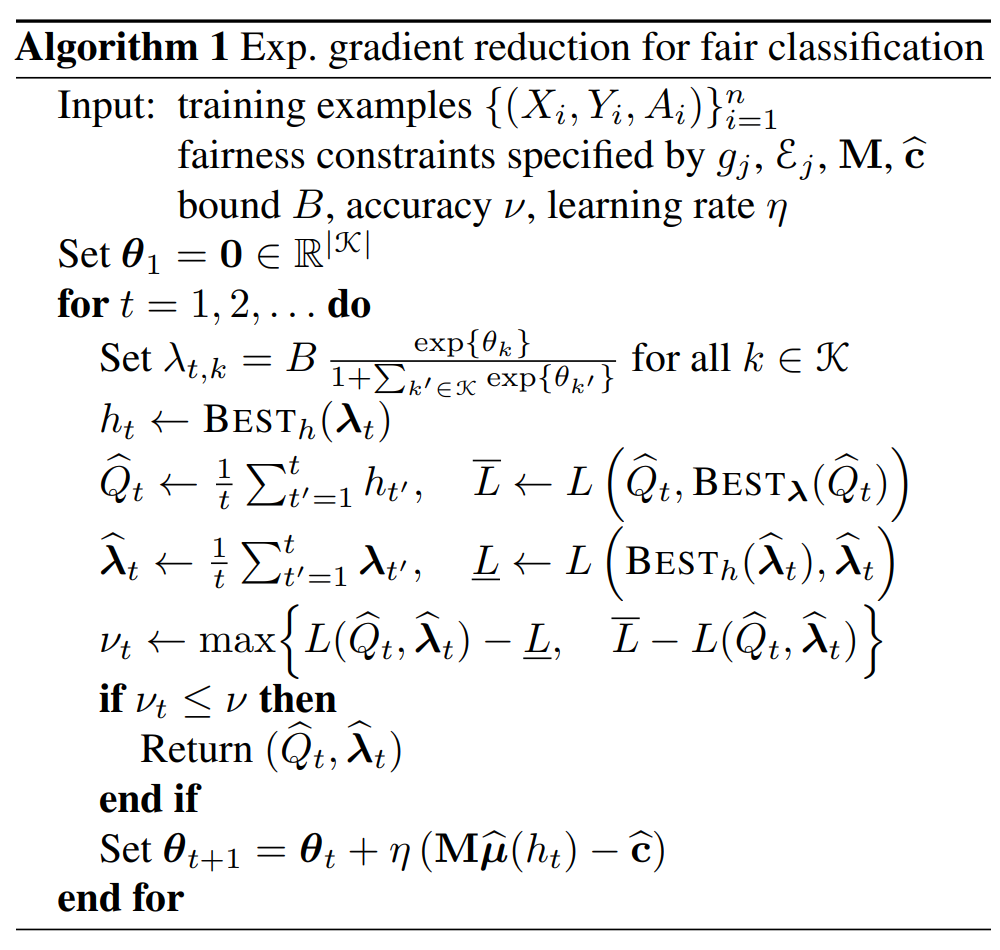

# 5. A Reductions Approach to Fair Classification

- Key Idea)
  - Reduce fair classification to a sequence of cost-sensitive classification problems
    - whose solutions yield a **randomized** classifier with the lowest (empirical) error subject to the desired constraints

## 1. Introduction
- Target)
  - Binary Classification subject to Fairness Constraints w.r.t. a pre-defined protected attribute (e.g. sex and race)
- Previous Approaches)
  1. Incorporate specific quantitative definitions of fairness into existing ML methods.
     - How?) 
       - Relax the desired definitions of fairness
       - Enforce weaker constraints (e.g. Lack of correlation)
     - Prop.)
       - The resulting fairness guarantees only hold under strong distributional assumptions.
       - Tied to specific families of classifiers (e.g. SVM)
  2. Eliminating the restriction to specific classifier families and treat the underlying classification method as a "**black box**," while implementing a wrapper that either works by...
     1. **pre-processing** data  
        - Props.)
          - Specific to particular definitions of fairness
          - Typically seek to come up with a single transformed data set that will work across all learning algorithms
            - In fact, leads to classifiers that still exhibit substantial **unfairness**
     2. **post-processing** the classifier's predictions
        - Props.)
          - Allows wider range of fairness definitions
          - Results in provable fairness guarantees.
          - Not guaranteed to find the most accurate fair classifier
          - Requires test-time access to the protected attribute (might not be available).
- What this paper suggests)
  - A general purpose approach that
    - Treating the underlying classification method as a **black box**
    - Without noted disadvantages of the previous approaches
      - How?)
        - It encompasses a wide range of fairness definitions
          - Any definition of fairness that can be formalized via linear inequalities on conditional moments
            - e.g.) demographic parity, equalized odds
        - Guarantees to yield the most accurate fair classifier
        - Not require test-time access to the protected attribute
  - Show how binary classification subject to the specified fairness constraints can be reduced to a sequence of cost-sensitive classification problems.
    - Requirement)
      - A black-box access to a cost-sensitive classification algorithm.
    - Advantage)
      - Does not need to have any knowledge of the desired definition of fairness or protected attribute
    - Outcome)
      - Yield a randomized classifier with the lowest (empirical) error subject to the desired fairness constraints
- Related Papers)
  - Preliminary Version)
    - Agrawal et. al, 
      - A reductions approach to fair classication. In Fairness, Accountability, and Transparency in Machine Learning (FATML), 2017.
  - Applied Version)
    - General Optimization Objective)
      - Alabi et al.
        - Unleashing linear optimizers for group-fair learning and optimization.
    - Combinatorial Protected Attributes)
      - Kearns et al.
        - Preventing fairness gerrymandering: Auditing and learning for subgroup fairness

  

## 2. Problem Formulation
### 2.1 Fairness Definition
#### Concept) Demographic Parity (DP)

#### Concept) Equalized Odds (EO)

#### Concept) General Set of Linear Constraints
- Def.)
  - $`M\mu(h) \le c`$
    - where 
      - $`M\in\mathbb{R}^{\vert\mathcal{K}\vert\times\vert\mathcal{J}\vert}`$ and $`c\in\mathbb{R}^{\vert\mathcal{K}\vert}`$ describe the linear constraints
        - each indexed by $`k\in\vert\mathcal{K}\vert`$
      - $`\mu(h)\in\mathbb{R}^{\vert\mathcal{J}\vert}`$ is a vector of conditional moments of the form
        - $`\mu_j(h) = \mathbb{E} \left[ g_j(X, A, Y, h(X)) \;\vert\; \mathcal{E_j} \right]`$ for $`j\in\mathcal{J}`$
          - where
            - $`g_j : \mathcal{X} \times \mathcal{A} \times \{0,1\}\times \{0,1\} \rightarrow [0,1]`$
              - $`g_j`$ depends on $`h`$
            - $`\mathcal{E}_j`$ is an event defined w.r.t. $`(X,A,Y)`$
              - $`\mathcal{E}_j`$ cannot depend on $`h`$
- Prop.)
  - [Demographic Parity (DP)](#concept-demographic-parity-dp) and [Equalized Odds (EO)](#concept-equalized-odds-eo) are the special cases of this linear constraint.
  
  

### 2.2 Fair Classification
- Standard Binary Classification Optimization Problem)
  - $`\displaystyle \min_{h\in\mathcal{H}} \text{err}(h)`$ s.t. $`M\mu(h) \le c`$
    - where
      - $`\text{err}(h) := P[h(x) \ne Y]`$ : the error
- Extending the Problem considering the Randomized Classifier)
  - Idea)
    - The above standard problem only considers classifiers $`h\in\mathcal{H}`$
    - Consider a randomized classifier $`Q\in\Delta`$ s.t.
      - $`\displaystyle \mu(Q) = \sum_{h\in\mathcal{H}}Q(h)\mu(h)`$
      - $`\Delta`$ is the set of all distributions over $`\mathcal{H}`$
    - Then we can make a prediction using $`Q`$ by... 
      1. Sampling a classifier $`h\in\mathcal{H}`$ from $`Q`$
      2. Using $`h`$ to make prediction.
  - Optimization Problem)
    - $`\displaystyle \min_{Q\in\Delta} \text{err}(Q)`$ s.t. $`M\mu(h) \le c`$
- Estimation)
  - In reality, we do not have the access to the true distribution over $`(X,A,Y)`$.
  - Instead, we only have example data $`\{(X_i, A_i, Y_i)\}_{i=1}^n`$.
  - Thus, we should replace
    - $`\text{err}(Q)`$ with $`\widehat{\text{err}}(Q)`$
    - $`\mu(Q)`$ with $`\widehat{\mu}(Q)`$
    - $`c`$ with $`\hat{c}`$
  - Therefore, the problem goes
    - $`\displaystyle \min_{Q\in\Delta} \widehat{\text{err}}(Q)`$ s.t. $`M\hat{\mu}(h) \le \hat{c}`$

  

## 3. Reduction Approach
### 3.1 Cost-Sensitive Classification
- Assume that we have access to a [cost-sensitive classification algorithm](#concept-cost-sensitive-classification-algorithm) for the set $`\mathcal{H}`$

#### Concept) Cost-sensitive classification algorithm
- Input)
  - Cost of the classification as an training example as below   
    $`\{(X_i, C_i^0, C_i^1)\}`$
    - where $`C_i^y`$ denotes the cost of predicting $`y`$
- Output)
  - $`\displaystyle\arg\min_{h\in\mathcal{H}} \sum_{i=1}^n h(X_i)C_i^1 + (1-h(X_i))C_i^0`$

### 3.2 Reduction
- Rewrite the optimization problem as a saddle point problem.
  - Optimization Problem)
    - $`\displaystyle \min_{Q\in\Delta} \widehat{\text{err}}(Q)`$ s.t. $`M\hat{\mu}(h) \le \hat{c}`$
  - Lagrangian)
    - $`L(Q, \lambda) = \widehat{\text{err}}(Q) + \lambda^\top \left(M\hat{\mu}(h) - \hat{c}\right)`$
  - Rewriting the Optimization Problem as
    - $`\displaystyle \min_{Q\in\Delta} \max_{\lambda_\in\mathbb{R}_{+}^{\vert\mathcal{K}\vert}} L(Q,\lambda)`$
  - For computational and statistical reasons, impose an additional constraint on the $`\ell_1`$ norm of $`\lambda`$.
  - Dual of the problem goes   
    $`\begin{cases}
      \displaystyle\min_{Q\in\Delta} \max_{\lambda\in\mathbb{R}_{+}^{\vert\mathcal{K}\vert}, \Vert\lambda\Vert_1\le B} L(Q,\lambda) & \quad\cdots(P) \\
      \displaystyle\max_{\lambda\in\mathbb{R}_{+}^{\vert\mathcal{K}\vert}, \Vert\lambda\Vert_1\le B} \min_{Q\in\Delta} L(Q,\lambda) & \quad\cdots(D) \\
    \end{cases}`$
    - This is a saddle point.
      - Why?)
        - Both problems $`(P), (D)`$ have solutions.
          - $`L`$ is linear in $`Q`$ and $`\lambda`$
          - The domains of $`Q`$ and $`\lambda`$ are convex and compact.
        - The minimum value of $`(P)`$ and the maximum value of $`(D)`$ are equal and coincide with $`L(Q^\dagger, \lambda^\dagger)`$
- Following is the algorithm that finds an approximate equilibrium in with neither player can gain more than $`\nu`$ by changing their choice.
  - i.e.)   
    $`\begin{cases}
        L(\widehat{Q}, \widehat{\lambda}) \le L(Q, \widehat{\lambda}) + \nu & \forall Q\in\Delta \\
        L(\widehat{Q}, \widehat{\lambda}) \le L(\widehat{Q}, \lambda) - \nu & \forall \lambda\in\mathbb{R}_{+}^{\vert\mathcal{K}\vert}, \Vert\lambda\Vert_1\le B \\
    \end{cases}`$   
    