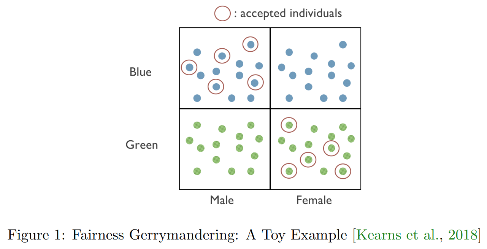

# 6. An Empirical Study of Rich Subgroup Fairness for Machine Learning

- Overlapping intersectional groups

## 1 Introduction
- Ideation)
  - Statistical definitions of fairness are common in ML
    - e.g.)
      - Positive classification rate
      - FPR, FNR, TPR
      - Positive predictive value
    - Advantage)
      - Easy to check
    - Drawback)
      - In worst case, computationally expensive
      - Not meaningful to individuals
        - Why?) Fairness Gerrymandering
          - These constraints are averages taken over large populations.
          - Thus, they don't represent how an individual person will be treated.
- Concept) Fairness Gerrymandering
  - e.g.)   
    
    - Settings)
      - Two sensitive attributes : race (blue/green), gender(male/female)
        - Two attributes are distributed 
          - independently 
          - uniformly at random
          - uncorrelated with a binary label that is also distributed uniformly at random
      - Applying [equalized odds](04.md#def-21-equalized-odds) to this problem.
        - i.e.) Equalizing the FPR across the protected groups
        - This works if we classify the population by either race or gender.
        - But doesn't work for the classification of both attributes
          - e.g.) Blue Male, Green Female
- This paper suggests...
  - Idea)
    - Put a small number of coarsely defined groups.
      - For the $`d`$ number of binary attributes, there will be $`2^d`$ groups.
    - Ask for them to hold over a combinatorially or infinitely large collection of subgroups defined by a set of functions $`\mathcal{G}`$ of the protected attributes.
  - Assumption)
    - Access to the black-box classifier (oracle) which can solve the unconstrained learning problems over $`\mathcal{G}`$ and $`\mathcal{H}`$ respectively.
  - Assertion)
    - As long as the class of functions defining these subgroups has bounded VC dimension, 
      - the statistical learning problem of finding the best (distribution over) classifiers in $`\mathcal{H}`$ subject to the constraint of equalizing the positive classification rate, the false positive rate, or the false negative rate over every subgroup defined over $`\mathcal{G}`$ is solvable whenever the **dataset size is sufficiently large** relative to the VC dimension of $`\mathcal{G}`$ and $`\mathcal{H}`$.
    - Given access to an oracle for $`\mathcal{G}`$,
      - they were able to efficiently solve the problem of auditing for rich subgroup fairness
        - i.e.) finding the $`g\in\mathcal{G}`$ that corresponds to the subgroup for whom the statistical fairness constraint was most violated.
  - Limit)
    - Access to the perfect learning oracles...
    - Rich subgroup fairness is asking for too much in practice
      - enforcing combinatorially many constraints leads to an untenable tradeoff with error.
  - Experiments with the empirical data)
    - Four datasets used.
    - Characterizing...
      - The basic convergence properties of the algorithm
      - The trade-off between subgroup fairness and accuracy.
      - The subgroup (unfairness) that can result when one applies more standard approaches
        - either...
          - ignore fairness constraints all together
          - or equalize false positive rates only across a small number of subgroups defined by individual protected attributes.
        - By auditing the models produced by these standard approaches with the rich subgroup auditor, they found that **often subgroup fairness constraints are violated, even by algorithms which are explicitly equalizing false positive rates across the groups defined on the marginal protected attributes.**