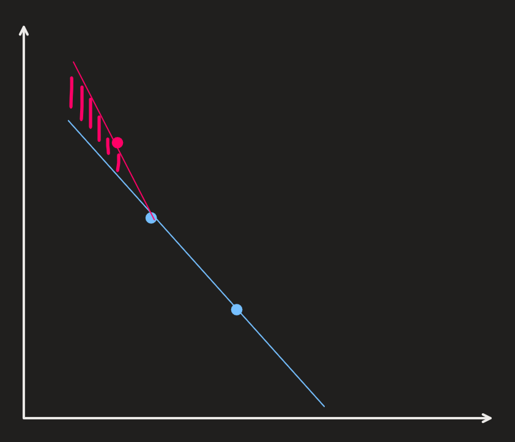

# Diversity-Guided Efficient Multi-Objective Bayesian Optimization with Batch Evaluations (DGEMO)

Luković et al.

     

Reviewed & Presented by Joon Hyeok Kim

---

<!-- slide: data-layout="center" -->

# DGEMO in One Sentence

$\text{DGEMO solves } \underbrace{\text{multi-objective problem}}_{\text{MOO}} \text{ with } \underbrace{\text{black-box functions}}_{\text{BO}} \text{ } \underbrace{\text{fast in parallel}}_{\text{MOBO}}.$

  

### 1. Multi-Objective Optimization (MOO)
- Pareto Frontier Approximation
- Hypervolume Indicator

### 2. Bayesian Optimization (BO)
- Gaussian Process

### 3. Multi-Objective **Bayesian** Optimization (MOBO)
- Diversity Region Batch Selection

  

  

---

  

# Outline
### 1. Multi-Objective Optimization (MOO)
- Pareto Front
- Hypervolume Index (HVI)
### 2. Multi Objective **Bayesian** Opt. (MOBO)
- Sequential Selection vs Batch Selection
### 3. DGEMO
- Pareto Front Approximation
- Diversity Region Batch Selection Strategy

  

  

---

# 1. Multi-Objective Optimization (MOO)

 

  
  
 Recall the example of finding the optimal molecule for medicine. 

---

 

  
  
  <b>Main Issue : Conflicting Objectives</b>   i.e.) Trade-off between Objectives    e.g.) The more effective, the more unstable, costly, severe side effect    

---

How can we measure and compare the performance in a Multi-Objective case?

#### Rule) Pareto Optimality
$x^*$ is Pareto optimal if there is **no** other solution $x$ s.t. $\left\{\begin{array}{l} f_i(x) \ge f_i(x^*) & \forall \text{ objective } i \\ f_i(x) \gt f_i(x^*) & \exists \text{ objective } i \\  \end{array}\right.$

---

#### Concept) Pareto Front(ier)
- The set of Pareto optimal points, i.e. the solution set of MOO.
  
|Maximization Problem| Minimization Problem|
|:-:|:-:|
|||

---

# MOO's Goal
- Get the **Pareto front**.
  - i.e.) the set of Pareto optimal solutions
  - Points on the Pareto fronts are better off than other available points.

---

### How do we measure the improvement on Pareto Fronts?

  

  

  
  

---

  

# HyperVolume  

  

  

---
### Hypervolume
- Def.)
  - Let
    - $\mathcal{P}_f$ : a Pareto Front **approximation** in an $m$-dim'l performance space
    - $r\in\mathbb{R}^m$ : a reference point
      - i.e.) a fixed point deliberately chosen so that its performance is “inferior” to that of all candidate solutions (or Pareto-optimal solutions)
  - Then the **hypervolume** $\mathcal{H}(\mathcal{P}_f)$ is defined as   
    - $\displaystyle \mathcal{H}(\mathcal{P}_f) = \int_{\mathbb{R}^m} \mathbb{1}_{H(\mathcal{P}_f)}(z)dz$ 
      - where 
        - $H(\mathcal{P}_f) = \{ z\in Z \;\vert\; \exists1\le i\le \vert\mathcal{P}_f \vert : r \preceq z \preceq \mathcal{P}_f(i) \}$
        - $\mathcal{P}_f(i)$ : the $i$-th solution in $\mathcal{P}_f$
        - $\preceq$ : the relation operator of objective dominance
        - $\mathbb{1}_{H(\mathcal{P}_f)} = \begin{cases} 1 & \text{ if } z\in H(\mathcal{P}_f) \\ 0 & \text{ otherwise} \end{cases}$ : a Dirac Delta function

---

  

# HVI
### HyperVolume Improvement 

  

  

---

### Hypervolume Improvement (HVI)
- Def.)
  - $\text{HVI}(P, \mathcal{P}_f) = \mathcal{H}(\mathcal{P}_f \cup P) - \mathcal{H}(\mathcal{P}_f)$
- Meaning)
  - How much the hypervolume would **increase** if a set of new points $P(\mathbf{p}_1, \cdots, \mathbf{p}_n)\subset\mathbb{R}^m$ is added to the current Pareto front approximation $\mathcal{P}_f$   

---

# MOO vs MOBO

### MOO : Multi Objective Optimization
- Goal)
  - Solve problems involving several conflicting objectives and optimizes for a set of Pareto-optimal solutions
- e.g.) 
  - MOEA, NSGA-II, MOEA/D

 

### MOBO : Multi Objective **Bayesian** Optimization
- Goal) 
  - Solve the **MOO** problem with Bayes Opt.
- Types)
  - Sequential Selection vs Batch Selection

---

# 2. Multi Objective **Bayesian** Optimization (MOBO)

 

## Sequential Selection vs Batch Selection

---

# Sequential Selection Models

- A.K.A. Single Point Method
- e.g.) PareEGO, EHI, SUR, PESMO, MESMO, USeMO

---

# Batch Selection Models

- Fast because it can run parallel : $X_B = (\mathbf{x}_, \cdots, \mathbf{x}_b)$
- With some sacrifice in accuracy
- e.g.) MOEA/D-EGO, MOBO/D, TSEMO (Thompson Sampling), BS-MOBO

---

|Sequential Selection|Batch Selection|
|:-:|:-:|
|||

---

|Sequential Selection|Batch Selection|
|:-:|:-:|
|||

---

|Sequential Selection|Batch Selection|
|:-:|:-:|
|||

---

# 3. DGEMO

  

## DGEMO is a Batch Selection MOBO  

with **Diversity Region** Batch Selection Strategy

  

  

---

### Just a small spoiler — the diversity region worked!

---

<!-- slide: data-layout="center" -->

  

# 3. DGEMO

## DGEMO is a Batch Selection MOBO  

### with Batch Selection Strategy that utilizes...

1. **GP** as a surrogate model
2. **First-order Approximation** $(\mathcal{A}_i)$ on Pareto Front
3. HVI maximization w.r.t. **Diversity Regions** $(\mathcal{D}_i)$
   - where $\mathcal{A}_i = \mathcal{D}_i$

  

  

---
## Problem Setting) Design Space vs Performance

---
## Problem Setting) Design Space vs Performance

---

## Problem Setting) Design Space vs Performance

---

#### Def.) Design Space and Constraints
- $\mathcal{X} = \{\mathbf{x}=(x^1, \cdots, x^D) \in\mathbb{R}^D : g_j(\mathbf{x})\le0, \forall j\in\{1,\cdot, K\} \}$
  - the design space where
    - $g_j$ represents a single constraint on $\mathbf{x}$
    - $G(\mathbf{x}) : \mathbb{R}^D \rightarrow \mathbb{R}^K \text{ s.t. } G(\mathbf{x}) = (g_1(\mathbf{x}), \cdots, g_K(\mathbf{x}))$
      - the concatenation of the $K$ constraints

#### Def.) Performance metric and Space
- $f_i : \mathbb{R}^D \rightarrow \mathbb{R}$ : the $i$-th performance metric (objective function)
- $F(\mathbf{x}) : \mathbb{R}^D \rightarrow \mathbb{R}^d \text{ s.t. } F(\mathbf{x}) = (f_1(\mathbf{x}), \cdots, f_d(\mathbf{x}))$
  - the concatenation of the $d$ performance metrics
  - $d\ge2$ : multi-objective problem!
  - $d \ll D$
- $\mathcal{S} = F(\mathcal{X}) \subseteq\mathbb{R}^d$ : the performance space

---
## Be Careful : Design Space vs Performance Space

 

|Design Space: $\mathcal{X}\subseteq\mathbb{R}^D$|$\rightarrow$|Performance Space: $F(\mathcal{X}) \subseteq\mathbb{R}^d$|
|:-|:-:|:-|
|$\mathbf{x} = (x_1, \cdots, x_D)$|$F : \mathbb{R}^D\rightarrow\mathbb{R}^d$  $F=(f_1,\cdots,f_d)$|$F(\mathbf{x}) = (f_1(\mathbf{x}),\cdots,f_d(\mathbf{x}))$|
|- Sample in here: $\mathbf{x}_s$  - Solution is in here: $\mathbf{x}^*$ - $B(j) = \{\mathbf{x}_{j1}, \cdots,\mathbf{x}_{jK}\}$||- Performance : $F(\mathbf{x}_s), F(\mathbf{x}^*)$  - Pareto Front : $\mathcal{P}_f$|

---

  

# 3-1. GP as a surrogate model.
### Problem)
- All we have is the data $\mathcal{D} = \{X, Y\}$
  -  $d=(\;\underbrace{x_1, x_2, \cdots, x_D}_{D\text{ features}}, \; \underbrace{y_1, y_2, \cdots, y_d}_{d\text{ objectives}} \;) \in \mathcal{D}$
- We want to find $F(X) = (f_1(X), f_2(X), \cdots, f_d(X))$
- But we don't know what $F(X)$ looks like...

  

  

---

For the $j$-th  independent objective function $f_j, \;\forall j\in\{1, \cdots, m\}$...

### 1. Prior
- Mean Function : $m_j(\mathbf{x}) = 0$
- Kernel Function Matern Kernel
    - $\displaystyle k(\mathbf{x},\mathbf{x}') = \sigma^2 \frac{2^{1-\nu}}{\Gamma(\nu)}\left(\sqrt{2\nu}\frac{\|\mathbf{x}-\mathbf{x}'\|}{\ell}\right)^\nu K_\nu\left(\sqrt{2\nu}\frac{\|\mathbf{x}-\mathbf{x}'\|}{\ell}\right)$
      - where
        - $\sigma^2$ : the variance parameter
        - $\ell$ : the length scale
        - $\nu$ : the smoothness parameter
        - $K_\nu$ : the modified Bessel function

---
### 2. Likelihood) 
- The log marginal likelihood of  on the available dataset $\{X, Y\}$
- $p_j(\mathbf{y}\vert\mathbf{x},\theta_j)$ : 
  - where $\theta_j$ is the parameters set
    - i.e.) $\sigma^2, \ell, \nu \in \theta_j$
  - Recall, $\mathbf{y} = \mathbf{f}(\mathbf{x}) + \epsilon$

### 3. Posterior
- $\tilde{f_j} \sim N(\mu_j(\mathbf{x}), \Sigma_j(\mathbf{x}, \mathbf{x}))$
  - where
    - $\begin{cases} \mu_j(\mathbf{x}) = m_j(\mathbf{x}) + k_jK_j^{-1}Y = k_jK_j^{-1}Y \\ \Sigma_j(\mathbf{x}) = k_j(\mathbf{x}, \mathbf{x}) - k_jK_j^{-1}k_j^\top \end{cases} \text{ for } \begin{cases} k_j=k_j(\mathbf{x}, X) \\ K_j = k_j(X, X) \end{cases}$

---

## Result
For the $d$ number of objectives $f_j$, we have $\tilde{f}_j\sim N (\mu_j, \Sigma_j)$.

 

$\tilde{F}(\mathbf{x}) = (\tilde{f}_1(\mathbf{x}),\cdots, \tilde{f}_d(\mathbf{x})) \quad\text{where } \tilde{f}_j \sim N(\mu_j, \Sigma_j)$

 

Additionally, during the first order approximation, we will use only the mean of $\tilde{f}_j$.
- $\tilde{f}_j = \mu_j, \; \forall j$ 

 

$\therefore \tilde{F} = (\mu_1(\mathbf{x}),\cdots, \mu_d(\mathbf{x}))$

 

Time to simply get the Pareto Front using $\tilde{F}$?

---

### Problem) Pareto Front is not nice and friendly in higher-dimensional space
Recall that we had $d$ number of objectives.   
Thus, the performance space is the subset of $\mathbb{R}^d$.

|$d=2$|$d=10$|
|:-:|:-:|
|||

---

# 3-2. First-Order Approximation (on the Pareto Front)

|||
|:-:|:-:|
|||

---

### Solution) Pareto Front Approximation
Schulz et al. "Interactive Exploration of Design Trade-Offs"

---

 But, do we know $F(X)$ ?

---

---

---

---

# 1. Performance Buffer (Buffer Cell)

---

## 1. Performance Buffer (Buffer Cell)
- $(d-1)$-dimensional array discretized using (hyper)spherical coordinates
- Partitions the **performance space** $\mathcal{S}=F(\mathcal{X}) \subseteq\mathbb{R}^d$
- Each buffer cell $B(j)$ contains a list of candidate solutions.
  - Why multiple candidates?)
    - Useful for extracting sparse approximation of the Pareto front
    - top $K(=50)$ candidates   
       

---

### $K$ candidates for each performance buffer $B(j)$

---

# 2. Stochastic Sampling

---

## 2. Stochastic Sampling
- Goal)
  - Choose $N_S$ samples in the design space $\mathcal{X}$
    - i.e.) $\mathbf{x}_s^i \in\mathcal{X}$ for $i=1,\cdots,N_S$
- How?)
  - First iteration
    - Uniformly sample from $\mathcal{X}$
  - Rest of the iteration
    - $B(j)$ from the previous state contains the point $\mathbf{x}^j$ with the minimal distance to the origin.
    - Sample $\displaystyle\mathbf{x}_s = \mathbf{x}^j + \frac{1}{2^{\delta_p}}\mathbf{d}_p$
      - where
        - $\delta_p$ : a uniform random number in $[0, \delta_p]$ (Scaling Factor)
        - $\mathbf{d}_p$ : a uniform random unit vector that defines the stochastic direction

---

# 3. Local Optimization

---

#### 3. Local Optimization
- Idea from Compromise Programming (Zeleny) 
- Goal)
  - For each $\mathbf{x}_s^i$, find $\mathbf{x}_o^i$ that optimizes for Pareto optimality
  - A scalarization scheme is used to convert the problem into **single** objective problem
    - **Diversification** is essential to avoid having solutions cluster in certain areas, failing to provide a good representation for the shape.
            

---

- Problem Setting)
  - $\displaystyle\mathbf{x}_o = \arg\min_{\mathbf{x}\in\mathcal{X}} \Vert F(\mathbf{x}) - \mathbf{z(x_s)} \Vert^2$
    - where $\mathbf{z(x_s)} \in\mathbb{R}^d$ is a reference point defined for each sample.
      - This paper uses $\mathbf{z(x_s)} = \mathbf{x}_s + \mathbf{s(x_s)}C(\mathbf{x}_s)$
        - where 
          - $\mathbf{s(x_s)}$ is a unit length search direction pushing $\mathbf{x}_s$ toward the Pareto front $\mathcal{P}$
            - Select the search direction assigned to a cell on the neighborhood of cell $j$ selected uniformly at random, within distance $\delta_N$
          - $C(\mathbf{x}_s) = \delta_s \Vert \mathbf{x}_s \Vert$ is a scaling factor depending on the distance to origin   
            - Key to **Diversification**!

---

### Result)

#### Although we don't know the actual Pareto Front, we have candidates.
- We have Performance Buffers $B(j)$ that partitions the performance space.
- For each $B(j)$ we have $K$ number of candidate points $\mathbf{x}_o$.

---

# 4. First-Order Approximation

---

# Affine Subspace around the point $\mathbf{x}_o$

    

---
- How?)
  - First-order approximation using the KKT condition.
  - The output is the affine subspace $\mathcal{A}_i$ represented by the point $\mathbf{x}_o$ and the bases represented by the matrix $M_i$

---
# Back to CIS5200 : 2nd-Order Taylor Approx
Newton's Method : $F(w+v) \approx F(w) + \nabla F(w)^\top v + \frac{1}{2} v^\top Hv$

---
<!-- _backgroundColor: #ADD8E6 -->

### KKT Conditions
  - Assuming that 
    - $f_i$ and $g_k$ are continuously differentiable 
    - the vectors $\{ \nabla g_{k'}(\mathbf{x}^*) \vert k' \text{ is an index of an active constraint} \}$ are linearly independent
  - Then for any solution $\mathbf{x}^*$ to $\displaystyle\min_{x} f_i(x) \text{ s.t. } x\in\mathcal{X}$
    - there exists dual variables $\alpha\in\mathbb{R}^d$ and $\beta\in\mathbb{R}^K$ s.t.   
      $\left\{ \begin{array}{ll}
          \mathbf{x}^* \in \mathcal{X} \\
          \alpha_i \ge 0, \; \forall i\in \{1, \cdots, d\} \\
          \beta_k \ge 0, \; \forall k\in \{1, \cdots, K\} & \text{: Dual Feasibility} \\
          \beta_k g_k(\mathbf{x}^*) = 0, \; \forall k\in \{1, \cdots, K\} & \text{: Complementary Slackness Condition} \\
          \sum_{i=1}^d \alpha_i = 1 \\
          \sum_{i=1}^d \alpha_i \nabla f_i(\mathbf{x}^*) + \sum_{k=1}^K \beta_k \nabla g_k(\mathbf{x}^*) = 0 & \text{: Stationary Condition} \\
      \end{array} \right.$

---
<!-- _backgroundColor: #ADD8E6 -->

### KKT Perturbation

- Suppose $\mathbf{x}(t)\in\mathcal{P}, \; \forall t\in(-\epsilon, \epsilon)$
  - $\mathbf{x}(t) : (-\epsilon, \epsilon) \rightarrow \mathbb{R}^D$ is in the Pareto set in a neighborhood of $t=0$.
- Taking $\alpha \in\mathbb{R}^D, \beta \in\mathbb{R}^K$ the KKT dual variables corresponding to $\mathbf{x}^* = \mathbf{x}(0)$, we have
  - $H \mathbf{x}'(0) \in \text{Im}\left( {DF}^\top (\mathbf{x}^*) \right) \oplus \text{Im}\left( {DG}_{K'}^\top (\mathbf{x}^*) \right)$
    - where
      - $\displaystyle H = \sum_{i=1}^d \alpha_i H_{f_i}(\mathbf{x}^*) + \sum_{k=1}^{K'} \beta_k H_{g_k}(\mathbf{x}^*) \in\mathbb{R}^{D\times D}$
        - for $\begin{cases} H_{f_i}(\mathbf{x}^*) = \begin{bmatrix} H_{f_1}(\mathbf{x}^*) \cdots H_{f_d}(\mathbf{x}^*) \end{bmatrix} \in \mathbb{R}^{D\times D\times d} & \text{Hessian of } F(\mathbf{x}) \\ H_{g_k}(\mathbf{x}^*) = \begin{bmatrix} H_{g_1}(\mathbf{x}^*) \cdots H_{g_K}(\mathbf{x}^*) \end{bmatrix} \in \mathbb{R}^{D\times D\times K}  & \text{Hessian of } G(\mathbf{x}) \\  \end{cases}$
      - $\mathbf{x}'(0)$ : the first order differentiation of $\mathbf{x}(t)$ on $t=0$

---
<!-- _backgroundColor: #ADD8E6 -->

- ${DF} (\mathbf{x}^*) = \begin{bmatrix} \nabla f_1(\mathbf{x}^*)^\top \\ \vdots \\ \nabla f_d(\mathbf{x}^*)^\top \end{bmatrix} \in\mathbb{R}^{D\times d}$ : the Jacobian of $F(\mathbf{x})$
- ${DG}_{K'} (\mathbf{x}^*) = \begin{bmatrix} \nabla g_1(\mathbf{x}^*)^\top \\ \vdots \\ \nabla g_{K}(\mathbf{x}^*)^\top \end{bmatrix} \in\mathbb{R}^{D\times K}$ : the Jacobian of $G(\mathbf{x})$
- $\text{Im}(\cdot)$ : the Span of the column space of $\cdot$

---
<!-- _backgroundColor: #ADD8E6 -->

#### First-order or Second order?
  - Recall the Second Order Taylor approximation
    - $f(x + x') \approx f(x) + \nabla f(x)^\top x' + \frac{1}{2}{x'}^\top H_f(x) x'$
  - Put $x' = \mathbf{x}'(0)$.
  - Then we have the second order term of  $\frac{1}{2}{\mathbf{x}'(0)}^\top \underbrace{H_f(x) \mathbf{x}'(0)}_{\text{here!}}$

#### Approximation using...
- $H_f(x)$ : the curvature of $f$   
- $\mathbf{x}'(0)$ : the direction of $f$

---
<!-- _backgroundColor: #ADD8E6 -->

### Property) First order approximation reduces the dimensionality!

 

$\mathbf{x}'(0) \in \mathbb{R}^{d+K'-1}$ where $K'$ is the number of active constraints.

 

- Meaning)
  - Recall that the design space was $\mathcal{X}\subseteq\mathbb{R}^D$.
  - This approximation reduces the dimension of the direction that $\mathbf{x}\in\mathcal{X}$ must move to $d+K'-1 \lt D$ dimension.
    - where
      - $d$ : the number of objective functions
      - $K'$ : the number of active constraints
  - Projecting on the subspace of Hessian and Jacobian.
    - cf.) Dimensionality reduction and PCA

---

---

# Result)

---
## Sparse Approximation : $\displaystyle\bigcup_{j=1}^{N_S} \mathcal{A}_j^* \approx \text{Pareto Front}$

---

### Sparse Approximation
- Goal)
  - Among $K$ solution candidates for each buffer cell $B(j)$, find a single solution $\mathbf{x}_j^*$.
  - Output)
    - $\{(\mathbf{x}_1^*, \mathcal{A}_1^*), \cdots, (\mathbf{x}_{N_S}^*, \mathcal{A}_{N_S}^*)\}$
      - Single solution and a corresponding affine subspace for each buffer cell
        - i.e.) The Pareto Front!
    - $\displaystyle\bigcup_{j=1}^{N_S} \mathcal{A}_j \approx \text{Pareto Front}$

---

# Graph-Cut Algorithm
- Criteria)
  - Optimality : Minimal distance to Origin
  - Continuity : adjacent cells share similar affine space $\mathcal{A}_i$
- Optimization using two constraints
  - $E_B(j,k)$ : binary term for continuity
    - How?) Lable $\mathcal{A}_i$ with $l_i$ and compare labels between solutions in adjacent buffer cells $B(j)$ and $B(k)$
  - $E_U(j,i)$ : unary term for optimality

---

## Optimality

---
## Continuity (Diversity!)

---

### Back to our spoiler...

---

# 3-3. HVI maximization w.r.t. **Diversity Regions**

|||
|:-:|:-:|
|||

---

$\displaystyle \arg\max_{X_B} \text{HVI} (Y_B, \mathcal{P_f}) \quad\text{s.t.}\quad \max_{1\le i\le\vert\mathcal{D}\vert} \delta_i(X_B) - \max_{1\le i\le\vert\mathcal{D}\vert} \delta_i(X_B) \le 1$

 

  

Looks great, but...

---

# Recap : DGEMO

  

A MOBO model using the Batch Selection Strategy with
- First-order Approximation on Pareto Front
- HVI maximization w.r.t. Diversity Region

  

  

---

# Result & Performance

  

### DGEMO successfully discovered all regions of interest!

  

  

---

### DGEMO converged fast!

 

---

---

---

# Thank you for your patience!