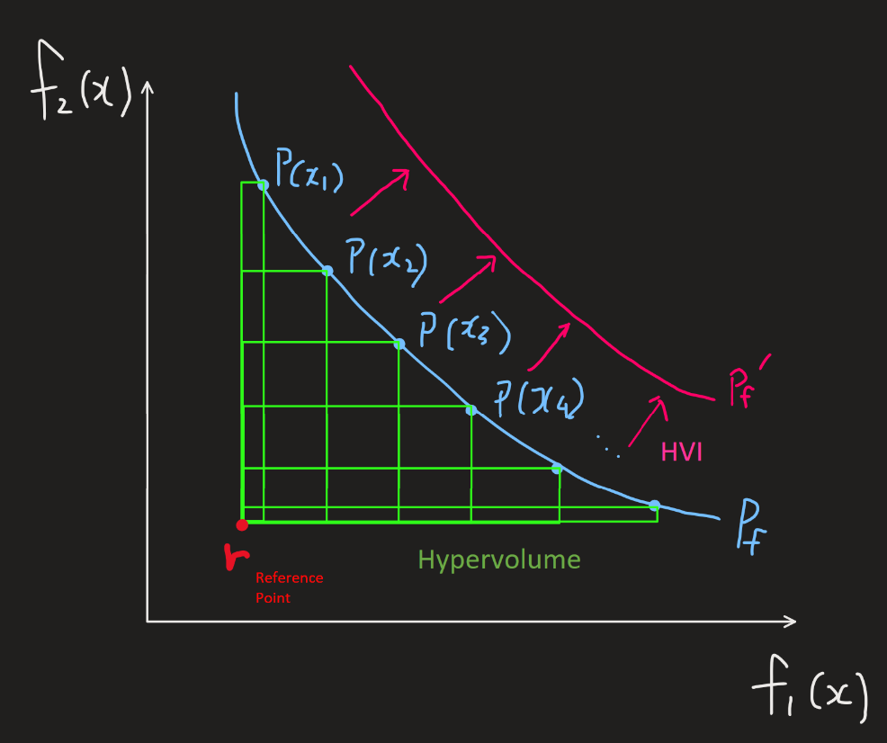
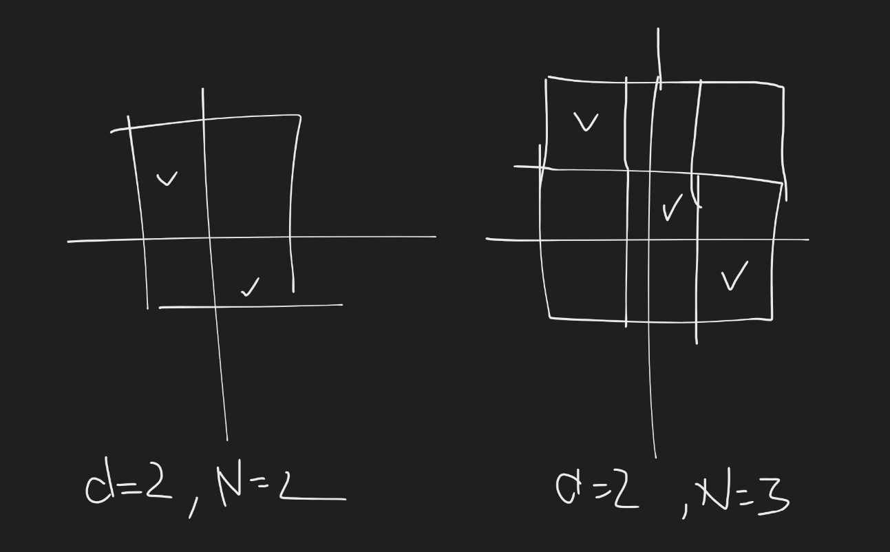

# Diversity-Guided Multi-Objective Bayesian Optimization with Batch Evaluations

## Abstract
- Goal)
  - Enhancing the Multi-objective Bayesian Optimization (MOBO)
- Existing Findings)
  - MOBO can automate the process of discovering the set of optimal solutions.
    - i.e.) Pareto Front!
  - Testing several samples in **parallel** can reduce the time.
    - Batch is one example of the parallel approach.
- What this papaer suggests)
  - A novel way of choosing the **best batch of samples** to be evaluated in parallel.
- How?)
  - The suggested algorithm approximates and analyzes **a piecewise-continuous Pareto set representation**.
  - This representation allows a batch selection strategy that optimizes for both...
    - hypervolume **improvement**
    - **diversity** of selected samples in order to efficiently advance promising regions of the Pareto Front
      - By enforcing the exploration of diverse identified regions in approximated optimal space.

  

## 1. Introduction
### Key Contributions)
- DGEMO (Diversity-Guided Efficient Multi-objective Optimization)
  - It simultaneously...
    - solves the multi-objective optimization problems of black-box functions
    - minimizes the number of function evaluations.
- Batch Selections Strategy
  - Divides the space into diversity regions that provide additional information in terms of **shared properties** and **performance of optimal solutions**.

  

## 2. Related Work
### Bayesian Optimization (BO)
- Advantage)
  - BO achieves a minimal number of function evaluations by utilizing the surrogate model and sampling guided by carefully designed selection criteria.
    - Types of Selection Criteria)
      - **Sequential Selection**
        - Better performance
        - Slower convergence
      - **Batch Selection**
        - Sacrifice some performance
        - Faster thanks to parallel evaluation

### Multi-objective Optimization (MOO)
- Desc.)
  - MOO is applied to problems involving several conflicting objectives and optimizes for a set of Pareto-optimal solutions
- Drawback)
  - Requires substantial number of evaluations
  - Too costly to investigate the infinite number of points on Pareto Frontier.
- e.g.)
  - **MOEA** : Population-based multi-objective evolutionary algorithms.
  - **NSGA-II**
  - **MOEA/D**

### Multi-objective Bayesian Optimization (MOBO)
- Desc.)
  - [BO](#bayesian-optimization-bo) X [MOO](#multi-objective-bayesian-optimization-mobo)
- Two types)
  - Single-Point Method
    - Corresponds to **Sequential Selection** in [BO](#bayesian-optimization-bo)
    - e.g.)
      |Model|Desc.|
      |:-:|:-|
      |**ParEGO** | - Randomly scalarize the MOO problem to a single-objective problem   - Select a sample with maximum [EI(expected improvement)](../notes/05.md#concept-expected-improvement).|
      |**EHI**, **SUR** | - Extension of **ParEGO** with different acquisition functions.|
      |**PAL** | - Focus on uncertainty reduction on the surrogate model for better performance|
      |**PESMO**, **MESMO** | - Rely on entropy-based acquisition functions   - Select a sample that maximizes the information gain about the optimal Pareto set|
      |**USeMO** | - Use maximum uncertainty as a selection criterion based on the Pareto set generated by **NSGA-II** |
  - Batch Method
    - Corresponds to the **Batch Selection** in [BO](#bayesian-optimization-bo)
    - e.g.)
      |Model|Desc.|
      |:-:|:-|
      |**MOEA/D-DEGO**| - Generalize **ParEGO** by multiple scalarization weights   - Perform parallel optimization with **MOEA/D**|
      |**MOBO/D**| - An extension to **MOEA/D-EGO** by changing the acquisition function|
      |**TSEMO**| - Use **Thompson Sampling** (TS) on the GP posterior as an acquisition function   -  Optimize multiple objectives with **NSGA-II**   - Select the next batch of samples by maximizing the **hypervolume improvement**.|
      |**BS-MOBO**| - Applies MOBO on a different setting with large scale datasets using neural network as surrogate model|
    - But no model considers the **diversity** in both design and performance space in the batch selection.
      - Why **diversity** matters?)
        - For many real-world problems, the Pareto-optimal solutions are distributed in **diverse** regions of the design space.

  

## 3. Preliminaries
### 3.1 Multi-objective optimization
- Goal)
  - Simultaneously minimize $`m(\ge2)`$ number of objective functions $`\mathbf{f}`$
- Settings)
  - Design Space
    - $`\mathcal{X} \subset \mathbb{R}^d`$ :  A continuous set of input variables.
  - Multiple Objective Functions
    - Notations)
      - $`f_1,\cdots, f_m:\mathcal{X}\rightarrow\mathbb{R}`$
      - $`\mathbf{f(x)} = (f_1(\mathbf{x}), \cdots, f_m(\mathbf{x}))`$ : the vector of all objects
        - where $`\mathbf{x}\in\mathcal{X}`$
  - Performance Space
    - $`\mathbf{f}(\mathcal{X}) \subset \mathbb{R}^m`$ : the $`m`$-dimensional image
  - Conflicting Objectives
    - Assume that the objective functions are often conflicting.
    - Thus, the set of **optimal solutions** are available, not the single best solution.
    - These optimal solutions are denoted by the **Pareto Set** and the **Pareto Front**.
      - Pareto Set
        - $`\mathcal{P}_s \subseteq \mathcal{X}`$
      - Pareto Front
        - $`\mathcal{P}_f = \mathbf{f}(\mathcal{P}_s) \subseteq \mathbb{R}^m`$
      - Pareto Optimality
        - Def.) A point $`\mathbf{x}^*\in\mathcal{P}_s`$ is considered Pareto-Optimal if 
          - $`\nexists\mathbf{x}\in\mathcal{X} \text{ s.t. } \begin{cases} f_i(\mathbf{x}^*) \ge f_i(\mathbf{x}),\; \forall i \\ f_i(\mathbf{x}^*) \gt f_i(\mathbf{x}),\; \exists i \end{cases}`$
  - Dataset
    - $`(X, Y) \subset \mathcal{X}\times\mathcal{Y}\subset \mathbb{R}^{d\times m}`$ : dataset
    - $`(\mathbf{x}, \mathbf{y})\in(X,Y)`$ : datapoint
      - where    
        $`\begin{aligned}
          & \mathbf{y} = \mathbf{f}(\mathbf{x}) + \epsilon, & \epsilon\sim N(0, \sigma_m^2) \\
          \Leftrightarrow& \begin{bmatrix} y_1 \\ \vdots \\ y_m \end{bmatrix} = \begin{bmatrix} f_1(\mathbf{x}) \\ \vdots \\ f_m(\mathbf{x}) \end{bmatrix} + \begin{bmatrix} \epsilon_1 \\ \vdots \\ \epsilon_m \end{bmatrix}, & \epsilon_j\sim N(0, \sigma_j^2)
        \end{aligned}`$
- How do we measure the utility of the set of points?)
  - MOO commonly uses **hypervolume indicator**
    - Concept) Hypervolume $`\mathcal{H}(\mathcal{P}_f)`$
      - Def.)
        - Let
          - $`\mathcal{P}_f`$ : a Pareto Front **approximation** in an $`m`$-dim'l performance sapce
          - $`r\in\mathbb{R}^m`$ : a reference point
            - i.e.) a fixed point deliberately chosen so that its performance is “inferior” to that of all candidate solutions (or Pareto-optimal solutions)
        - Then the **hypervolume** $`\mathcal{H}(\mathcal{P}_f)`$ is defined as   
          - $`\displaystyle \mathcal{H}(\mathcal{P}_f) = \int_{\mathbb{R}^m} \mathbb{1}_{H(\mathcal{P}_f)}(z)dz`$ 
            - where 
              - $`H(\mathcal{P}_f) = \{ z\in Z \;\vert\; \exists1\le i\le \vert\mathcal{P}_f \vert : r \preceq z \preceq \mathcal{P}_f(i) \}`$
              - $`\mathcal{P}_f(i)`$ : the $`i`$-th solution in $`\mathcal{P}_f`$
              - $`\preceq`$ : the relation operator of objective dominance
              - $`\mathbb{1}_{H(\mathcal{P}_f)} = \begin{cases} 1 & \text{ if } z\in H(\mathcal{P}_f) \\ 0 & \text{ otherwise} \end{cases}`$ : a Dirac Delta function
    - Concept) Hypervolume Improvement $`\text{HVI}(P, \mathcal{P}_f)`$
      - Def.)
        - $`\text{HVI}(P, \mathcal{P}_f) = \mathcal{H}(\mathcal{P}_f \cup P) - \mathcal{H}(\mathcal{P}_f)`$
      - Meaning)
        - How much the hypervolume would **increase** if a set of new points $`P(\mathbf{p}_1, \cdots, \mathbf{p}_n)\subset\mathbb{R}^m`$ is added to the current Pareto front approximation $`\mathcal{P}_f`$       
        

 

### 3.2 Bayesian Optimization
- Goal)
  - Find a global optimum solution of a black-box function $`f:\mathcal{X}\subset\mathbb{R}^d\rightarrow\mathbb{R}`$ that is expensive to evaluate.
- Advantage of BO)
  - Powerful for such optimization problem
  - The selection strategy of the next points to evaluate that balances the trade-off between
    - the exploration of unknown regions
    - exploitation of the best performing ones
- Procedure)
  - Single Objective Optimizations)
    - Iterate the followings.
      1. Train a single surrogate model
         - e.g.) GP
      2. Optimize a single acquisition function to select the next point to evaluate
         - e.g) 
           - expected improvement (EI)
           - probability improvement (PI)
           - upper confidence bound (UCB)
  - Multi Objective Optimizations)
    - Iterate the followings.
      1. For each objective, train a surrogate model independently.
      2. The single acquisition function is adapted to overlook multiple models.
         - e.g.)
           - expected hypervolume improvement (EHI)
             - Emmerich, *The computation of the expected improvement in dominated hypervolume of pareto front approximations.*
           - predictive entropy search (PES)
             - Hernández-Lobato et al., *Predictive entropy search for efficient global optimization of black-box functions.*

  

## 4. Proposed Method

#### Concept) Latin Hypercube Sampling (LHS)
- Goal)
  - Drawing $`N`$ samples from the $`d`$-dimensional space
- Desc.)
  - For $`d`$-dimensional space, divide each dimension into $`N`$ equally sized intervals.
    - There will be $`N^d`$ cells total.
  - We want exactly one sample in each interval along each dimension.
    - i.e.) each of the $`N`$ intervals in a given dimension is used exactly once.   
      

 

### Algorithm 1) DGEMO
- Settings)
  - $`\mathbf{f} = (f_1, \cdots, f_m):\mathcal{X}\rightarrow\mathbb{R}^m`$ : a vector of $`m`$ black-box objectives
    - where
      - $`\mathcal{X}\subset\mathbb{R}^d`$
      - $`f_j:\mathcal{X}\rightarrow\mathbb{R}`$
  - $`X_0\subset\mathcal{X}\subset\mathbb{R}^d`$ : a small set of initial samples, usually drawn by [LHS](#concept-latin-hypercube-sampling-lhs)
  - $`Y_0 = \{\mathbf{f}(\mathbf{x}_i), \; \forall\mathbf{x}_i\in X_0\} \subset\mathbb{R}^m`$
- Input)
  - $`\mathcal{X}`$ : the design space
  - $`\mathbf{f}(\mathbf{x}) = (f_1(\mathbf{x}), \cdots, f_m(\mathbf{x}))`$ : $`m`$ black-box objectives
  - $`n`$ : the number of iteration
  - $`k`$ : the number of initial samples
  - $`b`$ : the batch size 
- Output)
  - $`\mathcal{P}_s`$ : the Pareto set
  - $`\mathcal{P}_f`$ : the Pareto front
- Algorithm)
  - Initialize $`\begin{cases} X_0 \leftarrow \{\mathbf{x}_1, \cdots, \mathbf{x}_k\} \\ Y_0 \leftarrow \{\mathbf{f}(\mathbf{x}_1), \cdots, \mathbf{f}(\mathbf{x}_k)\} \end{cases}`$
  - `for` $`i=0,\cdots,n`$ `do`
    - [Train surrogate models](#41-surrogate-model) $`G_j^{(i)}`$ on $`X_i, Y_i`$ for each objective $`f_j, \; j\in\{1,\cdots,m\}`$.
    - Define acquisition function $`\tilde{f_j}^{(i)}`$ from each $`G_j^{(i)}`$.
      - i.e.) $`\tilde{\mathbf{f}}^{(i)}(\mathbf{x}) \leftarrow \left(\tilde{f_1}^{(i)}(\mathbf{x}), \cdots, \tilde{f_m}^{(i)}(\mathbf{x}) \right)`$
    - [Approximate Pareto set](#42-pareto-front-approximation) $`\mathcal{P}_s^{(i)}`$ and Pareto front $`\mathcal{P}_f`$ over $`\tilde{\mathbf{f}}^{(i)}`$.
    - Split points from $`\mathcal{P}_s^{(i)}`$ into diversity regions $`\mathcal{D}_1^{(i)}, \cdots, \mathcal{D}_r^{(i)}`$.
    - [Select points](#43-batch-selection-strategy) $`\mathbf{x}_1^{(i)}, \cdots, \mathbf{x}_b^{(i)}`$ to evaluate from $`\mathcal{D}_1^{(i)}, \cdots, \mathcal{D}_r^{(i)}`$.
    - Evaluate and update $`\begin{cases} X_{i+1} &\leftarrow X_i \cup \left\{ \mathbf{x}_1^{(i)}, \cdots, \mathbf{x}_b^{(i)} \right\} \\ Y_{i+1} &\leftarrow Y_i \cup \left\{ \mathbf{f}^{(i)}\left(\mathbf{x}_1^{(i)}\right), \cdots, \mathbf{f}^{(i)}\left(\mathbf{x}_b^{(i)}\right) \right\} \end{cases}`$
  - Compute Pareto front $`\mathcal{P}_f`$ from points in $`Y_n`$ and corresponding Pareto set $`\mathcal{P}_s`$

 

### 4.1 Surrogate Model
- Goal)
  - Model each objective **independently**
    - $`f_j, \; j\in\{1, \cdots, m\}`$
- How)
  - Use Gaussian Process as the surrogate model $`G_j`$ of the objective function $`f_j`$
  - Then, with the prior and the likelihood, get the posterior of $`f_j`$.
    - i.e.) $`f_j \sim N(\mu_j(\mathbf{x}), \Sigma_j(\mathbf{x}))`$.
- Derivation)
  - For the $`j`$-th  independent objective function $`f_j, \;\forall j\in\{1, \cdots, m\}`$...
    - Prior)
      - Any prior beliefs about the objective functions if available, without depending on the input data
      - Mean Function : $`m_j : \mathcal{X}\rightarrow\mathbb{R}`$
        - $`m_j(\mathbf{x}) = 0`$
      - Kernel Function $`k_j : \mathcal{X}\times\mathcal{X} \rightarrow \mathbb{R}`$
        - Matern Kernel
          - $`\displaystyle k(\mathbf{x},\mathbf{x}') = \sigma^2 \frac{2^{1-\nu}}{\Gamma(\nu)}\left(\sqrt{2\nu}\frac{\|\mathbf{x}-\mathbf{x}'\|}{\ell}\right)^\nu K_\nu\left(\sqrt{2\nu}\frac{\|\mathbf{x}-\mathbf{x}'\|}{\ell}\right)`$
            - where
              - $`\sigma^2`$ : the variance parameter
              - $`\ell`$ : the length scale
              - $`\nu`$ : the smoothness parameter
              - $`K_\nu`$ : the modified Bessel function
          - Why Matern?)
            - It can capture large variety of function properties.
    - Likelihood) The log marginal likelihood of  on the available dataset $`\{X, Y\}`$
      - $`p_j(\mathbf{y}\vert\mathbf{x},\theta_j)`$ : 
        - where $`\theta_j`$ is the parameters set
          - i.e.) $`\sigma^2, \ell, \nu \in \theta_j`$
        - Recall, $`\mathbf{y} = \mathbf{f}(\mathbf{x}) + \epsilon`$
    - Posterior)
      - $`f_j \sim N(\mu_j(\mathbf{x}), \Sigma_j(\mathbf{x}, \mathbf{x}))`$
        - where
          - $`\begin{cases} \mu_j(\mathbf{x}) = m_j(\mathbf{x}) + k_jK_j^{-1}Y = k_jK_j^{-1}Y \\ \Sigma_j(\mathbf{x}) = k_j(\mathbf{x}, \mathbf{x}) - k_jK_j^{-1}k_j^\top \end{cases} \text{ for } \begin{cases} k_j=k_j(\mathbf{x}, X) \\ K_j = k_j(X, X) \end{cases}`$
- What we calculate)
  - For each independent objective function $`f_j`$
    - calculate the posterior of $`f_j \sim N(\mu_j(\mathbf{x}), \Sigma_j(\mathbf{x}, \mathbf{x}))`$
      - where $`\begin{cases} \mu_j(\mathbf{x}) = k_j(\mathbf{x}, X)k_j(X, X)^{-1}Y \\ \Sigma_j(\mathbf{x}) = k_j(\mathbf{x}, \mathbf{x}) - k_j(\mathbf{x}, X)k_j(X, X)^{-1}k_j(\mathbf{x}, X)^\top \end{cases}`$
        - for the matern kernel   
          $`\displaystyle k_j(\mathbf{x},\mathbf{x}') = \sigma_j^2 \frac{2^{1-\nu_j}}{\Gamma(\nu_j)}\left(\sqrt{2\nu_j}\frac{\|\mathbf{x}-\mathbf{x}'\|}{\ell_j}\right)^\nu K_{\nu_j}\left(\sqrt{2\nu_j}\frac{\|\mathbf{x}-\mathbf{x}'\|}{\ell_j}\right)`$

 

### 4.2 Pareto Front Approximation
- Assumption)
  - Use the **mean function** $`\mu_j`$ of GP posterior as an acquisition function $`\tilde{f}_j`$.
    - Desc.)
      - Recall that we drived GP posterior $`G_j`$ for each objective function $`f_j`$.
        - i.e.) $`f_j(\mathbf{x}) \sim N(\mu_j(\mathbf{x}), \Sigma(\mathbf{x}))`$
      - Here, we use only $`\mu_j(\mathbf{x})`$ as the acquisition function.
        - hozy) Why not taking advantage of the variance?
          - What if we use the stochastic function $`f_j(\mathbf{x}) \sim N(\mu_j(\mathbf{x}), \Sigma(\mathbf{x}))`$?
      - Denote $`\tilde{f}_j(\mathbf{x}) = \mu_j(\mathbf{x})`$
- How to calculate the Pareto Front
  - Schulz et al., *Interactive exploration of design trade-offs.*
    - How?)
      - Solve a dual problem based on KKT conditions.
      - Derive a first-order approximation of the Pareto front.
        - This allows discovering large piecewise **continunous** regions of the Pareto front.
        - cf.) Evolutionalry algorithms' obtain only a **sparse** set of points.
- Procedure)
  1. A stochastic sampling scheme is used to generate a set of random samples $`\mathbf{x}_i\in\mathcal{X}`$

 

### 4.3 Batch Selection Strategy

 

