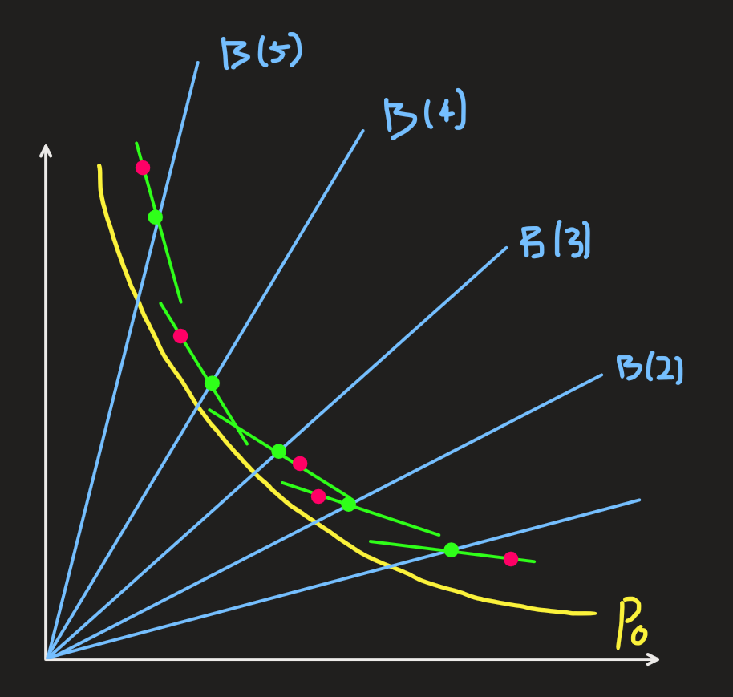
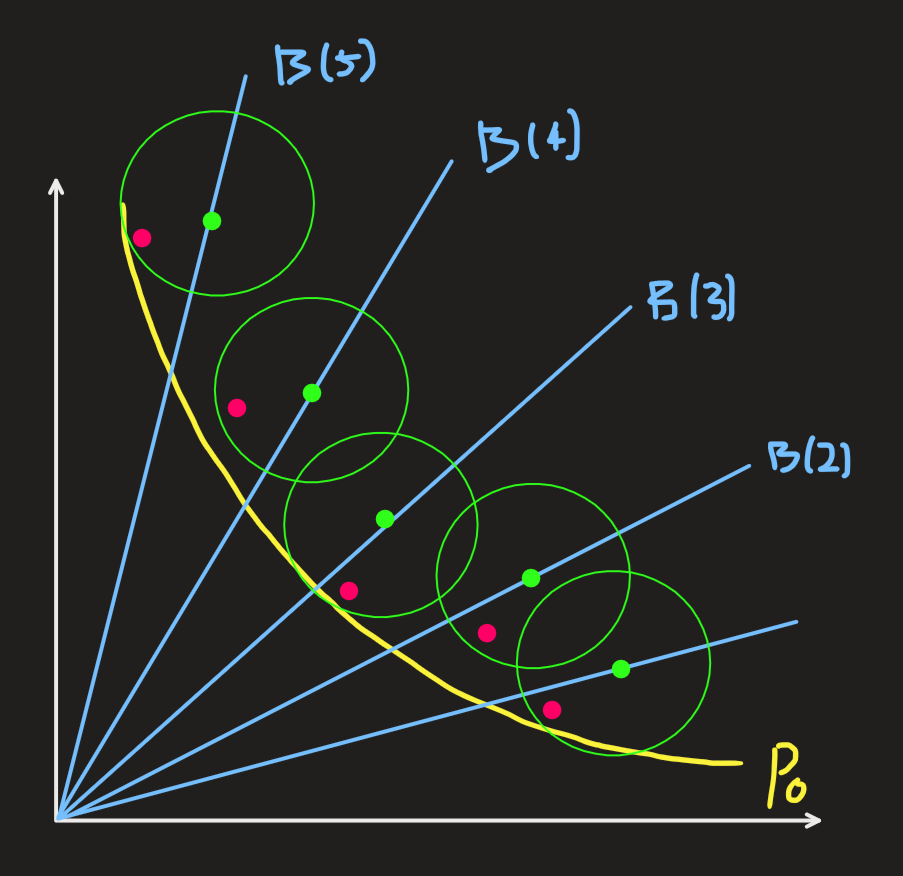

# Enhancing DGEMO with Bayesian Optimization Properties: Towards **DGEBO**

|As-is|To-be|
|:-:|:-:|
|||

---

# **DGEBO** Summary

  

- Utilize the posterior variance $\Sigma$ from $F\sim N(\mu, \Sigma)$.
- Define the diversity region $A_j$ as the dist. $A_j\sim N(x_j, C_j)$.
- Directly sample the batch $X_B$ from $A_j$:
   1. For each performance buffer (diversity region):
      1. Sample candidates from $A_j\sim N(x_j, C_j)$.
      2. Evaluate the candidates using the utility function $U(x) = \text{HVI}(P_f, x) -\lambda_\text{div} \cdot (\text{Diversity Discount})$
      3. Choose the one with the highest utility.
   2. Add the batch to the dataset and update the posterior.

  

  

---

# **DGEMO** Review

  

#### Methodology:
1. Partition the performance space into buffers $B(j)$ using Latin Hypercube Sampling (LHS).
2. For each $B(j)$, obtain $K$-best candidate points $\mathbf{x}_{jk}$ by repeating:
   1. Perform stochastic sampling in $B(j)$ to obtain $\mathbf{x}_j$.
   2. Locally optimize $\mathbf{x}_j$ to get $\mathbf{x}_o$.
   3. Maintain the $K$-best $\mathbf{x}_o$s.
3. Compute an affine subspace $A_{jk}$ for each candidate $\mathbf{x}_{jk}$.
4. Use a Graph-cut algorithm to select $A_j^*$ for each $B(j)$.
5. Sample $X_B$ from each $A_j^*$ using HVI optimization.

  

  

---

# **DGEMO**'s Limitations

### 1. The posterior variance $\Sigma_j$ is **not** used in the first-order approximation.
- $\tilde{F} \triangleq [\mu_1, \cdots, \mu_d] \text{ where } f_j\sim N(\mu_j, \sigma_j)$ represents the posterior distribution.

### 2. Stochastic sampling is arbitrary and not aligned with the philosophy of BO.
- $\displaystyle\mathbf{x}_s = \mathbf{x}^j + \frac{1}{2^{\delta_p}}\mathbf{d}_p$ : random sampling

### 3. The objective function $F$ is stochastic, but local opt. uses the $L_2$ norm.
- $\displaystyle \mathbf{x}_o = \arg\min_{\mathbf{x}\in\mathcal{X}} \Vert F(\mathbf{x}) - \mathbf{z(x_s)} \Vert^2$, where $F\sim N(\mu,\Sigma)$

---

# Idea: **DGEBO**
## Concepts I will **retain** from DGEMO:
1. Latin Hypercube Sampling (LHS)  
2. The concept of performance buffers (diversity regions)
3. GP as a surrogate model, using the posterior $F\sim N(\mu,\Sigma)$
4. Diversity conditions such as continuity and neighboring buffers
5. HVI optimization within each diversity region

---

## Concepts I want to **revise**:

### 1. Define the diversity region as a probability distribution $A_j\sim \mathcal{N}(\mathbf{x}_j, C_j)$ where:
- $[\mathbf{x}_1,\cdots,\mathbf{x}_B]$ are the LHS anchor point of each diversity region $B(1), \cdots, B(B)$.
- $C_j = C_j^{\text{local}} + \alpha \cdot C_j^{\text{diverse}}$, where:
  - $C_j^{\text{local}} = \lambda_1 \underbrace{J_\mu(x_j)J_\mu(x_j)^\top}_{\text{exploitation using mean}} + \lambda_2 \underbrace{J_\Sigma(x_j)J_\Sigma(x_j)^\top}_{\text{exploration using variance}}$
  - $\displaystyle C_j^{\text{diverse}} = \sum_{k\in \text{Neighbor}(j)} w_{jk} (v_{jk}v_{jk}^\top)$
    - $w_{jk} = \frac{1}{\Vert \mathbf{x}_j - \mathbf{x}_k\Vert^\beta} \in\mathbb{R}$: distance-based weighting
    - $v_{jk} = \frac{\mathbf{x}_j - \mathbf{x}_k}{\Vert \mathbf{x}_j - \mathbf{x}_k \Vert} \in\mathbb{R}^d$: direction from $\mathbf{x}_j$ to $\mathbf{x}_k$
  - $\alpha$: a hyperparameter controlling the diversity level

---

### 2. A new **Diversity Region-Based Batch Sampling Strategy**
- For each diversity region (performance buffer) $B(j)$:
  - Directly sample $K$ points $[\mathbf{x}_{j1},\cdots,\mathbf{x}_{jK}]$ using $A_j\sim \mathcal{N}(\mathbf{x}_j, C_j)$  
    - $X_{K}^j \triangleq [\mathbf{x}_{j1},\cdots,\mathbf{x}_{jK}]$
  - Compute $U(\mathbf{x}_{jk}, \mathcal{D}) \triangleq \text{HVI}(\mathbf{x}_{jk}, \mathcal{D}) -\lambda_\text{div} \cdot (\text{Diversity Discount})$
    - where $\displaystyle (\text{Diversity Discount}) = \sum_{j'\ne j} \exp\left(-\frac{\Vert x_j - x_{j'}\Vert^2}{2\ell^2}\right)$
  - Select $\displaystyle\arg\max_{\mathbf{x}_{jk}} U(\mathbf{x}_{jk}, \mathcal{D})$
- Update $\mathcal{D} \leftarrow \mathcal{D} \cup \{\mathbf{x}_{1}^*,\cdots, \mathbf{x}_{B}^*\}$

---

# **DGEBO** Procedure
1. From data $\mathcal{D}$, use GP as a surrogate model to get the posterior of $F \sim N(\mu, \Sigma)$.
2. Sample $[\mathbf{x}_1, \cdots, \mathbf{x}_B]$ using Latin Hypercube Sampling (LHS).
3. For each diversity region $B(j) \text{ for } j=1,\cdots, B$
   1. Calculate $J_\mu(\mathbf{x}_j)$ and $J_\Sigma(\mathbf{x}_j)$ using autograd.
   2. Sample $K$ candidates using $A_j \sim N(\mathbf{x}_j, C_j)$ where $C_j=C_j^{\text{local}} + \alpha C_j^{\text{diverse}}$.
   3. Calculate utilities of $K$ candidates using $U(\mathbf{x}, \mathcal{D})$. 
   4. Let $\mathbf{x}_j^*$ be the candidate with the highest utility.
4. Update $\mathcal{D} \leftarrow \mathcal{D} \cup \{\mathbf{x}_{1}^*,\cdots, \mathbf{x}_{B}^*\}$

---

# Visualized Comparison: DGEMO vs DGEBO
|DGEMO|DGEBO|
|:-:|:-:|
|||
