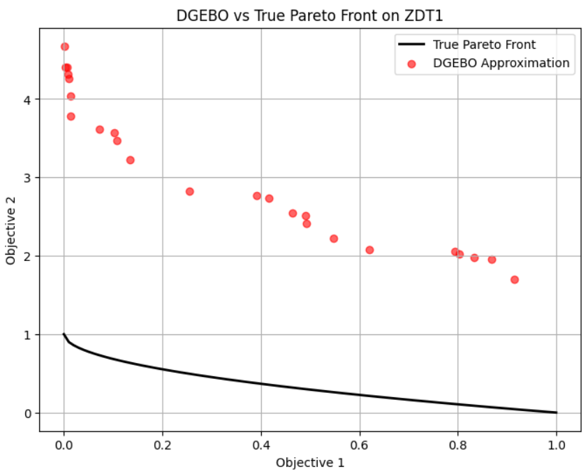
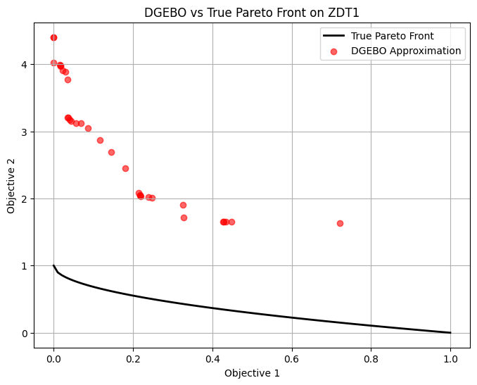

# Encountered Problem
- Current DGEBO cannot effectively search the pareto front.   
  
  - Suspected reason)
    - My idea of relying solely on sampling from the posterior to get the pareto front may be wrong.
      - Why?)
        - I'm using GP to estimate the black box multi objective function $`F`$.
        - But, GP enables more precise estimation on $`F`$, not its pareto front $`\mathcal{P}_F`$.
        - $`\mathcal{P}_F`$ is just a contour of $`F`$, which is just a small portion of $`\mathcal{Y}`$ where $`F:\mathcal{X}\rightarrow\mathcal{Y}`$
        - Thus, current algorithm of sampling $`\mathbf{x}_s`$ from $`\tilde{F}\sim\mathcal{N}(\mu, \Sigma)`$ does not guarantee that $`\mathbf{x}_s\in\mathcal{P}_F`$.
          - i.e.) Higher chance that $`\mathbf{x}_s\notin\mathcal{P}_F \wedge \mathbf{x}_s\in\mathcal{Y}`$.
  - Solution)
    - Let's try the local optimization method that DGEMO used.
      - Ideas)
        - Compromise Programming (Zeleny)
          - Optimize toward the point that I believe that it's the answer.
          - $`\displaystyle\min_x \Vert F(x)-z(x) \Vert_2^2`$ where $`z(x)`$ is my goal.
      - Twists)
        - Use KL divergence instead of $`L_2`$ norm.
          - Why?)
            - Our philosophy is to implement the fully Bayesian approach on DGEMO.
            - Thus, $`F`$ is stochastic.
            - Thus, distance metric like KL Divergence, Mutual Info, Wesserstein Distance is more appropriate.
          - Formula)
            - $`\displaystyle \mathbf{x}_o = \min_{\mathbf{x}} \text{KL}(F(\mathbf{x}),z(\mathbf{x}_s))`$
        - Set $`z`$ be the direction toward the pareto front.
          - Desc.)
            - Our goal is to optimize the sampled point to move toward the $`\mathcal{P}_F`$.
            - Although we don't know the actual $`\mathcal{P}_F`$, we have $`\mathcal{P}_{\tilde{F}}`$ from the previous estimation.
            - Choose a point $`\tilde{p}`$ from $`\mathcal{P}_{\tilde{F}}`$.
              - How?)
                - Randomly select one.
                - Choose the one that is the farthest from $`\mathbf{x}_s`$ 
            - Let $`z(\mathbf{x}_s) = \tilde{p}`$
              - Question)
                - Rather than naively setting $`z(\mathbf{x}_s) = \tilde{p}`$, what a about getting the unit vector that makes $`\mathbf{x}_s`$ to point toward $`\mathbf{x}_{\tilde{p}}`$
      - Algorithm)
        - Calculate the estimated HVI of the the sampled point $`\mathbf{x}_s`$.
          - If HVI > 0
            - Do not optimize.
            - If we do, we will drag the better point away from the origin.
          - Else,
            - Get $`\displaystyle \mathbf{x}_o = \min_{\mathbf{x}} \Vert F(\mathbf{x})-z(\mathbf{x}_s) \Vert_2^2`$
              - Problem I encountered)
                - This optimization on KL divergence does not consider the constraint on the feature space.
                  - e.g.) ZDT1 : $`\mathbf{x}\in[0,1]^{30}`$ but $`\mathbf{x}_o\notin[0,1]^{30}`$
                - Sol.)
                  - When using gradient descent to optimize the above problem, stop if the $`\mathbf{x}`$ goes out of the domain.
                  - Would there be other way to perform constrained optimization on KL divergence?
                  - $`\displaystyle \mathbf{x}_o = \min_{\mathbf{x}} \Vert F(\mathbf{x})-\tilde{p} \Vert_2^2`$

  

# Experiment
- How to choose $`\tilde{p}`$ from $`\mathcal{P}_{\tilde{F}}`$
  - Random pick -> Failed.
  - Farthest pick -> Failed.
    - Getting Worse : 
      - Lost diversity on Objective 1.
      - Only one point obtained in $`f_1 \in [0.5, 1.0]`$   
        

  

# Achievements
- Dealt with the problem of observing $`F`$ too much when calculating HVI
  - Why does this matter?)
    - The reason we are doing BO is because $`F`$ is too expensive.
    - If we observe $`F(\mathbf{x}_s)`$ for all sample points $`\mathbf{x}_s`$ to calculate HVI, it's not appropriate to the BO philosophy.
  - How?)
    - Instead, I used the posterior mean $`\mu(\mathbf{x})`$.
    - i.e.) $`\widetilde{\text{HVI}} = \text{HVI}(\mu(\mathbf{x}), \mathcal{P}_{\tilde{F}})`$
- Implemented KL divergence calculation.
- Implemented the local optimization.
- Started recording my progress on the research.
  - Don't forget.
    - You are doing research because your heart begged for it and your brain approved it.
    - You felt miserable in your previous work place.
  - Output is important, but you should not be overwhelmed by that.
  - If you fail, leave at least the record and use that for the PhD application.
  - 중꺾마!

  

# Things I should try tomorrow.
- Instead of naively naively setting $`z(\mathbf{x}_s) = \tilde{p}`$, let's use Schulz et al. method.
  - $`z(\mathbf{x}_s) = \mathbf{x}_s + s(\mathbf{x}_s) \mathcal{C}(\mathbf{x}_s)`$
    - where
      - $`s(\mathbf{x}_s)`$ is the unit vector pointing at $`\tilde{p} \in\mathcal{P}_{\tilde{F}}`$
      - $`\mathcal{C}(\mathbf{x}_s)`$ a scale factor
- Find ways to perform constrained optimization on the KL divergence.