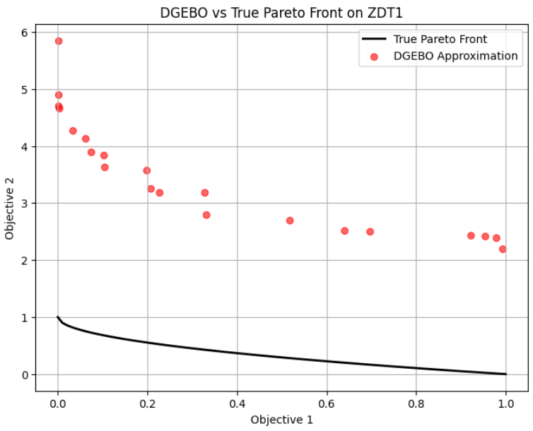

# What I did
- Correction on $`z(\mathbf{x}_s)`$
  - Recall the paper "Interactive exploration of design trade-offs"
  - The paper describeed the local optimization to be
    - $`\displaystyle \mathbf{x}_o = \min_{\mathbf{x}} \Vert F(\mathbf{x})-z(\mathbf{x}_s) \Vert_2^2`$
      - where $`z(\mathbf{x}_s) = \mathbf{x}_s + s(\mathbf{x}_s) \mathcal{C}(\mathbf{x}_s)`$
  - However, the assumption on $`z(\mathbf{x}_s)`$ was wrong due to the dimension mismatch
    - $`\mathbf{x}_s \in\mathbb{R}^D \Rightarrow z(\mathbf{x}_s)\in\mathbb{R}^D`$.
    - Recall that $`F(\mathbf{x}) \in\mathcal{Y}\subseteq\mathbb{R}^d`$.
    - Dimension mismatch!
  - Thus, it should be corrected as
    - $`z(\mathbf{x}_s) = F(\mathbf{x}_s) + s(\mathbf{x}_s) \mathcal{C}(\mathbf{x}_s)`$
  - Implementation Required!
- Scaling the variance $`C`$ where $`\mathbf{x_s}\sim\mathcal{N}(\mathbf{x_s}, C)`$.
  - In my model $`C`$ was defined as
    - $`C = (1-\lambda_\text{diversity}) C^\text{search} + \lambda_\text{diversity} C^\text{diversity}`$
      - $`C^\text{search} = (1-\lambda_\text{explore}) J_\mu J_\mu^\top + \lambda_\text{explore} J_\Sigma J_\Sigma^\top`$
      - $`\displaystyle C_j^{\text{diversity}} = \sum_{k\in \text{Neighbor}(j)} w_{jk} (v_{jk}v_{jk}^\top)`$
  - Consider that the variance $`C`$ is used to describe the distribution of the sample point in the design space $`\mathbb{R}^D`$.
  - However, the components $`J_\mu J_\mu^\top`$ and $`J_\Sigma J_\Sigma^\top`$ are from the performance space $`\mathbb{R}^d`$.
    - Why?)
      - $`\tilde{F}\sim\mathcal{N}(\mu, \Sigma)`$
      - $`\displaystyle J_\mu = \frac{d \mu}{d \mathbf{x}}, J_\Sigma = \frac{d \Sigma}{d \mathbf{x}}`$
      - Thus, $`J_{(\cdot)} J_{(\cdot)}^\top`$ is the sensitivity of $`{(\cdot)}`$ w.r.t. $`\mathbf{x}`$
        - Diagonals are always positive.
        - Other elements can be negative.
          - Why?)
            - If $`\displaystyle \frac{d J_{(\cdot)}}{d \mathbf{x}_i} \lt 0, \frac{d J_{(\cdot)}}{d \mathbf{x}_j} \gt 0`$, then $`\displaystyle [J_{(\cdot)} J_{(\cdot)}^\top]_{ij} = \left(\frac{d J_{(\cdot)}}{d \mathbf{x}_i}\right)\left(\frac{d J_{(\cdot)}}{d \mathbf{x}_j}\right) \lt 0`$
  - The concept of sensitivity seems to be valid.
  - However, the problem was that if I sample from $`\mathbf{x_s}\sim\mathcal{N}(\mathbf{x_s}, C)`$, where were so many samples that went out out of the domain $`[0, 1]^{30}`$.
  - I thought the problem was due to the difference in scale of the variance.
  - Thus, we may solve this problem by scaling the variance $`C^\text{search}`$.
    - How?)
      - Divide by the Frobenius Norm
      - Divide by the Trace
  - Additionally, we may divide once again by the value $`D-d+1`$.
    - Why?)
      - Each anchor point that we have are drawn from $`\text{LHS}(D-d+1)`$.
      - Thus, we should scale the variance with the same amount, so that the sampling may remain within each hypercube.
  - Effect)
    - the number of valid sample increased!
      - batch for sampling is enough with 2*K.
      - but set 10*K for safety.

## To-Do
- Implement the local optimization.
  - For now, let's use $`L_2`$ norm.
    - Why?)
      - $`z(\mathbf{x})`$ is deterministic.
        - Thought about $`F^{-1}`$ but impossible...
  - Let's figure out the way to use KL divergence later.
- If time allows, check how DGEMO sets the reference $`z(\mathbf{x})`$.
  - Cheating by setting it to be $`(-1, 1), (1,-1)`$??
  

Good morning Redian,

Thank you for letting me know the process of registering CIS9990.

But, would it be possible to register CIS9990 directly, instead of doing it after taking CIS5990?

In the CIS7000 course that I am taking this semester, I have already started my own project of doing research and Dr. Gardener is guiding this. Additionally, I am planning to spend sufficient amount of time on this project during the summer break. Considering the time schedule of the PhD application schedule that will take place at the end of this year, and the significance of the publication for that, I would like the expedite writing the thesis as fast as possible. Moreover, I asked for an opinion about whether to take CIS5990 or CIS9990 to Dr. Gardner, and he guided me that if the goal is to write a thesis, I should register CIS9990 directly. Considering all this, taking CIS9990 in Fall 2025 would be the best choice for me as far as the administrative system allows me to do so.

I appreciate you again for your assistance.