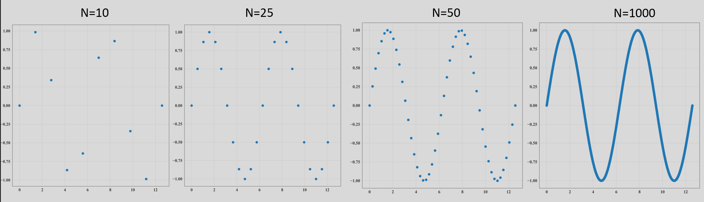
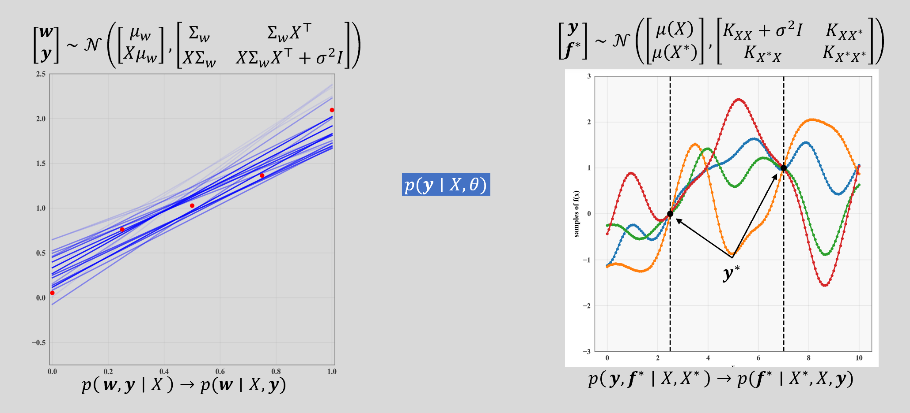

[Back to Main](../main.md)

# 4. Gaussian Process
### Concept) Gaussian Process
- Def.)
  - Infinite collection of random variables, any finite subset of which follows multivariate normal Gaussian.
- Props.)
  - GP is defined by two components
    - $`\mu(x)`$ : Mean Function
      - Prop.) Any real value function
    - $`k(x,x')`$ : Covariance Function
      - Prop.) Any real value function that results in a valid covariance matrix
      - e.g.) RBF Kernel
- Desc. with Analogy)
  - Consider plotting a function $`f(x) = \sin(x)`$.
  - We may plot $`f`$ better if we have more datapoints.   
    
  - Although our computer does not contain the infinite number of datapoints of $`f`$, it can plot it using the **marginal** calculated with the function $`\sin(x)`$.
    - i.e.) On a computer, we can only access **marginals** of a function.   
      $`\begin{bmatrix} x_1\\x_2\\\vdots\\x_n \end{bmatrix} \rightarrow \sin(x) \rightarrow \begin{bmatrix} f(x_1)\\ f(x_2)\\\vdots\\ f(x_n) \end{bmatrix}`$
  - Likewise, on a computer we can only access marginals of a GP   
    $`\begin{bmatrix} x_1\\x_2\\\vdots\\x_n \end{bmatrix} \rightarrow \text{GP} \rightarrow p\left(\begin{bmatrix} f(x_1)\\f(x_2)\\\vdots\\f(x_n) \end{bmatrix}\right) \sim N\left( \begin{bmatrix} \mu(x_1)\\\mu(x_2)\\\vdots\\\mu(x_n) \end{bmatrix}, \begin{bmatrix} k(x_1, x_1) & k(x_2, x_1) & \cdots & k(x_1, x_n) \\ k(x_2, x_1) & k(x_2, x_2) & \cdots & k(x_2, x_n) \\ \vdots & \ddots & \vdots \\ k(x_n, x_1) & k(x_n, x_2) & \cdots & k(x_n, x_n) \end{bmatrix} \right)`$   
    

  

### Concept) Applying GP to Machine Learning
- Settings)
  - $`\mathcal{D} = \{(x_1, y_1), \cdots, (x_n, y_n)\}`$ : Given dataset
  - $`x^*`$ : a test point(s) we want to predict
- Bayesian Model)
  - $`y_i = f(x_i) + \epsilon_i`$
    - where
      - $`\epsilon_i \sim N(0, \sigma_i^2)`$
  - We can estimate $`f`$ with GP as
    - $`f\sim GP (\mu(x), k(x,x'))`$
  - Adding the test point(s) to the GP, we may get   
    $`\begin{bmatrix} f(x_1)\\\vdots\\f(x_n)\\f(x^*) \end{bmatrix} \sim N \left( \begin{bmatrix}
       \mu(x_1)\\\vdots\\\mu(x_n)\\\mu(x^*)\end{bmatrix} , \begin{bmatrix} K_{nn} + \sigma_n^2 I & K_{n*} \\ K_{*n} & K_{**} \end{bmatrix} \right)`$
  - From this we can get
    - $`p(f(x^*)\vert \mathcal{D}) \sim N(\mu_{f^*\vert\mathcal{D}}(x^*), K_{f^*\vert\mathcal{D}}(x^*, {x^*}'))`$
      - where
        - $`\mu_{f^*\vert\mathcal{D}}(x^*) = \mu(x^*) - K_{*n}(K_{nn} + \sigma_n^2 I)^{-1}(y-\mu(x^*))`$
        - $`K_{f^*\vert\mathcal{D}}(x^*, {x^*}') = K_{**}-K_{*n}(K_{nn}+\sigma_n^2 I)^{-1}K_{n*}^\top`$
- Hypeparameter Selection)
  - There are hyperparameters in this setting as well.
    - $`\sigma_n^2`$ in $`\epsilon\sim N(0, \sigma_n^2 I)`$
    - $`\sigma^2`$ : the length scale of the RBF Kernel
  - But we don't have to choose the hyper parameter by ourselves.
  - Instead, we can optimize the hyperparameter by
    - $`\displaystyle \frac{\partial p(y)}{\partial \sigma_n^2} = 0`$
    - $`\displaystyle \frac{\partial p(y)}{\partial \sigma^2} = 0`$

  

[Back to Main](../main.md)