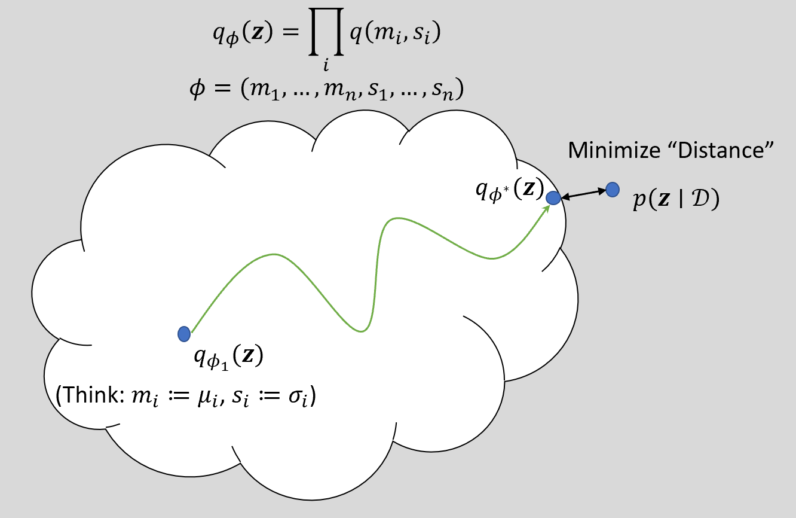
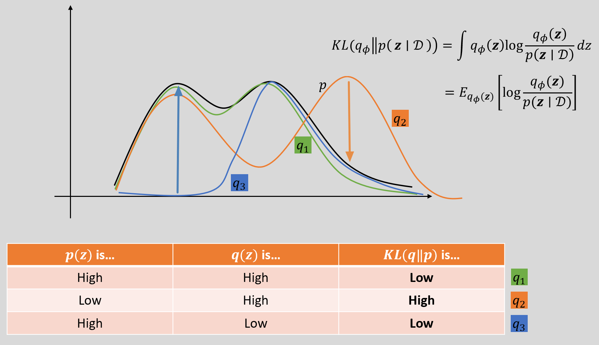
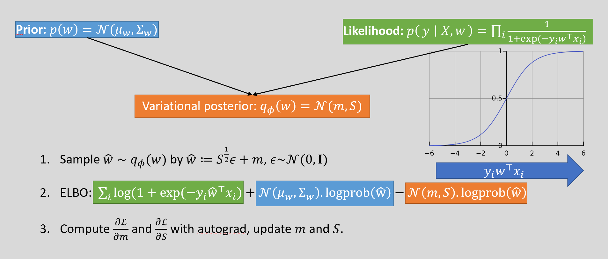

[Back to Main](../main.md)

# 6. Variational Inference

- Problems)
  - Gaussian Process's running time was $`O(n^3)`$ and kernel takes up $`O(n^2)`$ memory.
    - Is there any faster algorithm?
  - How do we approximate the intractable probability distributions?
- Sol.) Variational Inference
  - $`O(n)`$ running time
  - Independent of memory capacity!

 

### E.g.) Game Matching Example
- Goal)
  - Set up a team of players and match them with the similar skill level team
  - The problem is that the skill level is not explicitly recorded in the data.
    - cf.) the latent variable!
- Settings)
  - $`p_i`$ : the $`i`$-th player
  - $`z_i`$ : the latent skill of $`p_i`$
    - cf.) Latent
      - Not given in the data but what we believe.
      - This is also the target we want learn.
- Model Setup)
  - $`\text{Pr}(p_i \text{ beats } p_j) = \sigma(z_i - z_j)`$
    - where $`\sigma : \mathbb{R} \rightarrow [0,1]`$ is the sigmoid function.
  - Team Notation)
    - $`I, J`$ : the teams
    - $`\displaystyle \text{Pr}(I \text{ beats } J) = \sigma\left(\sum_{i\in I}z_i - \sum_{j\in J}z_j\right)`$
  - Prior
    - Individual : $`p(z_i) \stackrel{\text{i.i.d.}}{\sim} N(\mu_i, \sigma_i)`$ for each $`i`$ with i.i.d.
    - Team : $`\displaystyle p(z_I) = \prod_{i\in I} p(z_i) \quad (\because \text{i.i.d.})`$
  - Likelihood
    - $`\displaystyle p(\mathcal{D} \vert z) = \prod_{(I, J)\in\text{games}} \text{Pr}(I \text{ beats } J \vert z_I, z_J)`$
  - Posterior
    - Then with the prior and the likelihood, can we describe the posterior?   
      $`\begin{aligned}
        \underbrace{p(z_1, \cdots, z_n, \text{games})}_{\text{Posterior}} &\varpropto p(\mathcal{D} \vert z) \cdot p(z) \\
        &= \prod_{(I, J)\in\text{games}} \text{Pr}(I \text{ beats } J \vert z_I, z_J) \cdot \prod_{\forall i} p(z_i)
      \end{aligned}`$
      - Probably not.
        - Why?)
          - We don't even know how $`z`$ looks like.
      - Sol.) [Variational Inference](#6-variational-inference)

  

### Concept) Variational Inference
- Problem Setting)
  - Suppose we want to know the posterior distribution $`p(z\vert\mathcal{D})`$.
  - But the problem is that $`z`$ is a latent variable, so the distribution is intractable.
- Ideation)
  - What if we get the family of distributions $`q_\Phi (z)`$ that seems to be the closest to $`p(z\vert\mathcal{D})`$?
    
- Settings)
  - Suppose we have $`n`$ number of latent variables $`z_1, \cdots, z_n`$.
    - where each $`z_i`$ has 
      - the sample mean of $`m_i`$
      - the sample standard deviation of $`s_i`$
  - Then we might denote
    - $`\Phi = (m_1, \cdots, m_n, s_1, \cdots, s_n)`$
    - $`\displaystyle q_\Phi (z) = \prod_i q(m_i, s_i)`$
  - Assume that we have
    - Prior : $`p(z)`$
    - Likelihood : $`p(z\vert\mathcal{D})`$
  - Let's find $`\Phi`$ s.t. $`q_\Phi(z) \approx p(z\vert \mathcal{D})`$
- How)
  - We will use the Black Box Stochastic Variational Inference (SVI).
  - Gradient Descent.
    - To which direction?)
      - Minimizing the KL-Divergence between $`q`$ and $`p`$
      - This is identical to maximizing the [ELBO](#concept-evidence-lower-bound-elbo)
- Procedure)
  - Choose a variational family $`q_\Phi(\cdot)`$ and initial $`\phi_0 \sim (m_0, s_0)`$
  - Repeat the following until the convergence:
    - Draw a sample $`\hat{z} \sim q_\Phi(z)`$
    - Compute the [Evidence Lower Bound (ELBO)](#concept-evidence-lower-bound-elbo) using the sample by computing $`p(\mathcal{D}\vert z=\hat{z})`$, $`p(\hat{z})`$, and $`q_\Phi(\hat{z})`$
      - How?) 
        - Recall that $`L(\phi) = \mathbb{E}_{q_\Phi(z)} \left[ \underbrace{\log p(\mathcal{D}, z)}_{(A)} - \underbrace{\log q_\Phi(z)}_{\text{(B)}} \right]`$   
          - We can sample (A) from the likelihood and the prior.   
          $`\begin{aligned}
            (A) : \mathbb{E}_{q_\Phi(z)} \left[ \log p(\mathcal{D}, z) \right] &= \mathbb{E}_{q_\Phi(z)} \left[ \log p(\mathcal{D}\vert z) p(z) \right] \\
            &= \mathbb{E}_{q_\Phi(z)} \left[ \log \underbrace{p(\mathcal{D}\vert z)}_{\text{likelihood}} \right] + \mathbb{E}_{q_\Phi(z)} \left[ \log \underbrace{p(z)}_{\text{prior}} \right]
          \end{aligned}`$ 
          - Sample (B) using the [Markov Chain Monte Carlo](07.md#7-markov-chain-monte-carlo-model)   
            $`\displaystyle (B) : \mathbb{E}_{q_\Phi(z)} \left[ \log q_\Phi(z) \right] \approx \frac{1}{S}\sum_{i=1}^S \log q_\Phi(z_i)`$
    - Compute the derivative using autograd : $`\nabla_\phi L(\phi)`$
      - How?)
        - Recall the definition of the [ELBO](#concept-evidence-lower-bound-elbo) goes   
          $`\text{ELBO}(\phi) = \mathbb{E}_{q_\phi(z)} \left[ \log p(\mathcal{D}, z) - \log {q_\phi(z)} \right]`$
        - We want to solve the ELBO maximization (KL-Divergence minimization) problem w.r.t. $`\phi`$.
        - In order to perform the gradient descent, we need   
          $`\begin{aligned}
            \nabla_\phi \text{ELBO}(\phi) = \nabla_\phi \mathbb{E}_{q_\phi(z)} \left[ \log p(\mathcal{D}, z) - \log {q_\phi(z)} \right]
          \end{aligned}`$
        - The Magic Trick!
          - Theorem)
            - If 
              - $`\epsilon\sim p(\epsilon)`$ is independent of $`z`$
              - and some deterministic function $`T(\epsilon,\phi)`$ exists s.t.
                - $`z = T(\epsilon, \phi) \Rightarrow z\sim q_\phi(z)`$
            - Then   
              $`\begin{aligned}
                  \nabla_\phi \text{ELBO}(\phi) &= \nabla_\phi \mathbb{E}_{q_\phi(z)} \left[ \log p(\mathcal{D}, z) - \log {q_\phi(z)} \right] \\
                  &= \mathbb{E}_{q_\phi(z)} \left[ \nabla_\phi (\log p(\mathcal{D}, z) -\log {q_\phi(z)}) \right] \\
                  &= \mathbb{E}_{q_\phi(z)} \left[ \nabla_\phi (\log p(\mathcal{D}\vert z) + \log p(z) -\log {q_\phi(z)}) \right] \\
              \end{aligned}`$
        - Furthermore, consider that $`\displaystyle p(\mathcal{D}\vert z) = \prod_i p(x_i\vert z) \quad (\because \text{i.i.d.})`$.
        - Thus, $`\displaystyle \log p(\mathcal{D}\vert z) = \log \prod_i p(x_i\vert z) = \sum_i \log p(x_i\vert z)`$
        - Hence, $`\displaystyle \nabla_\phi \text{ELBO}(\phi) = \mathbb{E}_{q_\phi(z)} \left[ \nabla_\phi \left(\sum_i \log p(x_i\vert z) + \log p(z) -\log {q_\phi(z)} \right) \right]`$
          - Totally, SGD applicable!
    - Update $`\phi`$ with Gradient Descent!

 

### Concept) KL-Divergence
- Def.)   
  $`\begin{aligned}
    d &\equiv \text{KL}(q_\Phi \Vert p(z\vert\mathcal{D})) \\
    &\equiv \int q_\Phi(z) \log \frac{q_\Phi(z)}{p(z\vert\mathcal{D})} dz = \mathbb{E}_{q_\Phi(z)} \left[ \log \frac{q_\Phi(z)}{p(z\vert\mathcal{D})} \right]
  \end{aligned}`$
- Props.)
  - Distance of $`p`$ and $`q`$, and KL-Divergence   
     
    - $`q_1`$ (Green)
    - $`q_2`$ (Orange)
    - $`q_3`$ (Blue)
      - Why?) 
        - At the region where $`p`$ is high and $`q_3`$ is low we cannot get much sample from $`q_3`$.
        - So, there are less instances that increases the KL-Divergence.
        - Thus, when averaged overall, the KL-divergence is small.
  - Why using KL-Divergence)
    - Useful for the variational inference!

 

### Concept) Evidence Lower Bound (ELBO)
- Def.)
  - $`\text{ELBO}(\phi) = \mathbb{E}_{q_\phi(z)} \left[ \log p(\mathcal{D}, z) - \log {q_\phi(z)} \right]`$
- Why needed?)
  - To perform the gradient descent on this w.r.t. $`\phi`$
- Derivation)
  - Recall the KL-Divergence definition that   
    $`\begin{aligned}
        \text{KL}(q_\Phi \Vert p(z\vert\mathcal{D})) &= \mathbb{E}_{q_\Phi(z)} \left[ \log \frac{q_\Phi(z)}{p(z\vert\mathcal{D})} \right] \\
        &= \mathbb{E}_{q_\Phi(z)} \left[ \log q_\Phi(z) \right] - \mathbb{E}_{q_\Phi(z)} \left[ \log p(z\vert\mathcal{D}) \right] \\
        &= \mathbb{E}_{q_\Phi(z)} \left[ \log q_\Phi(z) \right] - \mathbb{E}_{q_\Phi(z)} \left[ \log \frac{p(\mathcal{D}, z)}{p(\mathcal{D})} \right] & (\because \text{Bayes Rule}) \\
        &= \mathbb{E}_{q_\Phi(z)} \left[ \log q_\Phi(z) \right] - \mathbb{E}_{q_\Phi(z)} \left[ \log p(\mathcal{D}, z) \right]  + \underbrace{\mathbb{E}_{q_\Phi(z)} \left[ \log p(\mathcal{D}) \right]}_{\text{indep. with } q_{\Phi}} \\
        &= \mathbb{E}_{q_\Phi(z)} \left[ \log q_\Phi(z) \right] - \mathbb{E}_{q_\Phi(z)} \left[ \log p(\mathcal{D}, z) \right] + \log p(\mathcal{D}) \\
        &= -\underbrace{(\mathbb{E}_{q_\Phi(z)} \left[ \log p(\mathcal{D}, z) - \log q_\Phi(z) \right])}_{\equiv\text{ELBO}(\phi)}  + \log p(\mathcal{D}) \\
        &= -\text{ELBO}(\phi) + \log p(\mathcal{D})
    \end{aligned}`$
- Prop.)
  - KL minimization problem is identical to ELBO maximization problem.
    - Why?)
      - By definition of ELBO, we have   
        $`\text{KL}(q_\Phi \Vert p(z\vert\mathcal{D})) = -\text{ELBO}(\phi) + \log p(\mathcal{D})`$
      - And, we will perform $`\nabla_\phi`$, which is independent with $`\log p(\mathcal{D})`$.
      - i.e.)   
        $`\begin{aligned}
          \arg\min_\phi \text{KL}(q_\Phi \Vert p(z\vert\mathcal{D})) &= \arg\min_\phi \left( -\text{ELBO}(\phi) + \log p(\mathcal{D}) \right) \\
          &= \arg\min_\phi \left( -\text{ELBO}(\phi)\right) \\
          &= \arg\max_\phi \text{ELBO}(\phi) \\
        \end{aligned}`$
  - $`\text{ELBO}(\phi) \le \log p(\mathcal{D})`$
    - Why?)
      - By definition of ELBO, we have   
        $`\begin{aligned}
            & \text{KL}(q_\Phi \Vert p(z\vert\mathcal{D})) = -\text{ELBO}(\phi) + \log p(\mathcal{D}) \\
            \Leftrightarrow & \text{KL}(q_\Phi \Vert p(z\vert\mathcal{D})) + \text{ELBO}(\phi) = \log p(\mathcal{D})
        \end{aligned}`$
    - Implication)
      - Maximizing ELBO is identical to increasing the confidence of $`p(\mathcal{D})`$.

  

### Concept) Bayesian Logistic Regression

  

[Back to Main](../main.md)