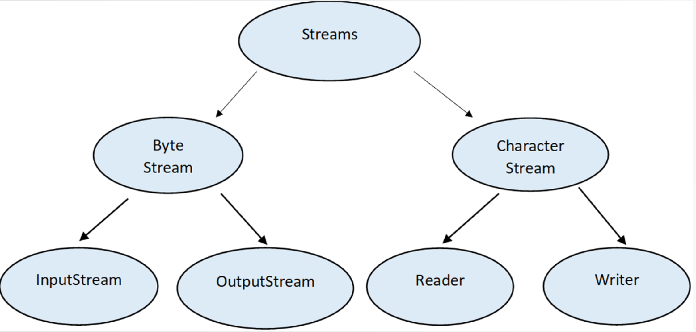
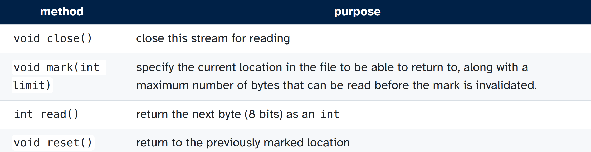

[Back to Main](../main.md)

# 1. File I/O

### Concept) Stream
- Desc.) 
  - A sequence of data
  - The stream abstraction represents a communication channel with the world outside the program
- e.g.)
  - a file
  - a network connection
- Java)
  - Class Hierarchy   
    

### Concept) I/O Streams
- Desc.)
  - An input source or output destination that can be read from or written to, respectively
  - Information of several different types can be sent along a stream
    - e.g.) bytes, primitive data types, objects
- Java)
  - Stream throw `IOException` in java.
  - Consists of [InputStream](#concept-inputstream) and [OutputStream](#concept-outputstream).

  

### Concept) InputStream
- Desc.)
  - An abstract class that serves as a superclass for all input streams of bytes
    - cf.) Since it's an [abstract class](https://github.com/JoonHyeok-hozy-Kim/program_languages/blob/main/Java/BigJavaRebuild0507/notes/ch_09/sub_04/note.md#concept-abstract-class--abstract-method), it cannot be instantiated.
  - All subclasses of InputStream are **byte streams**
    - i.e.) They return 8 bits of data from a file at a time as a byte.
      - Useful for reading raw data from a file : image, audio, machine code
      - Not useful for dealing with text.
        - cf.) `char` is in 16-bits.
- Subclasses)
  - `FileInputStream`
  - `ByteArrayInputStream`
  - `StringBufferInputStream`
- Interface   
  
  

  

### Concept) OutputStream

  

### Concept) Buffered Stream

  

### Concept) Reader

  

### Concept) Writer

  

### Concept) RandomAccessFile

  

  

[Back to Main](../main.md)