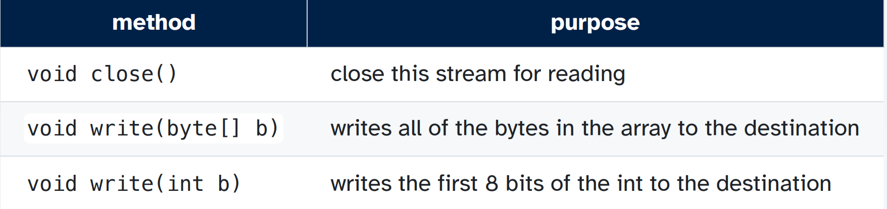

[Back to Main](../main.md)

# 1. File I/O

### Concept) Stream
- Desc.) 
  - A sequence of data
  - The stream abstraction represents a communication channel with the world outside the program
- e.g.)
  - a file
  - a network connection
- Java)
  - Class Hierarchy   
    

### Concept) I/O Streams
- Desc.)
  - An input source or output destination that can be read from or written to, respectively
  - Information of several different types can be sent along a stream
    - e.g.) bytes, primitive data types, objects
- Java)
  - Stream throw `IOException` in java.
  - Consists of [InputStream](#concept-inputstream) and [OutputStream](#concept-outputstream).


<br><br>

### Concept) InputStream
- Desc.)
  - An abstract class that serves as a superclass for all input streams of bytes
    - cf.) Since it's an [abstract class](https://github.com/JoonHyeok-hozy-Kim/program_languages/blob/main/Java/BigJavaRebuild0507/notes/ch_09/sub_04/note.md#concept-abstract-class--abstract-method), it cannot be instantiated.
  - All subclasses of InputStream are **byte streams**
    - i.e.) They return 8 bits of data from a file at a time as a byte.
      - Useful for reading raw data from a file : image, audio, machine code
      - Not useful for dealing with text.
        - cf.) `char` is in 16-bits.
- Subclasses)
  - `FileInputStream`
  - `ByteArrayInputStream`
  - `StringBufferInputStream`
- Interface   
  
  


<br><br>

### Concept) OutputStream
- Desc.)
  - An abstract class that serves as a superclass for all Output streams of bytes
- Subclasses)
  - `FileOutputStream`
  - `ByteArrayOutputStream`
  - `StringBufferOutputStream`
- Interface   
  


<br><br>

### Concept) Buffered Stream
- Desc.)
  - Buffered streams read/write data from/to a buffer, which is a temporary storage area in memory.
  - The disk operations are only executed when the buffer is empty (reading) or full (writing)
    - Better performance!
      - Why?)
        - Writing to an array: nanoseconds
        - Writing to a disk: milliseconds
- Classes
  - `BufferedInputStream`
  - `BufferedOutputStream`
- Syntax
  ```java
  FileInputStream fis = new FileInputStream("myFile.txt");
  BufferedInputStream bis = new BufferedInputStream(fis);
  FileOutputStream fos = new FileOutputStream("myFile.txt");
  BufferedOutputStream bos = new BufferedOutputStream(fos);

  /*Writing to a disk*/
  fos.write(0); // write to disk, taking 1 ms
  fos.write(3); // write to disk, taking 1 ms
  fos.write(4); // write to disk, taking 1 ms
  fos.write(7); // write to disk, taking 1 ms

  /*Writing to an array*/
  bos.write(0); // write to buffer, taking ~1 ns
  bos.write(3); // write to buffer, taking ~1 ns
  bos.write(4); // write to buffer, taking ~1 ns
  bos.write(7); // write to buffer, taking ~1 ns
  bos.flush(); // write to disk, taking 1 ms  
  ```


<br><br>

### Concept) Character Stream
- Desc.)
  - 16-bit type like `char`
    - cf.) Recall that [InputStream](#concept-inputstream) and [OutputStream](#concept-outputstream) are the subclasses of the [ByteStream](#concept-stream) of 8-bit
- Subclasses
  - [Reader](#concept-reader)
  - [Writer](#concept-writer)


<br><br>

### Concept) Reader
- Desc.)
  - Implemented by InputStreamReader, FileReader, and StringReader.
- Test)
  ```java
  @Test
  void test() throws IOException {
    Reader r = new StringReader("one two three four five");
    char c = (char) r.read();
    assertEquals('o' , c);
    c = (char) r.read();
    assertEquals('n' , c);
  }
  ```


<br><br>

### Concept) Writer
- Desc.)
  - Implemented by BufferedWriter, FileWriter, and StringWriter
- Test)
  ```java
  @Test
  void test() throws IOException {
    Writer w = new StringWriter();
    w.write('ê');
    assertEquals("ê" , w.toString());
  }
  ```


<br><br>

### Concept) RandomAccessFile
- Desc.)
  - It allows you to read from or write to any position in the file more easily.
    - cf.) Recall that [Streams](#concept-stream) have a sequential nature.
  - It behaves like a large array of bytes that you can freely index into.
  - It provides a file pointer, which marks the current position in the file and can be reset to any position.
- Interface   
  
  - cf.) [Java Doc](https://docs.oracle.com/javase/8/docs/api/java/io/RandomAccessFile.html)


<br><br>


<br><br>

[Back to Main](../main.md)