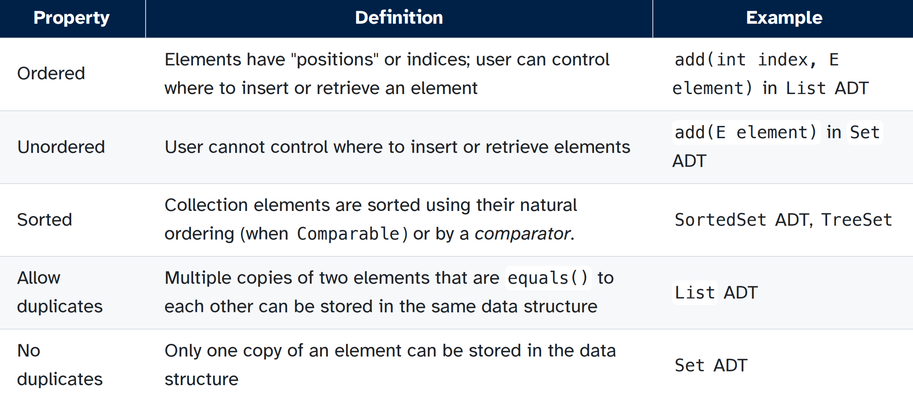
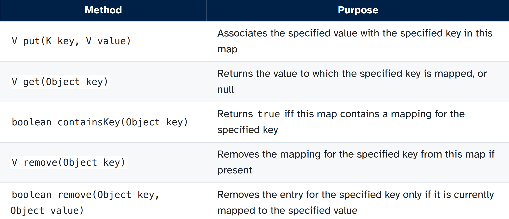

[Back to Main](../main.md)

# 2. Java Collections

### Concept) Java Collection Interface
- Desc.)
  - The root interface in the collection hierarchy
  - A collection represents a group of objects, which are known as its elements
- Kinds)
  - Lists
    - ArrayList, LinkedList
  - Dequeues
    - ArrayDequeue, LinkedList
  - Sets
    - TreeSet, HashSet
- Props.)   
  
- Operations
  - `boolean add(E e)`
  - `boolean contains(Object o)`
  - `boolean remove(Object o)`
  - Comparison
    - `equals()`
    - `hashCode()` : returns the hash value of the object

### Concept) Sorted Data Structures
- Desc.)
  - Binary Search Tree
  - Records need to be compared in order to find where to insert a new record
  - Implementations)
    - TreeSet
    - TreeMap

### Concept) The Comparable Interface
- Desc.)
  - Built-in Java interface
  - Imposes a total **ordering on the objects** of each class that implements it
    - This ordering is referred to as the class' **natural ordering**
    - The class's `compareTo` method is referred to as its natural comparison method
      - A class that implements `Comparable` must provide an implementation of `compareTo`
  - Objects of a class implementing the ADT are "sortable"
- `compareTo`
  - A method that compares two objects for order
  - It returns
    - a **negative** integer if the object on which the method is invoked is **less** than the object passed as an argument
    - **zero** if the object on which the method is invoked is **equal** to the object passed as an argument
    - a **positive** integer if the object on which the method is invoked is **greater** than the object passed as an argument
  - Syntax
    - How to inherit `Comparable` in a class (Making it sortable!)
      ```java
      public class Student implements Comparable<Student> {
        String name;
        int score;

        public Student(String name, int score){
            this.name = name;
            this.score = score;
        }

        @Override
        public int compareTo(Student other){
            return this.score - other.score;    // Return int with sign!
        }
      }
      ```
    - How to call
      ```java
      objInvokedOn.compareTo(objPassedAsArg);
      ```

### Concept) The Comparator ADT
- Desc.)
  - This allows comparison between predefined classes
- e.g.)
  ```java
  // This tuple class does not have a natural ordering!
  public class Tuple<L, R> {
    private L left;
    private R right;
    public Tuple(L left, R right) {
        this.left = left;
        this.right = right;
    }
  }

  // Use Comparator to provide the rule!
  Comparator<Tuple<Integer, Integer>> cmp = new Comparator<>(){
    @Override
    public int compare(Tuple<Integer, Integer> t1, Tuple<Integer, Integer> t2){
        return t1.left - t2.left;
    }
  }

  // Test : Recall that TreeSet requires natural ordering!
  TreeSet<Tuple<Integer, Integer>> s1 = new TreeSet<>(cmp);
  s1.add(t1);
  ```

### Concept) The Map Interface
- Desc.) 
  - A map is an object that maps keys to values.
  - A map cannot contain duplicate **keys**, but duplicate **values** are OK
- Implementations)
  - SortedMap
    - TreeMap
  - HashMap
- Operations)   
  


<br><br>

[Back to Main](../main.md)