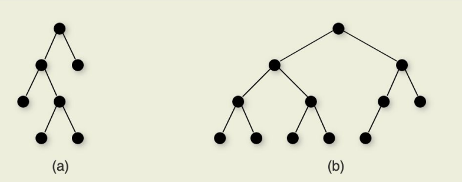

[Back to Main](../main.md)

# 5. Binary Trees
### Concept) Binary Tree
- Def.)
  - A finite set of nodes
  - A root node with two disjoint binary trees called the left and right subtrees (children)
  - Each node contains...
    - A value (the data we are storing)
    - A reference to a left/right child (may be null)
- Concepts)
  |Term|Desc.|
  |:-:|:-|
  |Leaf node|Any node that has two empty children|
  |Parent and Child|The node `P` that directly links to a node `A` is the parent of `A`. `A` is the child of `P`.|
  |Path|A sequence of nodes $`v_1 ,v_2,\cdots,v_n`$ forms a path of length $`n−1`$ if there exist edges from $`v_i`$ to $`v_{i+1}`$ for $`1\le i \lt n`$.|
  |Ancestor|For a given node `A`, any node on a path from `A` up to the root is an **ancestor** of `A`|
  |Depth|The depth of a node `M` in a tree is the length of the path from the root of the tree to `M`|
  |Sibling|A sibling of node `A` is any other node with the **same parent** as `A`|
  |Size of a Tree|Number of nodes in a tree|
  |Height|The depth of the deepest node|
  |Level|All nodes of depth $`d`$ are at level $`d`$ in the tree|
- Applications)
  - [Priority Queues](08.md#concept-priority-queue)
  - Expression Trees
  - Data Compression
- Implementation)
  - Separate implementations for internal and leaf nodes to reduce overhead. (Polymorphism)
    - Why?)
      - Approximately 50% of the nodes are the leaves.
      - And they do not have children nodes.
      - Thus, it is wasteful to store child pointers in leaf nodes.
- Analysis)
  - Space requirement)
    - Putting 
      - $`P`$ the space required by a pointer
      - $`D`$ the space required by a data value
      - overhead : the amount of space necessary to maintain the data structure
    - When every node has two pointers to its children
      - the overhead is $`\frac{2P}{2P+D}`$
    - When every node has two pointers to its children and one to data record
      - the overhead is $`\frac{3P}{3P+D}`$
    - When only internal nodes have children pointers
      - the overhead is $`\frac{P}{P+D}`$

 

### Concept) Full Binary Tree
- Def.)
  - A binary tree that every node is either... 
    - a leaf node
    - an internal node with two non-empty children

#### Thm.) Full BT Theorem
- Thm.)
  - The number of leaves in a non-empty full binary tree is one more than the number of internal nodes
- Pf.)
  - Put $`n`$ the number of internal nodes.
  - Base Case
    - $`n=0`$
      - No internal node and one leaf.
    - $`n=1`$
      - One internal node and two leaves.
  - Induction hypothesis
    - Assume that all full BTs with $`n-1`$ internal nodes have $`n`$ leaves.
    - Suppose we add two children to one of the leaf nodes.
    - Then that leaf node becomes an internal node, two leaves are added and the tree is still a Full BT.
      - i.e.) $`(n-1)+1=n`$ internal nodes, $`(n)-1+2=n+1`$ leaf nodes.
    - QED.

 

### Concept) Complete Binary Tree
- Def.)
  - A BT where the nodes are filled row (level) by row, with the bottom row filled in left to right
    |Comparison with [Full BT](#concept-full-binary-tree)|
    |:-:|
    ||
- Props.)
  - Refer to Priority Queue for more [detailed properties](08.md#concept-complete-binary-tree).
- Applications)
  - Heap
  - Huffman coding tree

 

### Concept) Balanced Binary Tree
- Def.)
  - A tree where the subtrees meet some criteria for being **balanced**
    - What is being balanced?)
      - The tree is height-balanced
        - i.e.) the depths of each subtree in the tree are roughly the same
        - e.g.) AVL Tree
      - The tree has a roughly equal number of nodes in each subtree

 

### Concept) Binary Tree Traversal
- Types)
  - Preorder Traversal
    - `root` -> `left_child` -> `right_child`
  - Postorder Traversal
    - `left_child` -> `right_child` -> `root`
  - Inorder Traversal
    - `left_child` -> `root` -> `right_child`

 

  

[Back to Main](../main.md)