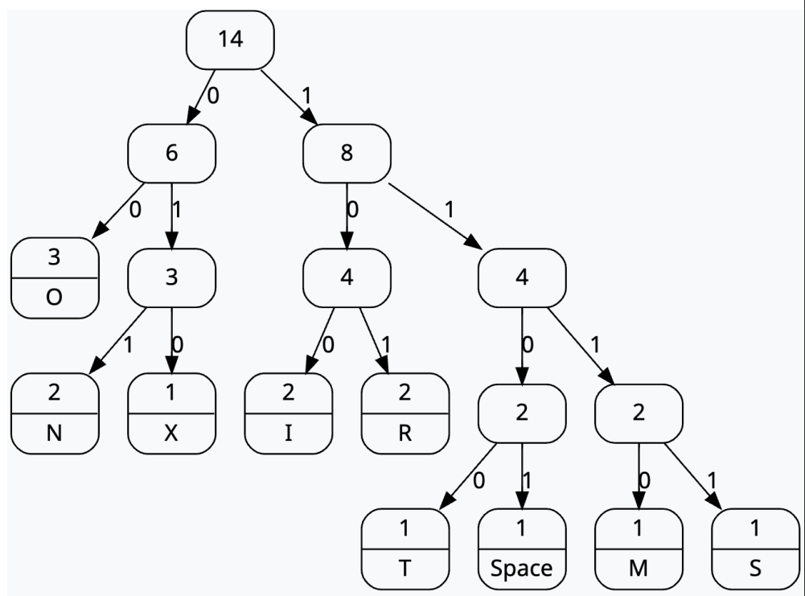
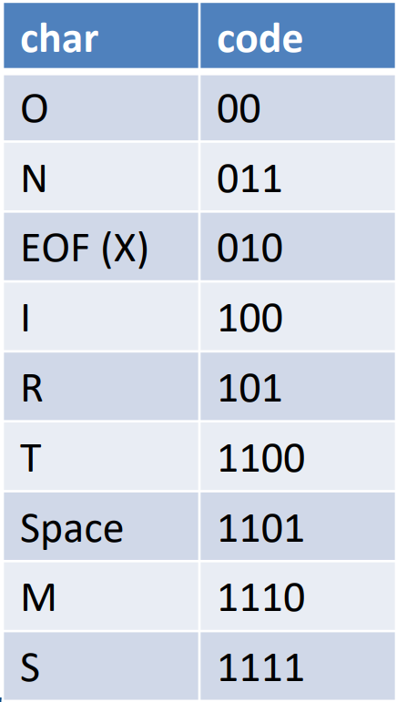
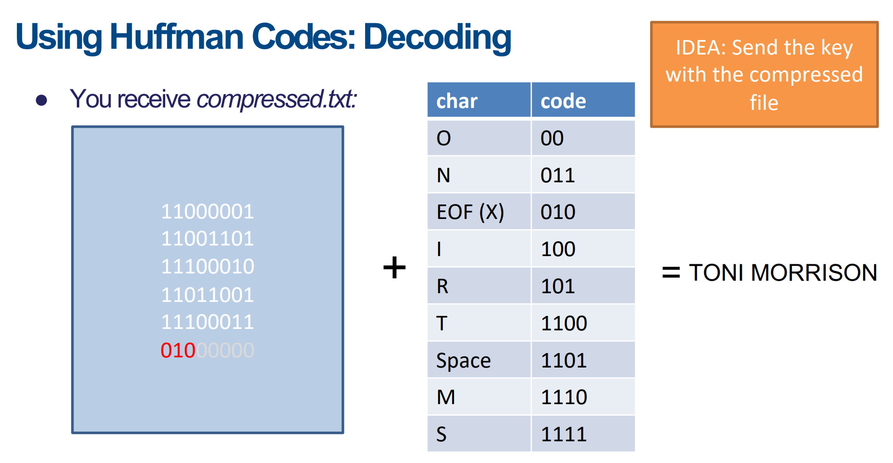

[Back to Main](../main.md)

# 6. Huffman Coding Trees
- Goal)
  - Compress the variable length codes.
- Idea)
  - Assign 
    - shorter codes to frequently occurring data
    - longer codes to data occurring less often
  - Review the [Huffman Code](https://github.com/JoonHyeok-hozy-Kim/ai_paper_study/blob/main/text_books/elmnts_info_theory/ch05/06/note.md#56-huffman-codes) in information theory for more information
- Relationship with the data structure?)
  - It can be implemented using
    - Tree 
    - [Priority Queue](08.md#concept-priority-queue)
- Prop.)
  - Huffman codes meet the [prefix property](#concept-prefix-property). 
    - Why?) Any prefix for a code correspond to an internal node, and all codes correspond to leaf nodes.
  - Huffman coding does better when there is large variation in the frequencies of letters.
  - Huffman coding of a typical text file will save around 40% over ASCII coding if we charge ASCII coding at eight bits per character.
  - Huffman coding for a binary file have a very different set of distribution frequencies and so have a different space savings.
  - Most commercial compression programs use two or three coding schemes to adjust to different types of file.
- Implementation)
  1. [Build Huffman Tree](#implementation-building-huffman-tree)
  2. [Building Huffman Code using the Huffman Tree](#tech-building-huffman-code)
  3. Encode Huffman Code using the Huffman Code
  4. Decode Huffman Code using the Huffman Code

 

#### Concept) Prefix Property
- Desc.)
  - Given a collection of strings, the collection has the prefix property if no string in the collection is a prefix for another string in the collection.

 

### Implementation) Building Huffman Tree
- Procedure)
  1. Create a collection of $`n`$ initial Huffman trees.
     - Each tree is a single leaf node containing one of the **letters** and its **frequency**.
  2. Put the $`n`$ partial trees onto a priority queue organized by weight (frequency).
  3. Repeat the following until only one element is left in the priority queue.
     1. Pop two trees from the priority queue. (The ones with the least frequencies.)
     2. Create a new tree and join the two popped trees as the left/right child.
     3. Add the frequencies of the subtrees assign it as the frequency of the new tree.
     4. Put this tree back into the priority queue.
- e.g.) Building Huffman Tree with "TONI MORRISON."
  - Characters : 'T', 'O', 'N', 'I', ' ', 'M', 'R', 'S', 'EOF'
    |The Huffman Tree ('EOF' IS 'X')|
    |:-|
    ||

 

### Tech.) Building Huffman Code
- How?)
  - For each node, assign 
    - 0 to the path to the left child
    - 1 to the path to the right child
  - Then the path from the root to each leaf becomes the Huffman Code of the letter stored in the leaf node.
  - Use [Preorder traversal algorithm](05.md#concept-binary-tree-traversal) to build the code.
- e.g.) Building Huffman Code with "TONI MORRISON."
  |The Huffman Code ('EOF' IS 'X')|
  |:-:|
  ||

 

### Tech.) Encode Using the Huffman Code
- Desc.)
  - [Huffman Tree](#implementation-building-huffman-tree) (or the [Huffman code](#tech-building-huffman-code)) is needed to encode.
- e.g.) TONI MORRISON
  - T : 1100
  - O : 00
  - N : 011
  - I : 100
  - ' ' : 1101
  - M : 1110
  - O : 00
  - R : 101
  - R : 101
  - S : 1111
  - O : 00
  - N : 011
  - EOF : 010

 

### Tech.) Decode Using the Huffman Code
- Desc.)
  - Huffman Tree is needed to decode.
- e.g.) TONI MORRISON   
  

  

[Back to Main](../main.md)