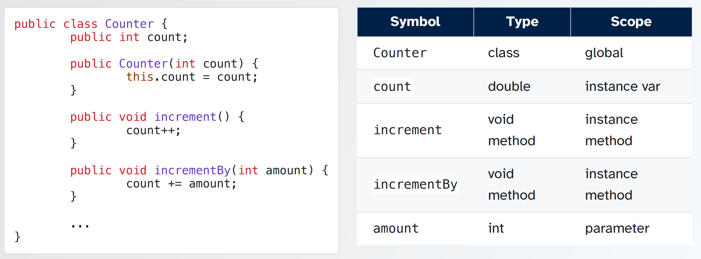
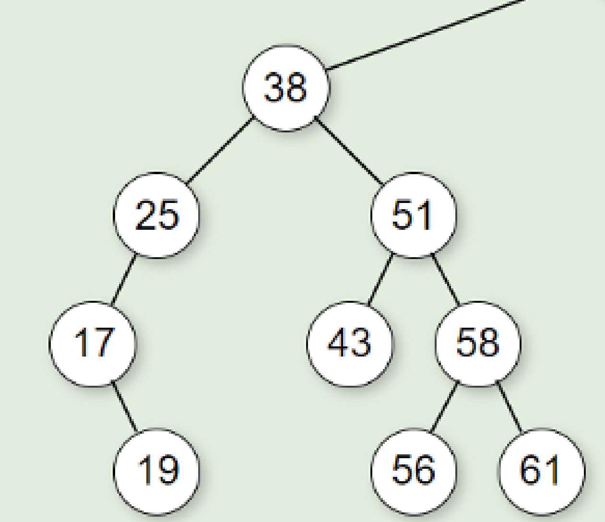

[Back to Main](../main.md)

# 8. Binary Search Trees
### Concept) Searchable Symbol Table
- Desc.)
  - Lists of variables along with information about their scopes and types.
- e.g.)
  - The compiler generates and uses a **symbol table** to check the validity of the program and generate machine code.
    - Why?)
      - To make sure no two variables are declared with the same name in the same scope
      - To make sure that every variable is declared before it is used
      - Symbol table expedites this process!
    - e.g.) Java
      
- Implementation)
  - Class implementation)
    ```java
    public record Symbol(String name, String type) implements Comparables<Symbol> {
        /*For now, just the compareTo*/
        @Override
        public int compareTo(Symbol other) {
            return this.name.compareTo(other.name);
        }
    }
    ```
  - Operations that Symbol Table should support
    |Method|Desc|
    |:-|:-|
    |`boolean add(Symbol s)`|Add a new symbol to the table.|
    |`boolean contains(Symbol s)`|Look up a symbol to see if it's already in the table.|
    |`boolean remove(Symbol s)`|Remove a symbol from the table.|
    - [Binary Search Tree](#concept-binary-search-tree-bst) is idealistic for these operations!

<br>

### Concept) Binary Search Tree (BST)
- Desc.)
  - All nodes stored in...
    - the left subtree of a node whose key value is K have key values less than or equal to K
    - the right subtree of a node whose key value is K have key values greater than K
  - Thus, the ordered sequence of elements can be obtained using the [inorder traversal](05.md#concept-binary-tree-traversal).
    - e.g.)
      |`l_child` > `parent` > `r_child`|
      |:-:|
      ||
      |17 > 19 > 25 > 38 > 43 > 51 > 56 > 58 > 61|
- In Java)
  - [TreeSet](#java-treeset) and [TreeMap](#java-treemap) are implemented using BST
- Operations)
  |Operation|Runtime|Desc.|
  |:-:|:-:|:-|
  |`contains`|O(d)|Inorder search!|
  |`add`|O(d)|Base Case with $`d=0`$, it's O(1). <br> Recursively, it takes $`T(d) = c + T(d-1)`$. <br> Thus, it takes O(d) in total.|
  |`remove`|O(d)|Inorder search, swap with the largest value in the left subtree, and pop!|
- Runtime Analysis)
  - All operations work in O(d) time.
    - Best case : $`d = \log(n)`$
    - Worst case : $`d = n`$
- Implementation)
  - `BST` Class
    - Data fields
      ```java
      private BSTNode<E> root;
      private int size;
      private Comparator<E> comparator; // In case natural ordering is not provided.
      ```
    - Subclass
      - `BSTNode` Class
        - Data fields
          ```java
          private E element
          private BSTNode left;
          private BSTNode left;
          ```
    - Methods
      - Contains
        ```java
        private boolean containsHelper(Comparable<E> e, BSTNode<E> currNode){
          if (currNode == null){
            return false;
          }
          int comparison = e.compareTo(currNode.getValue());
          boolean isLeaf = currNode.isLeaf();

          if (comparison == 0){
            return true;
          } else if (comparison < 0) {
            return !isLeaf && containsHelper(e, currNode.getLeft());
          } else {
            return !isLeaf && containsHelper(e, currNode.getRight());
          }
        }
        ```
- Limit)
  - Linear runtime when unbalanced.
    - Sol.) [AVL Tree](09.md#9-avl-tree)

#### Java) TreeSet
- Desc.)
  - It provides $`O(\log{n})`$ time for `add`, `remove`, and `contains` by maintaining the balanced form.
    - i.e.) self-balancing tree


#### Java) TreeMap
- Desc.)
  - Since our [BST](#concept-binary-search-tree-bst) rejects the duplicate, TreeMap, which is the implementation of BST, is a map.
  - `add`, `remove`, and `contains` are similar to `put`, `remove`, and `containsKey`.
  - It stores the key-value pair as its element.
    - i.e.) Ordering by key!


<br><br>

[Back to Main](../main.md)