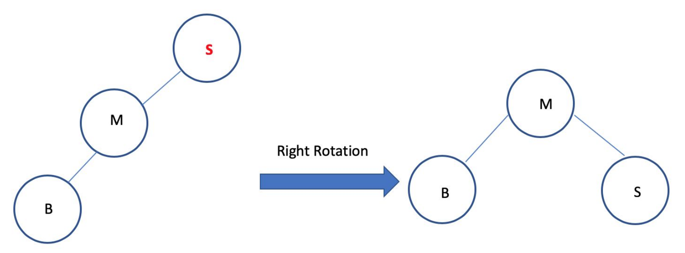
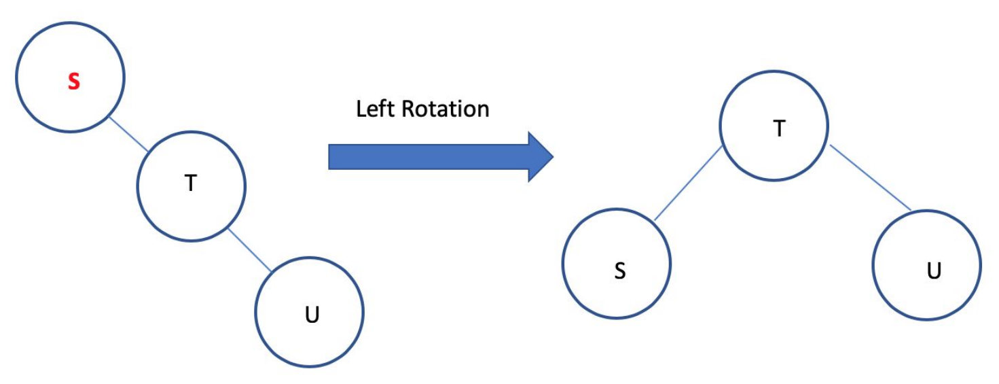
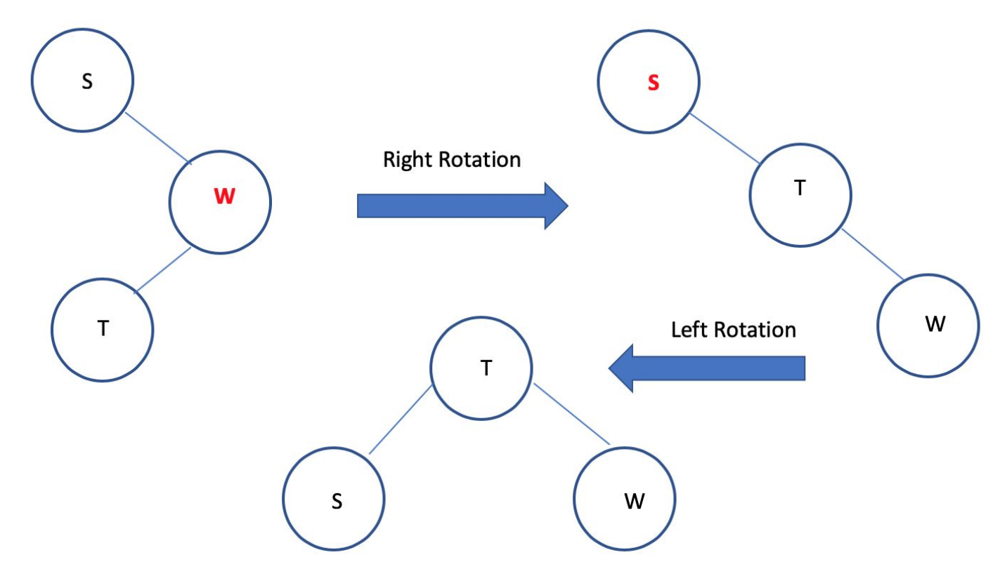
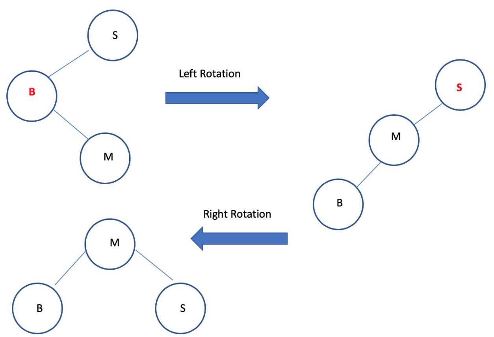

[Back to Main](../main.md)

# 9. AVL Tree
### Concept) AVL Tree
- Desc.)
  - A tree that for every node, the heights of its left and right subtrees differ by at most 1.
  - Thus, the tree maintains to be balanced.
    - Thanks to the balance, the search, the insertion, and the deletion of $`O(\log{n})`$ is guaranteed!
- Prop.)
  - If the tree contains $`n`$ nodes, then it has a depth of at most $`O(\log{n})`$
- Implementation)
  - Let each node maintain its height.
    - Empty BST and Empty Nodes : $`\text{height} = -1`$.
    - Non-empty Nodes : $`\text{height} = \max\{\text{height}_{l\_child},\; \text{height}_{r\_child}\} + 1`$.
  - Check if each node is balanced using the balance factor.
    - Concept) Balance Factor
      - Def.) 
        - $`\text{balance factor} = \text{height}_{l\_child} - \text{height}_{r\_child}`$ 
      - Prop.)
        - $`\text{balance factor} \in \{-1,0,+1\} \Leftrightarrow`$ Node is balanced!
  - 4 Cases of Unbalancedness
    - Suppose there is a balanced BST.
    - A new node is inserted as a leaf.
    - Putting $`S`$ be the bottommost unbalanced node, there can be four cases.
      - (1) The new node is in the **left** child of the **left** child of $`S`$
      - (2) The new node is in the **right** child of the **left** child of $`S`$
      - (3) The new node is in the **left** child of the **right** child of $`S`$
      - (4) The new node is in the **right** child of the **right** child of $`S`$
    - Sol.) Rotations
      |Unbalance|Rotation Sol.|Graphics|
      |:-:|:-:|:-:|
      |(1)|Right Rotation||
      |(2)|Left Rotation||
      |(3)|Right-Left Rotation||
      |(4)|Left-Right Rotation||
- Runtime Analysis)
  - Rotations are local operations with $`O(1)`$.
  - And the AVL Tree guarantees the search, the insertion, and the deletion of $`O(\log{n})`$

  

[Back to Main](../main.md)