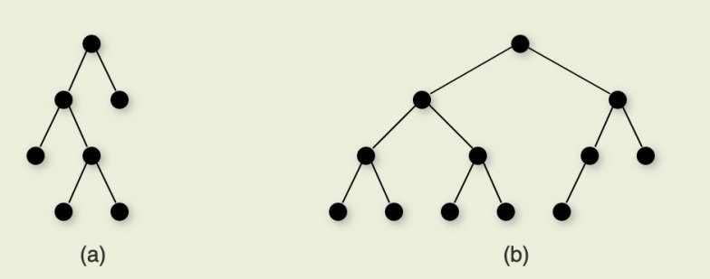

[Back to Main](../main.md)

# 9. Heaps & Priority Queues
### Concept) Priority Queue
- Def.)
  - A data structure that supports
    - Adding a new object
    - Check if the object is already present
    - Get the object with the highest priority
  - And has properties of
    - implementing the `Queue` interface (i.e. ordered)
    - ordering by priority
    - implemented using a `Heap` data structure
- Implementation)
  - [Binary Heap](#concept-binary-heaps)

<br>

### Concept) Complete Binary Tree
- Def.)
  |A binary tree where the nodes are filled in row by row, with the bottom row filled in left to right.|
  |:-|
  ||
- Prop.)
  - There is only one complete binary tree of $`n`$ nodes for any value of $`n`$.
  - Thus, it can be represented using an array.
    |Array Representation|
    |:-:|
    ||
    - Props.)
      - For a node at position $`i`$...
        |relation|Representation with $`i`$|
        |:-:|:-:|
        |parent|$`\lfloor \frac{i-1}{2}\rfloor`$|
        |left child|$`2i+1`$|
        |right child|$`2i+2`$|
        |left sibling|$`i-1`$|
        |right sibling|$`i+1`$|
      - Efficiency
        - No pointer overhead
        - Fast traversal using simple arithmetic
        - Resizing with amortization

<br><br>

### Concept) Binary Heaps
- Desc.)
  - Implemented using the [complete binary tree](#concept-complete-binary-tree).
  - Values are partially ordered.
  - The ordering relationship is between the value stored at any node and the values of its children.
    - No guarantees about ordering relative to siblings
- Types)
  - Max heap
    - Every node stores a value that is greater than or equal to the value of either of its children.
    - The root stores the maximum of all values in the tree.
  - Min heap
    - Every node stores a value that is less than or equal to that of its children
    - The root stores the minimum of all values in the tree.
- Runtime)
  - For $`n`$ elements and $`t`$ elements to poll, the runtime is $`O(n + t\log{n})`$
    - Why?)
      - $`O(n)`$ for `heapify`.
      - $`O(t\log{n})`$ for $`t`$ polls.
  - Better than $`O(n\log{n})`$ of the [Binary Search Tree](07.md#concept-binary-search-tree-bst).
- Operations)
  - Two key operations that maintain the Heap data structure.
    - `siftUp`
      - Procedure)
        - As long as a node is greater than its parent...
          - swap it with its parent
          - `siftUp` on the same node in the new location
      - Code)
        ```java
        private void siftUp(int index){
          while (index > 0){
              int parent = parent(index);
              Object key = heapArray[index];
              Object parentKey = heapArray[parent];

              if (key.compareTo(parentKey) <= 0){
                  return; // No swap!
              } else{
                  heapArray[index] = parentKey;   // Swap
                  heapArray[parent] = key;
                  index = parent                  // Keep move up!
              }
          }
        }
        ```
      - Runtime analysis)
        - $`O(\log{n})`$
          - Why?)
            - Swap takes a constant time operation.
            - Worst case is repeating as many swaps as the depth of the tree.
            - $`d = \log{n}`$
    - `siftDown`
      - Procedure)
        - As long as a node is smaller than one of its children...
          - swap it with its greater child
          - `siftUp` on the same node in the new location
      - Runtime analysis)
        - $`O(\log{n})`$
          - Why?)
            - Swap takes a constant time operation.
            - Worst case is repeating as many swaps as the depth of the tree.
            - $`d = \log{n}`$
  - Basic Operations we want to achieve.
    - `add`
      - Procedure)
        - Put the new value at the end of the array.
        - Increment the size of the heap.
        - Call `siftUp` on the new value.
        - Recurse upwards if necessary
      - Code)
        ```java
        private boolean add(E e){
          if (size == heapArray.length){
              grow();
          }
          heapArray[size++] = e;  // Increase array and append.
          siftUp(size-1);         // New element at the last!
          return true;
        }
        ```
      - Runtime analysis)
        - $`O(\log{n})`$ in the worst case.
    - `poll`
      - Return value depending on the type.
        - Max heap : maximum value
        - Min heap : minimum value
      - Procedure)
        - Swap the value at the front of the array with the value at the end of the array.
        - Decrement the heap size.
        - Call siftDown on the new root.
        - Recurse downwards as necessary.
      - Code)
        ```java
        private E poll(){
          E maxValue = (E) heapArray[0];          // Return the current root!
          E replaceValue = (E) heapArray[--size]  // Get the last value and reduce the size.
          if (size > 0) {
              heapArray[0] = replaceValue;        // New root!
              siftDown(0);                        // siftDown the new root.
          }
          return maxValue;
        }
        ```
      - Runtime analysis)
        - $`O(\log{n})`$ in the worst case.
    - `heapify`
      - Goal)
        - Generate a min/max heap from an array of values.
      - Procedure)
        - For a given array, call `siftDown` for the elements in the first half of the array.
          - Why?)
            - Considering the number of nodes, the elements in the second half are leaves.
              - i.e.) Already valid heaps.
            - Thus, `siftDown` calls on the first half can build a valid heap.
      - Runtime Analysis)
        - $`O(n)`$
          - Why?)
            - Let $`h`$ be the height of the heap.
            - Then, `siftDown` requires $`h-1 \in O(h)`$ swaps at most.
            - And considering the property of the [complete binary tree](#concept-complete-binary-tree), the number of nodes at the height $`h`$ is at most $`\frac{n}{2^h}`$.
            - Thus, the total number of swaps to `siftDown` all non-leaves goes:   
             $`\displaystyle O\left(\sum_{i=1}^{\log{n}} (i-1)\left(\frac{n}{2^i}\right) \right) = O\left(\left(\frac{n}{2}\right)\sum_{i=1}^{\log{n}} \left(\frac{i-1}{2^{i-1}}\right) \right) = O(n)`$
         - Thus, it is better to gather all records in an array and then heapify the array once than to insert records one by one.
           - Why?)
             - The former in $`O(n)`$, the latter in $`O(n\log{n})`$


<br><br>

[Back to Main](../main.md)