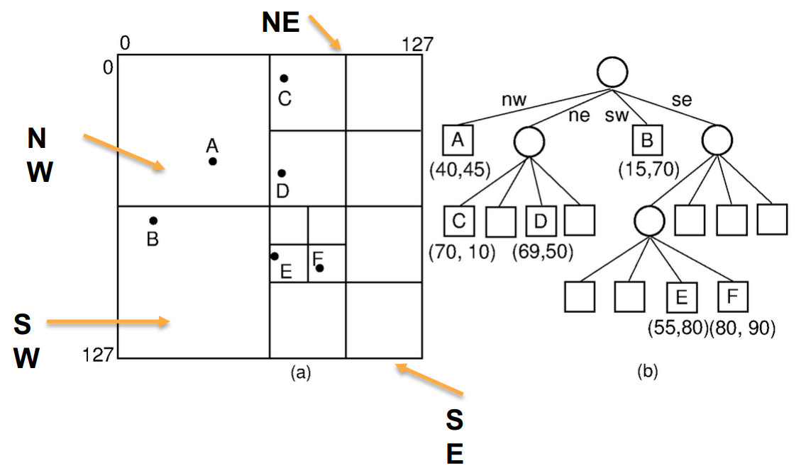

[Back to Main](../main.md)

# 10. Quad Trees
### Concept) Quad Tree (Point Region Quad Tree)
- Desc.)
  - A tree that branches full four ways.
    - How?)
      - Each node either has exactly four children or is a leaf.
      - Each child node (or quadrant) represents four regions divided by two axis.
      - Internal nodes do not store data points.
      - Leaf nodes represent either one data point or a region with no data point.   
        
- Functionalities)
  - Multidimensional Keys.
    - i.e.) It allows search with multiple features.
  - Range query
  - Suitable for spatial data set.
- Operations)
  - Choose Leaf
    ```
    CHOOSE_LEAF(Node node, Point p)
        1. Let x be the child of node whose region contains p.
        2. Return x.
    ```
  - Split
    ```
    SPLIT(Node node)
        1. Split the region occupied by node into four equally-sized regions : SW, NW, SE, NE.
        2. Create four children for node and assign them to occupy the quadrants SW, NW, SE, NE in that order.
        3. p = node.getKey()
        4. node.deleteKey()
        5. leaf = CHOOSE_LEAF(node, p)
        6. leaf.setKey(p)
    ```
  - Insert
    ```
    INSERT(Node node, Point p)
        if (node.isNotEmpty())
            SPLIT(node)
            nextNode = CHOOSE_LEAF(node, p)
            INSERT(nextNode, p)
        else if (node.isLeaf())
            node.setKey(p)
        else
            nextNode = CHOOSE_LEAF(node, p)
            INSERT(nextNode, p)
    ```
  - Search
    - Use BFS Search.
      ```
      Initialize empty queue Q.
      enqueue(Q, root)
      while Q is not empty do
        u ← dequeue(Q)
        for each v in children(u):
            Q.enqueue(Q, v)
      ```


<br><br>

[Back to Main](../main.md)