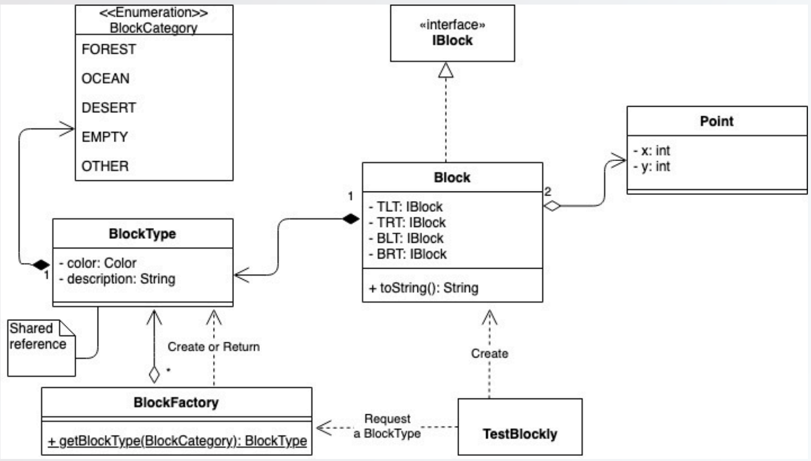

[Back to Main](../main.md)

# 12. Software Design
### Concept) Software Design
- Desc.)
  - An iterative process
  - Providing details about components necessary to implement S/W.
    - [Classes](#concept-class-design)
    - Data Structures
    - Software Architectures

<br><br>

### Concept) Class Design
- Concepts)
  - **Abstraction** : set of **information properties** relevant to a **stakeholder** about an entity
    - where
      - **Information Property** : a named, objective and quantifiable aspect of an entity
      - **Stakeholder** : a real or imagined person (or a class of people) who is seen as the audience for, or user of the abstraction being defined
  - **Information Hiding** : prevents client(s) from accessing some aspect of the class (or software system) implementation
    - How?)
      - [Interface](#eg-interface)
      - [Encapsulation](#concept-encapsulation)
- Desiderata)
  - Complete and sufficient
    - Design should [encapsulate](#concept-encapsulation) all attributes and methods that are expected
  - Primitive
    - Methods in a class should accomplish one service for the class.
    - A class should not have more than one method to accomplish the same function
  - High cohesion
    - A cohesive design class has a small, focused set of responsibilities
    - Single-mindedly applies attributes and methods to implement those responsibilities
  - Low coupling
    - Classes collaborate with each other
    - Collaboration should be kept to a minimum and mediated through interfaces wherever possible
    - High coupling leads to software that is difficult to implement, to test, and to maintain over time

#### e.g.) Interface
```java
public interface Derivable{
    void drive();
    void park();
    void reverse();
}

public class Car implements Drivable{
    // ...
}

public class Bus implements Drivable{
    // ...
}

public class DerivableClient{
    public static void main(){
        Derivable car = new Car();
        Derivable bus = new Bus();
        car.drive();
        bus.drive();
    }
}
```
- Desc.)
  - Users do not need to care about how `Car` and `Bus` are implemented.
  - They can just use them as `Derivable`s.

<br>

#### Concept) Encapsulation
- Desc.)
  - By using `private` access modifiers on **fields** and providing `public` **getter and setter methods**, encapsulation restricts direct access to the data and allows controlled manipulation. 
  - This helps protect the internal state of an object and ensures that it can only be modified in a controlled manner, maintaining data integrity and promoting modularity in code.


<br><br>

#### Concept) Unified Modeling Language (UML)
- Desc.)
  - A modeling language intended to provide a standard way to visualize the design of a software system.


<br><br>

### Concept) Class Diagram
- Desc.)
  - Static diagram that describes the structure of a system by showing the system's classes, their attributes, operations (or methods), and the relationships among objects
- Sections)
  |Section|Desc.|
  |:-:|:-|
  |Upper Section|Contains the name of the class|
  |Middle Section|Contains the attributes of the class|
  |Bottom Section|Includes class operations (methods header). Displayed in list format, each operation takes up its own line|

  |e.g.|
  |:-|
  ||
- Types)
  - [Domain Model Diagram](#concept-domain-model-diagram)
    - Used for this slide.
  - [Diagram of Implementation Classes](#concept-diagram-of-implementation-classes)

<br>

#### Concept) Domain Model Diagram
|Desc.|e.g.|
|:-|:-|
|- Emphasizes classes, interfaces, associations, usage, realizations, and multiplicity.<br>- Used to show how entities relate.<br>- Totally abstract implementation details.||
- Syntax)
  - Data Fields
    - `+` : public
    - `-` : private
    - `#` : protected
    - `/` : derived
    - `~` : package (default)
  - Methods
    - underlined : static methods
    - Parameter types are listed as "name: type".
    - No return type for the void return.
  - Association
    - Def.)
      - All relationships in [UML](#concept-unified-modeling-language-uml) are considered associations
    - General Syntax)   
      ||
      |:-|
      ||
    - Subtypes
      ||
      |:-|
      ||
      - Composition Relationship
        - Desc.)
          - When attempting to represent real-world whole-part relationships.
          - When the container is destroyed, the contents are also destroyed.
          - Usually refers to a collection (or data structure!) of some kind
        - e.g.)
          ||
          |:-|
          ||
      - Aggregation Relationship
        - Desc.)
          - Weak form of aggregation.
          - When the container is destroyed, the contents are usually not destroyed.
          - Usually refers to a collection (or data structure!) of some kind
        - e.g.)
          ||
          |:-|
          ||
  - Inheritance
    ||
    |:-|
    ||
  - Implementation
    ||
    |:-|
    ||
    

<br>

#### Concept) Diagram of Implementation Classes
|Desc.|e.g.|
|:-|:-|
|- Emphasizes classes, interfaces, associations, usage, and realizations<br>- Gives a clear picture of how the classes will be written. <br>- Includes fields and methods.||

<br><br>

### Concept) Design Pattern
- Desc.)
  - Embody and generalize important design concepts for a recurring problem
  - Reusable solution to a commonly occurring problem in software design
- Types)
  - 23 Patterns grouped in 3 categories:
    - Creational Patterns : Creating objects
    - Structural Patterns : Organizing classes and objects
      - Covered : [Flyweight](#concept-flyweight-pattern), [Composite](#concept-composite-pattern)
    - Behavioral Patterns : Communication between objects
      - Covered : [Visitor](#concept-visitor-pattern), [Strategy](#concept-strategy-pattern)

<br><br>

### Concept) Flyweight Pattern
- Category)
  - Structural Pattern
- Goal)
  - Building an application with many similar objects.
  - Objects store identical information and play the same role.
  - Minimize memory cost
- Sol.)
  - Shared memory space
  - A flyweight factory object is used to create and provide shared references as needed.
    - It is recommended to make shared references immutable.
- e.g.)
  - [QuadTree](10.md#10-quad-trees)
    - Situation)
      - Each `Block` stores reference to
        - two `Point` objects : `topLeft` and `bottomRight`
        - a `Color` in 32-bits
        - four children `IBlock` objects with 64-bits each.
    - Problem)
      - `Color`s come from a standard set of colors but each `Block` holds unique `Color` objects.
    - Solution)
      - Keeping a single reference to each color and **sharing** those references among all the `Block` objects would save a lot of memory!
    - Class Design)
      |Class|Purpose|
      |:-:|:-|
      |`BlockCategory`|Enum type. Lists all the categories of `Block`s.|
      |`BlockType`|The `Flyweight` data type. Maintains a reference to the `Block` category, color, and description. Shared reference|
      |`BlockFactory`|`Factory` class. Creates new `Flyweight` objects or return existing ones. `Flyweight` objects are stored in a collection (Map) and are retrieved based on their category|   
      
      

<br><br>

### Concept) Visitor Pattern
- Category)
  - Behavioral Pattern
- Goal)
  - We want to perform an activity/operation on all objects in a collection
  - Separate the **activity** from the object’s **specification**
- Sol.)
  - Create a separate object called `Visitor` that will implement the activity operation to be performed on the objects.
  - The objects in the collection `accept` the `Visitor` and the `Visitor` objects perform the activity
- Prop)
  - We don't have to modify existing classes anytime we want to define a new way of visiting.
- How?)
  - Use Anonymous Classes.
    - Make some interface, e.g. `MyInterface`.
    - Pass a reference to `new MyInterface() {...}` wherever an instance of `MyInterface` is expected.
    - Specify in the braces an implementation of each of the required methods.
- e.g.)
  - Situation)
    - We have 2 types of students (undergraduate and graduates) stored in a BST database for a class' gradebook.
    - We want to update the grade of all students in the class to "curve" it using the following formula :
      - Add 1 point to all undergraduate student GPAs
      - Add 0.5 point to all graduate student GPAs
  - Problem)
    - Including `update` operation in the `Student` class definition is wasteful.
      - Why?)
        - There are multiple ways that we might want to visit students in the future.
        - Poor [cohesion](#concept-class-design) if a student is resposible for storing its own information and updating itself subject to external criteria
  - Class Design)
    |Class|Type|Purpose|
    |:-:|:-:|:-|
    |`VisitorStudent`|Interface|Defines the activity to be performed (`visit` method)|
    |`Visitor`|Class|Implements the `VisitorStudent` activity (`visit` method)|
    |`VisitableStudent`|Interface|Defines the accept method to pass the `Visitor`|
    |`Student`|Class|Implements `VisitableStudent` operation (`accept`)|   
      
      


<br><br>

### Concept) Composite Pattern
- Category)
  - Structural Pattern
- Goal)
  - We have a collection of objects in which an object can be composed of other objects
  - We want to treat all objects (containers and components) uniformly / perform the same action on all the objects in the collection
- Sol.)
  - Share behavior/activity across all objects (using an interface)
  - Each subclass implements the activity
  - Call the activity on the first object in the collection
- e.g.)
  - Expression Tree
    - Collection of Nodes: internal and leaf nodes.
      - Internal nodes composed of (two) internal and/or leaf nodes.
    - We want to evaluate the expression tree.
      - Call `evaluate` on the root of the tree.
      - Each internal node invokes `evaluate` of its subtrees with the appropriate operator.
      - Leaf node return its value when performing `evaluate`.
    - Class Design)
      |Class|Purpose|
      |:-:|:-|
      |`VarBinNode`|Interface for a binary node.|
      |`VarIntNode`|Class for an internal node, implements `VarBinNode`|
      |`VarLeafNode`|Class for a leaf node, implements `VarBinNode`|   
      
      
    

<br><br>

### Concept) Strategy Pattern
- Category)
  - Behavioral Pattern
- Goal)
  - We want to use a general algorithm
    - with some part of it may **vary** depending on the context. 
  - We want to avoid multiple slightly different version of the same algorithm
  - Improved reusability of the code
- Sol.)
  - Use a class that represents the strategy and pass an instance to a single method that implement the rest of the algorithm.   
    
- e.g.)
  - Situation)
    - We want to search for an element (target) in a collection of objects (dogs) based on different criteria: by name, or by id
  - Sol.)
    - Use `Comparator`.
      - `Comparator` is an example of the [functional interface](#concept-functional-interface).

<br><br>

### Concept) Functional Interface
- Desc.)
  - An interface that has only one unimplemented method.
  - An implementing class for a functional interface can consist of one function.
  - An anonymous class implementing a functional interface is basically a single function definition!

<br><br>

### Concept) Anonymous Function (Lambda)
- e.g.)
  ```java
  TreeSet<Treasure> ts = new TreeSet((t1, t2) -> t1.getValue() - t2.getValue());
  ```
  - Here, `(t1, t2) -> t1.getValue() - t2.getValue()` represents a concise implementation of the `compare` method, which itself is a concise expression of an entire new `Comparator` class!

<br><br>

### Tech) Passing Functions
- e.g.)
  ```java
  TreeSet<Treasure> ts = new TreeSet(Comparator.comparing(Treasure::getValue));
  ```
  - Desc.)
    - `Comparator.comparing()` is a method that takes in another method that selects the proper value from the objects by which to compare them. 
    - It returns a `Comparator` that uses that method to compare the objects

<br><br>


<br><br>

[Back to Main](../main.md)