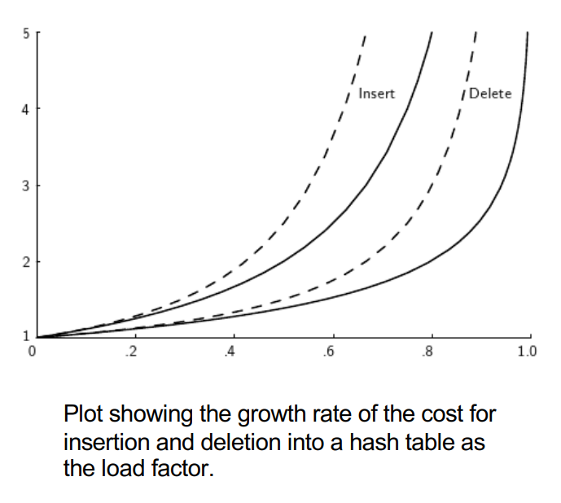

[Back to Main](../main.md)

# 15. Open Hashing and Bucket Hashing

### Concept) Hashing
- Def.)
  - A method for storing and retrieving records from a database based on some attribute value of the records.   
    |Term|Desc.|
    |:-:|:-|
    |Hashing|The **process** of applying a **hash function** to a key|
    |Hash Function|A **mathematical object** that generates maps a key to an integer|
    |Hash Table|A **data structure** that stores records in an array. <br> A record's position is determined by applying the **hash function** to the record's **key**.|
    |[Hash System](#concept-hash-system)|A **system** that uses a **hash table** to store records & resolve collisions|
- Props)
  - Appropriate for exact-match queries
  - Not Appropriate for...
    - multiple records with the same key are permitted
    - range searches
- Java Implementations)
  - `Hashtable`
  - `HashMap`
  - `HashSet`

<br>

### Concept) Hash System
- Def.)
  - A hash system consists of a [hash table and a hash function](#concept-hashing).
- Notations)
  - $`T`$ : the array of slots in the hash table.
  - $`M`$ : the number of slots in $`T`$
  - $`h`$ : the hash function
  - $`K`$ : the key s.t. $`h(K) = i \in [0, M)`$
    - Thus, $`T[h(K)]`$ denotes the record stored in the hash table.

<br>

### Concept) Collision
- Def.)
  - A situation that two search keys are mapped by the hash function to the same slot in the hash table
- Sol.) 
  - [Collision Resolution Policies](#concept-collision-resolution-policies)

<br>

### Concept) Load Factor
- Def.)
  - $`\displaystyle \frac{n}{M}\;`$ where $`\begin{cases}
    n & \text{: number of records in the hash table} \\
    M & \text{: the number of slots in the hash table}
  \end{cases}`$
- Goal)
  - Used to decide when to rehash (resize) the hash table.
  - Resize and rehash the hash table when the load factor exceeds a certain threshold.

<br>

### Concept) Open Hashing
- Def.)
  - A hash system where multiple records might be associated with the same slot of a hash table
    - e.g.) Linked list in each slot.
- Operation Procedures)
  - Insertion
    1. Compute the hash value of the key : $`h(K)`$
    2. Insert the record at the head of the linked list at the hash value : $`T[h(K)]\text{.append(E)}`$
       - Runtime) $`O\left(\frac{n}{M}\right)`$ on average, $`O(n)`$ in the worst case.
  - Searching
    1. Compute the hash value of the key : $`h(K)`$
    2. Search the linked list at the hash value
       - Runtime) $`O\left(\frac{n}{M}\right)`$ on average, $`O(n)`$ in the worst case.
  - Deletion
    1. Compute the hash value of the key : $`h(K)`$
    2. Delete the record from the linked list at the hash value
       - Runtime) $`O\left(\frac{n}{M}\right)`$ on average, $`O(n)`$ in the worst case.
- e.g.)   
  |Model|Image|
  |:-|:-:|
  |Using simple mod as hash function. <br> - i.e.) $`h(K) = K \% M`$||
  |Java's `HashMap` class <br>- Hash function: bitwise AND (&) operator<br>- Treeification when list size above a threshold (8)<br>- Thus, $`O(\log{n})`$ in the worst case.||

<br>

### Concept) Closed Hashing
- Def.)
  - A hash system where all records are stored in slots inside the hash table
- Implementations)
  - [Closed Hashing with Buckets](#concept-bucket-hashing)
  - Closed Hashing without Buckets
- Analysis)
  - [The Cost of Searching for Closed Hashing](#analysis-the-cost-of-closed-hashing)

<br>

### Concept) Bucket Hashing
- Desc.)
  - Slots of the hash table are grouped into buckets.
    - For $`M`$ slots in the hash table, there are $`B(\lt M)`$ buckets, each consisting of $`\frac{M}{B}`$ slots.
    - Additionally, the table will include an **overflow bucket**.
      - the bucket into which a record is placed if the bucket containing the record's home slot is full
      - Often considered to have infinite capacity.
        - e.g.) `ArrayList`
- Operation Procedures)
  - Insertion
    1. Hash the key to determine which bucket should contain the record : $`h(K)`$
    2. If the bucket is not full, insert the record in the first available slot.
    3. If the bucket is full then store the record in the first available slot in the overflow bucket.
  - Searching
    1. Hash the key to determine which bucket should contain the record : $`h(K)`$
    2. The records in this bucket are then searched.
    3. If the desired key value is not found and the bucket still has free slots, then the search is complete.
    4. If the bucket is full, then search the overflow bucket until the record is found or all records in the overflow bucket have been checked.
  - Deletion is more complicated.
    - [Tombstone for Deletion](#tech-tombstone-for-deletion)

<br>

### Concept) Collision Resolution Policies
- Desc.)
  - The process of finding the proper position in a hash table that contains the desired record
  - Used if the hash function did not return the correct position for that record due to a collision with another record
  - Mainly used in closed hashing systems
- Prop.)
  - [Open Hashing](#concept-open-hashing) systems rarely use it.
    - Why?) 
      - They store multiple records in the same slot by using auxiliary data structures
  - [Closed Hashing](#concept-closed-hashing) systems mainly use it. 
    - How?)
      - Store one record per slot, and use a collision resolution policy to find a new slot for a record that collides with an existing record
- How?)
  - Use a [probe function](#concept-prob-function)
- Algorithm)
  - Initialize the home position.
    ```java
    int home = h(K);        // h is the hash function, K is the Key.
    int position = home;    // position initialized to home.
    ```
  - Find next position using the probe function `p`.
    ```java
    position = (home + p(k, i)) % M;    // p(k, i) is the probe function. Increment i for the next use.
    ```

<br>

### Concept) Prob Function
- Def.)
  - A function used by a collision resolution method to calculate where to look next in the hash table
- Term.)
  - Probe Sequence
    - the series of slots visited by the probe function during collision resolution.
- Types)
  - [Linear Probing](#concept-linear-probing)
  - [Pseudo-Random Probing](#concept-pseudo-random-probing)
  - [Quadratic Probing](#concept-quadratic-probing)
  - Double Hashing

<br>

#### Concept) Linear Probing
- Algorithm)
  ```java
  p(k, i) = i;
  ```
  - Desc.)
    - Then the position will be `home`, `home+1`, `home+2`, $`\cdots`$, `(M-1)`
- Prop.)
  - One of the worst [collision resolution](#concept-collision-resolution-policies) methods.
  - Leads to [primary clustering](#concept-primary-clustering).
    - Sol.) Skip slots using a constant `c`.
      ```java
      p(k, i) = c*i;
      ```

<br>

#### Concept) Primary Clustering
- Desc.)
  - The tendency in certain [collision resolution](#concept-collision-resolution-policies) methods to create **clustering** in sections of the hash table.
  - It happens when a group of keys follow the same probe sequence during collision resolution
  - Primary clustering lead to empty slots in the table to not have an equal probability of receiving the next record inserted.


<br>

#### Concept) Pseudo-Random probing
- Idea)
  - Select the next position on the probe sequence at random from the unvisited slots
  - However, the random sequence should be the same for **insertion** and **searching**.
    - Thus, it cannot be a truly random sequence.
- Implementation)
  - Use permutation value to achieve the pseudo-randomness.
    ```java
    p(k, i) = Permutation(i);
    ```
- Limit)
  - [Secondary Clustering](#concept-secondary-clustering)

<br>

#### Concept) Quadratic Probing
- Algorithm)   
  $`p(k,i) = c_1 i^2 + c_2 i + c_3`$
- Implementations)
  - Simplest Form : $`p(k_i) = i^2`$
    - Problem)
      - Not all slots are visited!
        - e.g.) $`M=10`$ : Slots $`2,3,7,8`$ are never visited.
  - When the length of hash table is $`2^n`$
    - Use $`p(k,i) = \frac{i^2+i}{2}`$
    - In this case, all slots are visited.
- Limit)
  - [Secondary Clustering](#concept-secondary-clustering)


<br>

### Concept) Secondary Clustering
- Desc.)
  - A situation where two records with the same home slot will share the same probe sequence
  - This results from the **keys hashing to the same slot** of the table **sharing the same probe sequence**
  - [Pseudo-Random probing](#concept-pseudo-random-probing) and [Quadratic Probing](#concept-quadratic-probing) are vulnerable to this.


<br><br>

### Concept) Double Hashing
- Def.)   
  $`p(k,i) = i \cdot h_2(K)`$
  - i.e.) Use a second hash function
- Prop.)
  - Eliminates the [secondary clustering](#concept-secondary-clustering) problem.
  - The prob function uses the original key $`K`$.
- Implementations)
  - $`h_2(K) = 1 + (K \% (M-1))`$
    - e.g.)
      - Consider the case that $`M=11`$.
      - Then,
        - records with $`K=0`$ will generate the probe sequence of $`1,2,3,4,5,6,7,8,9,10`$
        - records with $`K=11`$ will generate the probe sequence of $`2,4,6,8,10,1,3,5,7,9`$
          - Why?) Recall the [collision resolution policy](#concept-collision-resolution-policies) of `pos = (home + p(k, i)) % M`.
  - $`h_2(K) = (((K/M) \% (M/2))\cdot 2)+1`$
    - e.g.)
      - Consider the case that $`M=16`$.
      - Then,
        - records with $`K=0`$ will generate the probe sequence of $`1,2,3,4,5,6,7,8,9,10`$
        - records with $`K=16`$ will generate the probe sequence of $`3,6,9,12,15,2,5,8,11,14,1,4,\cdots`$

<br>

### Tech.) Tombstone for Deletion
- Idea)
  - Deletion in closed hashing must consider the following properties.
    - Empty slots should not stop the probe sequence when searching.
    - The freed slot should be available to a future insertion.
- Sol.) Tombstone
  - Use tombstone to mark a slot in the hash table where a record has been deleted.
  - Then for...
    - searching : if a tombstone is encountered, the probe sequence continues.
    - insertion : if a tombstone is encountered, that slot is used to store the new record.
      - Also the insertion procedure must check for duplicates.

<br><br>

### Analysis) The Cost of Closed Hashing
- Def.)
  - The average amount of calculation that searching takes.
- Conclusion)
  - $`\displaystyle \text{Cost} = \frac{1}{1-\alpha}`$ where $`\displaystyle\alpha = \frac{n}{M}`$ is the [load factor](#concept-load-factor).
- Derivation)
  - Let's get the probability that the search succeeds in the $`k`$-th search.   
    $`\begin{matrix}
      k=1; & p_1 = 1-\alpha & \text{(Searched with no collision)} \\
      k=2; & p_2 = \alpha(1-\alpha) & \text{(Searched after only one collision)} \\
      k=3; & p_3 = \alpha^2(1-\alpha) & \text{(Searched after two collisions)} \\ 
      &\vdots \\
      k=x; & p_x = \alpha^{x-1}(1-\alpha)  & \text{(Searched after } (x-1) \text{ collisions)}
    \end{matrix}`$
  - Thus, the expected value of the search can be calculated as   
    $`\begin{aligned}
      \mathbb{E}[X] &= \sum_{k=1}^\infty k \cdot p_k = \sum_{k=1}^\infty k \cdot \alpha^{k-1}(1-\alpha) \\
      &= (1-\alpha) \sum_{k=1}^\infty k \cdot \alpha^{k-1} \\
      &\approx (1-\alpha) \frac{1}{(1-\alpha)^2} & (\because \vert\alpha\vert \lt 1) \\
      &= \frac{1}{1-\alpha}
    \end{aligned}`$
- Prop.)
  - For small values of $`\alpha`$, the expected cost is low. 
    - It remains below two until the hash table is about half full.
      |Graph|Desc.|
      |:-:|:-|
      ||- Horizontal axis is the value for $`\alpha`$ <br>- Vertical axis is the expected number of accesses to the hash table. <br>- Dashed lines show the cost for linear probing. <br>- Solid lines show the cost for "random" probing (a theoretical lower bound).|
  - Rule of thumb)
    - Design a hashing system so that the hash table never gets above about half full.
    - Select the table size accordingly.


<br><br>

[Back to Main](../main.md)