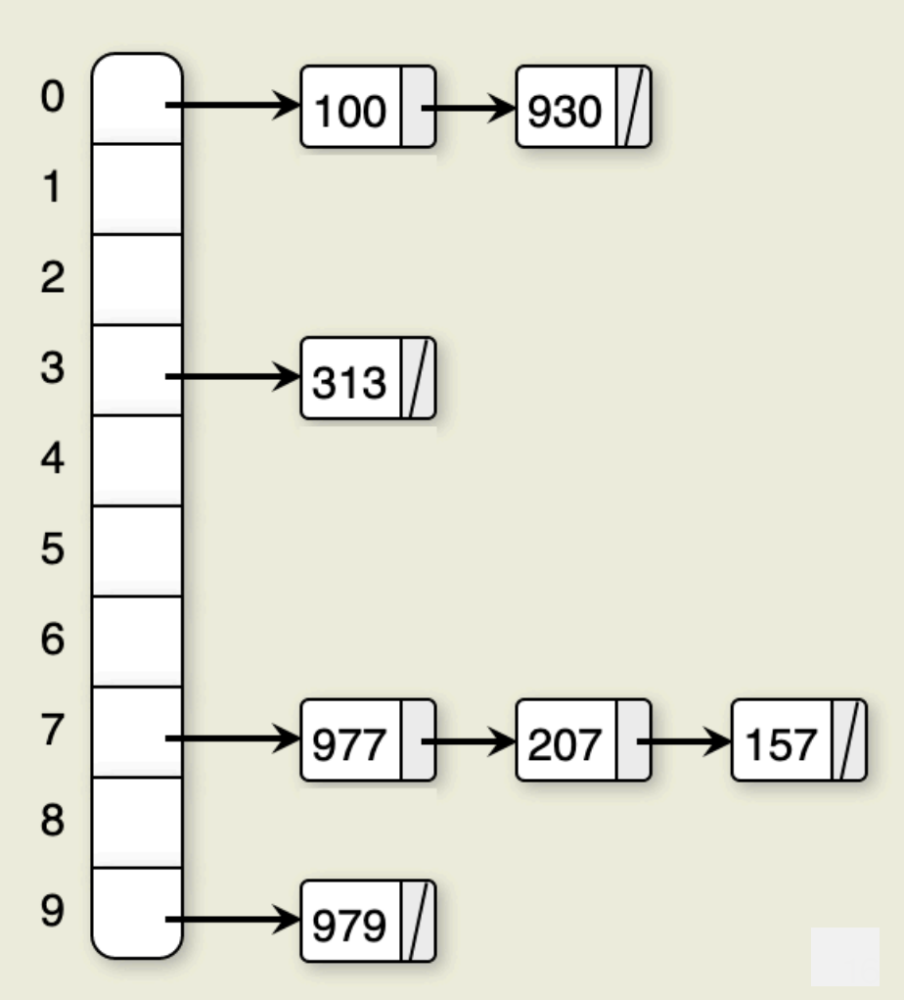

[Back to Main](../main.md)

# 15. Open Hashing and Bucket Hashing

### Concept) Hashing
- Def.)
  - A method for storing and retrieving records from a database based on some attribute value of the records.   
    |Term|Desc.|
    |:-:|:-|
    |Hashing|The **process** of applying a **hash function** to a key|
    |Hash Function|A **mathematical object** that generates maps a key to an integer|
    |Hash Table|A **data structure** that stores records in an array. <br> A record's position is determined by applying the **hash function** to the record's **key**.|
    |[Hash System](#concept-hash-system)|A **system** that uses a **hash table** to store records & resolve collisions|
- Props)
  - Appropriate for exact-match queries
  - Not Appropriate for...
    - multiple records with the same key are permitted
    - range searches
- Java Implementations)
  - `Hashtable`
  - `HashMap`
  - `HashSet`

<br>

### Concept) Hash System
- Def.)
  - A hash system consists of a [hash table and a hash function](#concept-hashing).
- Notations)
  - $`T`$ : the array of slots in the hash table.
  - $`M`$ : the number of slots in $`T`$
  - $`h`$ : the hash function
  - $`K`$ : the key s.t. $`h(K) = i \in [0, M)`$
    - Thus, $`T[h(K)]`$ denotes the record stored in the hash table.

<br>

### Concept) Collision
- Def.)
  - A situation that two search keys are mapped by the hash function to the same slot in the hash table
- Sol.) 
  - [Collision Resolution Policies](#concept-collision-resolution-policies)

<br>

### Concept) Load Factor
- Def.)
  - $`\displaystyle \frac{n}{M}\;`$ where $`\begin{cases}
    n & \text{: number of records in the hash table} \\
    M & \text{: the number of slots in the hash table}
  \end{cases}`$
- Goal)
  - Used to decide when to rehash (resize) the hash table.
  - Resize and rehash the hash table when the load factor exceeds a certain threshold.

<br>

### Concept) Open Hashing
- Def.)
  - A hash system where multiple records might be associated with the same slot of a hash table
    - e.g.) Linked list in each slot.
- Operation Procedures)
  - Insertion
    1. Compute the hash value of the key : $`h(K)`$
    2. Insert the record at the head of the linked list at the hash value : $`T[h(K)]\text{.append(E)}`$
       - Runtime) $`O\left(\frac{n}{M}\right)`$ on average, $`O(n)`$ in the worst case.
  - Searching
    1. Compute the hash value of the key : $`h(K)`$
    2. Search the linked list at the hash value
       - Runtime) $`O\left(\frac{n}{M}\right)`$ on average, $`O(n)`$ in the worst case.
  - Deletion
    1. Compute the hash value of the key : $`h(K)`$
    2. Delete the record from the linked list at the hash value
       - Runtime) $`O\left(\frac{n}{M}\right)`$ on average, $`O(n)`$ in the worst case.
- e.g.)   
  |Model|Image|
  |:-|:-:|
  |Using simple mod as hash function. <br> - i.e.) $`h(K) = K \% M`$||
  |Java's `HashMap` class <br>- Hash function: bitwise AND (&) operator<br>- Treeification when list size above a threshold (8)<br>- Thus, $`O(\log{n})`$ in the worst case.||

<br>

### Concept) Closed Hashing
- Def.)
  - A hash system where all records are stored in slots inside the hash table
- Implementations)
  - [Closed Hashing with Buckets](#concept-bucket-hashing)
  - [Closed Hashing without Buckets]()

<br>

### Concept) Bucket Hashing
- Desc.)
  - Slots of the hash table are grouped into buckets.
    - For $`M`$ slots in the hash table, there are $`B(\lt M)`$ buckets, each consisting of $`\frac{M}{B}`$ slots.
    - Additionally, the table will include an **overflow bucket**.
      - the bucket into which a record is placed if the bucket containing the record's home slot is full
      - Often considered to have infinite capacity.
        - e.g.) `ArrayList`
- Operation Procedures)
  - Insertion
    1. Hash the key to determine which bucket should contain the record : $`h(K)`$
    2. If the bucket is not full, insert the record in the first available slot.
    3. If the bucket is full then store the record in the first available slot in the overflow bucket.
  - Searching
    1. Hash the key to determine which bucket should contain the record : $`h(K)`$
    2. The records in this bucket are then searched.
    3. If the desired key value is not found and the bucket still has free slots, then the search is complete.
    4. If the bucket is full, then search the overflow bucket until the record is found or all records in the overflow bucket have been checked.

<br>

### Concept) Collision Resolution Policies
- Desc.)
  - The process of finding the proper position in a hash table that contains the desired record
  - Used if the hash function did not return the correct position for that record due to a collision with another record
  - Mainly used in closed hashing systems
- Prop.)
  - [Open Hashing](#concept-open-hashing) systems rarely use it.
    - Why?) 
      - They store multiple records in the same slot by using auxiliary data structures
  - [Closed Hashing](#concept-closed-hashing) systems mainly use it. 
    - How?)
      - Store one record per slot, and use a collision resolution policy to find a new slot for a record that collides with an existing record
- How?)
  - Use a [probe function](#concept-prob-function)
- Algorithm)
  - Initialize the home position.
    ```java
    int home = h(K);        // h is the hash function, K is the Key.
    int position = home;    // position initialized to home.
    ```
  - Find next position using the probe function `p`.
    ```java
    position = (home + p(k, i)) % M;    // p(k, i) is the probe function. Increment i for the next use.
    ```

<br>

### Concept) Prob Function
- Def.)
  - A function used by a collision resolution method to calculate where to look next in the hash table
- Term.)
  - Probe Sequence
    - the series of slots visited by the probe function during collision resolution.
- Types)
  - [Linear Probing](#concept-linear-probing)
  - [Pseudo-Random Probing](#concept-pseudo-random-probing)
  - Quadratic Probing
  - Double Hashing

<br>

#### Concept) Linear Probing
- Algorithm)
  ```java
  p(k, i) = i;
  ```
  - Desc.)
    - Then the position will be `home`, `home+1`, `home+2`, $`\cdots`$, `(M-1)`
- Prop.)
  - One of the worst [collision resolution](#concept-collision-resolution-policies) methods.
  - Leads to [primary clustering](#concept-primary-clustering).
    - Sol.) Skip slots using a constant `c`.
      ```java
      p(k, i) = c*i;
      ```

<br>

#### Concept) Primary Clustering
- Desc.)
  - The tendency in certain [collision resolution](#concept-collision-resolution-policies) methods to create **clustering** in sections of the hash table.
  - It happens when a group of keys follow the same probe sequence during collision resolution
  - Primary clustering lead to empty slots in the table to not have an equal probability of receiving the next record inserted.


<br>

#### Concept) Pseudo-Random probing
- Idea)
  - Select the next position on the probe sequence at random from the unvisited slots
  - However, the random sequence should be the same for **insertion** and **searching**.
    - Thus, it cannot be a truly random sequence.
- Implementation)
  - Use permutation value to achieve the pseudo-randomness.
    ```java
    p(k, i) = Permutation(i);
    ```


<br>


<br><br>

[Back to Main](../main.md)