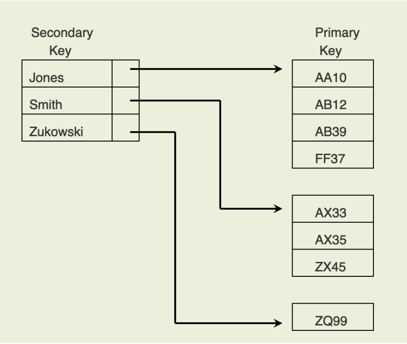
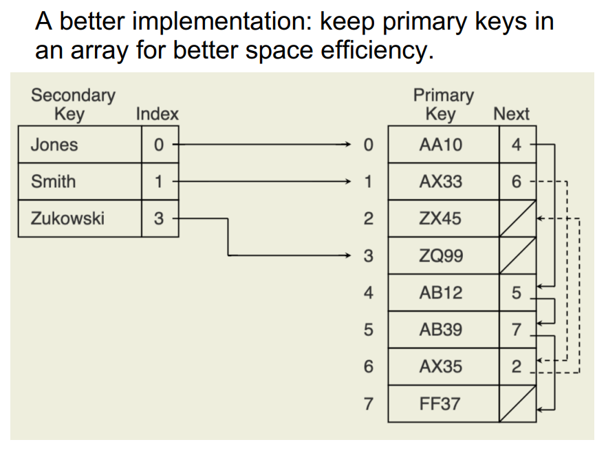

[Back to Main](../main.md)

# 18. Indexing
### Concept) Index
- Desc.)
  - The process of associating a **search key** with the **location** (on disk) of a corresponding data record
    - Why needed?)
      - Program memory is fast but expensive
      - Disk space is slow and cheap
      - Thus, we must find a way to do as little seeking on disk as possible.
- Prop.)
  - The index does **NOT** store the **record**.
  - The index stores a **reference** to the record

 

### Concept) Primary Key
- Desc.)
  - An attribute that uniquely identifies a record.
  - It associates each primary key value with a **pointer** to the actual record on disk.
- Props.)
  - Primary key often not known by the user of the database
  - Primary key often not useful when searching for a record
    - Database searches often performed using attributes other than the primary key

 

### Concept) Secondary Key
- Desc.)
  - A key field in a record where a particular key value **might be duplicated** in multiple records
- Prop.)
  - Secondary key is more likely to be used by a user as a search key than is the record's primary key
  - Can’t be used to uniquely identify a record
    - Why?) Possible duplicity.

#### Concept) Secondary key index)
- Desc.)
  - It associates a secondary key value with the primary key of each record having that secondary key value
    ||
    |:-:|
    ||

 

### Concept) Index File
- Def.)
  - A file whose records consist of key-value pairs where the pointers are referencing the complete records stored in another file
- Types)
  - [Linear Indexing](#concept-linear-indexing)
  - Hash-Based Indexing
  - Tree-Based Indexing

 

### Concept) Linear Indexing
- Desc.)
  - An index file organized as a sequence of key-value pairs where...
    - the keys are in sorted order 
    - the pointers either...
      - point to the position of the complete record on disk.
      - point to the position of the primary key in the primary key index.
- Prop.)
  - Very efficient on binary search
  - The secondary key index is called the **inverted list**
    ||
    |:-:|
    ||
  - It works well when
    - Keys are much smaller than records
    - The dataset is not too large
    - The primary keys can all be kept in **memory**
      - What if it cant?)
        - Use [second-level index](#concept-second-level-index)
- Drawbacks)
  - Insertion and deletions are expensive.
    - Consider updating every indices after the deleted record.
  - [Secondary key indices](#concept-secondary-key-index) contain duplicates.
    - which means it's space expensive.

 

### Concept) Second-Level Index
- Desc.)
  - Index file stored across several blocks (on **disk**)
  - Second-level index stores the first key value in the corresponding disk block of the index file.
  - Search requires 2 disk accesses
    - (1) Load the block of the index file containing the key.
    - (2) Retrieve the record.

### E.g.) Facebook's Haystack

  

[Back to Main](../main.md)