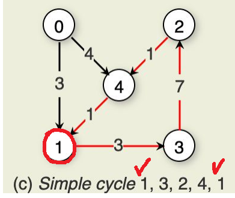

[Back to Main](../main.md)

# 19. Graphs
### Concept) Graph
- Defs.)
  - A graph consists of 
    - a set of nodes $`V=\{v_1, \cdots, v_n\}`$
    - a set of edges $`E=\{e_1, \cdots, e_m\}`$
      - each edge in $`E`$ is a connection between a pair of vertices in $`V`$.
  - Various Graphs
    |Type|Desc.|Image|
    |:-:|:-|:-:|
    |Undirected Graph|A graph whose edges do not have a direction||
    |Directed Graph|A graph whose edges –each- are directed from one of its defining vertices to the other||
    |Labeled Graph|A graph with labels associated with the nodes||
    |Sparse Graph|A graph with relatively few edges||
    |Dense Graph|A graph with relatively many edges||
    |Complete Graph|A graph with edges connecting every pair of nodes||
  - Incident / Adjacent
    |Concept|Desc|Image|
    |:-:|:-|:-:|
    |Incident|An edge connecting vertices a and b is said to be incident with vertices a and b.||
    |Adjacent|Vertices a and b are said to be adjacent (neighbors).||
- Props.)
  - $`\vert V\vert^2 - \vert V\vert \ge \vert E \vert \ge 0`$
    - Why?)
      - Consider the directed graph case.
      - There can be $`P(\vert V\vert,2) = \vert V\vert^2 - \vert V\vert`$ number of edges.

 

#### Concept) Degree
- Def.)
  - The degree of a vertex is its number of neighbors
  - In Directed Graph
    - In Degree : the number of edges directed **into** the vertex
    - Out Degree : the number of edges directed **out of** the vertex

 

#### Concept) Path
- Def.)
  - A sequence of vertices $`v_1, \cdots, v_n`$ forms a **path** of length $`n-1`$
    - if there exists edges from $`v_i`$ to $`v_{i+1}, \; 1\le i \le n`$
  - Simple Path
    - A path is a **simple path** if all vertices on the path are distinct
      |Simple|Not Simple|
      |:-:|:-:|
      |||

 

#### Concept) Cycle
- Def.) 
  - A cycle is a [path](#concept-path) of length three or more that connects some vertex $`v`$ to itself.
  - Concepts)
    |Concept|Desc|Image|
    |:-:|:-|:-:|
    |Simple Cycle|A cycle is a simple cycle if the path is simple, except for the first and last vertices being the same.||
    |Acyclic Graph|A graph without cycles||
    |Directed Acyclic Graph (DAG)|A directed graph without cycles||

 

#### Concept) Clique
- Def.)
  - A clique is a subset of $`V`$
    - where all vertices in clique have edges to all other vertices in it.
      ||
      |:-:|
      ||

 

### Tech.) How to represent graphs
- Sols.)
  - [Adjacency Matrix](#concept-adjacency-matrix)
  - Adjacency List

 

#### Concept) Adjacency Matrix
- Def.)
  - Consider a graph with $`\vert V\vert`$ number of vertices.
  - Then the adjacency matrix is a $`\vert V\vert \times \vert V\vert`$ array
    - where
      - vertices are labeled from $`v_0`$ through $`v_{\vert V\vert-1}`$
      - row $`i`$ of it contains entries for vertex $`v_i`$
      - column $`j`$ in row $`i`$ is marked if there is an edge from $`v_i`$ to $`v_j`$.
- Prop.)
  - $`O(\vert V\vert^2)`$ space complexity.
- e.g.)
  |Directed|Undirected|
  |:-:|:-:|
  |||

 

#### Concept) Adjacency List
- Def.)
  - The adjacency list is an array of linked lists of $`\vert V\vert`$ size.
  - `L[i][j]` represents the adjacency of $`v_i`$ with $`v_j`$.
  
  

## Graph Traversals
### Concept) Depth First Search (DFS)
- Def.)
  - DFS will recursively visit all of $`v`$'s unvisited neighbors
  - Implemented using
    - recursive calls
    - stacks
- Props.)
  - The next vertex to be visited is determined by popping the stack and following that edge.
  - $`O(\vert V\vert + \vert E \vert)`$

 

### Concept) Breadth First Search (BFS)
- Def.)
  - BFS will visit all of $`v`$'s neighbors before visiting vertices further away
  - Implemented using
    - queues
- Props.)
  - The next vertex to be visited is determined by dequeuing the queue and following that edge.
  - $`O(\vert V\vert + \vert E \vert)`$

  

[Back to Main](../main.md)