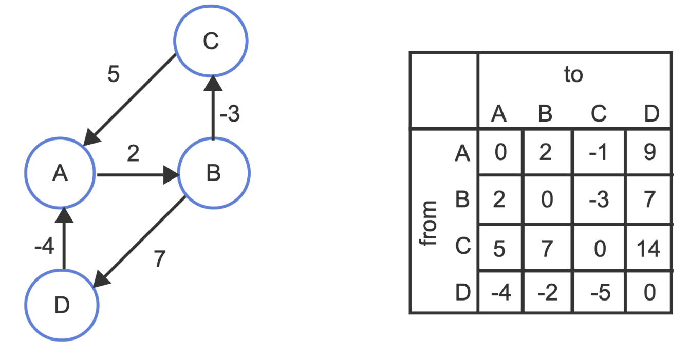
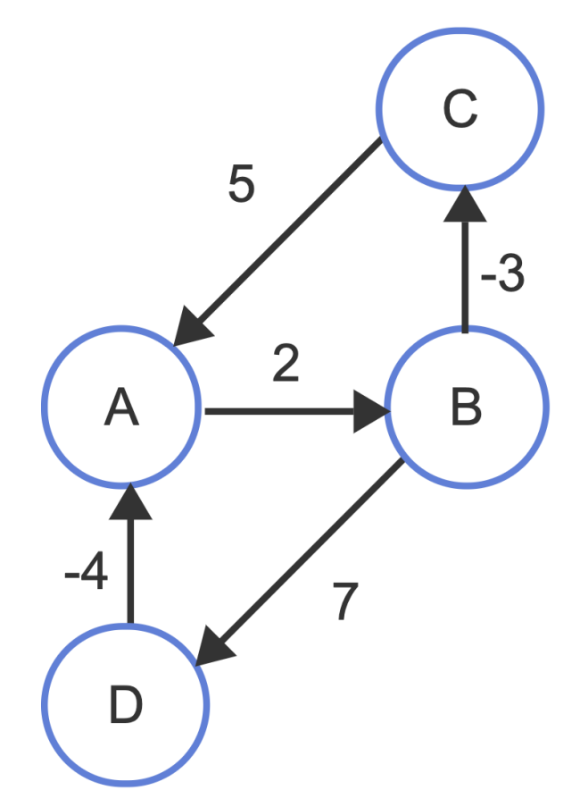

[Back to Main](../main.md)

# 22. All-Pairs Shortest Paths (APSP)
- Goal)
  - Calculate the shortest path distance between any two pairs of vertices in the graphs.
    - Constraints)
      |Constraint Type|Tolerable?|Why?|
      |:-:|:-:|:-|
      |Cycles|O|Repeating cycles increase the cost.|
      |Negative Edge Weights|O|No problem adding up negative value just as the positives.|
      |Negative Weight Cycles|X|Negative infinite path is available for a path to itself!|
- Prop.)
  - The output for APSP problems is a $`\vert V \vert \times \vert V \vert`$ matrix.
    - e.g.)   
      

 

### Sol.) Floyd-Warshall Algorithm
- Concepts)
  - `shortestPath(i, j)`
    - Def.)
      - For vertex $`i`$ and vertex $`j`$
      - `shortestPath(i, j)` is the shortest path starting from $`i`$ and ending at $`j`$.
  - `shortestPath(i, j, k)` 
    - Def.)
      - For vertex $`i`$ and vertex $`j`$
      - `shortestPath(i, j, k)` is the shortest path starting from $`i`$ and ending at $`j`$
      - such that contains only intermediate vertices with indices less than equal to $`k`$.
    - Prop.)
      - `shortestPath(i, j)` = `shortestPath(i, j, |V|)`
- Idea)
  - Base Cases
    - 1 $`(i=j) \wedge (k=0) \wedge (\text{shortestPath}(i,j,k) = 0)`$
    - 2 $`(i\ne j) \wedge (k=0) \wedge (e_{i,j}\in E) \wedge (\text{shortestPath}(i,j,k) = w_{i,j})`$
    - 3 $`(i\ne j) \wedge (k=0) \wedge (e_{i,j}\notin E) \wedge (\text{shortestPath}(i,j,k) = \infty)`$
  - Inductive Steps
    - Idea)
      - Consider that $`\forall i, j, k`$, $`\text{shortestPath}(i,j,k) \ge \text{shortestPath}(i,j,k+1)`$.
        - Why?)
          - As $`k`$ increments, we can add more vertices to the possible shortest paths.
          - i.e.) the possibility to find shorter one!
      - Suppose $`\text{shortestPath}(i,j,k) \gt \text{shortestPath}(i,j,k+1)`$.
        - This means that we found a shorter path using the vertex $`(k+1)`$.
        - Then, the new shortest path contains the following two shortest paths
          - Path from $`i`$ to $`k+1`$
          - Path from $`k+1`$ to $`j`$
        - The above two paths will use only $`[1,k]`$ vertices.
        - Thus, $`\text{shortestPath}(i,j,k+1) = \text{shortestPath}(i,k+1,k) + \text{shortestPath}(k+1, j,k)`$
      - Thus, we can conclude that 
        - $`\text{shortestPath}(i,j,k+1) = \min\left\{\begin{matrix}
            \text{shortestPath}(i,j,k), \\
            \text{shortestPath}(i,k+1,k) + \text{shortestPath}(k+1, j,k)
        \end{matrix}\right\}`$
- Implementation)
  - [Floyd-Warshall]()
- Runtime Analysis)
  - $`O(\vert V\vert^3)`$
    - Why?) Triply nested for loop ranging from 1 to $`\vert V\vert`$.

#### e.g.)

<table>
<thead>
<tr>
<th>Graph</th>
<th>Base Cases</th>
<th>Inductive Steps</th>
</tr>
</thead>
<tbody>
<tr>
<td rowspan="3"></td>
<td>
            
|$`k=0`$|$`A`$|$`B`$|$`C`$|$`D`$|
|:-:|:-:|:-:|:-:|:-:|
|$`A`$|0||||
|$`B`$||0|||
|$`C`$|||0||
|$`D`$||||0|
            
</td>
<td>

No change for $`k=1`$.

</td>
</tr>
<tr>
<td>

|$`k=0`$|$`A`$|$`B`$|$`C`$|$`D`$|
|:-:|:-:|:-:|:-:|:-:|
|$`A`$|0|2|||
|$`B`$||0|-3|7|
|$`C`$|5||0||
|$`D`$|-4|||0|

</td>
<td>

|$`k=0`$|$`A`$|$`B`$|$`C`$|$`D`$|
|:-:|:-:|:-:|:-:|:-:|
|$`A`$|0|2|**-1**|**9**|
|$`B`$|**2**|0|-3|7|
|$`C`$|5|**7**|0|$`\infty`$|
|$`D`$|-4|**-2**|$`\infty`$|0|

</td>
</tr>
<tr>
<td>

|$`k=0`$|$`A`$|$`B`$|$`C`$|$`D`$|
|:-:|:-:|:-:|:-:|:-:|
|$`A`$|0|2|$`\infty`$|$`\infty`$|
|$`B`$|$`\infty`$|0|-3|7|
|$`C`$|5|$`\infty`$|0|$`\infty`$|
|$`D`$|-4|$`\infty`$|$`\infty`$|0|

</td>
<td>

|$`k=0`$|$`A`$|$`B`$|$`C`$|$`D`$|
|:-:|:-:|:-:|:-:|:-:|
|$`A`$|0|2|-1|9|
|$`B`$|2|0|-3|7|
|$`C`$|5|7|0|**14**|
|$`D`$|-4|-2|**-5**|0|

</td>
</tr>
</tbody>
</table>

  

[Back to Main](../main.md)