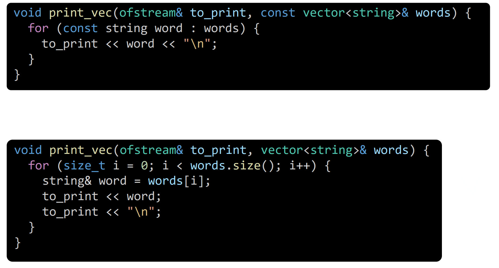

# Q1


<details>
  <summary>A</summary>
  <p>
    Down. <br>
    Assigning `string word` is costly. Use reference instead.  
  </p>
</details>

<br>


# Minimizing the memory allocation
  - Reserve memory
    - `vector::reserve(size_t new_capa)`
  - Move semantics
    - `std::move`
      - Prop.)
        - Use when copying is expensive.
      - Syntax)
        - Constructor
          ```cpp
          VerboseInt(VerboseInt&& other) noexcept {
              data_ = other.data_;
          }
          ```
        - Assignment
          ```cpp
          VerboseInt& operator=(VerboseInt&& other) noexcept {
            data_ = other.data_;
            return *this;
          }
          ```
          - If `noexcept` is added, STLs like vector can use move semantics with `Point` more safely.
          - Guaranteeing that exception will not happen when move is used for this class.
      - e.g.)
        ```cpp
        Point p {3,2};
        Point a {std::move(p)};
        ```