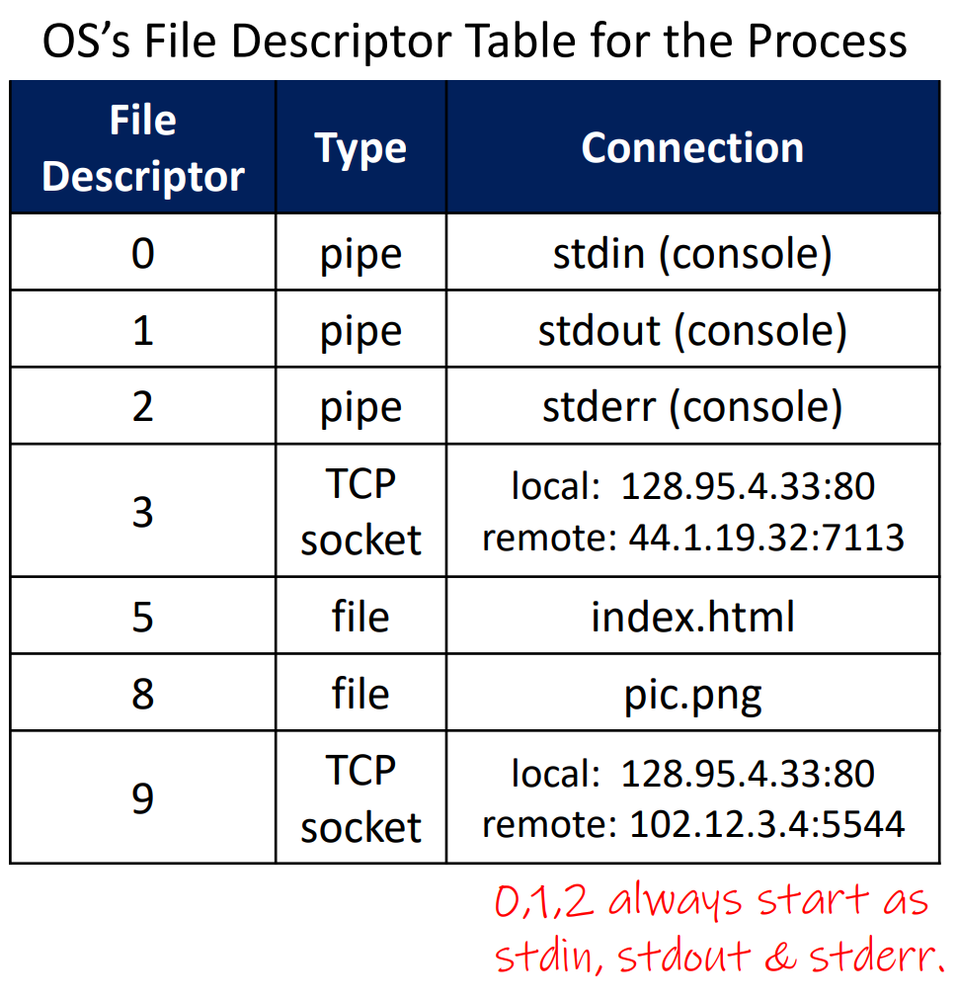
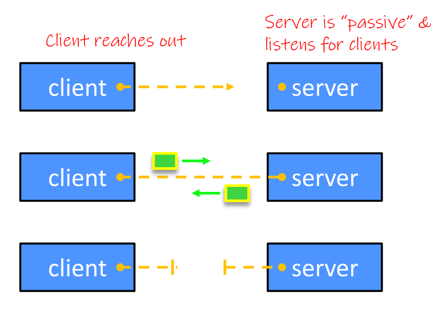
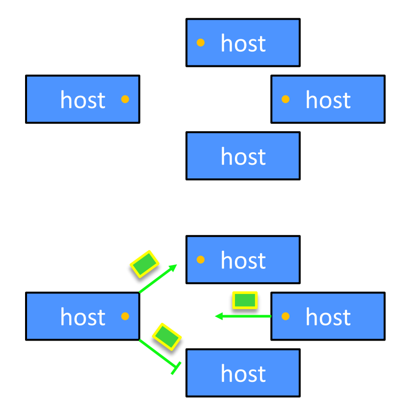

### Concept) Socket API
- Types)
  |Socket API|Desc|
  |:-:|:-|
  |Berkeley Socket|- Written in C|
  |POSIX Socket|- Multi-threading added|

<br><br>

### Concept) IPv4
- Props.)
  - 4 Bytes (1 Byte = 0 ~ 255)
- C struct
  ```cpp
  struct in_addr {
    uint32_t s_addr;    // 32 bit = 4 * 1 Byte
  }
  ```
  - In socket usage
    ```cpp
    struct sockaddr_in {
        sa_family_t     sin_family;
        in_port_t       sin_port;
        struct in_addr  sin_addr;    // Here!
        unsigned char   sin_zero[8];
    }
    ```
    - This should be type casted to `struct sockaddr` or `struct sockaddr_storage` to use in function.
    - `sin_zero` pads 8 byte zeros to sync the size with `sockaddr`.
      - `sin_family` : 2 Byte
      - `sin_port` : 2 Byte
      - `sin_addr` : 4 Byte (IPv4)
      - `sin_zero` : 8 Bytes of zeros!

<br><br>

### Concept) IPv6
- Props.)
  - 16 Bytes
  - 8 group of 4 hex-digits
    - Why?)
      - 16 Bytes = 8 * 16 bits = 8 * (4 * 4) bits = 8 * (4 * hex)
        - where hex : 0 ~ 16 = 2^4
    - e.g.) 2d01:0db8:f188:0000:0000:0000:0000:1f33
  - Can omit leading zeros
- C struct
  ```cpp
  struct in6_addr {
    uint8_t s6_addr[16];    // 16 * 8bits = 16 Bytes
  }
  ```
  - In socket usage
    ```cpp
    struct sockaddr_in6 {
        sa_family_t     sin6_family;
        in_port_t       sin6_port;
        uint32_t        sin6_flowinfo;
        struct in6_addr sin6_addr;      // Here!
        uint32_t        sin6_scope_id;
    }
    ```
    - This should be type casted to `struct sockaddr` or `struct sockaddr_storage` to use in function.

<br><br>

### Concept) Generic Address Structures
- Desc.)
  - A mostly-protocol-independent address structure.
  - Pointer to this is parameter type for socket system calls.
- Types)
  - `sockaddr`
    - Def.)
      ```cpp
      struct sockaddr {
        sa_family_t sa_family;
        char        sa_data[14];
      }
      ```
    - Props.)
      - 16 Bytes
        - `sa_family` : 2 Bytes
        - `sa_data` : 14 Bytes
      - Used when we know the IP version.
        - e.g.)
          - `bind()`
          - `connect()`
  - `sockaddr_storage`
    - Def.)
      ```cpp
      struct sockaddr_storage {
        sa_family_t ss_family;
        char __ss_pad1[_SS_PAD1SIZE];
        int64_t __ss_align;
        char __ss_pad2[_SS_PAD2SIZE];
      }
      ```
    - Props.)
      - 10 Bytes + $`\alpha`$ : big enough!
        - `sa_family` : 2 Bytes
        - `__ss_align` : 8 Bytes
        - `__ss_pad1` and `__ss_pad2` differs by the platform.
      - Used when we do NOT know the IP version.
        - e.g.)
          - `accept()`
          - `recvfrom()`
- How to Use)
  - Type cast the `sockaddr_in` and `sockaddr_in6` struct when passing them as the args of functions.

<br><br>

### Concept) Address Conversion
- Desc.)
  - `sockaddr_in` and `sockaddr_in6` are the network address.
  - `inet_ntop` converts network address into presentation.
  - `inet_pton` converts presentation into network address.
    - e.g.) IPv4, IPv6
      ```cpp
      #include <stdlib.h>
      #include <arpa/inet.h>
      #include <iostream>
      
      using namespace std;
      
      int main(int argc, char** argv) {
              // IPv4
              struct sockaddr_in sa;
              char zstring[INET_ADDRSTRLEN];
      
              inet_pton(AF_INET, "192.255.255.255", &(sa.sin_addr));
              inet_ntop(AF_INET, &(sa.sin_addr), zstring, INET_ADDRSTRLEN);
      
              cout << zstring << endl;
      
              // IPv6
              struct sockaddr_in6 sa6;
              char astring[INET6_ADDRSTRLEN];
      
              inet_pton(AF_INET6, "2001:0db8:63b3:1::3490", &(sa6.sin6_addr));
              inet_ntop(AF_INET6, &(sa6.sin6_addr), astring, INET6_ADDRSTRLEN);
      
              cout << astring << endl;
      
              return EXIT_SUCCESS;
      
      }
      ```

<br><br>

### Concept) Socket
- Desc.)
  - Endpoint for a specific connection
  - File descriptor for network communications.   
    
    - It identifies...
      - Client's
        - IP address
        - Port number
      - Server's
        - IP address
        - Port number
- Types)
  |Type|Desc.|Procedures|
  |:-:|:-|:-|
  |Stream Socket|- Point to Point, reliable byte streams <br> - TCP, SCTP<br> - Typical client-server communication.|1. Establish connection<br>2. Communicate<br>3. Close connection.|
  |Datagram Socket|- One to many, unreliable byte streams <br> - UDP<br>- Often used as a building block|1. Create socket.<br>2. Communicate|
  |Raw Socket|- Layer 3 communication||
  - Diagrams)
    |Stream Socket|Datagram Socket
    |:-:|:-:|
    |||