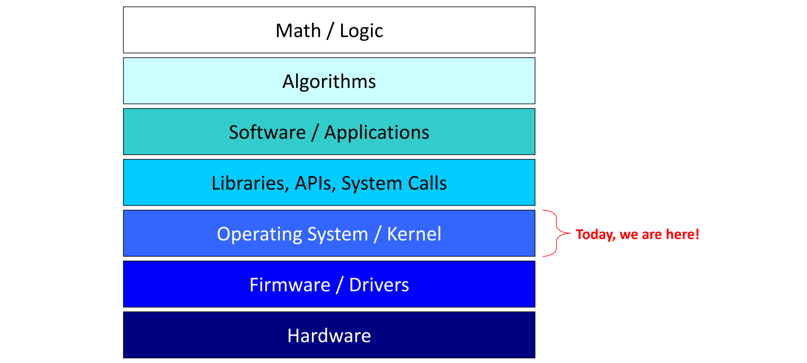
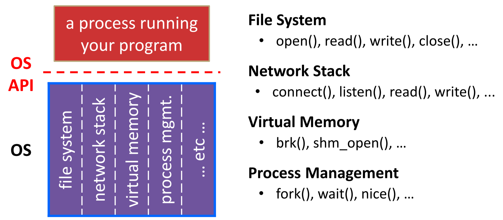
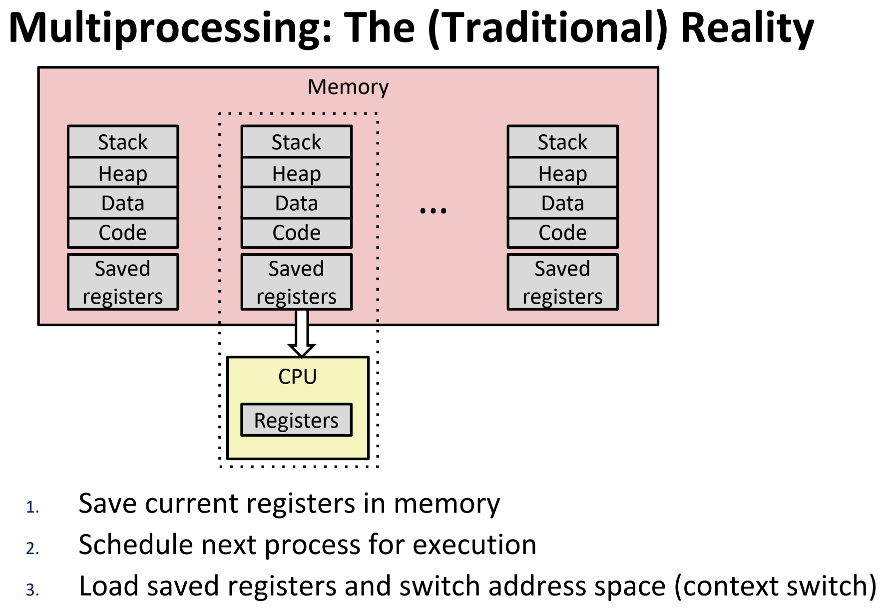
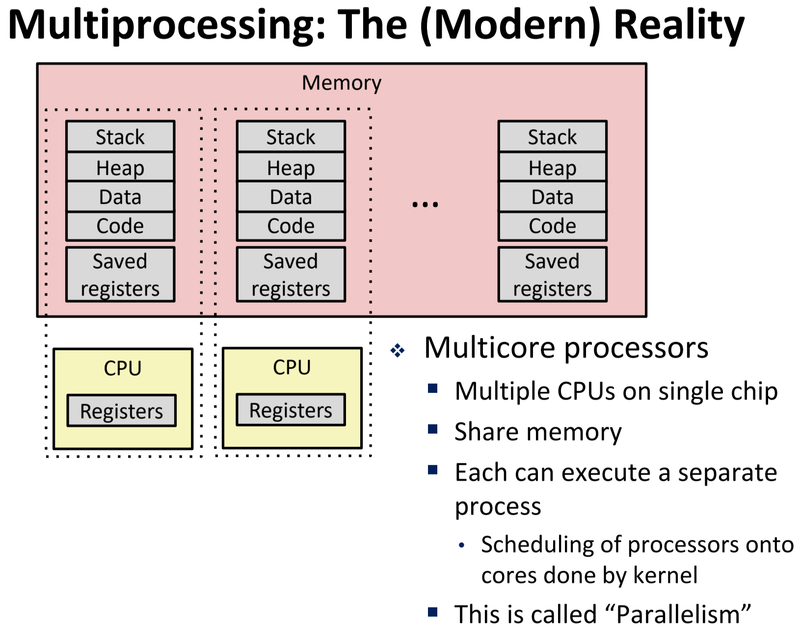
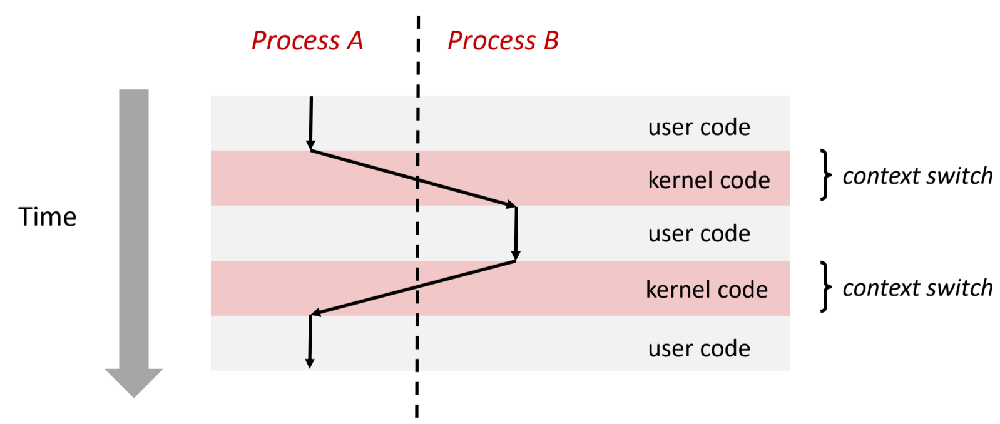
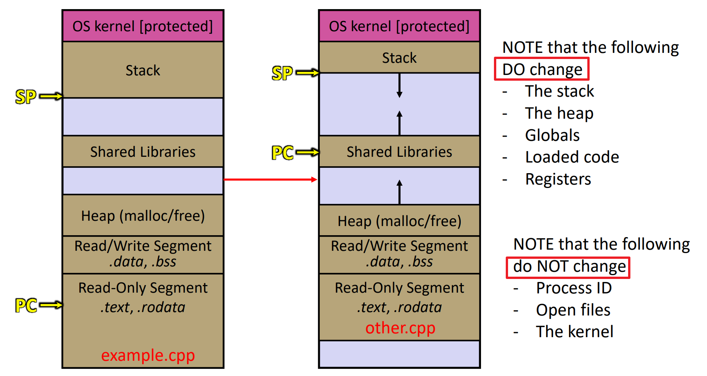

[Back to Main](../main.md)

# OS Start: Processes & Fork

### Concept) Operating System (OS)

- Desc.)
  - OS is a SW that...
    - directly interacts with the HW
    - abstracts away messy HW devices
    - manages HW resources
      - e.g.) allocating, scheduling, and protecting
        

<br>

#### Concept) System Call
- Desc.)
  - The way that user program call OS
- Procedure)
  1. CPU runs a user-level code in a [process]().
     - CPU is set to unprivileged mode
  2. Code in process invokes a **system call**.
     - OS sets the CPU to privileged mode
     - Traps into the OS
     - Invokes the appropriate system call handler
       - e.g.) `glibc` for Linux
  3. CPU runs privileged instructions that interact directly with the HW devices.
  4. When servicing the system call is finished by the OS
     1. OS sets CPU back to unprivileged mode
     2. Returns out the system call back to the user-level code in the original process.
  5. (if applicable) CPU runs remaining codes in the process.

<br>

### Concept) Process
- Def.)
  - An instance of a program that is being executed (or is being for execution)
- Prop.)
  - Consists of:
    - memory
    - registers
    - other resources
  - Multiple processes
    - Computers run multiple processes at the same time.
    - OS isolates precess from each other
      - Each process has its own independent address space.
      - Each process seem to exclusively use its own memory and processor.
        - In reality, this is an illusion
    - OS schedules each process
    - OS also permits controlled sharing resources between processes.
      |Single Core|Multi Core|
      |:-:|:-:|
      |||  
    - Each process is scheduled by the OS
- Tech.)
  - In cpp, a process can be 
    - created using the [`fork()`](#os-start-processes--fork) function.
    - exited using `exit()`
      - Desc.)
        - Causes the current process to exit normally
        - Automatically called by `main()` when it returns.
        - Return statuses `#include <cstdlib>`
          - `EXIT_SUCCESS`
          - `EXIT_FAILURE`
            - These statuses are accessible by the parent process with `wait()` or `waitpid()`
    - made to call a program in this process with [`execvp()`](#concept-execvp)
    - made to wait for its child process with 
      - [`wait()`](#concept-wait)
      - [`waitpid()`]()

<br>

### Concept) Creating new processes with fork
- Desc.)
  - A function that creates a new process that is an exact clone of the current process
    - Parent : the current process
    - Child : the newly created process from Parent
  - The new process has a separate virtual address space from the parent
  - It returns
    - For the parent who called `fork()`, 
      - the process id (pid) of the child in an integer type (`pid_t`).
    - For the child who is created by the `fork()` call, 
      - `0`.
  - The copies of the memory segments are nearly identical.
    - Even the global variable is cloned independently.
- Example)
  ```cpp
  #include <iostream>
  #include <unistd.h>
  #include <cstdlib>
  
  using namespace std;
  
  // Test 1
  int pid_difference_test(){
          pid_t p = fork();
  
          if (p == 0) {
                  cout << "Child" << endl;
          } else {
                  cout << "Parent" << endl;
          }
  
          return EXIT_SUCCESS;
  }
  
  
  
  // Test 2
  int variable_exclusion_test(){
          int x = 3;
          fork();
          x++;
          cout << x << endl;
  
          return EXIT_SUCCESS;
  }
  
  
  
  // Test 3
  int global_num = 1;
  
  void shared_function() {
          global_num++;
          cout << global_num << endl;
  }
  
  int global_var_test(){
          pid_t id = fork();
  
          if (id == 0){
                  shared_function();
                  id = fork();
  
                  if (id == 0) {
                          shared_function();
                  }
  
                  return EXIT_SUCCESS;
          }
  
          global_num += 2;
          cout << global_num << endl;
          return EXIT_SUCCESS;
  }
  
  
  
  // Test 4
  int recursive_fork_test(){
          for (int i=0; i<4; i++){
                  fork();
          }
  
          cout << ";)\n" << endl;
          return EXIT_SUCCESS;
  }
  
  // Test 5
  int multi_process_seq_test(){
          pid_t fork_ret = fork();
 
          if (fork_ret == 0){
                  fork_ret = fork();
 
                  if (fork_ret == 0){
                          cout << "Hi 3!" << endl;
                  } else {
                          cout << "Hi 2!" << endl;
                  }
          } else {
                  cout << "Hi 1!" << endl;
          }
 
          cout << "Bye" << endl;
 
          return EXIT_SUCCESS;
  }

  
  int main(){
  
          //pid_difference_test();
  
          //variable_exclusion_test();
  
          //global_var_test();
  
          //recursive_fork_test();

          multi_process_seq_test();
  }
  ```


<br> 

### Concept) Process State
- Temporary definition
  - Three states
    - Ready
    - Running
      - Can be interrupted through HW timer interrupt.
    - Terminated

### Concept) Context Switching
- Desc.)
  - Processes are managed by **kernel**
    - i.e.) a shared chunk of memory-resident OS code
    - The kernel is not a separate process, but rather runs as part of some existing process
  - Context switching can be described as below:   
    

### Concept) Scheduler
- Desc.)
  - One of the kernel codes that is called when switching between processes.
  - It runs when a process
    - starts
    - finishes
    - blocks (waiting on something)
    - has run for a certain amount of time (timer)
  - It is responsible for
    - choosing which process to run
      - Factors that are considered for its algorithm
        - Fairness 
        - Liveness
        - Throughput
        - Wait Time
        - etc.
    - deciding how long to run the process

<br>

### Concept) execvp
- Syntax)
  ```cpp
  int execvp(const char* file     // name of the executable
            ,char* const argv[])  // arguments that are passed to the executable
                                  // nullptr is needed at the end. 
                                  // Recall that its a C char string!
  ```
- Desc.)
  - It duplicates the action of the shell (terminal)
  - Returns -1 on error.
  - Does not return on success.
    - Thus, it may not go back to the program that it was originally called!
  - When called there are things that are copied and not copied from the parent process.
    

<br>

### Concept) exit
- Def.)
  ```cpp
  void exit(int status);
  ```
  - Use `<cstdlib>` constants as the input `status` value.
    - e.g.) 
      ```cpp
      #include <cstdlib>
      ...
      // In case the process was successful. (not needed for execvp)
      exit(EXIT_SUCCESS);
      ...
      // In case the process failed.
      exit(EXIT_FAILURE);
      ```
- Desc.)
  - Causes the current process to exit normally.
  - Automatically called by `main()` when main returns.
  - Exits with a return status. (`EXIT_SUCCESS`, `EXIT_FAILURE`)


<br>

### Concept) wait
- Def.)
  ```cpp
  #include <sys/types.h>
  #include <sys/wait.h>

  pid_t wait(int *wstatus);
  ```
- Desc.)
  - Calling process waits for any child process to change status.
  - Also cleans up the child process if it was a zombie/terminated.
    - e.g.)
      - Consider the case that child process ends before the parent's wait is called.
      - In that case, the child process's status becomes Zombie.
        - Recorded on the PCB.
      - `wait` will clean this up.
  - Gets the exit status of child process **through output parameter** `wstatus`
  - Returns process ID of child who was waited for or -1 on error

<br>

### Concept) waitpid
- Def.)
  ```cpp
  #include <sys/types.h>
  #include <sys/wait.h>
  
  pid_t waitpid(pid_t pid, int *wstatus, int options);
  ```
- Desc.)
  - Enables targeting the child to wait for with the argument `pid`.
  - `option`
    - `0` : default
    - `WNOHANG` : Return right away even if the child process is not finished yet.

<br>

### Concept) Process Table 
- Desc.)
  - A table that maintains all processes that aren't completely done.
- How to check
  - In Linux terminal
    ```
    ps -u
    ```


### Concept) Process Control block
- Desc.)
  - Each process in the [process table](#concept-process-table) has PCB to hold information about it.
  - The information consists of...
    - Process ID
    - Parent Process ID
    - Child process IDs
    - Process Group ID
    - Status (e.g. running/zombie/etc)
    - Other things (file descriptors, register values, etc)


<br><Br>

### Concept) std::array
- Desc.)
  - Static sized container.
    - The size is decided at compile time.
    - Recall that [`std::vector`](02.md#concept-vector) could change its size.
  - Does not support the dynamic allocation.
  - Still, better than C arrays on that...
    - It specifies the length.
    - Methods like `at()` checks the bound, while C array doesn't.
    - Better readability.
      - Why?) It explicitly shows its element's data type.
- Methods)
  - `at(size_t idx)` : returns the element at the `idx`-th index.
    - It checks the validity of the index!
      - cf.) `[]` does not!
  - `data()` : returns the direct access to the underlying contiguous storage.
  - `size()` : returns the size of the array
    - Both works for `vector` as well.
- Example Code / Sample Question
  - Refer to wsl : `~/upenn_mcit/spring2025/cit5950/scripts/04/array_test.cpp`

### Concept) std::string.c_str()
- Desc.)
  - A member function of `std::string` that allows the access to its internal C char array.
  - Useful when interfacing with C code from C++
- Sample code
  ```cpp
  #include <string>
  #include <cstdlib>
  #include <iostream>
  #include <fcntl.h>      // for open()
  #include <unistd.h>     // for close()
 
  using namespace std;
 
  int main(){
          string fname{"foo.txt"};
          const char* fname_cstr = fname.c_str();
 
          int fd = open(fname_cstr, O_RDONLY);
          if (fd == -1){
                  perror("open failed");
                  exit(EXIT_FAILURE);
          }
 
          close(fd);
 
          return EXIT_SUCCESS;
  }     
  ```

<br><br>

[Back to Main](../main.md)