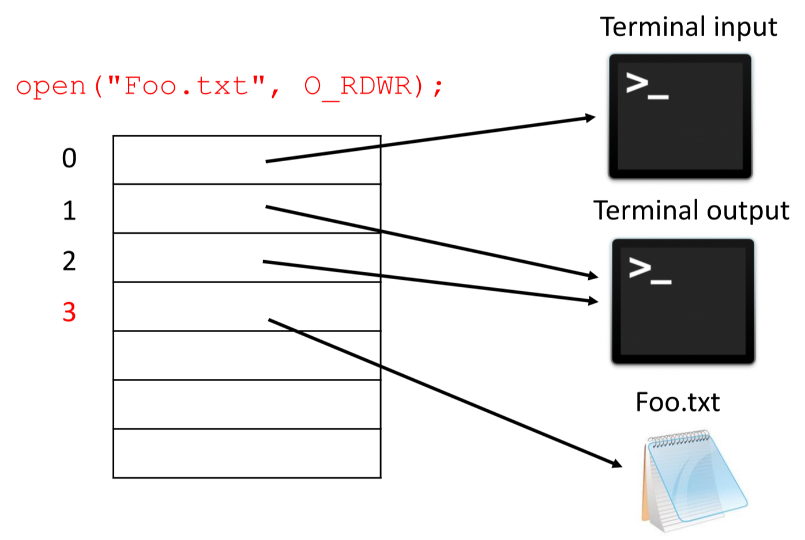

[Back to Main](../main.md)

# 5. Unix Shell & Hierarchical File System

## 5.1. Unix Shell
### Concept) Unix Shell
- Desc.)
  - A **user level** process that reads in commands
  - e.g.) Bash, zsh

<br>

### Concept) Fork-exec
- Desc)
  - Fork-exec lets us write programs that do what can be done in the shell
  - Similar tools in other languages
    - Java `Runtime` class
    - Python `subprocess` module
    - Rust `Command` API
    - Node.js `child_process` module

<br><br>

## 5.2. File I/O
### Concept) POSIX (Portable Operating System Interface)
- Desc.)
  - Similar to C standard library I/O
    - `FILE*` stream abstraction
    - Functions)
      - `fopen()`, `fread()`, `fwrite()`, `fclose()`, `fseek()`
    - Props.)
      - They are buffered.
      - They are implemented using lower-level OS calls
  - POSIX functions)
    - `open()`, `read()`, `write()`, `close()`, `lseek()`
  - Props.)
    - Lower-level but **unbuffered**!
- e.g.)
  - `open()`, `close()`
    ```cpp
    #include <fcntl.h> // for open()
    #include <unistd.h> // for close()
    ...
    int fd = open("foo.txt", O_RDONLY); // file descriptor!
    if (fd == -1) {
        perror("open failed");
        exit(EXIT_FAILURE);
    }
    ...
    close(fd)
    ```
  - `read`
    ```cpp
    int fd = open(filename, O_RDONLY);  // file descriptor
    array<char, 1024> buf {};
    ssize_t result;

    result = read(fd, buf.data(), 1024);
    ```

<br>

### Concept) stdout, stdin, stderr
- Desc.)
  ||c++ function|`unistd.h` constant|
  |:-:|:-:|:-:|
  |stdout|`std::cout`|`STDIN_FILENO -> 0`|
  |stdin|`std::cin`|`STDOUT_FILENO -> 1`|
  |stderr|`std::cerr`|`STDERR_FILENO -> 2`|
  - `unistd.h` constants are open on default for a process.
    - Usage e.g.)
      - `cout << ...` corresponds to `write(STDOUT_FILENO, ...)`

<br>

### Concept) File Descriptor Table
- Desc.)
  - A table that maintains the file descriptor of a [process](04.md#concept-process).
    - i.e.) Each process has an independent address space and file descriptor table
  - The value 0, 1, and 2 are secured for `STDIN_FILENO`, `STDOUT_FILENO`, and `STDERR_FILENO` respectively.
    

<br><br>

[Back to Main](../main.md)