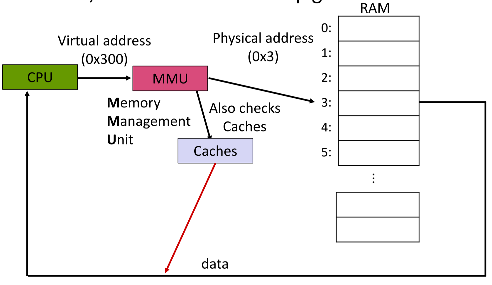

[Back to Main](../main.md)

# 7. Locality, Buffering, and Caches
### Concept) Memory Hierarchy

- Desc.)
  - Closer to the CPU, faster the IO

<br>

### Concept) Principles of Locality
1. Programs tend to **access** the **same set of memory locations** over a **short period** of time.
2. Two types of Locality
   1. Temporal Locality
      - If we access a portion of memory, we will likely reference it **again soon**
   2. Spatial Locality
      - If we access a portion of memory, we will likely reference memory **close to it** in the near future.
3. Data that is accessed frequently can be stored in hardware that is quicker to access.

<br><br>

## IO Buffering in CPP
#### Tech.) open() / close()
- Goal)
  - Opening a file in a process.
- Props.)
  - It returns the file descriptor.
  - Must be manually closed
- e.g.)
  ```cpp
  #include <fcntl.h> // for open()
  #incldue <unistd.h> // for close()
  ...
  int fd = open("foo.txt", O_RDONLY);   // FD returned!
  if (fd == -1){
    perror("open failed");
    exit(EXIT_FAILURE);
  }
  ...
  close(fd);
  ...
  ```

<br>

#### Tech.) read()
- Goal)
  - Read from a file and store the result in the buffer.
- Syntax)
  ```cpp
  ssize_t read(int fd, void* buf, size_t count);
  ```
  - Desc.)
    - Return type `ssize_t` is a signed `size_t` datatype.
    - Input arguments are
      - `fd` : the file descriptor
        - [The file that is `open()`](#tech-open--close)ed can be given.
      - `buf` : an array that will store the read result.
      - `count` : the number of bytes to read
        - If `buf.size()` < `count`, there can be buffer overflow!
        - When using `char* buf`, make sure to leave one byte for the `'\0'`.
- Prop.)
  - C design style because it is written in C.
  - Possible to return less than the number of bytes requested.
    - When encountered `EOF`
- e.g.)
  - Unstable due to `string` case
    ```cpp
    int fd = open(flie_name, O_RDONLY);   // File open
    array<char, 1024> buf {};
    ssize_t result;

    result = read(fd, buf.data(), 1024);
    if (result == -1){
      exit(EXIT_FAILURE);
    }

    string data_read(buf.data(), result); // string type needs '\0' at the end, but not guaranteed here!

    close(fd);
    ```

<br>

#### Tech.) endl
- Desc.)
  - It provides `'\n'` to the buffer and **flushes** it!
- cf.)
  - Calling `endl` frequently may be good for the performance.
    - e.g.)
      ```cpp
      void print_vec(ifstream& to_print, const vector<string>& words) {
        for (auto& word : words) {
          to_print << word << endl; // <- Flushing every time : Slow!
        }
      }

      void print_vec(ifstream& to_print, vector<string>& words) {
        for (size_t i = 0; i < words.size(); i++) {
          string& word = words[i]; to_print << word;
          to_print << "\n"; // <- Stacking up the buffer without flushing.
        }
      }
      ```


<br>

### Concept) CPP iostream and Buffer
- Desc.)
  - By default, C++ `iostream` usually uses buffering on top of POSIX.
  - When enough data has been written, the buffer will be flushed to the OS.
  - This prevents invoking the write system call and going to the filesystem to often.
- e.g.)

<table>
<tr>
<td></td>
<td>Buffered</td>
<td>Unbuffered</td>
<td>Desc.</td>
</tr>
<tr>
<td>Writing</td>
<td>

```cpp
int main(){
    string msg {"hi"};
    std::ofstream fout("hi.txt");

    fout.put(msg.at(0));
    fout.put(msg.at(1));

    return EXIT_SUCCESS;
}
```
- This buffers 'h' and 'i', and flush in one shot.

</td>
<td>

```cpp
int main(){
    string buf[2] = {'h', 'i'};
    int fd = open("hi.txt", O_WRONLY | O_CREAT);
    std::ofstream fout("hi.txt");

    write(fd, &buf, sizeof(char));
    write(fd, &buf+1, sizeof(char));

    close(fd);
    return EXIT_SUCCESS;
}
```
- 'h' and 'i' are written on the disc separately.

</td>
<td>Row 2, Col 4</td>
</tr>
<tr>
<td>Reading</td>
<td>

```cpp
int main(){
    std::array<char, s> buf {};
    std::ifstream fin("hi.txt");

    fout.get(arr.at(0));  // This reads chunks in advance
    fout.get(arr.at(1));

    return EXIT_SUCCESS;
}
```

</td>
<td>

```cpp
```

</td>
<td>Row 3, Col 4</td>
</tr>
</table>


<br>

### Analysis) C stdio vs POSIX
||C `stdio`|POSIX|
|:-:|:-|:-|
|Compatibility|Only on C++ std lib env.|Many OS level systems|
|Priority|By default, C `stdio` uses buffer on top of POSIX||
|How to flush|`std::flush` : Flushes the stream to the OS / files system. <br> `std::endl` : Flush and print new line. <br> `std::pubsetbuf` : Can set the stream to be unbuffered or a specified buffer.|`fsync()` : Flushes all in-core data and metadata to the storage medium <br> `fdatasync()` : Sends the file data to disk|


<br>

### Concept) Drawback of Buffering
- Reliability Issue
  - Recall that the buffer must be flushed.
  - If there is a system error before the flush, the written data may get lost.
- Performance Issue
  - Copying data into the `stdio` buffer consumes CPU cycles and memory bandwidth.
  - This can potentially slow down high-performance applications.
- Buffer can be slow when writing a large sized data.
  - Many small writes or writing a small sized data will be faster using the buffer.

<br><br>

### Concept) Cache
- Def.)
  - Memory with shorter access time used for the storage of data for increased performance. 
  - Data is usually either something frequently and/or recently used.
- How it works)
  - Memory Management Unit (MMU) communicate with the CPU and manages the cache.   
    
- Props.)
  - Faster and better performance.
    - Desc.)
      - Accessing data in the cache allows for much better utilization of the CPU.
      - Accessing data **not** in the cache can cause a bottleneck
  - Data is loaded in the cache in [cache line](#concept-cache-line).
    - Cache’s typically follow an **LRU (Least Recently Used)** on the entries a line can be stored in
      - cf.) LRU (Least Recently Used)
        - If a cache line is used recently, it is likely to be used again in the near future.
        - Use past knowledge to predict the future.
        - Replace the cache line that has had the longest time since it was last used.
  - Cache replacement policy)
    - Cache storage is limited.
    - So, when its full, we must evict an existing entry.

<br>

#### Concept) Cache Line
- Def.)
  - A unit block of data brought into the cache
- Prop.)
  - 64-byte in most architectures.

<br>

#### Concept) Instruction Cache
- Desc.)
  - The CPU not only has to fetch data, but it also fetches instructions.
    - e.g.)
      - L1I for instructions, L1D for the data.
- e.g.) OOD Inheritance
  ```cpp
  public class A {
    public void compute(){};
  }

  public class B extends A {
    public void compute(){};
  }

  public class C extends A {
    public void compute(){};
  }

  public static void main() {
    // Bad
    ArrayList<A> all_in_A = new ArrayList<A>();
    all_in_A.push_back(new A());
    all_in_A.push_back(new B());
    all_in_A.push_back(new C());

    for (A item: all_in_A){
      item.compute(); // This should check each instruction of A, B, and C
    }

    // Good
    ArrayList<A> only_A = new ArrayList<A>();
    only_A.push_back(new A());
    only_A.push_back(new A());
    only_A.push_back(new A());

    ArrayList<B> only_B = new ArrayList<B>();
    only_B.push_back(new B());
    only_B.push_back(new B());
    only_B.push_back(new B());

    for (A item: only_A){
      item.compute(); // CPU can simply check the instruction of A in the instruction cache
    }

    for (B item: only_B){
      item.compute(); // CPU can simply check the instruction of B in the instruction cache
    }
  }
  ```

<br><br>

### Concept) Memory Allocation in CPP
- Desc.)
  - `new`/ `delete` manages the memory allocation in C++, although we rarely use them explicitly.
    - RAII!
  - Memory allocation takes some times.
    - Thus, to improve the performance...
      - Make references instead of copies.
      - Use functions like `vector::reserve(size_t new capacity)`.
      - Use `std::move` semantics.


<br><br>

[Back to Main](../main.md)