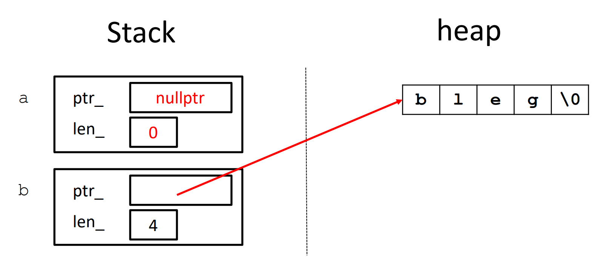

[Back to Main](../main.md)

# Move & File Descriptors

### CPP) Vector Reserve
- Desc.)
  - Increase the capacity of the vector (the total number of elements that the vector can hold without requiring reallocation) to a value that's greater or equal to `new_cap`.
- Syntax)
  ```cpp
  std::vector.reserve(size_t new_cap)
  ```
- e.g.)
  ```cpp
  vector<int> a {};
  a.reserve(10);
  ```
- cf.)
  - To fill the allocated memories with default value, use `resize`.
    ```cpp
    vector<int> a{};
    a.push_back(3);
    a.resize(10);
    ```

<br>

### Concept) rvalue
- Desc.)
  - A temporary value that does not have a persistent memory address. 
  - It cannot be assigned to, and it typically exists only within a single expression before disappearing.
- e.g.)
  - Literals: `10`, `3.14`, `"hello"`
  - Temporary expressions: `x + y`, `std::move(obj)`, `func_returning_temp()`
- How to reference a rvalue?)
  - Use `&&`
    - e.g.)
      ```cpp
      // rvalue reference
      int&& rref = 5; // Here 5 is the rvalue.

      // Recall that lvalue reference was...
      int x = 5; // lvalue
      int& ref = x;
      ```

<br>

### Concept) Move Semantics
- Desc.)
  - “Move semantics” move values from one object to another without copying (“stealing”).
  - Takes in [rvalue](#concept-rvalue) as the input.
    - `std::move()` function converts lvalue into rvalue.
- e.g.)
  |Code|Diagram|
  |:-|:-|
  |<code>std::string a{"bleg"}; <br> std::string b{std::move(a)};</code>||
- Syntax)
  - Move Constructor in a Class
    ```cpp
    Object::Obejct(Object&& other) {
        this->ptr_field = other.ptr_field;
        this->int_field = other.int_field;

        other.ptr_field = nullptr;
        other.int_field = 0;
    }
    ```
  - Move Assignment in a Class
    ```cpp
    Object& Object::operator=(Object&& rhs) {}
    ```


<br><br>

[Back to Main](../main.md)