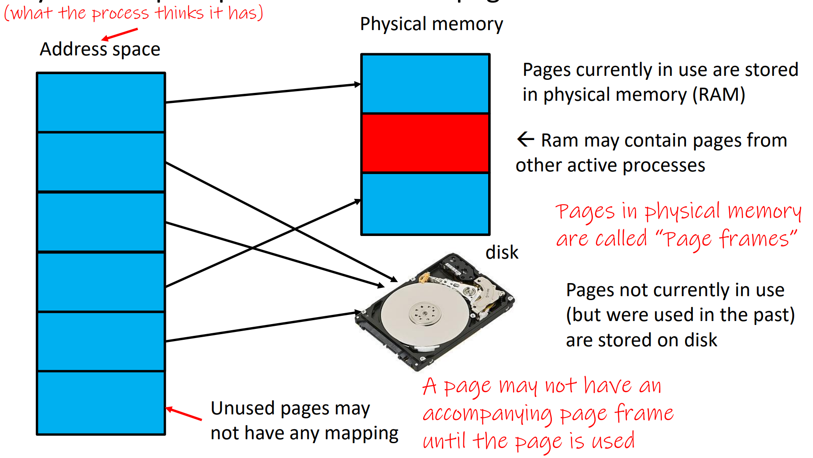

[Back to Main](../main.md)

# Buffering & Virtual Memory

## Concept) Virtual Memory

<br>


### Concept) Memories

#### Concept) Addressable Memory
- Def.)
  - The total amount of memory that can be theoretically be accessed based on...
    - the number of addresses (address space)
    - bytes per address (addressability)


#### Concept) Physical Memory
- Def.)
  - The total amount of memory that is physically available on the computer


#### Concept) Virtual Memory
- Def.)
  - An abstraction technique for making memory look larger than it is and hides many details from the programs
- Idea)
  - Only the currently running processes need the actual physical memory.
  - Even for the running process, only the part of the memory that are currently being used is actually needed.
  - Data not currently used can be stored in disk instead.


<br>

### Concept) Page
- Def.)
  - An abstract unit that splits the physical memory

#### Concept) Page Table
- Def.)
  - A table that maintains the virtual address and the physical address
  - It is managed by the MMU
- e.g.)
  |Virtual Page #|Valid|Physical Page #|
  |:-:|:-:|:-:|
  |0|0 (page not in physical memory)|`null` (page not used yet)|
  |1|1 (page in physical memory)|0|
  |2|1|1|
  |3|0|Disk|   

#### Concept) Page Frame
- Def.)
  - A page in physical memory 
    


#### Concept) Page Fault Exception
- Desc.)
  - An exception that is made when writing to a memory location that is not in physical memory currently.
  - The OS kernel handles this fault and returns to the running thread in the user code.

<br>

### Concept) Page Replacement
- Why needed?)
  - What if the physical memory is full and we should load data from the disk?
  - OS needs to evict some page in physical memory
- Strategies)
  - Random Choice
    - Prop.)
      - Worst but easy to implement
  - FIFO
    - How?)
      - Replace the page that has been in physical memory the longest
  - (Theoretically) Optimal
    - How?)
      - Assume that we know the sequence of the requests for pages in advance
      - Replace the page to be used at the farthest point in future.
  - Least Recently Used (LRU)
    - How?)
      - Assume that the recently used will be used again soon.
      - Evict the pages that have been **unused** for the longest time.
    - Prop.)
      - Significant overhead because it should maintain the timestamp for each memory access that is updated in the page table
      - Pages should be maintained sorted
      - LRU is generally better than FIFO.
        - Not every case!
    - Implementations)
      - Counter-based Sol.
        - Maintain the counter that gets incremented with each memory access.
        - Evict the ones with the lowest counts
      - List-based Sol.
        - Maintain a linked list of pages in memory.
        - ON every memory access, move the accessed page to end
        - Pick the front page to evict
      - Hashmap and Linked List
        - Maintain a hashmap and a linked list
        - 

<br><br>


## CPP
### Concept) = Operator Overloading
- Desc.)
  - `=` : the assignment operator
    - Usage)
      ```cpp
      Point x(1,2);     // ctor
      Point y(x);       // cctor
      y = x;            // assignment
      y.operator=(x);   // equivalent to y=x;
      ```
- Overloading)
  - Why doing this?)
    - Customize the `=` operation.
    - If not, C++ will synthesize one.
      - This is usually wrong whenever a class has dynamically allocated data
  - e.g.) Overloading
    ```cpp
    Point& Point::operator=(const Point& rhs) {
        if (this != &rhs) {
            x_ = rhs.x_;
            y_ = rhs.y_;
        }

        return *this;  // The return type is the reference! Allow chaining.
    }
    ```
    - e.g.) Usage
      ```cpp
      Point a;
      a = b = c;    // Works because = returns *this.
      a.operator=(b.opeartor=(c)); // equiv.
      a = (b = c);  // Works.
      (a = b) = c;  // Works.
      ```


<br>

### Concept) Initialization List
- Syntax)
  ```cpp
  // Constructor with an initialization list
  Point::Point(int x, int y) : x_(x), y_(y) {}
  ```
- Why needed?)
  - It prevents the unnecessary default construction of fields.
    |When used|When not used|
    |:-|:-|
    |<code>Point::Point(int x, int y) {<br> int x_ = x; <br> int y_ = y; <br> int z_ = z; <br>}</code>|<code>Point::Point(int x, int y) {<br> int x_; <br> int y_; <br> int z_;<br> x_ = x; <br> y_ = y; <br> z_ = z; <br>}</code>|
  - A class with a reference data member compile only with the **Initialization List** ctor.
    ```cpp
    class Song {
        public:
            // Initialization List ctor
            Song(string name, int rating) name_(name), rating_(rating) {}; 
        private:
            string name_;
            int& rating_; // This member forces the ctor with the initialization list
    }
    ```
- Props.)
  - Data members in initializer list are initialized in the order they are **defined in the class**
    - cf.) not by the initialization list ordering


<br>

### Concept) Casting
- Desc.)
  - Recall the C-style castings as below.
    - Types)
      - Conversion between pointers of arbitrary type.
        - e.g.)
          ```cpp
          (void*) my_ptr;
          ```
      - Forcibly convert a primitive type to another.
        - e.g.)
          ```cpp
          (double) my_int;
          ```
    - Problem)
      - Intent of the casting is not clear...
        - Sol.) C++ provides alternative casting styles
          - [Static Casting](#concept-static-casting)
          - [Dynamic Casting](#concept-dynamic-casting)
          - [Const Casting](#concept-const-casting)
          - [Reinterpret Casting](#concept-reinterpret-casting)

#### Concept) Static Casting
- Desc.)
  - Eligibility)
    - Casting `void*` to `T*`.
    - Converting pointers to classes of **related** types
      - Compile error if the classes are not related.
        ```cpp
        class A {
            public:
                int x;
        };

        class B {
            public:
                float y;
        };

        class C : public B {
            public:
                char z;
        }
        ```
        ```cpp
        void foo() {
            B b; C c;

            // Compile error : unrelated types
            A* a_ptr = static_cast<A*>(&b);
            // Works, but also works without static_cast.
            B* b_ptr = static_cast<B*>(&c);
            // Compiles but dangerous: What if c_ptr->z?
            C* c_ptr = static_cast<C*>(&b);
        }
        ```
    - Non-pointer conversion.
      - e.g.)
        ```cpp
        void foo() {
            int b = 3;
            float c;
        }

        c = static_cast<float>(b);
        ```
- Prop.)
  - Used in cases where casting is not related to object inheritance.

<br>


#### Concept) Dynamic Casting
- Desc.)
  - Eligibility)
    - Converting...
      - Pointers to classes of related type.
      - References to classes of related type.
  - `dynamic_cast` is checked both at compile time and run time
    - At compile time, error if the classes are unrelated.
    - At run time, casts from the base type to the derived type fails if the pointed-to object is not the derived type.
- e.g.)
  ```cpp
  class Base {
    public:
        virtual void foo() {};
        float x;
  };

  class Der1: public Base {
    public:
        char x;
  };
  ```
  ```cpp
  void bar() {
    Base b; Der1 d;

    // Ok
    Base* b_ptr = dynamic_ast<Base*>(&d);
    assert(b_ptr != nullptr);
    // Ok
    Der1* d_ptr = dynamic_ast<Base*>(b_ptr);
    assert(d_ptr != nullptr);
    // Run-time check fails.
    b_ptr = &b;
    d_ptr = dynamic_cast<Der1*>(b_ptr);
    assert(d_ptr != nullptr);
  }
  ```


<br>


#### Concept) Const Casting
- Desc.)
  - Used to add or strip the `const` property.
- e.g.)
  ```cpp
  void foo(int* x) {
    *x++;
  }

  void bar(const int* x) {
    foo(x);     // compile error!
    foo(const_cast<int*>(x));  // Success!
  }
  ```


<br>


#### Concept) Reinterpret Casting
- Desc.)
  - Casting between incompatible types
    - Low-level reinterpretation of the bit pattern
      - e.g.) Storing a pointer in an `int`.


<br>


<br>


<br><br>

[Back to Main](../main.md)