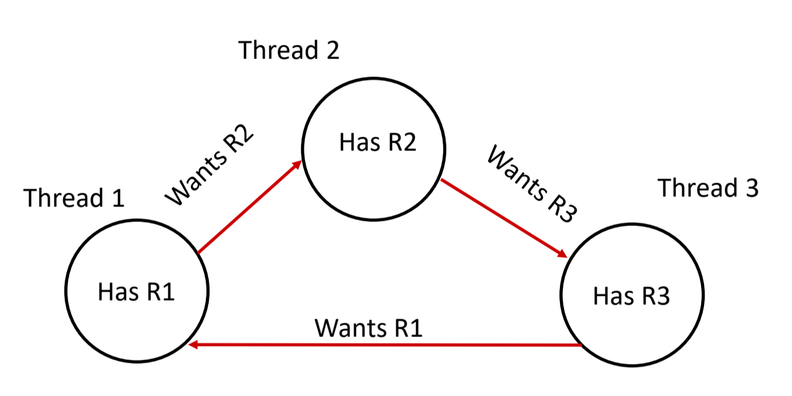

[Back to Main](../main.md)

# Thread & Mutex
### Concept) Thread
- Def.)
  - A sequential execution stream within a process
  - A unit of scheduling in a [process](./04.md#concept-process).
    - [Process](./04.md#concept-process) is the container of the **threads**.
    - Every [process](./04.md#concept-process) has at least one thread in it.
- Comparison with [Process](./04.md#concept-process)
  - A [process](./04.md#concept-process) has unique :
    - address space
    - OS resources
    - security attributes
  - A thread has a unique :
    - stack
    - stack pointer
    - program counter
    - registers   
      

<br>

### Concept) POSIX Thread (pthread)
- Desc.)
  - The POSIX APIs for dealing with threads.
  - Declared in `pthread.h`.
  - Must include the `-pthread` flag when compiling and linking with gcc command.   
    ```
    g++ -g -Wal -std=c++23 -pthread -o main main.c
    ```
  - Must deal with C programming practices and style.
- Syntax)
  - Creation
    ```c
    // Definition
    int pthread_create(
        pthread_t* thread,  // output parameter
        const pthread_attr_t* attr,
        void* (*start_routine) (void*), // functor
        void* arg // arg for the thread function
    );

    // Usage
    pthread_t thds[10]; // An array of threads
    void* thread_main(void* arg) {}  // A function that threads should run
    pthread_create(&thd[0], NULL, &thread_main, NULL);
    ```
  - Join
    ```c
    int pthread_join(pthread_t thread, void** retval);

    pthread_join(thds[0], NULL);
    ```
    - Prop)
      - Waits for the specified thread to terminate
      - Equivalent to `waitpid()` of the process.
      - Exit status of the terminated thread is placed in `**retval`.
  - Detach
    ```c
    int pthread_join(pthread_t thread);

    pthread_join(thds[0]);
    ```
    - Prop)
      - Mark the specified thread as detached.
      - Clean up resources as soon as it terminates.

<br><br>

### Concept) Process Isolation
- Def.)
  - A set of mechanisms implemented to protect processes from each other and protect the kernel from user processes
- Desc.)
  - Still the limited Inter-Process Communication (IPC) is available through
    - Pipe : `pipe()`
    - Socket : `socketpair()`
    - Shared Memory : `shm_open()`


<br>

### Analysis) Parallelism vs Concurrency
#### Concept) Parallelism
- Def.)
  - One or more tasks run at same instant in time

<br>

#### Concept) Concurrency
- Def.)
  - When there are one or more tasks that have overlapping lifetimes.


<br>

### Concept) Sequential Consistency
- Desc.)
  - The order of operations within a single thread are the same as the program order


<br>

## Data Sharing

### Concept) Data Race
- Desc.)
  - Two memory accesses form a **data race** if **different threads** access the **same location**, and at least one is a write, and they occur one after another
  - Thus, the result of a program can vary depending on chance.
- e.g.)
  ```cpp
  #include <cstdlib>
  #include <thread>

  #define NUM_THREADS 50
  #define LOOP_NUM 100

  int sum_total = 0;

  void* thread_main(void* arg) {
          for (int i=0; i < LOOP_NUM; i++) {
                  sum_total++;
          }
          return NULL;
  }

  int main(int argc, char** argv) {
          pthread_t thds[NUM_THREADS];

          for (int i=0; i<NUM_THREADS; i++) {
                  if (pthread_create(&thds[i], NULL, &thread_main, NULL) != 0) {
                          fprintf(stderr, "pthread_create failed\n");
                  }
          }

          for (int i=0; i<NUM_THREADS; i++) {
                  if (pthread_join(thds[i], NULL) != 0) {
                          fprintf(stderr, "pthread_join failed\n");
                  }
          }

          printf("%d\n", sum_total);

          return EXIT_SUCCESS;
  }
  ```
  - Problem)
    - Threads try to access `sum_total` in parallel.
    - `sum_total++` is not a single operation.
      - Why?) In assembly...
        ```assy
        LOAD sum_total into R0;
        ADD R0 R0 #1;
        STORE R0 into sum_total;
        ```
    - Context switching can happen during the operations.


<br>

### Concept) Synchronization
- Def.)
  - An act of preventing two (or more) concurrently running threads from interfering with each other when operating on shared data
- Goal)
  - [Liveness](#concept-liveliness) : ability execute in a **timely manner**
  - Safety : avoid unintended interactions with shared data structures.


<br>

### Concept) Lock
- Desc.)
  - Use a “Lock” to grant access to a critical section so that only one thread can operate there at a time
  - Locks are constructs that are provided by the operating system to help ensure synchronization.
  - Only one thread can acquire a lock at a time
    - No thread can acquire that lock until it has been released
  - Has memory barriers built into it and usually uses TSL to ensure that acquiring the lock is atomic (more on TSL and memory barriers in a little bit).


<br>

### Concept) Mutex (Mutual Exclusion)
- Desc.)
  - One way of performing [lock](#concept-lock).
  - Library : `pthread.h`
- Syntax)
  - Initialization
    ```cpp
    int pthread_mutex_init(pthread_mutex_t* mutex, const pthread_mutexattr_t* attr);
    ```
  - Lock
    ```cpp
    int pthread_mutex_lock(pthread_mutex_t* mutex);
    ```
  - Unlock
    ```cpp
    int pthread_mutex_unlock(pthread_mutex_t* mutex);
    ```
  - Destroy (uninitialize!)
    ```cpp
    int pthread_mutex_destroy(pthread_mutex_t* mutex);
    ```

<br>

### Concept) Liveliness
- Def.)
  - A set of properties that ensure that threads execute in a timely manner, despite any contention on shared resources.
- Failure cases)
  - Releasing Lock
    - Desc.)
      - Case when a lock is not released by a thread and another thread tries to acquire that lock.
    - e.g.) `~/upenn_mcit/spring2025/cit5950/scripts/10/release_locks.cpp`
  - Deadlock
    - Def.)
      - A computer has multiple threads, finite resources, and the threads want to acquire those resources
      - A threads typically accumulate resources over time
      - Deadlock: Cyclical dependency on resource acquisition so that none of them can 
    - e.g.) 
      - Milk Deadlock
        - `~/upenn_mcit/spring2025/cit5950/scripts/10/milk_deadlock.cpp`
      - Circular wait   
        
    - Sol.)
      - Lock only the critical sections.
  - Mutex Recursion
    - e.g.) `~/upenn_mcit/spring2025/cit5950/scripts/10/recursive_deadlock.cpp`

<br>

### Concept) Race Condition
- Desc.)
  - Where the program has different behavior depending on the ordering of concurrent threads.
  - [Data race](#concept-data-race) is a subset of the race condition.

<br>

### Concept) Thread Communication
- Desc.)
  - A situation where threads communicate with each other to know when they can perform operations
- e.g.)
  - Producer / Consumer Case
    - Desc.)
      - The producer threads create some data that is then added to a shared data structure
      - Consumers will process and remove data from the shared data structure
    - Sol.)
      - Spinning
        - Desc.)
          - Infinitely loop until the producer thread notifies that the consumer thread can print
        - Drawback)
          - Loop uses a lot of cpu resource.
        - e.g.)
          - `~/upenn_mcit/spring2025/cit5950/scripts/10/spinning.cpp`
      - [Condition Variables](#concept-condition-variable)

<br>

### Concept) Condition Variable
- Desc.)
  - Variables that allow for a thread to wait until they are notified to resume.
  - Done in the context of mutual exclusion
    - How?)
      - A thread must already have a lock.
      - This lock will temporarily release while waiting.
      - Once notified, the thread will re-acquire a lock and resume execution.
- Library : `pthread.h`
  - Datatype : `pthread_cond_t`
- Syntax)
  - Initialization
    ```cpp
    int pthread_cond_init(pthread_cond_t* cond, const pthread_condattr_t* attr);
    ```
  - Destroy : clean up when done.
    ```cpp
    int pthread_cond_destroy(pthread_cond_t* cond);
    ```
  - Wait : Atomically releases the mutex and blocks on the condition variable.
    ```cpp
    int pthread_cond_wait(pthread_cond_t* cond, const pthread_condattr_t* attr);
    ```
  - Signal : Unblock at least one of the threads on the specified block condition
    ```cpp
    int pthread_cond_signal(pthread_cond_t* cond);
    ```
  - Broadcast : Unblock all threads on the specified block condition
    ```cpp
    int pthread_cond_broadcast(pthread_cond_t* cond);
    ```
- e.g.)
  `~/upenn_mcit/spring2025/cit5950/scripts/10/cond.cpp`


<br><br>

[Back to Main](../main.md)


