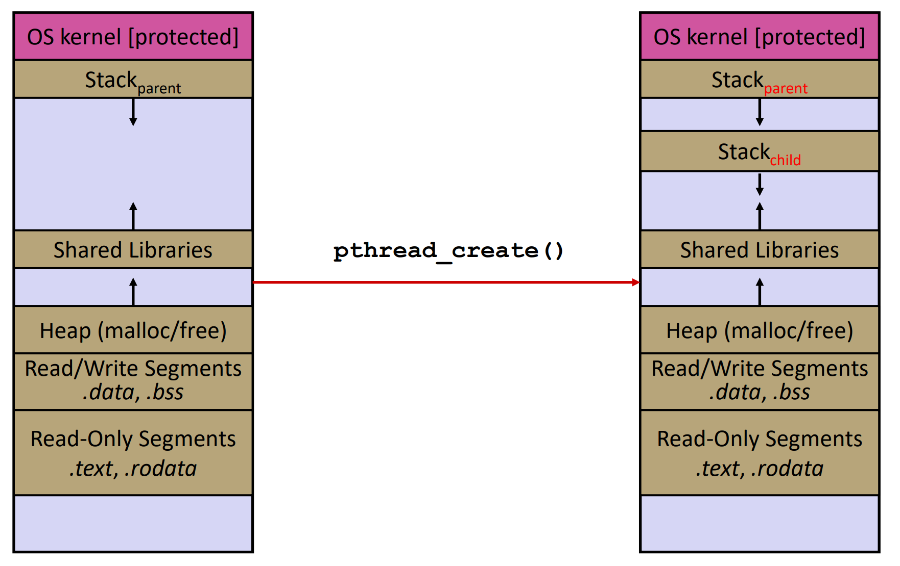

[Back to Main](../main.md)

# Thread
### Concept) Thread
- Def.)
  - A sequential execution stream within a process
  - A unit of scheduling in a process.
    - Process is the container of the threads.
    - Every process has at least one thread in it.
- Comparison with Process
  - A process has unique :
    - address space
    - OS resources
    - security attributes
  - A thread has a unique :
    - stack
    - stack pointer
    - program counter
    - registers   
      

<br>

### Concept) POSIX Thread (pthread)
- Desc.)
  - The POSIX APIs for dealing with threads.
  - Declared in `pthread.h`.
  - Must include the `-pthread` flag when compiling and linking with gcc command.
    `g++ -g -Wal -std=c++23 -pthread -o main main.c`.
  - Must deal with C programming practices and style.
- Syntax)
  - Creation
    ```c
    int pthread_create(
        pthread_t* thread,  // output parameter
        const pthread_attr_t* attr,
        void* (*start_routine) (void*), // functor
        void* arg // arg for the thread function
    );
    ```
  - Wait
    ```c
    int pthread_join(pthread_t thread, void** retval);
    ```

<br><br>

[Back to Main](../main.md)