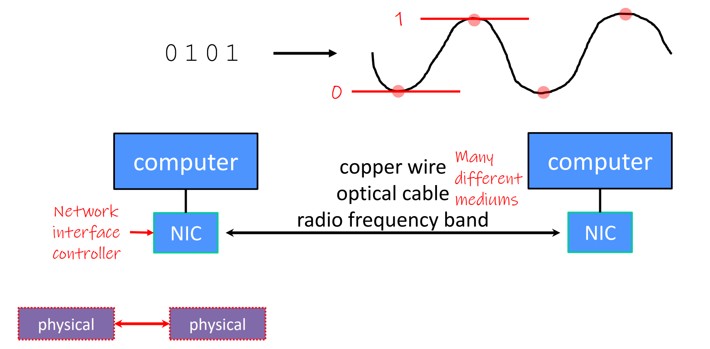
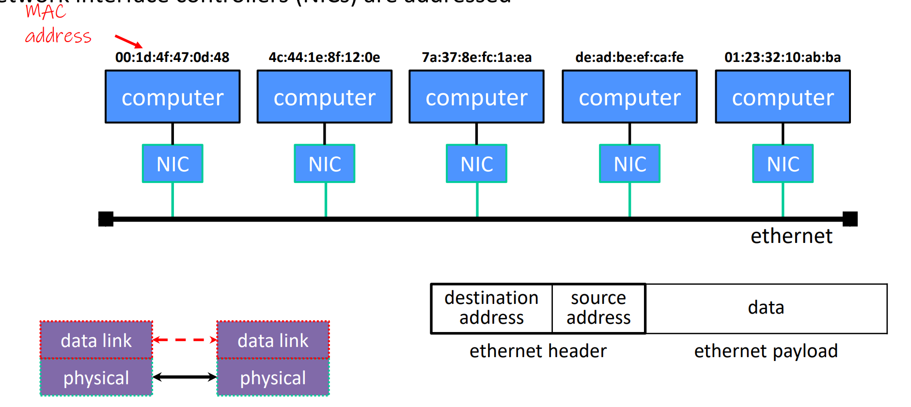
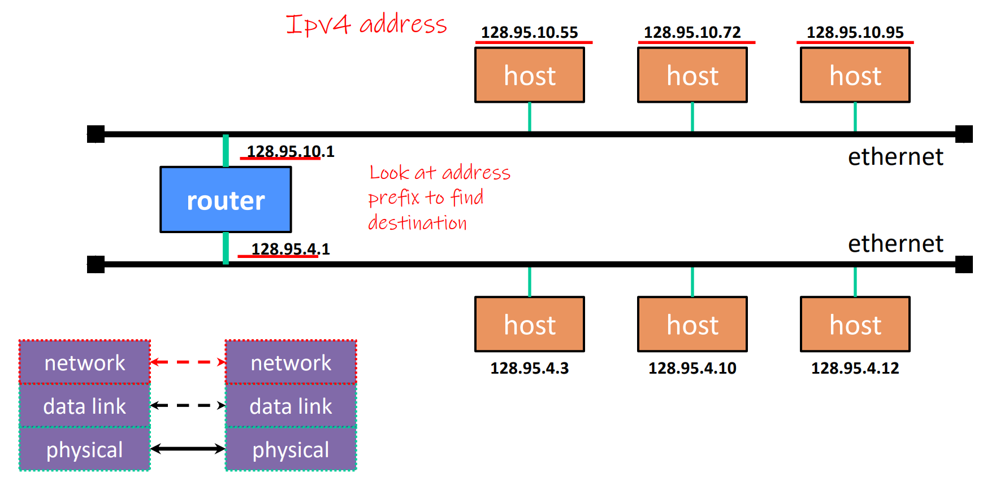
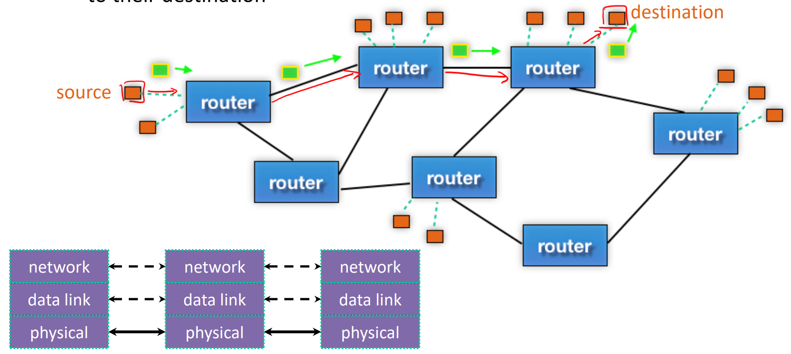
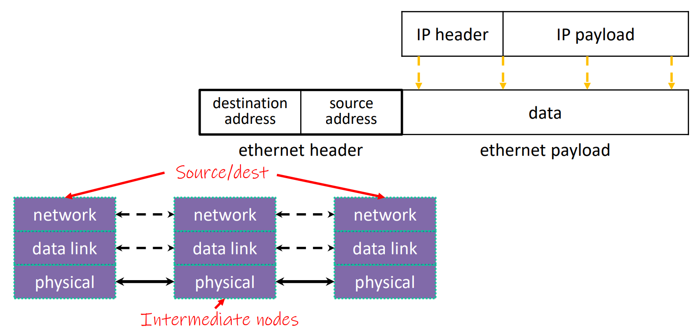

[Back to Main](../main.md)

# Networking

### Concept) 7-Layer OSI Model
- [Application Layer]()
- [Presentation Layer]()
- [Session Layer]()
- [Transport Layer]()
- [Network Layer]()
- [Data Link Layer]()
- [Physical Layer]()

 

### Concept) Physical Layer (Layer 1)

- Desc.)
  - How bits are encoded at a signal level.
  - These individual bits are modulated onto a wire or transmitted over radio   
- Matters that affect the Physical Layer
  - Materials
    - **Fiber optic** cables are lower-latency and higher-bandwidth than traditional **copper** wiring
  - Topology
    - Some places are surprisingly well- or poorly-connected to “backbone” infrastructure like fiber optic cables

  

### Concept) Data Link Layer (Layer 2)

- Desc.)
  - How computers cooperate in a local network
  - How bits are “packetized” and network interface controllers (NICs) are addressed
  - Multiple computers on a LAN contend for the network medium
  - Each device is assigned with the MAC Address

  

### Concept) Network Layer (Internet Protocol, IP, Layer 3)
- Desc.)
  - Internet Protocol (IP) routes packets across multiple networks.
    - Every computer has a unique IP address.
    - Individual networks are connected by **routers** that span networks   
      
  - There are protocols to:
    - Let a host map an IP to MAC address on the same network
    - Let a router learn about other routers to get IP packets one step closer to their destination   
      
- Packet Encapsulation
  - Desc.)
    - An IP packet is encapsulated as the payload of an Ethernet frame
    - As IP packets traverse networks, routers pull out the IP packet from an Ethernet frame and plunk it into a new one on the next network   
      

  

### Concept) Transport Layer (Layer 4)
- Desc.)
  - Provides an interface to treat the network as a data stream
  - Provides different protocols to interface between source and destination:
    - e.g.)
      - [TCP](#transmission-control-protocol-tcp)
      - [UDP](#user-datagram-protocol-udp)

#### Concept) Transmission Control Protocol (TCP)
- Desc.)
  - Provides applications with **reliable**, **ordered**, **congestion-controlled** byte streams
  - A single host (IP address) can have up to $`2^16`$ ports.
  - Applications use OS services to establish TCP streams:
    - POSIX
      - `connect()`
      - `listen()`
      - `accept()`
      - `read()`
      - `write()`
  - Setting up a TCP connection typically requires 3 round trips

#### Concept) User Datagram Protocol (UDP)
- Desc.)
  - Provides applications with unreliable packet delivery
  - Fast
  - UDP is a really thin, simple layer on top of IP

  

### Concept) Session Layer (Layer 5)
- Supposedly handles establishing and terminating application sessions
- Remote Procedure Call (RPC) kind of fits in here

  

### Concept) Presentation Layer (Layer 6)
- Supposedly maps application-specific data units into a more network-neutral representation
- Encryption (SSL) kind of fits in here

  

### Concept) Application Layer (Layer 7)
- Application protocols
  - Desc.)
    - The format and meaning of messages between application entities  
  - e.g.) 
    - DNS
    - HTTP
    - SMTP, IMAP, POP
    - SSH
    - bittorrent

  

---

### Concept) IPv4
- 4-Byte

  

### Concept) IPv6
- 16-Byte
  - groups of 4 hex digits
    - Can omit leading zeros in hextets
      - e.g.) 2d01:**0**db8:f188:**0000**:**0000**:**0000**:**0000**:1f33 $`\rightarrow`$ 2d01:**db8**:f188::1f33

  

[Back to Main](../main.md)