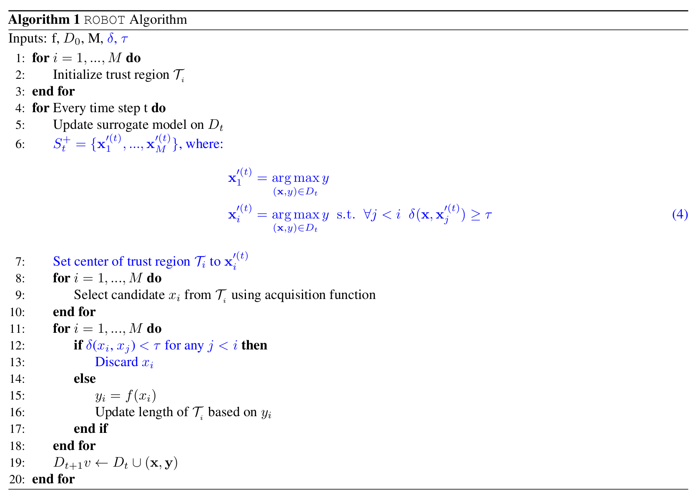

# Discovering Many Diverse Solutions with Bayesian Optimization (ROBOT)
Maus et al.

### Settings & Objective)
- Settings)
  - Let
    - $`\mathbf{x}^*`$ : a single best solution
- Objective)
  - Seek $`S^*=\{ \mathbf{x}^*_1, \cdots, \mathbf{x}^*_M \}`$ s.t. $`\delta(\mathbf{x}^*_i,\mathbf{x}^*_j)\ge\tau,\;\forall\mathbf{x}^*_i,\mathbf{x}^*_j\in S^*,\exists\tau\gt0`$
    - where
      - $`\delta(\mathbf{x},\mathbf{x}')`$ : a symmetric diversity measure provided by the practitioner
        - Sequential SCBO
          - Eriksson and Poloczek (2021)

 

## 3. Methods
- Settings)
  - $`f(\cdot)`$ : a high-dimensional objective function 
    - $`y = f(\mathbf{x})`$
  - $`\delta(\mathbf{x}_1,\mathbf{x}_2)`$ : user-supplied function defined on $`\mathcal{X}^2`$
- Goal)
- Find a diverse set of $`M`$ solutions for $`f`$.
  - i.e.) Find $`S^* := \{ \mathbf{x}_1^*, \cdots, \mathbf{x}_M^* \}`$ s.t.
    - $`\mathbf{x}_1^* = \displaystyle\arg\max_{\mathbf{x}\in\mathcal{X}} f(\mathbf{x})`$
    - $`\mathbf{x}_i^* = \displaystyle\arg\max_{\mathbf{x}\in\mathcal{X}} f(\mathbf{x})`$ s.t. $`\delta(\mathbf{x}^*_i,\mathbf{x}^*_j)\ge\tau`$ for $`j=1,\cdots, i-1`$ 
    - Optima in $`S^*`$ are defined hierarchically.

### 3.1 Rank-Ordered Bayesian Optimization with Trust Regions (ROBOT)
- Trusted Region)
  - $`\mathcal{T}_i\subseteq\mathcal{X}`$ : Trusted Regions
    - ROBOT maintains $`M`$ simultaneous local optimization runs using $`M`$ individual TRs : 
      - $`\mathcal{T}_i`$'s side lengths are defined using standard Euclidean distance.
      - Even sampling candidate $`\mathbf{x}`$ locations from within such a TR becomes challenging in the general setting.
  - Each local run $`i`$ aims to find a single diverse solution $`\mathbf{x}_i^*`$.
    - Together form $`S^*`$
    - $`\mathbf{x}_i^*`$ is constrained only w.r.t. prior solutions $`\mathbf{x}_j^*,\;j\lt i`$
- Candidate Acquisition)
  - Select candidates $`\hat{\mathbf{x}}_i`$ from each $`\mathcal{T}_i`$ s.t.
    - $`\hat{\mathbf{x}}_1 = \displaystyle\arg\max_{\mathbf{x}\in\mathcal{T}_1}\alpha(\mathbf{x};y_1^+)`$
    - $`\hat{\mathbf{x}}_i = \displaystyle\arg\max_{\mathbf{x}\in\mathcal{T}_i}\alpha(\mathbf{x};y_i^+)`$ s.t. $`\delta(\mathbf{x},\hat{\mathbf{x}}_j) \ge\tau,\; \forall j\lt i`$
      - where
        - $`\alpha`$ : an acquisition function such as EI
        - $`y_i^+`$ : the best objective value observed so far by the i-th optimizer
  - Prop.)
    - Each TR is constrained by the TRs ranked above it.
      - No constraint on $`\hat{\mathbf{x}}_1 \text{ and }\mathcal{T}_1`$
- Thompson Sampling)
  - Select a candidate $`\hat{\mathbf{x}}_i`$ for each $`\mathcal{T}_i`$ one at a time in rank-order.
    - How?)
      - Sample $`r`$ points $`C_i = \{ \mathbf{c}_{i1}, \cdots, \mathbf{c}_{ir} \}`$ from $`\mathcal{T}_i`$
      - Sample a realization $`\hat{f}(\mathbf{c}_{ij})`$
      - Select a batch of candidates $`\hat{F}`$ s.t.
        - $`\hat{F} = \{ \mathbf{c\mid c}\in C_i, \;\forall \mathbf{p}\in P_i,\;\delta(\mathbf{c},\mathbf{p})\ge\tau \}`$
          - where $`P_i`$ is the set of all **candidate points** which have already been selected from each of the higher-ranking TRs, i.e. $`\mathcal{T}_1,\cdots,\mathcal{T}_{i-1}`$
        - If $`\hat{F}=\emptyset`$, no candidate is selected from $`\mathcal{T}_i`$ at this round.
- Trusted Region Modification)
  - ROBOT re-centers the TRs when $`S_t^+ \equiv \{ \mathbf{x}_1^+, \cdots, \mathbf{x}_M^+ \}`$
    - where
      - $`S_t^+`$ : the current best set after $`t`$ iterations
      - $`\{ \mathbf{x}_1^+, \cdots, \mathbf{x}_M^+ \}`$ : set of all centers
    - How?)
      - Set $`S_t^* = \{ {\mathbf{x}_1'}^{(t)}, \cdots, {\mathbf{x}_M'}^{(t)} \}`$
        - where
          - $`{\mathbf{x}_1'}^{(t)} = \displaystyle\arg\max_{(\mathbf{x},y)\in\mathcal{D}_t} y`$
            - i.e.) The best-scoring point at $`t`$
          - $`{\mathbf{x}_i'}^{(t)} = \displaystyle\arg\max_{(\mathbf{x},y)\in\mathcal{D}_t} y`$ s.t. $`\forall j\lt i,\; \delta(\mathbf{x}, {\mathbf{x}_j'}^{(t)}) \ge \tau`$
      - Set $`{\mathbf{x}_i'}^{(t)}`$ be the center of $`\mathcal{T}_i`$
- Global Surrogate Model)
  - ROBOT maintains a single global surrogate model across all $`M`$ trust regions.
    - Why?)
      - The re-c[text](../../../2508_Fall_2025/CIS_NNN)entering procedure may put $`\mathcal{T}_i`$ centered on any point in $`\mathcal{D}_t`$.
      - No local optimization history exists in this case.

   

- [Implementation](https://github.com/nataliemaus/robot)

