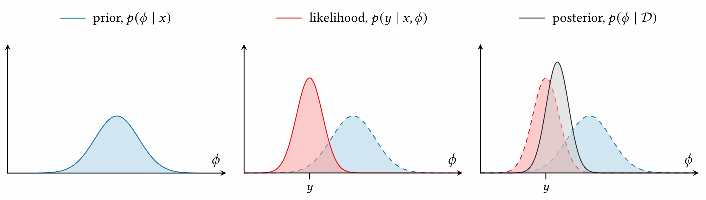

[Back to Main](../main.md)

# 1. Introduction
## 1.1 Formalization of Optimization
### Concept) Objective Function 
- Def.)
  - $`f : \mathcal{X} \rightarrow \mathbb{R}`$ : a real-valued objective function
    - Don't require a known functional form or even be computable directly.
    - Only require access to a mechanism revealing some information about the objective function at identified points on demand

 

### Concept) Optimization
- Settings
  - $`\mathcal{X}`$ : some domain
  - $`f : \mathcal{X} \rightarrow \mathbb{R}`$ : a real-valued [objective function](#concept-objective-function)
- The goal of optimization)
  - Search a domain for a point $`x^*`$ attaining the globally maximal value $`f^*`$ as
    - $`\displaystyle x^*\in\arg\max_{x\in\mathcal{X}} f(x)`$
    - $`\displaystyle f^* = \max_{x\in\mathcal{X}} f(x) = f(x^*)`$
- How to solve?)
  - [Iterative Optimization Algorithm](#concept-iterative-optimization-algorithm)

 

### Concept) Iterative Optimization Algorithm
- Motivation)
  - Directly solving for the location of global optima is infeasible except in exceptional circumstances.
  - Recall that we don't know much about our [objective function](#concept-objective-function).
  - Instead, we are taking an indirect approach.
- How?)
  - Design a sequence of experiments to probe the [objective function](#concept-objective-function) for information
- Goal)
  - Reveal the solution to the [optimization problem](#concept-optimization)
    - $`\displaystyle f^* = \max_{x\in\mathcal{X}} f(x) = f(x^*)`$
- The Algorithm)
  - Input)
    - Initial dataset $`\mathcal{D}`$
  - Main)
    - Repeat until the [termination condition](#concept-termination) is reached
      - $`x^* \leftarrow \text{policy}(\mathcal{D})`$ : [Optimization Policy](#concept-optimization-policy)
      - $`y^* \leftarrow \text{observe}(x^*)`$ : [Observation Model](#concept-observation-model)
      - $`\mathcal{D} \leftarrow \mathcal{D} \cup \{(x^*,y^*)\}`$
  - Return)
    - $`\mathcal{D}`$

 

### Concept) Optimization Policy
- Goal)
  - Inspects the available data and selects a point $`x\in\mathcal{X}`$
    - We will make our next [observation](#concept-observation-model).
- Prop.)
  - No restriction on the policy
    - May be deterministic or stochastic
- Challenge)
  - Designing policies that can rapidly optimize a broad class of objective functions

 

### Concept) Observation Model (ϕ)
- Def.)
  - $`\phi = f(x)`$ : the underlying objective function value (deterministic, actual)
  - $`y`$ : our observation at point $`x`$ (stochastic)
    - with the probability distribution of $`p(y\vert x, \phi)`$ 
- Desc.)
  - We want to know $`\phi`$, but there is no perfect observation in reality due to noise.
  - Thus, we assume that observations are realized by a stochastic mechanism depending on the objective function
- Assumptions) 
  - $`p(\mathbf{y}\vert \mathbf{x}, \mathbf{\phi}) = \prod_{i} p(y_i \vert x_i, \phi_i)`$ (conditional independence)
    - i.e.) multiple measurements $`\mathbf{y} = \begin{bmatrix} y_1 \\\vdots\\y_n \end{bmatrix}`$ are conditionally independent given the corresponding observation locations $`\mathbf{x} = \begin{bmatrix} x_1 \\\vdots\\x_n \end{bmatrix}`$
    - cf.) Not strictly necessary but practically convenient
- e.g.)
  - Gaussian noise
    - $`\mathbf{y} = \phi + \epsilon`$ where $`\epsilon \sim N(0, \sigma_n^2 I)`$
      - Then
        - $`p(\mathbf{y} \mid \mathbf{x}, \phi, \sigma_n) = N(\mathbf{y}; \phi, \sigma_n^2 I)`$
  - Zero noise : Direc Delta Distribution
    - $`\mathbf{y} = \phi`$
      - Then $`p(\mathbf{y}\mid\phi) = \delta(y-\phi)`$

 

### Concept) Termination
- Desc.)
  - Decided by an external agent
  - Maybe deterministic or stochastinc

  

## 1.2 Bayesian Approach

#### Concept) Prior Distribution
- Def.) $`p(\phi\mid x)`$
- Desc.)
  - Encodes what we consider to be plausible values for $`\phi`$ before observing any data
  - Injecting the prior knowledge saves time from starting from scratch

#### Concept) Likelihood Function
- Def.) $`p(y\mid x, \phi)`$
  - a distribution explaining the observed value $`y`$ in terms of values of interest $`\phi`$
- Desc.)
  - a data point $`(x, y)`$ that we observed is assumed to be determined by the likelihood function $`p(y\mid x, \phi)`$

#### Concept) Posterior Distribution
- Def.) $`p(\phi\mid x,y) = p(\phi\mid \mathcal{D})`$
- Prop.)   
  $`\displaystyle p(\phi\mid x,y) = \frac{\overbrace{p(\phi\mid x)}^{\text{prior}}\; \overbrace{p(y\mid x,\phi)}^{\text{likelihood}}}{p(y\mid x)} = \frac{\overbrace{p(\phi\mid x)}^{\text{prior}}\; \overbrace{p(y\mid x,\phi)}^{\text{likelihood}}}{\underbrace{\displaystyle\int p(y\mid\phi,x) p(\phi\mid x) d\phi}_{\text{constant w.r.t. }\phi}}`$
    - i.e.) Posterior is a compromise between our experience ([prior](#concept-prior-distribution)) and the information contained in our data ([likelihood](#concept-likelihood-function))
      
- Derivation)
  - By the Bayes Theorem we have   
    $`\begin{aligned}
      p(\phi\mid x,y) 
      &= \frac{p(\phi, x, y)}{p(x,y)} = \frac{p(\phi, x, y)}{p(x,y)} \cdot \frac{p(x)}{p(x)} = \frac{p(\phi, x,y)}{p(y\mid x)p(x)} \\
      &= \frac{p(\phi, x,y)}{p(y\mid x)p(x)} \cdot \frac{p(x, \phi)}{p(x, \phi)} = \frac{p(y\mid x, \phi)p(x, \phi)}{p(y\mid x)p(x)} & (\text{AKA chain rule}) \\
      &= \frac{p(y\mid x,\phi) \; p(\phi\mid x)}{p(y\mid x)} \\
      &= \frac{\overbrace{p(\phi\mid x)}^{\text{prior}}\; \overbrace{p(y\mid x,\phi)}^{\text{likelihood}}}{p(y\mid x)} \\
    \end{aligned}`$
    - Desc.)
      - Posterior is proportional to the [prior](#concept-prior-distribution) weighted by the [likelihood](#concept-likelihood-function).
      - The denominator $`p(y\mid x)`$ is constant w.r.t. $`\phi`$
        - cf.)   
          $`\begin{aligned}
            p(y\mid x) &= \int p(y,\phi\mid x) d\phi & (\because\text{Law of total probability}) \\
            &= \int p(y,\phi\mid x) \frac{p(\phi, x)}{p(\phi, x)} d\phi \\
            &= \int \frac{p(y,\phi, x)}{p(x)} \frac{p(\phi, x)}{p(\phi, x)} d\phi \\
            &= \int p(y\mid\phi,x) p(\phi\mid x) d\phi \\
          \end{aligned}`$

 

### Concept) Bayesian Inference
- Def.)
  - A framework for inferring uncertain features of a system of interest from observations grounded in the laws of probability
- Goal)
  - We want to infer a function $`f`$ using our model $`\phi`$
    - i.e.) $`\phi = f(x),\; \forall x\in\mathcal{X}`$
- Assumption)
  - All unknown quantities are treated as random variables
    - This allows our beliefs about these quantes with probability distributions
  - Observed datapoints are determined by the [likelihood function](#concept-likelihood-function).
- Training Procedure)
  - Set the [prior distribution](#concept-prior-distribution) of $`\phi`$ given $`x`$
    - i.e.) our beliefs on $`f`$
  - Repeat until the termination condition is satisfied.
    - Observe a value $`(x,y)`$.
      - We assume that $`(x,y)`$ is determined by the [likelihood](#concept-likelihood-function) $`p(y\mid x, \phi)`$
    - Refine $`\phi`$ in lights of observed data $`\mathcal{D} = (x,y)`$   
      $`\displaystyle p(\phi\mid \mathcal{D}) = p(\phi\mid x,y) = \frac{\overbrace{p(\phi\mid x)}^{\text{prior}}\; \overbrace{p(y\mid x,\phi)}^{\text{likelihood}}}{p(y\mid x)} = \frac{\overbrace{p(\phi\mid x)}^{\text{prior}}\; \overbrace{p(y\mid x,\phi)}^{\text{likelihood}}}{\underbrace{\displaystyle\int p(y\mid\phi,x) p(\phi\mid x) d\phi}_{\text{constant w.r.t. }\phi}}`$
    - Put $`p(\phi, x) \leftarrow p(\phi\mid \mathcal{D})`$.
      - Current posterior is the prior of the next iteration.
- Making Predictions)
  - Notation)
    - $`y' = \phi(x)`$
  - Desc.)
    - Suppose we have trained our model $`\phi`$ on the existing dataset $`\mathcal{D}`$.
    - We want to make prediction on a new point $`x`$ as $`y' = \phi(x)`$.
    - This prediction follows the [posterior predictive distribution](#concept-posterior-predictive-distribution-for) of $`\displaystyle p(y'\mid x, \mathcal{D})`$.

#### Concept) Posterior Predictive Distribution for $`y'`$
- Def.)
  - $`\displaystyle p(y'\mid x, \mathcal{D}) = \int p(y'\mid x,\phi) p(\phi\mid x,\mathcal{D})d\phi`$
- Derivation)
  - Treating the outcome $`y'`$ as the random variable, we have   
    $`p(y'\mid x, \mathcal{D}) = \displaystyle\int p(y'\mid x,\phi) p(\phi\mid x,\mathcal{D})d\phi`$   
  - Then,   
    $`\begin{aligned}
      p(y'\mid x, \mathcal{D})
      &= \int p(y',\phi\mid x, \mathcal{D})d\phi & (\because\text{Law of total prob.}) \\
      &= \int \frac{p(y',\phi,x,\mathcal{D})}{p(x,\mathcal{D})} \frac{p(\phi,x,\mathcal{D})}{p(\phi,x,\mathcal{D})}d\phi \\
      &= \int \frac{p(y',\phi,x,\mathcal{D})}{p(\phi, x,\mathcal{D})} p(\phi\mid x,\mathcal{D})d\phi \\
    \end{aligned}`$
  - Further assumption : $`p(y',\phi,x,\mathcal{D}) = p(\mathcal{D}) p(\phi\mid\mathcal{D})p(x)p(y'\mid x,\phi)`$
    - Meaning)
      - $`\mathcal{D}`$ affects only $`\phi`$
      - $`\phi`$ affects $`y'`$
      - $`y'`$ is not affected directly by $`\mathcal{D}`$
      - $`x`$ is independent with $`\phi, \mathcal{D}`$ but affects $`y'`$
  - Also, consider that   
    $`\begin{aligned}
      p(\phi, x,\mathcal{D}) &= \sum_{y'}p(y',\phi,x,\mathcal{D}) & (\because\text{Assume } y \text{ is discrete. (e.g. Classification)}) \\
      &= \sum_{y'} p(\mathcal{D}) p(\phi\mid\mathcal{D})p(x)p(y'\mid x,\phi) \\
      &= p(\mathcal{D}) p(\phi\mid\mathcal{D})p(x)
    \end{aligned}`$
  - Thus, we have   
    $`\begin{aligned}
      p(y'\mid x, \mathcal{D})
      &= \int \frac{p(y',\phi,x,\mathcal{D})}{p(\phi, x,\mathcal{D})} p(\phi\mid x,\mathcal{D})d\phi \\
      &= \int \frac{p(\mathcal{D}) p(\phi\mid\mathcal{D})p(x)p(y'\mid x,\phi)}{p(\mathcal{D}) p(\phi\mid\mathcal{D})p(x)} p(\phi\mid x,\mathcal{D})d\phi \\
      &= \int p(y'\mid x,\phi) p(\phi\mid x,\mathcal{D})d\phi
    \end{aligned}`$

 

### Concept) Bayesian Inference of the Objective Function

#### Concept) Stochastic Process
- Def.)
  - A probability distribution over an infinite collection of random variables
- Notation)
  - $`p(f)`$ : prior process
    - Desc.)
      - any assumptions we have about the objective function $`f`$
  - $`p(\phi\mid \mathbf{x})`$ : distribution of the function values $`\phi`$ corresponding to an arbitrary finite set of locations $`\mathbf{x}`$
- e.g.)
  - Gaussian Process
    - Props.)
      - Smooth
      - characteristic scale
      - stationary
        - expected behavior does not depend on location

 

#### Concept) Posterior Process
- Def.)
  - $`p(f\mid\mathcal{D}) = \displaystyle\int p(f\mid \mathbf{x},\phi) p(\phi\mid\mathcal{D}) d\phi`$
    - where
      - $`p(\phi\mid\mathcal{D})\varpropto p(\phi\mid\mathbf{x}) p(y\mid\mathbf{x},\phi)`$
        - $`p(\phi\mid\mathbf{x})`$ is the [prior process above](#concept-stochastic-process)
        - $`p(y\mid\mathbf{x},\phi)`$ is made by the [observation model](#concept-observation-model-ϕ)

  

[Back to Main](../main.md)