[Back to Main](../main.md)

# 2. Gaussian Process

### Concept) Gaussian Process
- Def.)
  - An extension of the familiar multivariate normal distribution suitable for modeling functions on infinite domains
  - Let
    - $`f:\mathcal{X}\rightarrow\mathbb{R}`$ : an objective function of interest over an arbitrary infinite domain $`\mathcal{X}`$
  - Then a Gaussian Process on $`f`$ can be defined as
    - $`p(f) = \mathcal{GP}(f;\mu,K)`$
      - where
        - $`\mu:\mathcal{X}\rightarrow\mathbb{R}`$ is a mean function
          - i.e.) $`\mu(x) = \mathbb{E}[\phi\mid x],\;\forall x\in\mathcal{X}`$
        - $`K:\mathcal{X}\times\mathcal{X}\rightarrow\mathbb{R}`$ is a covariance(kernel) function
          - i.e.) $`K(x,x') = \text{cov}[\phi,\phi'\mid x,x'],\; \forall x,x'\in\mathcal{X}`$

#### e.g.) Finite-Dimensional Marginal Distribution
  - Let
    - $`\mathbf{x}=\begin{bmatrix}x_1,\cdots,x_n\end{bmatrix}\subset\mathcal{X}`$
    - $`\boldsymbol{\phi} = f(\mathbf{x})\subset\mathcal{Y}`$
  - Then the distribution of $`\boldsymbol{\phi}`$ can be denoted using GP as
    - $`p(\boldsymbol{\phi}\mid \mathbf{x}) = \mathcal{N}(\boldsymbol{\phi};\boldsymbol{\mu},\Sigma)`$
      - where
        - $`\boldsymbol{\mu} = \mathbb{E}[\boldsymbol{\phi}\mid\mathbf{x}] = \mu(\mathbf{x})`$
        - $`\Sigma = \text{cov}[\boldsymbol{\phi}\mid\mathbf{x}] = K(\mathbf{x,x})`$
          - where $`\Sigma_{ij} = K(x_i,x_j)`$ i.e. the Gram matrix of $`\mathbf{x}`$

#### Concept) GP Inference from Arbitrary Jointly Gaussian Observation
- Situation)
  - Suppose we observed some points $`\mathcal{D} = (\mathbf{x}, \mathbf{y})`$.
  - How do we condition a GP on theses observations?
- Settings)
  - $`p(f) = \mathcal{GP}(f;\mu,K)`$ : a GP
  - $`\mathbf{y}`$ : the observed values s.t. $`p(\mathbf{y})\sim\mathcal{N}(\mathbf{y};\mathbf{m,C})`$
  - $`\kappa(x) = \text{cov}[\mathbf{y},\phi\mid x]`$ : the cross covariance function between $`f`$ and $`\mathbf{y}`$
- Then the joint Gaussian distribution of $`f`$ and $`\mathbf{y}`$ can be denoted as
  - $`p(f,\mathbf{y}) = \mathcal{GP}\left(\begin{bmatrix} f\\ \mathbf{y} \end{bmatrix}; \begin{bmatrix} \mu\\\mathbf{m} \end{bmatrix}, \begin{bmatrix} K&\kappa^\top \\ \kappa&\mathbf{C} \end{bmatrix}\right)`$
    - AKA the [GP Prior](#concept-gp-prior)
- Using the joint distribution above, we may derive the [GP posterior](#concept-gp-posterior) on $`f`$ as
  - Putting $`\mathcal{D}=\mathbf{y}`$ we have
    - $`p(f\mid\mathcal{D}) = \mathcal{GP(f;\mu_\mathcal{D},K_\mathcal{D})}`$
      - where
        - $`\mu_\mathcal{D}(x) = \mu(x) + \kappa(x)^\top \mathbf{C}^{-1} (\mathbf{y-m})`$
        - $`K_\mathcal{D}(x,x') = K(x,x')-\kappa(x)^\top \mathbf{C}^{-1}\kappa(x')`$

#### Concept) GP Prior
- Def.)   
  $`p(f,\mathbf{y}) = \mathcal{GP}\left(\begin{bmatrix} f\\ \mathbf{y} \end{bmatrix}; \begin{bmatrix} \mu\\\mathbf{m} \end{bmatrix}, \begin{bmatrix} K&\kappa^\top \\ \kappa&\mathbf{C} \end{bmatrix}\right)`$
  - Refer to the [GP inference above](#concept-gp-inference-from-arbitrary-jointly-gaussian-observation).

#### Concept) GP Posterior
- Def.)   
  - $`p(f\mid\mathcal{D}) = \mathcal{GP(f;\mu_\mathcal{D},K_\mathcal{D})}`$
    - where
      - $`\mathcal{D}=\mathbf{y}`$
      - $`\mu_\mathcal{D}(x) = \mu(x) + \kappa(x)^\top \mathbf{C}^{-1} (\mathbf{y-m})`$
      - $`K_\mathcal{D}(x,x') = K(x,x')-\kappa(x)^\top \mathbf{C}^{-1}\kappa(x')`$
  - Refer to the [GP inference above](#concept-gp-inference-from-arbitrary-jointly-gaussian-observation).

 

### Concept) Corruption by Additive Gaussian Noise
- Desc.)
  - Adding observation error $`\boldsymbol{\epsilon}`$ to $`\mathbf{y}`$
- Def.)
  - Observation Error
    - $`p(\boldsymbol{\epsilon}\mid\mathbf{N}) = \mathcal{N}(\boldsymbol{\epsilon};\mathbf{0,N})`$ or $`\boldsymbol{\epsilon}\sim\mathcal{N}(0,\mathbf{N})`$ 
      - s.t. $`\boldsymbol{\epsilon}`$ is independent of $`\mathbf{y}`$
        - i.e.) $`\text{cov}[\boldsymbol{\epsilon}, \mathbf{y}] = 0`$
  - Observation
    - $`\mathbf{z} = \mathbf{y}+\boldsymbol{\epsilon}`$
- Prop.)
  - $`p(\mathbf{z}\mid\mathbf{N}) = \mathcal{N}(\mathbf{z;m,C+N})`$
    - why $`\text{var}[\mathbf{z}] = \mathbf{C+N}`$?
      - $`\text{cov}[\boldsymbol{\epsilon}, \mathbf{y}] = 0`$
  - $`\begin{aligned}
    \text{cov}[\mathbf{z},\phi\mid x] &= \text{cov}[\mathbf{y},\phi\mid x] & \because\text{cov}[\boldsymbol{\epsilon}, \mathbf{y}] = 0 \\
    &= \kappa(x)
  \end{aligned}`$
- Meaning)
  - Although the observation is corrupted by the error, we can simply replace the variance $`\mathbf{C}`$ with $`\mathbf{C+N}`$
    - i.e.)   
      $`\begin{cases}
        \text{Prior : } & p(f,\mathbf{y}) = \mathcal{GP}\left(\begin{bmatrix} f\\ \mathbf{y} \end{bmatrix}; \begin{bmatrix} \mu\\\mathbf{m} \end{bmatrix}, \begin{bmatrix} K&\kappa^\top \\ \kappa&\mathbf{C+N} \end{bmatrix}\right) \\
        \text{Posterior : } & \begin{cases}
          \mu_\mathcal{D}(x) = \mu(x) + \kappa(x)^\top \mathbf{(C+N)}^{-1} (\mathbf{y-m}) \\
          K_\mathcal{D}(x,x') = K(x,x')-\kappa(x)^\top \mathbf{(C+N)}^{-1}\kappa(x')
        \end{cases}
      \end{cases}`$

 

### Analysis) The Effect of Observation on GP Posterior
- Intuitions)
  1. Independent observations do not affect the posterior mean.
  2. Dependent observations affect the posterior mean the more when its **surprising**.
  3. The variance of the posterior is dependent on the correlation between the observation $`y`$ and the model $`\phi`$, not the individual observed value of $`y`$. 
     - And, the greater the correlation, smaller the posterior variance.
       - i.e.) Reduction of uncertainty
- Settings for Pf.)
  - Consider a single point (scalar) observation $`y\in\mathcal{Y}`$.
    - s.t. $`\mathcal{N}(y;m,s^2)`$
  - Let 
    - $`\phi`$ be the function value with the [prior distribution](#concept-gp-prior) of $`\mathcal{N}(\phi;\mu,\sigma^2)`$.
    - $`z = \displaystyle\frac{y-m}{s}`$ be the $`z`$-score of $`y`$.
    - $`\begin{aligned}
      \rho = \text{corr}[y,\phi\mid x] &= \displaystyle\frac{\text{cov}[y,\phi]}{\sqrt{\text{var}[y]}\sqrt{\text{var}[\phi]}} \\
      &= \displaystyle\frac{\kappa(x)}{\sigma\cdot s}
    \end{aligned}`$
  - Then, we may get the posterior distribution of $`\phi`$ as   
    - Posterior Mean $`\mu_y`$   
      $`\begin{aligned}
        \mu_{y} &= \mu + \kappa(x) \cdot \displaystyle\frac{1}{s^2} \cdot (y-m) & (\because \mu_\mathcal{D}(x) = \mu(x) + \kappa(x)^\top \mathbf{(C+N)}^{-1} (\mathbf{y-m})) \\
        &= \mu + \displaystyle\frac{\kappa(x)}{s} \cdot \frac{y-m}{s} \\
        &= \mu + \sigma\rho\cdot z
      \end{aligned}`$   
    - Posterior Variance $`\sigma_y^2`$   
      $`\begin{aligned}
        \sigma_y^2 &= \sigma^2 -\kappa(x)^2\cdot \displaystyle\frac{1}{s^2} & (\because K_\mathcal{D}(x,x') = K(x,x')-\kappa(x)^\top \mathbf{(C+N)}^{-1}\kappa(x')) \\
        &= \sigma^2 - (\sigma\rho)^2 \\
        &= \sigma^2(1-\rho^2)
      \end{aligned}`$
- Pfs.)
  1. Consider that $`\mu_{y} = \mu + \sigma\rho  z`$
     - If $`y`$ is independent of $`\phi`$, then $`\text{cov}[y,\phi]=0`$.
     - Thus, $`\rho=0 \Rightarrow \mu_y = \mu.`$
     - Therefore, $`y`$ does not affect the posterior mean of $`\phi`$, $`\mu_y`$.
  2. Consider that $`\mu_{y} = \mu + \sigma\rho  z`$
     - Now, $`\rho \ne 0`$.
     - Also, more the $`y`$ is surprising, the higher the $`\vert z \vert`$ will be.
     - Thus, the posterior mean $`\mu_y`$ will change more.
  3. Consider that $`\sigma_y^2 = \sigma^2(1-\rho^2)`$
     - Thus, the individual observation $`y`$ does not directly affect $`\sigma_y^2`$.
     - Also, $`\displaystyle\frac{\partial\sigma_y^2}{\partial\rho} = \frac{\partial (\sigma^2(1-\rho^2))}{\partial\rho} \lt 0`$   
       
- Vectorized Notation
  - $`\mathbf{y}\in\mathcal{Y}^n`$ the $`n`$ observations with $`p(\mathbf{y};\mathbf{m,C})`$.
    - Here, $`\mathbf{C}`$ can be denoted as $`\mathbf{C=SPS}`$
      - where
        - $`\mathbf{S}`$ is a diagonal matrix with $`\mathbf{S}_{ii} = \sqrt{\mathbf{C}_{ii}}`$
        - $`\mathbf{P} = \text{corr}[\mathbf{y}]`$ is the observation correlation matrix.
  - $`\mathbf{z}`$ s.t. $`\mathbf{z}_i = \displaystyle\frac{\mathbf{y}_i-\mathbf{m}_i}{\mathbf{s}_i}`$ : the vector of measurement $`z`$-score
  - $`\boldsymbol{\rho}`$ s.t. $`\boldsymbol{\rho}_i = \displaystyle\frac{[\kappa(x)]_i}{\sigma s_i}`$
  - Then, the posterior can be denoted as
    - Posterior Mean : $`\mu + \sigma\boldsymbol{\rho}^\top \mathbf{P}^{-1}\mathbf{z}`$
    - Posterior Variance : $`\sigma^2 (1-\boldsymbol{\rho}^\top \mathbf{P}^{-1}\boldsymbol{\rho})`$
  - The reduced uncertainty in the posterior in terms of differential entropy goes
    - $`\left\vert K(\mathbf{x},\mathbf{x}) - \kappa(\mathbf{x})\mathbf{C}^{-1} \kappa(\mathbf{x}) \right\vert \le \underbrace{\left\vert K(\mathbf{x},\mathbf{x}) \right\vert}_{\text{Independent Case: } \kappa(\mathbf{x})=0}`$

 

### Concept) GP Inference with Exact Function Evaluations
- Settings)
  - $`\mathcal{D} = (\mathbf{x}, \boldsymbol{\phi})`$ : dataset s.t.
    - $`\mathbf{x}\in\mathcal{X}^n`$ : some set of locations
    - $`\boldsymbol{\phi} = f(\mathbf{x})`$ : corresponding function values
  - Assume that $`\boldsymbol{\phi}`$ shares a joint Gaussian distribution with any other set of function values on $`f`$.
    - Put $`p(\boldsymbol{\phi}\mid\mathbf{x}) = \mathcal{N}(\boldsymbol{\phi};\boldsymbol{\mu,\Sigma})`$.
  - Let the cross-covariance between an arbitrary function value $`\phi`$ and the exact evaluated results $`\boldsymbol{\phi}`$ as
    - $`\kappa(x) = \text{cov}[\boldsymbol{\phi},\phi \mid \mathbf{x},x] = K(\mathbf{x}, x)`$
      - where $`x`$ is an arbitrary point and $`\mathbf{x}`$ are the locations we know.
- Def.)
  - Posterior : $`p(f\mid\mathcal{D}) = \mathcal{GP}(f;\mu_\mathcal{D}, K_\mathcal{D})`$
    - where
      - Posterior Mean
        - $`\mu_\mathcal{D}(x) = \mu(x) + K(x,\mathbf{x})\boldsymbol{\Sigma^{-1}(\phi-\mu)}`$
      - Posterior Variance
        - $`K_\mathcal{D}(x,x') = K(x,x') - K(x,\mathbf{x})\Sigma^{-1}K(\mathbf{x},x')`$
- cf.) Corrupted by Additive Gaussian Noise Case
  - Settings)
    - Additional error on the observation of the function value at $`\mathbf{x}`$
      - i.e.) $`\mathbf{y} = \boldsymbol{\phi} + \boldsymbol{\epsilon}`$
        - where 
          - $`p(\boldsymbol{\epsilon}\mid\mathbf{x,N}) = \mathcal{N}(\boldsymbol{\epsilon};\mathbf{0,N})`$
          - $`\boldsymbol{\epsilon}`$ is independent of $`\boldsymbol{\phi}`$
    - Here, we can choose either homoskedastic or heteroskedastic noise as
      - homoskedastic : $`\mathbf{N} = \sigma_n^2 \mathbf{I}`$
        - Greater the variance of noise, less effect on posterior   
          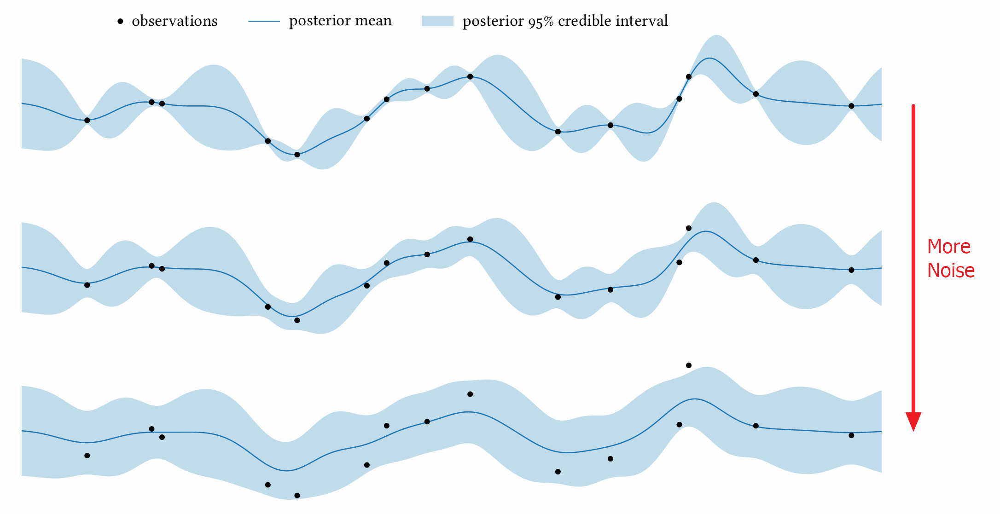
      - heteroskedastic : $`\mathbf{N} = \text{diag}(\sigma_n^2 (\mathbf{x}))`$   
        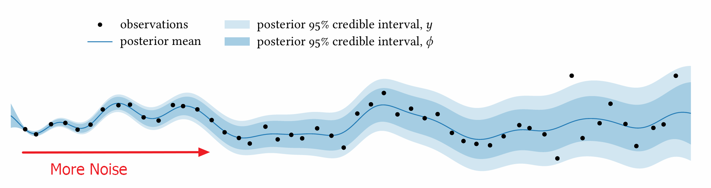
      - Non-Diagonal Case
        - Easiest way is to recognize that the noisy observation process $`y=\phi+\epsilon`$ as a function of $`x`$.
          - $`C(x,x') = \text{cov}[y,y'\mid x,x'] = K(x,x')+N(x,x')`$
            - where $`N(x,x')=\text{cov}[\epsilon,\epsilon'\mid x,x']`$
          - GP Posterior will be   
            $`\begin{cases}
              \mathbb{E}[y\mid x,\mathcal{D}] &= \mu(x)+C(x,\mathbf{x})(\Sigma+\mathbf{N})^{-1}(\mathbf{y}-\boldsymbol{\mu}) \\
              \text{cov}[y,y'\mid x,x',\mathcal{D}] &= C(x,x')-C(x,\mathbf{x})(\Sigma+\mathbf{N})C(\mathbf{x},x')
            \end{cases}`$
  - GP Prior 
    - $`p(\mathbf{y}\mid\mathbf{x,N}) = \mathcal{N}(\mathbf{y};\boldsymbol{\mu},\Sigma+\mathbf{N})`$
      - the cross-covariance is $`\kappa(x) = \text{cov}[\mathbf{y},\phi\mid\mathbf{x},x] = K(\mathbf{x},x)`$
        - Why?) $`\text{cov}[\boldsymbol{\phi},\boldsymbol{\epsilon}] = 0`$
  - GP Posterior
    - $`\mu_\mathcal{D} = \mu(x) + K(\mathbf{x},x)(\Sigma+\mathbf{N})^{-1}(\mathbf{y}-\boldsymbol{\mu})`$
    - $`K_\mathcal{D}(x,x') = K(x,x')-K(x,\mathbf{x})(\Sigma + \mathbf{N})^{-1}K(\mathbf{x},x')`$

 

### Concept) Joint Gaussian Process on Combined Functions
- Def.)
  - Settings)
    - $`\left\{ f_i: \mathcal{X}_i\rightarrow\mathbb{R} \right\}`$ : a set of functions we wish to model
    - $`\mathcal{X} = \sqcup \mathcal{X}_i`$ : the disjoint union of the domains of the functions $`f_i`$
      - cf.) Disjoint : $`\nexists x\text{ s.t. } x\in X_i \wedge x\in X_j, i\ne j`$
    - $`\sqcup f`$ : the disjoint union of the functions $`f_i`$
      - i.e.)
        - $`\sqcup f : \mathcal{X}\rightarrow \mathbb{R}`$
  - Then the GP on $`\sqcup f`$ can be defined as
    - $`p(\sqcup f) = \mathcal{GP}(\sqcup f; \mu, K)`$ : AKA joint Gaussian Process
- e.g.) Two Function Case
  - Settings)
    - Let $`f,g`$ be disjoint functions s.t.
      - $`f:\mathcal{F}\rightarrow\mathbb{R}`$
      - $`g:\mathcal{G}\rightarrow\mathbb{R}`$
    - Consider two vectors $`\mathbf{x,x'}`$ in each domain
      - $`\mathbf{x} \subset \mathcal{F}`$
      - $`\mathbf{x'} \subset \mathcal{G}`$
    - Define corresponding evaluations on those vectors as
      - $`\boldsymbol{\phi} = f(\mathbf{x})`$
      - $`\boldsymbol{\gamma} = g(\mathbf{x'})`$
    - The GP of $`f,g`$ can be defined as
      - $`p(f) = \mathcal{GP}(f;\mu_f,K_f)`$
        - where
          - $`\mu_f \equiv \mu\vert_\mathcal{F}`$
          - $`K_f \equiv K\vert_{\mathcal{F}\times\mathcal{F}}`$
      - $`p(g) = \mathcal{GP}(g;\mu_g,K_g)`$
        - where
          - $`\mu_g \equiv \mu\vert_\mathcal{G}`$
          - $`K_g \equiv K\vert_{\mathcal{G}\times\mathcal{G}}`$
    - Let their cross-covariances be
      - $`K_{fg} \equiv K\vert_{\mathcal{F}\times\mathcal{G}}`$
      - $`K_{gf} \equiv K\vert_{\mathcal{G}\times\mathcal{F}}`$
    - Then the cross-covariances on the vectors $`\mathbf{x,x'}`$ will be
      - $`K_{fg}(\mathbf{x,x'}) = \text{cov}[\boldsymbol{\phi,\gamma}\mid \mathbf{x,x'}]`$
      - $`K_{gf}(\mathbf{x,x'}) = \text{cov}[\boldsymbol{\gamma,\phi}\mid \mathbf{x,x'}] = K_{fg}(\mathbf{x,x'})^\top`$
  - Joint Gaussian Process can be written as   
    $`p(f,g) = \mathcal{GP}\left(\begin{bmatrix} f\\g \end{bmatrix} ; \begin{bmatrix} \mu_f \\ \mu_g \end{bmatrix} , \begin{bmatrix} K_f & K_{fg} \\ K_{gf} & K_g \end{bmatrix}\right)`$
    - Intuition)
      - This allows us to condition a joint GP on observations of jointly Gaussian distributed values following the procedure outlined previously.   
        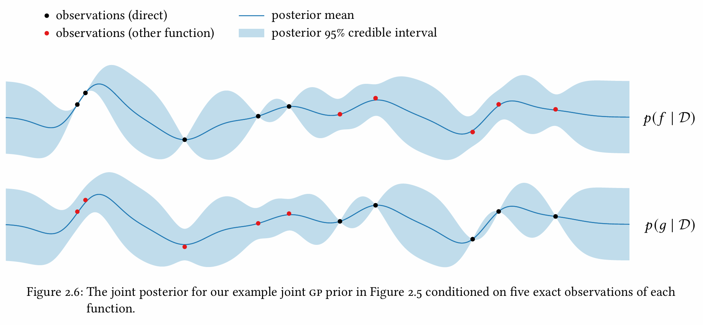
  - e.g.) A strongly correlated function case
    - Suppose we set $`K_{fg}(x,x') = 0.9 K(x,x')`$
      - where $`K = K_f = K_g`$ is the marginal covariance function of $`f,g`$.
    - Then the correlation of the corresponding function values goes strong.
      - $`\text{corr}[\phi,\gamma\mid x] = 0.9`$
        - where $`\phi = f(x), \gamma=g(x)`$   
          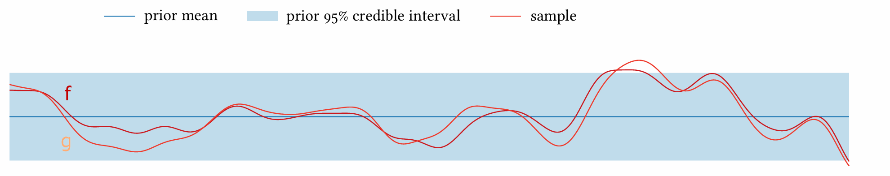

 

### Concept) Sample Path
- Def.)
  - A sample path of a Gaussian process is a single realization of a function drawn from the process.
- e.g.)   
  
  - $`f,g`$ are sample paths respectively.

 

### Concept) Sample Path Continuity
- Problem)
  - Recall that GP is completely specified by its mean and covariance.
  - And, the [sample path](#concept-sample-path) was a single realized sample function drawn from that GP.
  - Then, how can we guarantee that the sample path is continuous?
- Def.) Sample Path Continuity
  - A function $`f:\mathcal{X}\rightarrow\mathbb{R}`$ with distribution $`\mathcal{GP}(f;\mu,K)`$ is simultaneously continuous at $`\forall x\in\mathcal{X}`$ with the probability of 1.
- Prop.)
  - If the [continuity in Mean Square](#concept-continuity-in-mean-square) is satisfied, the sample path converges in probability.
    - However, this does not guarantee the **sample path continuity**.
  - Under the following conditions on the moments of GP, the **sample path continuity** if guaranteed.
    - Thm.) Alder and Taylor's Theorem 1.4.1   
      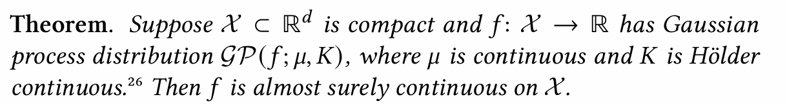

#### Concept) Continuity in Mean Square
- Def.)
  - Let
    - $`f:\mathcal{X}\rightarrow\mathbb{R}`$ has distribution $`\mathcal{GP}(f;\mu,K)`$.
    - $`\exists x,x' \in\mathcal{X}`$ s.t. $`\phi = f(x), \phi' = f(x')`$
  - Then we have
    - $`p(\phi-\phi'\mid x,x') = \mathcal{N}(\phi-\phi';m,s^2)`$
      - where
        - $`m = \mu(x) - \mu(x')`$
        - $`s^2 = K(x,x) -2K(x,x') + K(x',x')`$
  - If $`x=x' \Rightarrow m\rightarrow0, s^2\rightarrow 0`$, then we say $`p(f)`$ is continuous in mean square.

 

#### Concept) Differentiability in Mean Square
- Def.)
  - Let
    - $`f:\mathcal{X}\rightarrow\mathbb{R}`$ has distribution $`\mathcal{GP}(f;\mu,K)`$.
      - where $`\mathcal{X}\subset\mathbb{R}^d`$
    - $`\exists \mathbf{x,x}' \in\mathcal{X}`$
    - $`\displaystyle\frac{\partial f}{\partial x_i}(\mathbf{x}) = \lim_{h\rightarrow0}\frac{f(\mathbf{x} + h \mathbf{e}_i) - f(\mathbf{x})}{h}`$ : the $`i`$-th partial derivative of $`f`$ at $`\mathbf{x}`$
      - where $`\mathbf{e}_i`$ is the $`i`$th standard basis vector
  - $`f`$ is said to be differentiable in mean square at $`\mathbf{x}`$ if the following holds for each coordinate $`1\le i\le d`$:   
    $`\displaystyle p\left(\frac{\partial f}{\partial x_i}(\mathbf{x}) \mid \mathbf{x}\right) = \mathcal{N}\left( \frac{\partial f}{\partial x_i}(\mathbf{x}); \frac{\partial \mu}{\partial x_i}(\mathbf{x}), \frac{\partial^2 K}{\partial x_i \partial x_i'}(\mathbf{x}, \mathbf{x}) \right)`$
  - The GP of $`\mathcal{GP}(f;\mu,K)`$ is said to be differentiable in mean square if $`f`$ is differentiable in mean square at $`\forall\mathbf{x}\in\mathcal{X}`$
- Prop.)
  - If GP is differentiable in mean square, we may get a joint GP between $`f`$ and its gradient $`\nabla f`$ as:
    - $`p(f,\nabla f) = \mathcal{GP}\left(\begin{bmatrix} f\\\nabla f \end{bmatrix}; \begin{bmatrix} \mu\\\nabla\mu \end{bmatrix}, \begin{bmatrix} K&K\nabla^\top \\ \nabla K & \nabla K \nabla^\top \end{bmatrix}\right)`$
      - where
        - $`\nabla K:\mathcal{X}\times\mathcal{X}\rightarrow\mathbb{R}^d`$ : the covariance between $`\nabla f(\mathbf{x})`$ and $`f(\mathbf{x}')`$ 
          - i.e.) the pairs of points to column vectors
            - $`\displaystyle \left[ \nabla K (\mathbf{x},\mathbf{x}') \right]_i = \text{cov} \left[ \frac{\partial f}{\partial x_i}(\mathbf{x}), f(\mathbf{x}') \mid \mathbf{x},\mathbf{x}' \right] = \frac{\partial K}{\partial x_i}(\mathbf{x},\mathbf{x}')`$
        - $`K\nabla^\top:\mathcal{X}\times\mathcal{X}\rightarrow\mathbb{R}^d`$ : the transposed covariance between $`f(\mathbf{x})`$  and $`\nabla f(\mathbf{x}')`$
          - i.e.) the pairs of points to row vectors
            - $`\displaystyle  K \nabla^\top(\mathbf{x},\mathbf{x}') =  \left[ \nabla K (\mathbf{x}',\mathbf{x}) \right]^\top`$
        - $`\nabla K \nabla^\top`$ is the covariance between $`\nabla f(\mathbf{x})`$ and $`\nabla f(\mathbf{x}')`$
          - i.e.) the pairs of points to elements
            - $`\displaystyle \left[ \nabla K \nabla^\top (\mathbf{x},\mathbf{x}') \right]_{ij} = \text{cov}\left[ \frac{\partial f}{\partial x_i}(\mathbf{x}), \frac{\partial f}{\partial x_j'}(\mathbf{x}') \mid \mathbf{x},\mathbf{x}'  \right] = \frac{\partial^2 K}{\partial x_i \partial x_j'}(\mathbf{x},\mathbf{x}')`$

### Concept) Sample Path Differentiability
- Desc.)
  - We can reduce the question of continuous differentiability to [sample path continuity](#concept-sample-path-continuity) of the [joint GP of the funcion and its gradient](#concept-differentiability-in-mean-square).
- Prop.)
  - The posterior mean of the **derivative** vanishes at critical points of the posterior mean of the **function**.   
    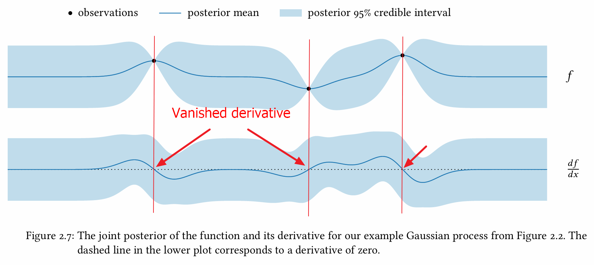
  - Adding an observation immediately next to a previous one significantly reduces the uncertainty in the derivative in that region by effectively providing a finite-difference approximation   
    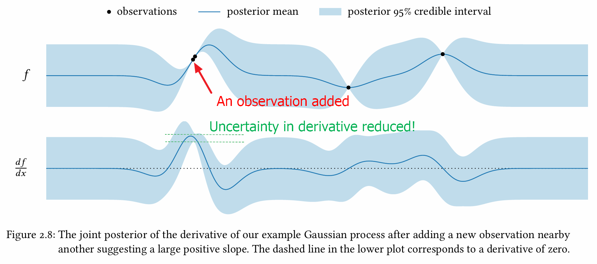
  - Conditioning directly on an exact observation of the derivative removes the uncertainty in the derivative entirely.   
    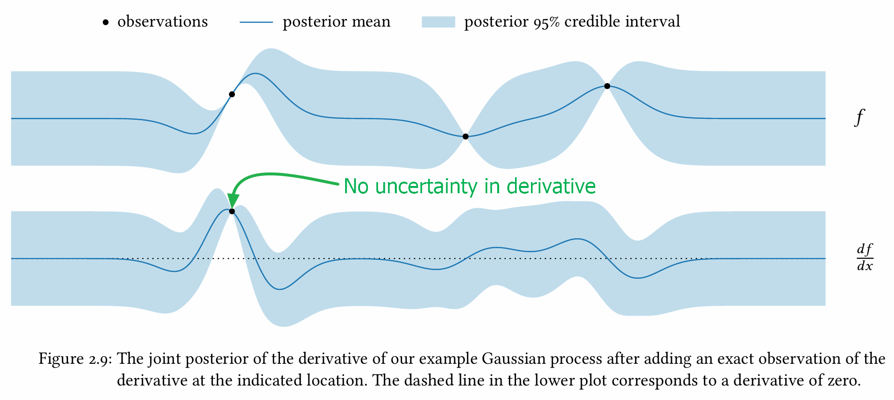
    - i.e.) the seamless incorporation of derivative information into an objective function model

 

### Concept) Bayesian Quadrature
- AKA Bayesian Monte Carlo
- Desc.)
  - Recall that Monte Carlo goes $`Z\approx \displaystyle\frac{1}{n}\sum_{i=1}^n f(x_i), \; x_i\sim p_i`$
  - This is just a point estimate.
  - Instead, if we may use the posterior uncertainty of $`Z`$ in Baysian method.
    - How?)
      - Suppose $`p(f) = \mathcal{GP}(f;\mu,K)`$ is the GP of $`f`$.
      - The expectation can be denoted as $`Z=\displaystyle\int f(x)p(x) dx`$.
      - What if we have a joint GP over $`f,Z`$.
        - i.e.) $`p(f,Z) = \mathcal{GP}\left( \begin{bmatrix} f \\ Z \end{bmatrix}; \begin{bmatrix} \mu \\ \mu_Z \end{bmatrix}, \begin{bmatrix} K & K_{fZ} \\ K_{Zf} & K_Z \end{bmatrix} \right)`$

 

### Concept) Global Maximum of GP
- Question)
  - [Existence](#concept-existence-of-the-global-maximum-in-gp)
    - i.e.) Does GP guarnagees the existence of the global maximum?
  - [Uniqueness](#concept-uniqueness-of-the-global-maximum-in-gp)
    - i.e.) If it does, is the maximum unique?
- Answer)
  - Under some conditions, yes.

 

#### Concept) Existence of the Global Maximum in GP
- Assumption)
  - The domain $`\mathcal{X}`$ is compact.
- Idea)
  - If $`f`$ is continuous (i.e. [sample path continuity](#concept-sample-path-continuity)), then it achieves a **global optimum** by the extreme value theorem.
    - cf.) W. Rudin, Principles of Mathematical Analysis, theorem 4.16

#### Concept) Uniqueness of the Global Maximum in GP
- Theorem 1) Kim and Pollard 1990, Cube Root Asymptotics
  - Let $`\mathcal{X}`$ be a compact metric space.
  - Suppose $`f:\mathcal{X}\rightarrow\mathbb{R}`$ has distribution $`\mathcal{GP}(f;\mu\equiv0, K)`$.
    - i.e.) **Centered Gauusian Process** of $`\mu\equiv0`$
  - Also, assume that $`f`$ is [sample path continuous](#concept-sample-path-continuity).
  - If $`\text{var}[\phi-\phi'\mid x,x'] = K(x,x) - 2K(x,x') + K(x'x') \ne 0`$
    - where $`\forall x,x'\in\mathcal{X}`$ with $`x\ne x'`$
  - Then $`f`$ almost surely has a unique maximum on $`\mathcal{X}`$
    - cf.) If $`\mathcal{X}`$ is $`\sigma`$-compact, $`f`$'s supremum is unique
- Theorem 2) Arcones 1992, On the arg max of a Gaussian Process, Statistics & Probability Letters p373-374

  

## Concept) Non-Gaussian Observations and Constraints
- Situation)
  - What if the observation is non-Gaussian?
    - e.g.) 
      - Observations corrupted by Student-t errors with $`\nu=4`$ degrees of freedom.   
        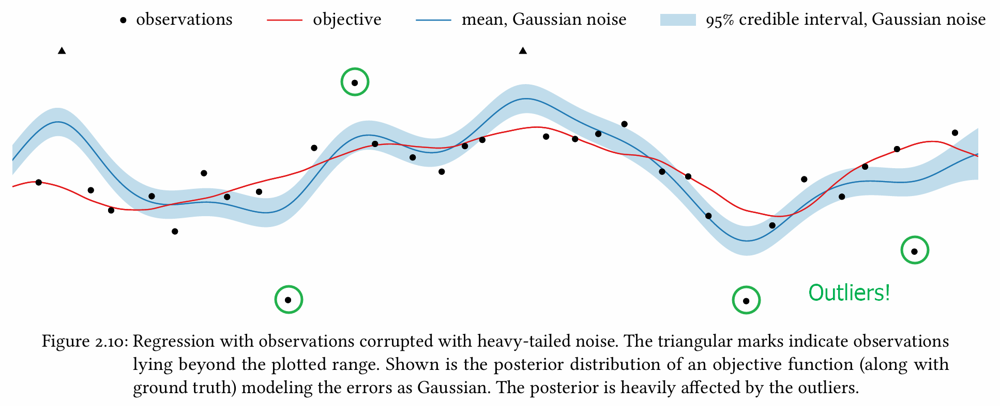
        - Recall that Student-t distribution with high degrees of freedom has fatter tails compared to the Gaussian.
    - Problem)
      - When data do not obey Gaussian assumptions, we can't use standard GP inference, because posterior updates become analytically intractable.
    - Sol.)
      - [Monte Carlo Sampling](#concept-monte-carlo-sampling)
  - What if the given constraint cannot be handled in the closed form?
    - e.g.)
      - Suppose we know that our function of interest has a local optimum at $`x'`$.
      - This means that $`f'(x') = 0, f''(x) \lt 0`$.
      - This first condition of $`f'(x') = 0`$ can be modeled as a point observation.
      - However, the second condition is a constraint with the sign, not the exact value.
      - Thus, we cannot compute the posterior of this in closed form.
    - Problem)
      - If we cannot compute the posterior of certain information in a closed form, how do we setup the GP on this?
    - Sol.)
      - [Gaussian Approximate Inference](#concept-gaussian-approximate-inference)
- Sol.)
  - Framework Approach
    - [Factorization](#concept-factorization)
  - How to get the posterior $`p(\mathbf{y}\mid\mathcal{D})`$
    - [Monte Carlo Sampling](#concept-monte-carlo-sampling)
    - [Gaussian Approximate Inference](#concept-gaussian-approximate-inference)

### Concept) Factorization
- Desc.)
  - This provides the framework for doing approximate inferences like [Monte Carlo Sampling](#concept-monte-carlo-sampling) and [Gaussian Approximate Inference](#concept-gaussian-approximate-inference)
- Settings)
  - $`f`$ : a function of interest
  - $`\mathbf{y}`$ : some information we received int the form of $`\mathcal{D}`$
    - where $`\mathcal{D}`$ includes non-Gaussian posterior on $`\mathbf{y}`$
      - e.g.) $`f''(x'')\lt 0`$
- Derivation)
  - We may setup the joint GP distribution of $`f`$ as   
    $`p(f,\mathbf{y}) = \mathcal{GP}\left(\begin{bmatrix} f\\\mathbf{y}  \end{bmatrix}; \begin{bmatrix} \mu\\\mathbf{m}  \end{bmatrix}, \begin{bmatrix} K&\kappa^\top \\ \kappa & \mathbf{C} \end{bmatrix}\right)`$
  - Our target is to get the posterior of $`f`$ as   
    $`p(f\mid\mathcal{D}) = \displaystyle\int p(f\mid \mathbf{y})p(\mathbf{y}\mid\mathcal{D}) d\mathbf{y}`$
  - Since we assumed that $`p(f,\mathbf{y})`$ is Gaussian, the conditional distribution of $`p(f\mid\mathbf{y})`$ is also Gaussian.
  - However, the posterior of $`\mathbf{y}`$, which is $`p(\mathbf{y})\mid\mathcal{D}`$ is not in the closed form.
- Solution)
  - What if we adopt the factor graph as   
    $`\begin{array}{rccc}
      p(\mathbf{y}\mid\mathcal{D}) \varpropto & \underbrace{p(\mathbf{y})}_{\text{GP Prior}} & \cdot & \underbrace{t(\mathbf{y})}_{\text{non-Gaussian Constraints}} \\
      = & \overbrace{\mathcal{N}(\mathbf{y;m,C})} & \cdot & \overbrace{\displaystyle\prod_i t_i(\mathbf{y})}
    \end{array}`$
    - where 
      - the function $`t(\mathbf{y})`$ encodes the available information.
      - $`\{t_i\}`$ : factors or local functions
- Limit)
  - $`t(\mathbf{y})`$ is just a hypothetical approach.
  - We still do not know what $`p(\mathbf{y}\mid\mathcal{D})`$ looks like.
    - Sol.)
      - [Monte Carlo Sampling](#concept-monte-carlo-sampling) 
      - [Gaussian Approximate Inference](#concept-gaussian-approximate-inference)

 

### Concept) Monte Carlo Sampling
- Idea)
  - Get $`p(\mathbf{y}\mid\mathcal{D})`$ by sampling $`\mathbf{y}`$ into $`\{\mathbf{y}_i\}`$
- Desc.)
  - We want to sample from the $`p(\mathbf{y}\mid\mathcal{D})`$, i.e. the $`\mathbf{y}`$ posterior
    - i.e.) $`\{y_i\}_{i=1}^s \sim p(\mathbf{y}\mid\mathcal{D})`$
      - where $`p(\mathbf{y}\mid\mathcal{D}) \varpropto \mathcal{N}(\mathbf{y;m,C}) \cdot \displaystyle\prod_i t_i(\mathbf{y})`$
    - How?)
      - We may use Monte Carlo (MCMC) routines.   
        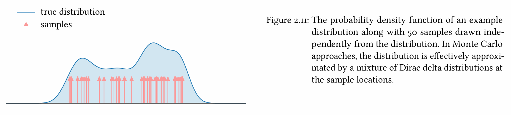
        - e.g.) elliptical slice sampling
          - Specifically tailored for latent Gaussian models
  - Then, using $`\{y_i\}_{i=1}^s`$ we sampled, we may approximate as   
    $`\begin{aligned}
      p(f\mid\mathcal{D}) &\approx \displaystyle\frac{1}{s}\sum_{i=1}^s p(f\mid\underbrace{\mathbf{y}_i}_{\text{samples!}}) \\ 
      &= \frac{1}{s}\sum_{i=1}^s \mathcal{GP}(f;\mu_{\mathcal{D}_i}, K_\mathcal{D})
    \end{aligned}`$
    - Result)
      - We have the Gaussian mixture in the closed form.
      - $`p(\mathbf{y}\mid\mathcal{D})`$ implicitly resides in the equation above as the samples $`\mathbf{y}_i`$
- Analysis)
  - Let $`\phi`$ be a function value of $`f`$ at $`x`$.
    - i.e.) $`\phi = f(x)`$
  - Then, we have   
    $`p(\phi\mid x,\mathcal{D}) \approx \displaystyle\frac{1}{s}\sum_{i=1}^s \mathcal{N}(\phi; \mu_{\mathcal{D}_i}(x), \sigma^2)`$ 
    - where $`\sigma^2 = K_\mathcal{D}(x,x)`$
  - The posterior mean functions $`\mu_{\mathcal{D}_i}(x)`$ depend on the corresponding $`\mathbf{y}`$ samples. 
  - The posterior covariance functions are identical to $`\sigma^2 = K_\mathcal{D}(x,x)`$ .
    - Why?) Due to the prop. of the conditional GP, the covariance is independent of individual sample $`\mathbf{y}_i`$ 
- e.g.)
  - Previous Student-t Distribution with the df 4.   
    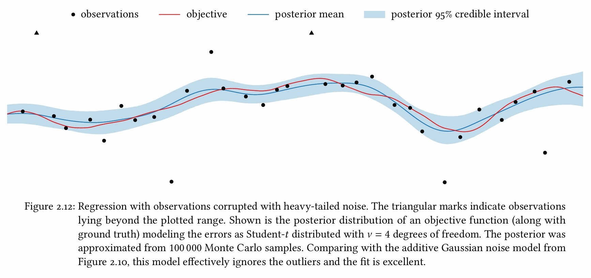

 

### Concept) Gaussian Approximate Inference
- Idea)
  - Approximate $`p(\mathbf{y}\mid\mathcal{D})`$ into $`q(\mathbf{y}\mid\mathcal{D})`$ using specific methods.
- Notation)
  - $`q(\mathbf{y}\mid\mathcal{D}) = \mathcal{N}(\mathbf{y;\tilde{m}, \tilde{C}})`$ : the approxmiation of $`p(\mathbf{y}\mid\mathcal{D})`$
    - i.e.) $`p(\mathbf{y}\mid\mathcal{D}) \approx q(\mathbf{y}\mid\mathcal{D}) = \mathcal{N}(\mathbf{y;\tilde{m}, \tilde{C}})`$
- How to get $`q(\mathbf{y}\mid\mathcal{D})`$
  - Laplace Approximation
  - Gaussian Expectation Propagation
  - Variational Inference
- Derivation)
  - Using the $`q(\mathbf{y}\mid\mathcal{D})`$ we approximated, we have   
    $`\begin{aligned}
      p(f\mid\mathcal{D}) &= \int p(f\mid\mathbf{y}) q(\mathbf{y}\mid\mathcal{D}) d\mathbf{y} \\
      &= \mathcal{GP}(f; \mu_\mathcal{D}, K_\mathcal{D})
    \end{aligned}`$
    - where $`\begin{cases} \mu_\mathcal{D}(x) &= \mu(x) + \kappa(x)^\top \mathbf{C}^{-1} (\mathbf{\tilde{m}- m}) \\ K_\mathcal{D}(x,x') &= K(x,x') - \kappa(x)^\top \mathbf{C^{-1} (C-\tilde{C}) C^{-1}} \kappa(x') \end{cases}`$
      - For most approximation schemes, we have   
        $`\mathbf{\tilde{C} = C - C(C+N)^{-1} C}`$ where $`\mathbf{N}`$ is positive definite.
      - Thus, the posterior covariance becomes the additive noise case of   
        $`K_\mathcal{D}(x,x') = K(x,x') - \kappa(x)^\top \mathbf{(C+N)^{-1}} \kappa(x')`$
- e.g.) [Local optimum case above](#concept-non-gaussian-observations-and-constraints) $`f'' \lt 0`$
  - Put $`h=f''(x)`$
    - s.t. $`p(h) = \mathcal{N}(h; m, s^2)`$
  - We want to incorporate the factor of $`[h\lt0]`$
    - i.e.) $`p(h\mid\mathcal{D}) \varpropto p(h)[h\lt0]`$
  - Using the Gaussian expectation propagation we may approximate this as   
    $`p(h\mid\mathcal{D}) \approx q(h\mid\mathcal{D}) = \mathcal{N}(h;\tilde{m}, \tilde{s}^2)`$   
    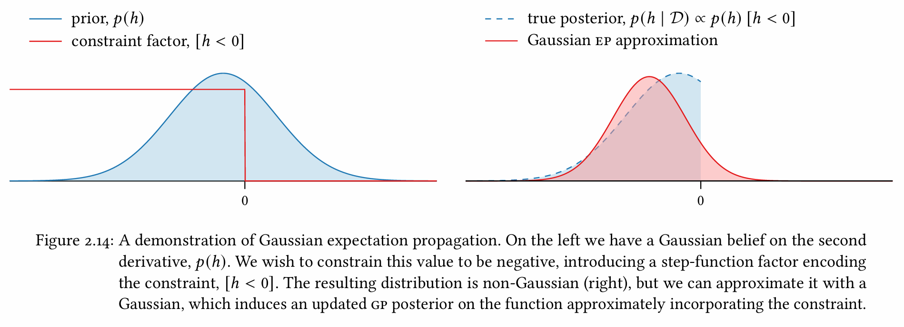
  - We may reflect our belief on $`f''`$ approximated as $`q(h\mid\mathcal{D})`$ into the GP.   
    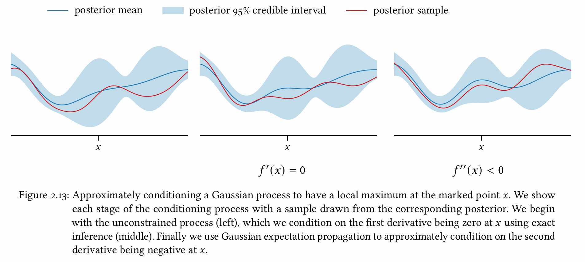

 

### References
- Rasmussen and Williams, *Gaussian Process for Machine Learning*
- Adler and Taylor, *Random Fields and Geometry*

  

[Back to Main](../main.md)