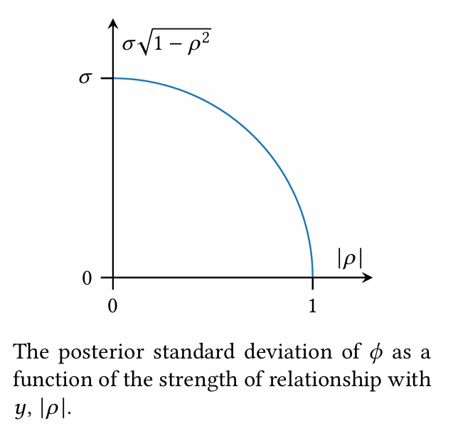

[Back to Main](../main.md)

# 2. Gaussian Process

### Concept) Gaussian Process
- Def.)
  - An extension of the familiar multivariate normal distribution suitable for modeling functions on infinite domains
  - Let
    - $`f:\mathcal{X}\rightarrow\mathbb{R}`$ : an objective function of interest over an arbitrary infinite domain $`\mathcal{X}`$
  - Then a Gaussian Process on $`f`$ can be defined as
    - $`p(f) = \mathcal{GP}(f;\mu,K)`$
      - where
        - $`\mu:\mathcal{X}\rightarrow\mathbb{R}`$ is a mean function
          - i.e.) $`\mu(x) = \mathbb{E}[\phi\mid x],\;\forall x\in\mathcal{X}`$
        - $`K:\mathcal{X}\times\mathcal{X}\rightarrow\mathbb{R}`$ is a covariance(kernel) function
          - i.e.) $`K(x,x') = \text{cov}[\phi,\phi'\mid x,x'],\; \forall x,x'\in\mathcal{X}`$

#### e.g.) Finite-Dimensional Marginal Distribution
  - Let
    - $`\mathbf{x}=\begin{bmatrix}x_1,\cdots,x_n\end{bmatrix}\subset\mathcal{X}`$
    - $`\boldsymbol{\phi} = f(\mathbf{x})\subset\mathcal{Y}`$
  - Then the distribution of $`\boldsymbol{\phi}`$ can be denoted using GP as
    - $`p(\boldsymbol{\phi}\mid \mathbf{x}) = \mathcal{N}(\boldsymbol{\phi};\boldsymbol{\mu},\Sigma)`$
      - where
        - $`\boldsymbol{\mu} = \mathbb{E}[\boldsymbol{\phi}\mid\mathbf{x}] = \mu(\mathbf{x})`$
        - $`\Sigma = \text{cov}[\boldsymbol{\phi}\mid\mathbf{x}] = K(\mathbf{x,x})`$
          - where $`\Sigma_{ij} = K(x_i,x_j)`$ i.e. the Gram matrix of $`\mathbf{x}`$

#### Concept) Jointly Gaussian Observation
- Situation)
  - Suppose we observed some points $`\mathcal{D} = (\mathbf{x}, \mathbf{y})`$.
  - How do we condition a GP on theses observations?
- Settings)
  - $`p(f) = \mathcal{GP}(f;\mu,K)`$ : a GP
  - $`\mathbf{y}`$ : the observed values s.t. $`p(\mathbf{y})\sim\mathcal{N}(\mathbf{y};\mathbf{m,C})`$
  - $`\kappa(x) = \text{cov}[\mathbf{y},\phi\mid x]`$ : the cross covariance function between $`f`$ and $`\mathbf{y}`$
- Then the joint Gaussian distribution of $`f`$ and $`\mathbf{y}`$ can be denoted as
  - $`p(f,\mathbf{y}) = \mathcal{GP}\left(\begin{bmatrix} f\\ \mathbf{y} \end{bmatrix}; \begin{bmatrix} \mu\\\mathbf{m} \end{bmatrix}, \begin{bmatrix} K&\kappa^\top \\ \kappa&\mathbf{C} \end{bmatrix}\right)`$
    - AKA the [GP Prior](#concept-gp-prior)
- Using the joint distribution above, we may derive the [GP posterior](#concept-gp-posterior) on $`f`$ as
  - Putting $`\mathcal{D}=\mathbf{y}`$ we have
    - $`p(f\mid\mathcal{D}) = \mathcal{GP(f;\mu_\mathcal{D},K_\mathcal{D})}`$
      - where
        - $`\mu_\mathcal{D}(x) = \mu(x) + \kappa(x)^\top \mathbf{C}^{-1} (\mathbf{y-m})`$
        - $`K_\mathcal{D}(x,x') = K(x,x')-\kappa(x)^\top \mathbf{C}^{-1}\kappa(x')`$

#### Concept) GP Prior
- Def.)   
  $`p(f,\mathbf{y}) = \mathcal{GP}\left(\begin{bmatrix} f\\ \mathbf{y} \end{bmatrix}; \begin{bmatrix} \mu\\\mathbf{m} \end{bmatrix}, \begin{bmatrix} K&\kappa^\top \\ \kappa&\mathbf{C} \end{bmatrix}\right)`$
  - Refer to the [jointly Gaussian observation above](#concept-jointly-gaussian-observation).

#### Concept) GP Posterior
- Def.)   
  - $`p(f\mid\mathcal{D}) = \mathcal{GP(f;\mu_\mathcal{D},K_\mathcal{D})}`$
    - where
      - $`\mathcal{D}=\mathbf{y}`$
      - $`\mu_\mathcal{D}(x) = \mu(x) + \kappa(x)^\top \mathbf{C}^{-1} (\mathbf{y-m})`$
      - $`K_\mathcal{D}(x,x') = K(x,x')-\kappa(x)^\top \mathbf{C}^{-1}\kappa(x')`$
  - Refer to the [jointly Gaussian observation above](#concept-jointly-gaussian-observation).

 

### Concept) Corruption by Additive Gaussian Noise
- Desc.)
  - Adding observation error $`\boldsymbol{\epsilon}`$ to $`\mathbf{y}`$
- Def.)
  - Observation Error
    - $`p(\boldsymbol{\epsilon}\mid\mathbf{N}) = \mathcal{N}(\boldsymbol{\epsilon};\mathbf{0,N})`$ or $`\boldsymbol{\epsilon}\sim\mathcal{N}(0,\mathbf{N})`$ 
      - s.t. $`\boldsymbol{\epsilon}`$ is independent of $`\mathbf{y}`$
        - i.e.) $`\text{cov}[\boldsymbol{\epsilon}, \mathbf{y}] = 0`$
  - Observation
    - $`\mathbf{z} = \mathbf{y}+\boldsymbol{\epsilon}`$
- Prop.)
  - $`p(\mathbf{z}\mid\mathbf{N}) = \mathcal{N}(\mathbf{z;m,C+N})`$
    - why $`\text{var}[\mathbf{z}] = \mathbf{C+N}`$?
      - $`\text{cov}[\boldsymbol{\epsilon}, \mathbf{y}] = 0`$
  - $`\begin{aligned}
    \text{cov}[\mathbf{z},\phi\mid x] &= \text{cov}[\mathbf{y},\phi\mid x] & \because\text{cov}[\boldsymbol{\epsilon}, \mathbf{y}] = 0 \\
    &= \kappa(x)
  \end{aligned}`$
- Meaning)
  - Although the observation is corrupted by the error, we can simply replace the variance $`\mathbf{C}`$ with $`\mathbf{C+N}`$
    - i.e.)   
      $`\begin{cases}
        \text{Prior : } & p(f,\mathbf{y}) = \mathcal{GP}\left(\begin{bmatrix} f\\ \mathbf{y} \end{bmatrix}; \begin{bmatrix} \mu\\\mathbf{m} \end{bmatrix}, \begin{bmatrix} K&\kappa^\top \\ \kappa&\mathbf{C+N} \end{bmatrix}\right) \\
        \text{Posterior : } & \begin{cases}
          \mu_\mathcal{D}(x) = \mu(x) + \kappa(x)^\top \mathbf{(C+N)}^{-1} (\mathbf{y-m}) \\
          K_\mathcal{D}(x,x') = K(x,x')-\kappa(x)^\top \mathbf{(C+N)}^{-1}\kappa(x')
        \end{cases}
      \end{cases}`$

 

### Analysis) The Effect of Observation on GP Posterior
- Intuitions)
  1. Independent observations do not affect the posterior mean.
  2. Dependent observations affect the posterior mean the more when its **surprising**.
  3. The variance of the posterior is dependent on the correlation between the observation $`y`$ and the model $`\phi`$, not the individual observed value of $`y`$. 
     - And, the greater the correlation, smaller the posterior variance.
       - i.e.) Reduction of uncertainty
- Settings for Pf.)
  - Consider a single point (scalar) observation $`y\in\mathcal{Y}`$.
    - s.t. $`\mathcal{N}(y;m,s^2)`$
  - Let 
    - $`\phi`$ be the function value with the [prior distribution](#concept-gp-prior) of $`\mathcal{N}(\phi;\mu,\sigma^2)`$.
    - $`z = \displaystyle\frac{y-m}{s}`$ be the $`z`$-score of $`y`$.
    - $`\begin{aligned}
      \rho = \text{corr}[y,\phi\mid x] &= \displaystyle\frac{\text{cov}[y,\phi]}{\sqrt{\text{var}[y]}\sqrt{\text{var}[\phi]}} \\
      &= \displaystyle\frac{\kappa(x)}{\sigma\cdot s}
    \end{aligned}`$
  - Then, we may get the posterior distribution of $`\phi`$ as   
    - Posterior Mean $`\mu_y`$   
      $`\begin{aligned}
        \mu_{y} &= \mu + \kappa(x) \cdot \displaystyle\frac{1}{s^2} \cdot (y-m) & (\because \mu_\mathcal{D}(x) = \mu(x) + \kappa(x)^\top \mathbf{(C+N)}^{-1} (\mathbf{y-m})) \\
        &= \mu + \displaystyle\frac{\kappa(x)}{s} \cdot \frac{y-m}{s} \\
        &= \mu + \sigma\rho\cdot z
      \end{aligned}`$   
    - Posterior Variance $`\sigma_y^2`$   
      $`\begin{aligned}
        \sigma_y^2 &= \sigma^2 -\kappa(x)^2\cdot \displaystyle\frac{1}{s^2} & (\because K_\mathcal{D}(x,x') = K(x,x')-\kappa(x)^\top \mathbf{(C+N)}^{-1}\kappa(x')) \\
        &= \sigma^2 - (\sigma\rho)^2 \\
        &= \sigma^2(1-\rho^2)
      \end{aligned}`$
- Pfs.)
  1. Consider that $`\mu_{y} = \mu + \sigma\rho  z`$
     - If $`y`$ is independent of $`\phi`$, then $`\text{cov}[y,\phi]=0`$.
     - Thus, $`\rho=0 \Rightarrow \mu_y = \mu.`$
     - Therefore, $`y`$ does not affect the posterior mean of $`\phi`$, $`\mu_y`$.
  2. Consider that $`\mu_{y} = \mu + \sigma\rho  z`$
     - Now, $`\rho \ne 0`$.
     - Also, more the $`y`$ is surprising, the higher the $`\vert z \vert`$ will be.
     - Thus, the posterior mean $`\mu_y`$ will change more.
  3. Consider that $`\sigma_y^2 = \sigma^2(1-\rho^2)`$
     - Thus, the individual observation $`y`$ does not directly affect $`\sigma_y^2`$.
     - Also, $`\displaystyle\frac{\partial\sigma_y^2}{\partial\rho} = \frac{\partial (\sigma^2(1-\rho^2))}{\partial\rho} \lt 0`$   
       
- Vectorized Notation
  - $`\mathbf{y}\in\mathcal{Y}^n`$ the $`n`$ observations with $`p(\mathbf{y};\mathbf{m,C})`$.
    - Here, $`\mathbf{C}`$ can be denoted as $`\mathbf{C=SPS}`$
      - where
        - $`\mathbf{S}`$ is a diagonal matrix with $`\mathbf{S}_{ii} = \sqrt{\mathbf{C}_{ii}}`$
        - $`\mathbf{P} = \text{corr}[\mathbf{y}]`$ is the observation correlation matrix.
  - $`\mathbf{z}`$ s.t. $`\mathbf{z}_i = \displaystyle\frac{\mathbf{y}_i-\mathbf{m}_i}{\mathbf{s}_i}`$ : the vector of measurement $`z`$-score
  - $`\boldsymbol{\rho}`$ s.t. $`\boldsymbol{\rho}_i = \displaystyle\frac{[\kappa(x)]_i}{\sigma s_i}`$
  - Then, the posterior can be denoted as
    - Posterior Mean : $`\mu + \sigma\boldsymbol{\rho}^\top \mathbf{P}^{-1}\mathbf{z}`$
    - Posterior Variance : $`\sigma^2 (1-\boldsymbol{\rho}^\top \mathbf{P}^{-1}\boldsymbol{\rho})`$
  - The reduced uncertainty in the posterior in terms of differential entropy goes
    - $`\left\vert K(\mathbf{x},\mathbf{x}) - \kappa(\mathbf{x})\mathbf{C}^{-1} \kappa(\mathbf{x}) \right\vert \le \underbrace{\left\vert K(\mathbf{x},\mathbf{x}) \right\vert}_{\text{Independent Case: } \kappa(\mathbf{x})=0}`$

 

### Concept) 

 

### Concept) 

 

### Concept) 

  

[Back to Main](../main.md)