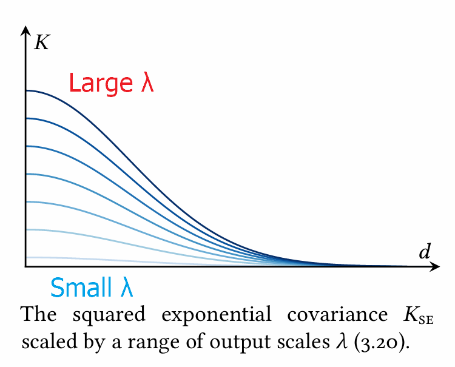

[Back to Main](../main.md)

# 3. Modeling with Gaussian Process

### Concept) Prior Mean Function
- Notation) $`\mu(x)`$
  - $`\mu(x) = \mathbb{E}[\phi\mid x]`$
    - where $`\phi = f(x)`$ is the value of $`f`$ at $`x`$
- Props.)
  - The prior mean function only affects the **marginal distribution** of function values.
    - cf.) The [covariance function](#concept-prior-covariance-function) can modify the **joint distribution** of function values.
      - i.e.) [Sample path](./02.md#concept-sample-path) is determined solely by the [covariance function](#concept-prior-covariance-function).
  - Prior mean influences the posterior process only through the [posterior](./02.md#concept-gp-posterior) mean.
    - Why?)
      - $`\underbrace{\mu_\mathcal{D}(x)}_{\text{posterior}} = \underbrace{\mu(x)}_{\text{prior}} + \kappa(x)^\top \mathbf{C^{-1}(y-m)}`$
        - where 
          - $`\mathbf{y}`$ is an observation vector
          - $`p(\mathbf{y}) = \mathcal{N}(\mathbf{y;m,C})`$
          - $`\kappa(x) = \text{cov}[\mathbf{y},\phi\mid x]`$
      - $`K_\mathcal{D}(x,x') = K(x,x')-\kappa(x)^\top \mathbf{C}^{-1}\kappa(x')`$
        - Not determined by $`\mu(x)`$
    - Interpolation vs Extrapolation   
      
      - Interpolatory Region (Data Dominant)
        - Strong correlation between a given function values and observations
        - $`\mu_\mathcal{D}`$ is determined by $`\mathbf{y}`$, not $`\mu(x)  \quad (\because \Vert\kappa(x)\Vert \gggtr 0)`$
      - Extrapolatory Region (Prior Mean Dominant)
        - Weak correlation between a given function values and observations
        - $`\mu_\mathcal{D} \approx \mu(x) \quad (\because \kappa(x) \approx 0)`$

 

### Concept) Constant Mean Function
- Def.)
  - $`\mu(x;c)\equiv c`$ where $`c\in\mathbb{R}`$
- Prop.)
  - $`c`$ is usually treated as a parameter to be estimated or marginalized.
- Types)
  - [Constant Mean + Gaussian Prior](#concept-constant-mean--gaussian-prior)
  - [Linear Combination of Basis Functions](#concept-linear-combination-of-basis-functions)
  - Custom Prior Knowledge
    - e.q.) [Quadratic Mean using Mahalanobis Distance](#eg-quadratic-mean-using-mahalanobis-distance)

#### Concept) Constant Mean + Gaussian Prior
- Idea)
  - Give the constant mean the Gaussian prior knowledge.
- How?
  - Suppose we have prior on $`c`$ of $`p(c) = \mathcal{N}(c;a,b^2)`$.
  - Then, we can marginalize $`f`$ as   
    $`\begin{aligned}
        p(f) &= \displaystyle\int p(f\mid c) p(c) dc \\
        &= \mathcal{GP}(f;\mu\equiv a, K+b^2)
    \end{aligned}`$
- Advantage)
  - We can avoid estimating $`c`$ and directly use the prior covariance function of $`b^2`$

#### Concept) Linear Combination of Basis Functions
- Idea)
  - Use basis function $`\psi(x)`$ to synthesize more complex structure of the prior mean
    - e.g.) $`\Psi(x) = \begin{bmatrix} x^2 & x & 1 \end{bmatrix} `$
- How?)
  - Let 
    - $`\mu(x;\boldsymbol{\beta}) = \boldsymbol{\beta^\top\psi}(x)`$ : the prior mean function
      - where
        - $`\boldsymbol{\psi}:\mathcal{X}\rightarrow\mathbb{R}^n`$ : the basis function
        - $`\boldsymbol{\beta}\in\mathbb{R}^n`$
          - cf.) $`\boldsymbol{\beta^\top\psi}(x) \in\mathbb{R}`$
    - $`K`$ : an arbitrary prior covariance function
  - Further assume the multivariate normal prior on $`\boldsymbol{\beta}`$ as $`p(\boldsymbol{\beta}) = \mathcal{N}(\boldsymbol{\beta}; \mathbf{a,B})`$
  - Then we can marginalize $`f`$ as $`p(f) = \mathcal{GP}(f;m,C)`$
    - where $`\begin{cases} m(x) = \mathbf{a}^\top\boldsymbol{\psi}(x) \\ C(x,x') = K(x,x') + \boldsymbol{\psi}(x)^\top\mathbf{B}\boldsymbol{\psi}(x') \end{cases}`$
- cf.)
  - $`\boldsymbol{\psi} = 1`$ is the [Constant Mean + Gaussian Prior](#concept-constant-mean--gaussian-prior) case above.

#### e.g.) Quadratic Mean using Mahalanobis Distance
- Desc.)
  - Assume a concave quadratic mean of $`\mu(\mathbf{x; A,b},c) = \mathbf{(x-b)^\top A^{-1} (x-b)} + c`$
    - where $`\mathbf{A\prec0} `$
- Prop.)
  - $`\mu`$ encodes that values near $`\mathbf{b}`$ are expected to be higher than those farther away   
    

 

---

 

### Concept) Prior Covariance Function
- Notation)
  - $`K(x,x') = \text{cov}[\phi, \phi' \mid x,x']`$
    - where $`\begin{cases} \phi = f(x) \\ \phi' = f(x')\end{cases}`$
- Props.)
  - The prior covariance function determines the fundamental properties of [sample path](./02.md#concept-sample-path) behavior, including
      - [continuity](./02.md#concept-sample-path-continuity)
      - [differentiability](./02.md#concept-sample-path-differentiability)
      - [aspects of global optima](./02.md#concept-global-maximum-of-gp)
  - $`K`$ must be 
    - symmetric
    - positive semi definite (PSD).

#### Concept) Correlation between function values  
- Def.)    
  - $`\rho = \text{corr}[\phi, \phi' \mid x,x']  = \displaystyle\frac{K(x,x')}{\sqrt{K(x,x)K(x',x')}}`$
    - where $`K`$ is the [prior covariance function](#concept-prior-covariance-function)
- Props.)
  - $`\rho`$ can be interpreted as the strength of the dependence between $`\phi,\phi'`$

#### Concept) Stationary Covariance Function
- Def.)
  - A covariance function $`K(x,x')`$ is stationary iff $`K`$ only depends on the differnce $`x-x'`$
- Notation)
  - $`K(x-x') \Leftrightarrow K(x,x') = K(x-x',0)`$
- Props.)
  - If a GP is stationary, iff it has a **stationary covariance function** and a [constant mean function](#concept-constant-mean-function)
  - The distribution of any set of functions $`\phi, \phi'`$ is invariant under **translation**.
    - i.e.) The function acts the same everywhere!
    - Thus, the local behavior around a single point suffices to specify the global behavior of the entire function!
      - cf.) Not always valid.
        - e.g.) An objective function may exhibit different behavior near the optimum.

#### Concept) Isotropic Covariance Function
- Def.)
  - A covariance function $`K(x,x')`$ is isotropic iff $`K`$ only depends on the Euclidean distance of $`d = \vert x-x' \vert`$
- Notation)
  - $`K(d)`$
- Props.)
  - Isotropy is more restrictive assumption than [stationarity](#concept-stationary-covariance-function).
    - cf.) Isotropy implies stationarity.
  - Covariance is invariant to **translation** and **rotation**.
    - Thus, the function has identical behavior in every direction from every point.
  - [The Bochner Theorem](#theorem-bochner-1993) enables the **spectral density** to be Fourier transformed into the [stationary covariance function](#concept-stationary-covariance-function).
- Types)
  - [The Matérn Family](#concept-the-matérn-family-covariance-functions)
  - [The Spectral Mixture Covariance](#concept-the-spectral-mixture-covariance)
  - [Linear Covariance Function](#concept-linear-covariance-function)

 

#### Theorem) Bochner, 1993

- Meaning)   
  - The Fourier transform of any [stationary covariance function](#concept-stationary-covariance-function) on $`\mathbb{R}^n`$ is proportional to a probability measure and vice versa.
  - The constant of proportionality is $`K(0)`$
  - $`\nu`$ : the spectral mesure of $`K`$.
  - When a corresponding density function $`\kappa`$ exists, $`\kappa(\boldsymbol{\xi})`$ is called the **spectral density** of $`K`$ and forms a Fourier pair with $`K`$:   
    $`\begin{cases}
        K(\mathbf{x}) &= \displaystyle\int\exp(2\pi i\mathbf{x}^\top \boldsymbol{\xi}) \kappa(\boldsymbol{\xi}) d \boldsymbol{\xi} \\
        \kappa(\boldsymbol{\xi}) &= \displaystyle\int\exp(2\pi i\mathbf{x}^\top \boldsymbol{\xi}) K(\mathbf{x}) d\mathbf{x}
    \end{cases}`$
- Usage)
  - Suppose we found spectral density from a dataset.
  - Then, the Bochner Theorem shows that we can Fourier transform the **spectral density** into [stationary covariance function](#concept-stationary-covariance-function).
    - Recall that [stationary covariance function](#concept-stationary-covariance-function) had nice properties!
  - Refer to the [spectral mixture covariance function](#concept-the-spectral-mixture-covariance).

 

### Concept) The Matérn Family Covariance Functions
- Notation)
  - $`K_{M(\nu)}`$ : the Matérn covariance
    - where $`\nu`$ is the parameter that determines the smoothness
- Parameter $`\nu`$
  - [Sample paths](./02.md#concept-sample-path) with the covariance $`K_{M(\nu)}`$ is $`\lceil\nu\rceil-1`$ times differentiable.
  - $`\nu=\frac{\square}{2}`$ values are used to denote $`K_{M(\nu)}`$ as the simple formed function of $`d=\vert x-x'\vert`$
    |$`\nu`$|$`K_{M(\nu)}`$|Props./Graphics|
    |:-:|:-:|:--|
    |$`\nu=\frac{1}{2}`$|$`K_{M(\frac{1}{2})}(x,x')=\exp(-d)`$|- Nowhere differentiable.   - A GP with $`K_{M(\frac{1}{2})}`$ is known as Ornstein-Uhlenbeck process and satisfies continuous time Markov property. (Convenient for rendering its posterior.)  |
    |$`\nu=\frac{3}{2}`$|$`K_{M(\frac{3}{2})}(x,x')=(1+\sqrt{3}d)\exp(-\sqrt{3}d)`$|- Differentiable once.   |
    |$`\nu=\frac{5}{2}`$|$`K_{M(\frac{5}{2})}(x,x')=(1+\sqrt{5}d+\frac{5}{3}d^2)\exp(-\sqrt{5}d)`$|- Differentiable twice.   |
    |$`\nu=\infty`$|$`K_{\text{SE}}(x,x')=\exp\left(-\displaystyle\frac{d^2}{2}\right)`$|- Squared Exponential   -- Not a good choice in practice.   ---- Why?) Infinitely differentiable : Nonsense in reality.|
- Props.)
  - A versatile family of [covariance functions](#concept-prior-covariance-function)  for modeling [isotropic](#concept-isotropic-covariance-function) behavior on Euclidean domains $`\mathcal{X}\subset\mathbb{R}^n`$ of any desired **smoothness** ($`\nu`$).
    - cf.) The smoothness here corresponds to the [differentiability of sample paths](./02.md#concept-sample-path-differentiability).
  - Covariance drops monotonically to zero as the distance $`d=\vert x-x'\vert`$ increases.   
    
- Limit)
  - Arbitrary assumptions
    - e.g.)
      1. Unit variance for every function value $`\phi=f(x)`$
         - i.e.) $`\text{var}[\phi\mid x] = K(x,x) = 1, \quad \forall x\in\mathcal{X}`$
      2. Fixed isotropic characteristic length scale of correlation of approximately one unit
         - e.g.) Correlation decreases as...   
           $`\begin{aligned}
            \vert x-x' \vert = 0 &\Rightarrow \text{corr}[\phi,\phi' \mid x,x']\approx1 & (\text{Identical to } K(x,x) = 1 \text{ above}.) \\
            \vert x-x' \vert = 1 &\Rightarrow \text{corr}[\phi,\phi' \mid x,x']\approx0.5\\
            \vert x-x' \vert = 5 &\Rightarrow \text{corr}[\phi,\phi' \mid x,x']\approx0\\
           \end{aligned}`$
    - Problem)
      - NO guarantee that these arbitrary assumptions fit to arbitrary (out of the box) functions.
    - Sol.) Transformations
      - [Output Space Scaling]()
      - [Design Space (Domain) Transformation]()

 

### Concept) The Spectral Mixture Covariance
- Desc.)
  - Recall the [Bochner Theorm](#theorem-bochner-1993).
    - A vast world of [stationary covariance functions](#concept-stationary-covariance-function) indexed by the entire space of symmetric spectral measures, which may have considerably more complex structure.
  - Wilson and Adams, *Gaussian Process Kernels for Pattern Discovery and Extrapolation*. ICML 2013.
- How?)
  - Parameterize a space of [stationary covariance functions](#concept-stationary-covariance-function) by some suitable family of mixture distributions in the Fourier domain representing their **spectral density**.
    - Covariance Function   
      $`\begin{cases}
        K(\mathbf{x}) &= \displaystyle\int\exp(2\pi i\mathbf{x}^\top \boldsymbol{\xi}) \kappa(\boldsymbol{\xi}) d \boldsymbol{\xi} \\
        \kappa(\boldsymbol{\xi}) &= \displaystyle\int\exp(2\pi i\mathbf{x}^\top \boldsymbol{\xi}) K(\mathbf{x}) d\mathbf{x}
    \end{cases}`$
  - Define Gaussian Mixture Spectral Density $`\kappa`$ as    
    $`\begin{cases}
      k(\boldsymbol{\xi}) = \displaystyle\sum_i w_i \mathcal{N}(\boldsymbol{xi;\mu_i,\Sigma_i}) \\
      \kappa(\boldsymbol{\xi}) = \displaystyle \frac{1}{2} \left[ k(\boldsymbol{\xi}) + k(-\boldsymbol{\xi}) \right] \\
  \end{cases}`$
    - Construction through $`k`$ ensures the [required symmetry](#concept-prior-covariance-function).
    - The weights $`\{w_i\}`$ must be positive but need not sum to unity.
  - Taking the inverse Fourier transform, the corresponding covariance function is   
    $`K_{\text{SM}}(\mathbf{x}, \mathbf{x}'; \{w_i\}, \{\boldsymbol{\mu_i}\}, \{\Sigma_i\}) = \displaystyle\sum_i w_i \exp\left(-2\pi^2(\mathbf{x}-\mathbf{x}')^\top \Sigma_i(\mathbf{x}-\mathbf{x}')\right) \cos\left( 2\pi(\mathbf{x}-\mathbf{x}')^\top \boldsymbol{\mu}_i \right)`$
- Props.)
  - Infinitely differentiable
  - Using the Fourier transformation, it can approximate any stationary covariance function.

 

### Concept) Linear Covariance Function
- Derivation)
  - $`f(\mathbf{x}) = \beta + \boldsymbol{\beta}^\top \mathbf{x}`$ : a linear regression
    - where $`\beta\in\mathbb{R}, \mathbf{x}, \boldsymbol{\beta}\in\mathbb{R}^n`$
  - Priors on coefficients   
    $`\begin{cases}
      p(\beta) = \mathcal{N}(\beta; a,b^2) \\
      p(\boldsymbol{\beta}) = \mathcal{N}(\boldsymbol{\beta}; \mathbf{a,B})
    \end{cases}`$
  - Then we have the linear covariance of $`f`$ as   
    $`K_{\text{LIN}}(\mathbf{x, x'};b,\mathbf{B}) = b^2 + \mathbf{x^\top Bx}`$

 

### Concept) Output Space Scaling
- Goal)
  - Control the variance of the function output $`\phi = f(x)`$ using the prior knowledge
- e.g.) Scaling Function $`a(x)`$
  - Derivation)
    - Let
      - $`f:\mathcal{X}\rightarrow\mathbb{R}`$ : a random function with covariance function $`K`$
      - $`a:\mathcal{X}\rightarrow\mathbb{R}`$ : a known scaling function
    - Then the point-wise product $`af`$ has the covariance function as   
      $`\text{cov}[af\mid a] = a(x)K(x,x')a(x')`$
  - e.g.) Constant $`a`$ case
    - Derivation)
      - Suppose $`a\equiv\lambda`$.
      - Then, we have $`\text{cov}[\lambda f\mid \lambda ] = \lambda^2 K`$
    - Prop.)
      - We may scale the covariance with $`\lambda`$.
      - Larger $`\lambda \Rightarrow`$ Larger $`K \Rightarrow`$ More variance in output values.    
        |Covariance|Sample Path|
        |:-:|:-:|
        |||
  - e.g.) Non constant $`a(x)`$ case
    

 

### Concept) Design Space (Domain) Transformation
- Goal)
  - Transform the domain $`\mathcal{X}`$ of a function into a more convenient space for modeling
- Derivation)
  - Let
    - $`f:\mathcal{X}\rightarrow\mathbb{R}`$ : a function of interest
    - $`g:\mathcal{X}\rightarrow\mathcal{Z}`$ : a map from domain to some arbitrary space $`\mathcal{Z}`$
  - Then, we may get the covariance function on $`\mathcal{Z}`$ as   
    $`K_\mathcal{X}(x,x') = K_\mathcal{Z}(g(x), g(x'))`$
    - which is the covariance function on $`\mathcal{X}`$
- e.g.)
  - Dilation : $`\mathbf{x}\mapsto\mathbf{x}/\ell`$ (i.e. scale by $`\ell^{-1}`$)
    - Props.)
      - Dilated covariance would be $`K'(x,x';\ell) = K(d/\ell)`$ 
        - where the base covariance $`K(d)`$ on $`\mathcal{X}`$
      - The length scale of unit is $`\ell`$
        - cf.) Recall that the base model's was $`1`$.
      - Longer $`\ell \Rightarrow`$ $`K`$ decreases slowly for the same $`d=\vert x-x'\vert`$   
        $`\quad\quad\quad\Rightarrow`$ Smoother shape of the sample path.
      - Shorter $`\ell \Rightarrow`$ $`K`$ decreases fastly for the same $`d=\vert x-x'\vert`$   
        $`\quad\quad\quad\Rightarrow`$ wigglier shape of the sample path.
        |Covariance|Sample Path|
        |:-:|:-:|
        |||
        - $`x`$ has more correlation with the $`x'`$ further away.
  - Dilating each axis by a separate factor $`\boldsymbol{\ell}\in\mathbb{R}^n`$ where $`\mathbf{x}\in\mathcal{X}\subset\mathbb{R}^n`$
    - Settings)
      - $`x_i\mapsto x_i/\ell_i`$
      - $`\mathbf{x}\mapsto\left[\text{diag} \; \boldsymbol{\ell}\right]^{-1} \mathbf{x}`$
    - Then, we may define the Euclidean distance as    
      $`\displaystyle d_{\boldsymbol{\ell}} = \sqrt{\sum_i\frac{(x_i-x_i')^2}{l_i}}`$
    - The anisotropic covariances can be denoted as $`K'(x,x';\boldsymbol{\ell}) = K(d_{\boldsymbol{\ell}})`$.
    - Automatic Relevance Determination (ARD)
      - The length scale parameters $`\boldsymbol{\ell}`$ are inferred from data.
  - General Transformation
    - i.e.) Arbitrary Linear Transformation inducing the Mahalanobis distance
    - Notations)
      - $`g:\mathbf{x}\mapsto\mathbf{Ax}`$
      - $`d_\mathbf{A} = \vert \mathbf{Ax-Ax'} \vert`$
      - $`K'(x,x';\mathbf{A}) = K(d_\mathbf{A})`$
  - Non-linear Warping
    - Mackay, 1998
      - Idea)
        - Consider the case when $`f:\mathbb{R}\rightarrow\mathbb{R}`$ is smooth and periodic with period $`p`$.
        - Compose a map onto a circle of radius $`r = \displaystyle\frac{p}{2\pi}`$.
          - How?)   
            $`x \mapsto \begin{bmatrix} r \cos x \\ r \sin x \end{bmatrix}`$
      - Prop.)
        - This map identifies points separated by any multiple of the period.
        - Corresponding function values are perfectly correlated (which was intended!).   
          
    - Snoek et al, 2014
      - Idea)
        - Compose nonlinear maps with stationary covariance.
        - Why doing this?)
          - Consider that many objective functions exhibit different behavior depending on the proximity to the optimum;
          - This suggests that nonstationary models may sometimes be worth exploring
        - How?)
          - Normalize the domain into $`\mathcal{X}=[0,1]^n`$ using the prior knowledge that indicates the lower/upper bound of each feature.
          - Warp each coordinate of the input via the cumulative distribution function of a beta distribution: $`x_i\mapsto I(x_i;\alpha_i, \beta_i)`$ where $`(\alpha_i,\beta_i)`$ are shape parameters and $`I`$ is the regularized beta function.
        - Prop.)
          - Monotonic bijection with various shapes are available depending on $`(\alpha_i,\beta_i)`$.   
            
        - e.g.)   
          
    - Calandra et al, 2016
      - Idea)
        - Use artificial newural networks as warping maps for modeling functions of high-dimensional dta with complex structure.
  - Combining Covariance Functions
    - Assumptions)
      - $`f,g:\mathcal{X}\rightarrow\mathbb{R}`$ : two centered, **independent** random functions (not necessariliy Gaussian)
    - Props.)
      - Covariance functions are closed under addition and poinwise multiplication.   
        $`\begin{cases}
          \text{cov}[f+g] &= K_f + K_g \\
          \text{cov}[fg] &= K_f  K_g \\
        \end{cases}`$
    - Application)
      - Consider the case that the function is **almost periodic**.   
        
      - By combining 
        - a bump-shaped isotropic covariance function
          - e.g.) [Squared Exponential (Matern with $`\nu=\infty`$)](#concept-the-matérn-family-covariance-functions)
        - a warped version modeling perfectly periodic function
          - e.g.) $`x \mapsto \begin{bmatrix} r \cos x \\ r \sin x \end{bmatrix}`$

  

## Concept) Modeling Functions on High Dimensional Domains
### Concept) Neural Embeddings
- Desc.)
  - Snoek et al. 
    
  - Demonstrated excellent performance on hyperparameter tuning tasks by 
    - How?)
      - Interpreting the output layer of a deep neural network as a set of custom nonlinear basis functions for Bayesian linear regression.   

 

### Concept) Linear Embeddings
- Def.)
  - For
    - $`f: \mathcal{X}\rightarrow\mathbb{R}`$ : the objective function on the domain of $`\mathcal{X}\subset\mathbb{R}^n`$
  - Find $`\mathbf{A}\in\mathbb{R}^{k\times n}`$ s.t.
    - $`f(\mathbf{x}) = g(\mathbf{Ax})`$
      - where 
        - $`g:\mathbb{R}^k\rightarrow\mathbb{R}`$
        - $`k \ll n`$
- e.g.)
  - [Automatic Relevance Determination (ARD)](#concept-design-space-domain-transformation)
  - Objective function  as a sum of contributions on multiple relevant linear subspaces
    - Def.)
      - Let
        - $`f(\mathbf{x}) = \displaystyle\sum_i g_i(\mathbf{A}_i\mathbf{x})`$
      - Assuming the additive components $`g_i(\mathbf{A}_i\mathbf{x})`$ are independent of each other, we have
        - $`\mu(\mathbf{x}) = \displaystyle\sum_i \mu_i(\mathbf{A}_i\mathbf{x})`$
        - $`\mathbf{K}(\mathbf{x},\mathbf{x}') = \displaystyle\sum_i K_i(\mathbf{A}_i\mathbf{x}, \mathbf{A}_i\mathbf{x}')`$

  

[Back to Main](../main.md)