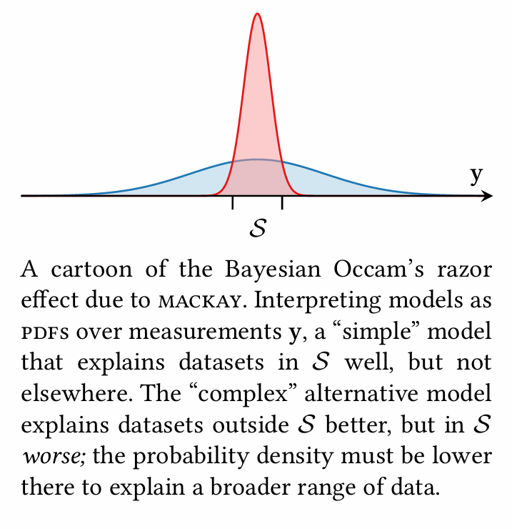

[Back to Main](../main.md)

# 4. Model Assessment, Selection, and Averaging

### Concept) Model Assessment
- Def.)
  - Determining which models are the most compatible with the data and thereby establish preferences over possible choices.
- Settings)
  - $`\mathcal{D} = (\mathbf{x,y})`$ : a set of observations
  - $`f`$ : the latent function
    - Desc.)
      - The hidden function that determines the real world.
      - What we want to figure out!
      - Recall that we assumed that $`f`$ is a [random variable](./02.md#2-gaussian-process)!
        - i.e.) $`f`$ is NOT deterministic!
  - $`p(\mathbf{y}\mid\mathbf{x})`$ : a model
    - Desc.)
      - a prior probability distribution over the measured values $`\mathbf{y}`$ that would result from observing at a set of locations $`\mathbf{x}`$.
    - How to specify a model)   
      - $`\left[ p(f), p(y\mid x,\phi) \right]`$ : link prior $`p(f)`$ and observation $`p(y\mid x,\phi)`$
        - Desc.)
          1. $`p(f)`$ : A prior process on a latent function $`f`$
             - Why doing this?)
               - Since we don't know what $`f`$ is, we set our prior of $`p(f)`$
          2. $`p(y\mid x,\phi)`$ : An observation model that contains noise 
             - where $`\phi = f(x)`$ : the latent function value with noise
      - How to link them)
        - $`\displaystyle p(\mathbf{y}\mid\mathbf{x}) = \int p(\mathbf{y}\mid\mathbf{x}, \boldsymbol{\phi}) p(\boldsymbol{\phi}\mid\mathbf{x}) d\boldsymbol{\phi}`$
          - i.e.) Marginalize on $`\boldsymbol{\phi}`$ to drop the noise!
  - $`\mathcal{M} = \left\{ \left[ p(f\mid\boldsymbol{\theta}), p(y\mid x,\phi,\boldsymbol{\theta}) \right] \mid \boldsymbol{\theta}\in\boldsymbol{\Theta} \right\}`$
    - where
      - $`\boldsymbol{\theta}`$ : hyperparameter 
        - i.e.) a vector of any necessary parameters 
        - $`\boldsymbol{\Theta}`$ : the joint range of $`\boldsymbol{\theta}`$
      - $`p(f\mid\boldsymbol{\theta}) = \mathcal{GP}(f;\mu(x;\boldsymbol{\theta}), K(x,x';\boldsymbol{\theta}))`$ : the prior
      - $`p(y\mid x,\phi,\boldsymbol{\theta})`$ : the observed model

#### e.g.) Zero-Mean / Matérn Kernel Model
- Domain $`\mathcal{X} = [a,b]`$
- Initial beliefs...
  - the objective will exhibit stationary behavior with a constant trend near zero
  - our observations will be corrupted by additive noise
- Setting the observation model)
  - $`p(y\mid\phi,\sigma_n) = \mathcal{N}(y;\phi,\sigma_n^2)`$
    - Desc.)
      - homoskedastic additive Gaussian noise
- Setting the prior)
  - Mean Function)
    - $`\mu(x;c) \equiv c`$ where $`p(c) = \mathcal{N}(c; 0,b^2)`$
      - Desc.)
        - A constant mean function with zero-mean normal prior on unknown constant $`c`$.
  - Covariance Function)
    - $`K(x,x';\lambda,\ell) = \lambda^2 K_{M_{5/2}}(d/\ell)`$
      - Desc.)
        - the [Matérn](./03.md#concept-the-matérn-family-covariance-functions) covariance function with $`\nu = 5/2`$
        - $`\lambda`$ : the [output scale](./03.md#concept-output-space-scaling)
        - $`\ell`$ : the unknown [length scale](./03.md#concept-design-space-domain-transformation)
- By marginalizing the unknown constant mean $`c`$ under its assumed prior, we have the zero mean function and the additive contribution to the covariance function of
  - $`\mu(x) \equiv 0`$
  - $`K(x,x';\lambda,\ell) = b^2 + \lambda^2 K_{M_{5/2}}(d/\ell)`$
- Now we have hyperparameters $`\theta = [\sigma_n, \lambda, \ell]^\top`$

 

### Concept) Model Prior
- Goal)
  - Endow the model space with a prior encoding which models are more plausible a priori $`p(\boldsymbol{\theta})`$.
- How?)
  - Commonly, use the uniform prior : $`p(\boldsymbol{\theta}) \varpropto 1`$.
    - i.e.) Any value of $`\boldsymbol{\theta}`$ is equally likely, no preference!

 

### Concept) Model Posterior
- Goal)
  - Given $`\mathcal{D} = (\mathbf{x,y})`$, we want to derive the posterior distribution over the candidate models $`p(\boldsymbol{\theta} \mid \mathcal{D})`$.
- How?)
  - Using the Bayes theorem, we may get
    - $`p(\boldsymbol{\theta} \mid \mathcal{D}) \varpropto \underbrace{p(\boldsymbol{\theta})}_{\text{prior}} \;\cdot\; \underbrace{p(\mathbf{y \mid x},\boldsymbol{\theta})}_{\text{model evidence}}`$
    - Derivation)   
      $`\begin{aligned}
        p(\boldsymbol{\theta} \mid \mathcal{D}) &= \frac{p(\boldsymbol{\theta}, \mathcal{D})}{p(\mathcal{D})} = \frac{p(\boldsymbol{\theta}) p(\mathcal{D}\mid \boldsymbol{\theta})}{p(\mathcal{D})} \\
        &= \frac{p(\boldsymbol{\theta}) p(\mathbf{y}\mid \mathbf{x}, \boldsymbol{\theta})}{p(\mathbf{y}\mid \mathbf{x})} & (\because p(\mathcal{D})\equiv p(\mathbf{y}\mid \mathbf{x})) \\
        &\varpropto p(\boldsymbol{\theta}) p(\mathbf{y}\mid \mathbf{x}, \boldsymbol{\theta})
      \end{aligned}`$
      - cf.) The second term is the [model evidence](#concept-model-evidence-marginal-likelihood-of-data).

#### Concept) Model Evidence (Marginal Likelihood of Data)
- Def.)
  - $`p(\mathbf{y \mid x},\boldsymbol{\theta})`$ : the **model evidence** or the **marginal likelihood** of the data
- Prop.)
  - Consistency with the data is encapsulated here.
  - It serves as a likelihood in Bayes Theorem.
  - It is computed by marginalizing the latent function values at the observed locations.
- How to compute)
  - Use [GP](./02.md#2-gaussian-process)!
    - Assume 
      - $`f`$ is a Gaussian random variable with $`f=\mathcal{GP}(\mathbf{y};\boldsymbol{\mu},\mathbf{K})`$
      - [Random observation noise](./02.md#concept-corruption-by-additive-gaussian-noise) $`p(\epsilon\mid\mathbf{x},\theta)=\mathcal{N}(\epsilon;0,\mathbf{N})`$
    - Then, the observation would be $`\mathbf{y} = \boldsymbol{\phi} + \epsilon`$
      - where $`\boldsymbol{\phi} = f(\mathbf{x})`$
    - Thus, we may get the joint GP of
      - $`p(\mathbf{y}\mid\mathbf{x},\boldsymbol{\theta}) = \mathcal{N}(\mathbf{y};\boldsymbol{\mu,\Sigma} + \mathbf{N})`$
- cf.) Log Marginal Likelihood
  - Def.)
    - $`\log p(\mathbf{y}\mid\mathbf{x},\boldsymbol{\theta}) = \displaystyle -\frac{1}{2}\left[ \underbrace{(\mathbf{y}-\boldsymbol{\mu})^\top(\boldsymbol{\Sigma} + \mathbf{N})^{-1}(\mathbf{y}-\boldsymbol{\mu})}_{\text{Mahalanobis norm}} + \underbrace{\log \vert \boldsymbol{\Sigma} + \mathbf{N} \vert}_{\text{complexity penalty}} + n\log{2\pi} \right]`$
  - Why needed?)
    - Marginal Likelihood can be exceptionally small and have high dynamic range
  - Derivation)
    - Recall that $`p(\mathbf{y}\mid\mathbf{x},\boldsymbol{\theta}) = \mathcal{N}(\mathbf{y};\boldsymbol{\mu,\Sigma} + \mathbf{N})`$.
    - Thus, we can get the pdf of $`p(\mathbf{y}\mid\mathbf{x},\boldsymbol{\theta})`$ as
      - $`p(\mathbf{y}\mid\mathbf{x},\boldsymbol{\theta}) = \displaystyle\frac{1}{(2\pi)^\frac{n}{2}\vert\boldsymbol{\Sigma + \mathbf{N}}\vert^\frac{1}{2}} \exp \left( -\frac{1}{2} (\mathbf{y}-\boldsymbol{\mu})^\top(\boldsymbol{\Sigma} + \mathbf{N})^{-1}(\mathbf{y}-\boldsymbol{\mu}) \right)`$
    - Taking the log on both side, we may get the above.
  - Props.)
    - $`\log \vert \boldsymbol{\Sigma} + \mathbf{N} \vert`$ : complexity penalty
      - The volume of any confidence ellipsoid under the prior is proportional to $`\vert \boldsymbol{\Sigma} + \mathbf{N} \vert`$.
      - Thus, this term scales according to the volume of the model’s support  in observation space. 

 

#### Concept) Bayesian Occam's Razor
Mackay 2003,  Information Theory, Inference, and Learning Algorithms.
- Desc.)
  - If a “simpler” model wishes to become more “complex” by putting support over a wider range of possible observations, it can only do so by reducing the support for the datasets that are already well explained.   
    

 

### Concept) Model Selection
- Desc.)
  - Choose a single model for use in inference and prediction from the [model space](#concept-model-assessment)

 

### Concept) 

대한민국 노동법에서, 근로계약서를 작성하는데 연봉 급여부분은 공란으로 두고 먼저 사람을 고용해서 사용하다가 나중에 연봉을 정하는게 적법한 행동이야? 지금 내 여자친구가 그런 형태로 일을 하고 있는데, 연봉을 확정해달라고 하는데 업무한지 3주가 지나도록 요청을 무시하고 있어

고용노동부에 신고시, 사용자와 근로자가 각각 어떤 조치를 받을수 있는거야? 근로자는 수습기간이라서 불이익 받고 해고되면 어떡하지?

  

[Back to Main](../main.md)