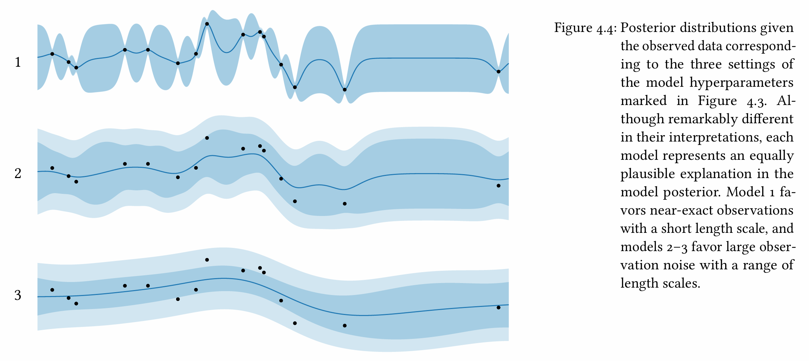

[Back to Main](../main.md)

# 4. Model Assessment, Selection, and Averaging

### Concept) Model Assessment
- Def.)
  - Determining which models are the most compatible with the data and thereby establish preferences over possible choices.
- Settings)
  - $`\mathcal{D} = (\mathbf{x,y})`$ : a set of observations
  - $`f`$ : the latent function
    - Desc.)
      - The hidden function that determines the real world.
      - What we want to figure out!
      - Recall that we assumed that $`f`$ is a [random variable](./02.md#2-gaussian-process)!
        - i.e.) $`f`$ is NOT deterministic!
  - $`p(\mathbf{y}\mid\mathbf{x})`$ : a model
    - Desc.)
      - a prior probability distribution over the measured values $`\mathbf{y}`$ that would result from observing at a set of locations $`\mathbf{x}`$.
    - How to specify a model)   
      - $`\left[ p(f), p(y\mid x,\phi) \right]`$ : link prior $`p(f)`$ and observation $`p(y\mid x,\phi)`$
        - Desc.)
          1. $`p(f)`$ : A prior process on a latent function $`f`$
             - Why doing this?)
               - Since we don't know what $`f`$ is, we set our prior of $`p(f)`$
          2. $`p(y\mid x,\phi)`$ : An observation model that contains noise 
             - where $`\phi = f(x)`$ : the latent function value with noise
      - How to link them)
        - $`\displaystyle p(\mathbf{y}\mid\mathbf{x}) = \int p(\mathbf{y}\mid\mathbf{x}, \boldsymbol{\phi}) p(\boldsymbol{\phi}\mid\mathbf{x}) d\boldsymbol{\phi}`$
          - i.e.) Marginalize on $`\boldsymbol{\phi}`$ to drop the noise!
  - $`\mathcal{M} = \left\{ \left[ p(f\mid\boldsymbol{\theta}), p(y\mid x,\phi,\boldsymbol{\theta}) \right] \mid \boldsymbol{\theta}\in\boldsymbol{\Theta} \right\}`$
    - where
      - $`\boldsymbol{\theta}`$ : hyperparameter 
        - i.e.) a vector of any necessary parameters 
        - $`\boldsymbol{\Theta}`$ : the joint range of $`\boldsymbol{\theta}`$
      - $`p(f\mid\boldsymbol{\theta}) = \mathcal{GP}(f;\mu(x;\boldsymbol{\theta}), K(x,x';\boldsymbol{\theta}))`$ : the prior
      - $`p(y\mid x,\phi,\boldsymbol{\theta})`$ : the observed model

#### e.g.) Zero-Mean / Matérn Kernel Model
- Domain $`\mathcal{X} = [a,b]`$
- Initial beliefs...
  - the objective will exhibit stationary behavior with a constant trend near zero
  - our observations will be corrupted by additive noise
- Setting the observation model)
  - $`p(y\mid\phi,\sigma_n) = \mathcal{N}(y;\phi,\sigma_n^2)`$
    - Desc.)
      - homoskedastic additive Gaussian noise
- Setting the prior)
  - Mean Function)
    - $`\mu(x;c) \equiv c`$ where $`p(c) = \mathcal{N}(c; 0,b^2)`$
      - Desc.)
        - A constant mean function with zero-mean normal prior on unknown constant $`c`$.
  - Covariance Function)
    - $`K(x,x';\lambda,\ell) = \lambda^2 K_{M_{5/2}}(d/\ell)`$
      - Desc.)
        - the [Matérn](./03.md#concept-the-matérn-family-covariance-functions) covariance function with $`\nu = 5/2`$
        - $`\lambda`$ : the [output scale](./03.md#concept-output-space-scaling)
        - $`\ell`$ : the unknown [length scale](./03.md#concept-design-space-domain-transformation)
- By marginalizing the unknown constant mean $`c`$ under its assumed prior, we have the zero mean function and the additive contribution to the covariance function of
  - $`\mu(x) \equiv 0`$
  - $`K(x,x';\lambda,\ell) = b^2 + \lambda^2 K_{M_{5/2}}(d/\ell)`$
- Now we have hyperparameters $`\theta = [\sigma_n, \lambda, \ell]^\top`$

 

### Concept) Model Prior
- Goal)
  - Endow the model space with a prior encoding which models are more plausible a priori $`p(\boldsymbol{\theta})`$.
- How?)
  - Commonly, use the uniform prior : $`p(\boldsymbol{\theta}) \varpropto 1`$.
    - i.e.) Any value of $`\boldsymbol{\theta}`$ is equally likely, no preference!

 

### Concept) Model Posterior
- Goal)
  - Given $`\mathcal{D} = (\mathbf{x,y})`$, we want to derive the posterior distribution over the candidate models $`p(\boldsymbol{\theta} \mid \mathcal{D})`$.
- How?)
  - Using the Bayes theorem, we may get
    - $`p(\boldsymbol{\theta} \mid \mathcal{D}) \varpropto \underbrace{p(\boldsymbol{\theta})}_{\text{prior}} \;\cdot\; \underbrace{p(\mathbf{y \mid x},\boldsymbol{\theta})}_{\text{model evidence}}`$
    - Derivation)   
      $`\begin{aligned}
        p(\boldsymbol{\theta} \mid \mathcal{D}) &= \frac{p(\boldsymbol{\theta}, \mathcal{D})}{p(\mathcal{D})} = \frac{p(\boldsymbol{\theta}) p(\mathcal{D}\mid \boldsymbol{\theta})}{p(\mathcal{D})} \\
        &= \frac{p(\boldsymbol{\theta}) p(\mathbf{y}\mid \mathbf{x}, \boldsymbol{\theta})}{p(\mathbf{y}\mid \mathbf{x})} & (\because p(\mathcal{D})\equiv p(\mathbf{y}\mid \mathbf{x})) \\
        &\varpropto p(\boldsymbol{\theta}) p(\mathbf{y}\mid \mathbf{x}, \boldsymbol{\theta})
      \end{aligned}`$
      - cf.) The second term is the [model evidence](#concept-model-evidence-marginal-likelihood-of-data).

#### Concept) Model Evidence (Marginal Likelihood of Data)
- Def.)
  - $`p(\mathbf{y \mid x},\boldsymbol{\theta})`$ : the **model evidence** or the **marginal likelihood** of the data
- Prop.)
  - Consistency with the data is encapsulated here.
  - It serves as a likelihood in Bayes Theorem.
  - It is computed by marginalizing the latent function values at the observed locations.
- How to compute)
  - Use [GP](./02.md#2-gaussian-process)!
    - Assume 
      - $`f`$ is a Gaussian random variable with $`f=\mathcal{GP}(\mathbf{y};\boldsymbol{\mu},\mathbf{K})`$
      - [Random observation noise](./02.md#concept-corruption-by-additive-gaussian-noise) $`p(\epsilon\mid\mathbf{x},\theta)=\mathcal{N}(\epsilon;0,\mathbf{N})`$
    - Then, the observation would be $`\mathbf{y} = \boldsymbol{\phi} + \epsilon`$
      - where $`\boldsymbol{\phi} = f(\mathbf{x})`$
    - Thus, we may get the joint GP of
      - $`p(\mathbf{y}\mid\mathbf{x},\boldsymbol{\theta}) = \mathcal{N}(\mathbf{y};\boldsymbol{\mu,\Sigma} + \mathbf{N})`$

#### cf.) Log Marginal Likelihood
- Def.)
  - $`\log p(\mathbf{y}\mid\mathbf{x},\boldsymbol{\theta}) = \displaystyle -\frac{1}{2}\left[ \underbrace{(\mathbf{y}-\boldsymbol{\mu})^\top(\boldsymbol{\Sigma} + \mathbf{N})^{-1}(\mathbf{y}-\boldsymbol{\mu})}_{\text{Mahalanobis norm}} + \underbrace{\log \vert \boldsymbol{\Sigma} + \mathbf{N} \vert}_{\text{complexity penalty}} + n\log{2\pi} \right]`$
- Why needed?)
  - Marginal Likelihood can be exceptionally small and have high dynamic range
- Derivation)
  - Recall that $`p(\mathbf{y}\mid\mathbf{x},\boldsymbol{\theta}) = \mathcal{N}(\mathbf{y};\boldsymbol{\mu,\Sigma} + \mathbf{N})`$.
  - Thus, we can get the pdf of $`p(\mathbf{y}\mid\mathbf{x},\boldsymbol{\theta})`$ as
    - $`p(\mathbf{y}\mid\mathbf{x},\boldsymbol{\theta}) = \displaystyle\frac{1}{(2\pi)^\frac{n}{2}\vert\boldsymbol{\Sigma + \mathbf{N}}\vert^\frac{1}{2}} \exp \left( -\frac{1}{2} (\mathbf{y}-\boldsymbol{\mu})^\top(\boldsymbol{\Sigma} + \mathbf{N})^{-1}(\mathbf{y}-\boldsymbol{\mu}) \right)`$
  - Taking the log on both side, we may get the above.
- Props.)
  - $`\log \vert \boldsymbol{\Sigma} + \mathbf{N} \vert`$ : complexity penalty
    - The volume of any confidence ellipsoid under the prior is proportional to $`\vert \boldsymbol{\Sigma} + \mathbf{N} \vert`$.
    - Thus, this term scales according to the volume of the model’s support  in observation space. 

#### cf.) Log Posterior
- Def.)   
  $`\begin{aligned}
    \log p(\boldsymbol{\theta}\mid\mathcal{D}) &= \log \left( p(\boldsymbol{\theta})\; p(\mathbf{y\mid x}, \mathcal{D}) \right) \\
    &= \log p(\boldsymbol{\theta}) + \underbrace{\log p(\mathbf{y\mid x}, \mathcal{D})}_{\text{log marginal likelihood}}
  \end{aligned}`$

 

#### Concept) Bayesian Occam's Razor
Mackay 2003,  Information Theory, Inference, and Learning Algorithms.
- Desc.)
  - Various models are possible depending on $`\boldsymbol{\theta}`$   
    
  - If a “simpler” model wishes to become more “complex” by putting support over a wider range of possible observations, it can only do so by reducing the support for the datasets that are already well explained.   
    

 

### Concept) Model Selection
- Desc.)
  - Choose a single model for use in inference and prediction from the [model space](#concept-model-assessment)
- How?)
  - [Maximum a posteriori (MAP)](#concept-maximum-a-posteriori-map)

 

### Concept) Maximum A Posteriori (MAP)
- Def.)
  - $`\hat{\boldsymbol{\theta}} = \displaystyle\arg\max_{\boldsymbol{\theta}} p(\boldsymbol{\theta}) p(\mathbf{y}\mid\mathbf{x},\boldsymbol{\theta})`$
    - i.e.) Find $`\boldsymbol{\theta}`$ that maximize the [model posterior](#concept-model-posterior) $`p(\boldsymbol{\theta}\mid\mathcal{D})`$
- Prop.)
  - When the [model prior](#concept-model-prior) is flat, the MAP corresponds to the maximum likelihood estimate (MLE).
  - If the model space is defined over a continuous space of hyperparameters, the MAP can be accelerated via gradient-based optimization.
    - e.g.) Previous [log marginal likelihood](#cf-log-marginal-likelihood)
      - By taking the log we may get the [log posterior](#cf-log-posterior)
        - $`\log p(\boldsymbol{\theta}) + \log p(\mathbf{y}\mid\mathbf{x}, \boldsymbol{\theta})`$
      - We also had the [log model evidence](#cf-log-marginal-likelihood) term of
        - $`\log p(\mathbf{y}\mid\mathbf{x},\boldsymbol{\theta}) = \displaystyle -\frac{1}{2}\left[ \underbrace{(\mathbf{y}-\boldsymbol{\mu})^\top(\boldsymbol{\Sigma} + \mathbf{N})^{-1}(\mathbf{y}-\boldsymbol{\mu})}_{\text{Mahalanobis norm}} + \underbrace{\log \vert \boldsymbol{\Sigma} + \mathbf{N} \vert}_{\text{complexity penalty}} + n\log{2\pi} \right]`$
      - $`\boldsymbol{\mu,\Sigma},\mathbf{N}`$ are all implicitly functions of $`\boldsymbol{\theta}`$
      - $`\log p(\mathbf{y}\mid\mathbf{x},\boldsymbol{\theta})`$ is differentiable w.r.t. $`\boldsymbol{\theta}`$
      - However, the [model posterior](#concept-model-posterior) $`p(\boldsymbol{\theta}) p(\mathbf{y}\mid\mathbf{x},\boldsymbol{\theta})`$ is not guaranteed to be concave and may have multiple local maxima.

 

### Concept) Model Averaging
- Problem)
  - Recall that [various model](#concept-bayesian-occams-razor) was possible depending on $`\boldsymbol{\theta}`$.
  - [MAP](#concept-maximum-a-posteriori-map) was also one of those various models.
  - Committing to a single model in this case may systematically bias our  predictions and underestimate predictive uncertainty
- Sol.) Averaging out with Marginalization
  - By marginalizing the model w.r.t. the model posterior, we have
    - $`p(f\mid\mathcal{D}) = \displaystyle\int p(f\mid\mathcal{D},\boldsymbol{\theta}) p(\boldsymbol{\theta}\mid\mathcal{D}) d\boldsymbol{\theta}`$ 
      - i.e.) model-marginal objective posterior
  - For the new datapoint $`x`$. we may predict $`y`$ as
    - $`p(y\mid x,\mathcal{D}) = \displaystyle\int_{\boldsymbol{\theta}}\int_\phi \underbrace{p(y\mid x,\phi,\boldsymbol{\theta})}_{\text{likelihood}} \; \underbrace{p(\phi \mid x,\mathcal{D},\boldsymbol{\theta})}_{\text{latent function posterior}} \; \underbrace{p(\boldsymbol{\theta} \mid \mathcal{D})}_{\text{hyperparam posterior}} d\phi d\boldsymbol{\theta}`$
      - i.e.)  model-marginal predictive distribution
- Limit)
  - Both $`p(f\mid\mathcal{D})`$ and $`p(y\mid x,\mathcal{D})`$ can be computed in limited cases.
    - e.g.) Marginalizing $`\boldsymbol{\theta}`$ of [linear prior mean](./03.md#concept-constant-mean-function) against Gaussian prior.
- Sol.)
  - Treat $`\boldsymbol{\theta}_{\text{MAP}}`$ as if its a distribution.
    - How?)
      - Direct-Delta distribution of $`p(\boldsymbol{\theta} \mid\mathcal{D}) \approx \delta(\boldsymbol{\theta - \hat{\theta}})`$
  - Limit)
    - This can be defensible when the dataset is large compared to the number of hyperparameters.
    - However, large datasets are not always available.

 

### Concept) Monte Carlo Approximation
- Why needed?)
  - Recall that the goal of [model averaging](#concept-model-averaging) was obtaining
    - the [model posterior $`p(f\mid \mathcal{D})`$](#concept-model-posterior) marginalized over $`\boldsymbol{\theta}`$
      - $`p(f\mid\mathcal{D}) = \displaystyle\int p(f\mid\mathcal{D},\boldsymbol{\theta}) p(\boldsymbol{\theta}\mid\mathcal{D}) d\boldsymbol{\theta}`$
    - the [likelihood (model evidence) $`p(y\mid x,\mathcal{D})`$](#concept-model-evidence-marginal-likelihood-of-data) marginalized over $`\boldsymbol{\theta}`$
      - $`p(y\mid x,\mathcal{D}) = \displaystyle\int_{\boldsymbol{\theta}}\int_\phi \underbrace{p(y\mid x,\phi,\boldsymbol{\theta})}_{\text{likelihood}} \; \underbrace{p(\phi \mid x,\mathcal{D},\boldsymbol{\theta})}_{\text{latent function posterior}} \; \underbrace{p(\boldsymbol{\theta} \mid \mathcal{D})}_{\text{hyperparam posterior}} d\phi d\boldsymbol{\theta}`$
  - However, marginalizing over $`\boldsymbol{\theta}`$ was intractable in most cases.
  - Instead, sample possible $`\boldsymbol{\theta}`$s and average them.
- How?)
  - Draw a set of hyperparameter samples from the [model posterior](#concept-model-posterior)
    - $`\left\{ \boldsymbol{\theta}_{i=1}^s \right\} \sim p(\boldsymbol{\theta} \mid\mathcal{D})`$
      - cf.) How?
        - Recall that the [model posterior](#concept-model-posterior) was
          - $`p(\boldsymbol{\theta} \mid \mathcal{D}) \varpropto \underbrace{p(\boldsymbol{\theta})}_{\text{prior}} \;\cdot\; \underbrace{p(\mathbf{y \mid x},\boldsymbol{\theta})}_{\text{model evidence}}`$
        - We can arbitrarily set the [model prior](#concept-model-prior) $`p(\boldsymbol{\theta})`$.
        - Also, using the GP, we could obtain the [likelihood](#concept-model-evidence-marginal-likelihood-of-data) $`p(\mathbf{y \mid x},\boldsymbol{\theta})`$
        - By applying the scalar multiplication between those two, we can get the model posterior [model posterior](#concept-model-posterior) $`p(\boldsymbol{\theta} \mid \mathcal{D})`$.
        - Now, using the Markov Chain Monte Carlo (MCMC), we can sample $`\boldsymbol{\theta}`$.
          - In this case, only pdf is required for sampling!
          - No moment, nor full distribution is required.
        - e.g.)
          - Hamiltonian Monte Carlo (HMC)
          - No U-Turn Sampler (NUTS)
            - Reasonable when the gradient of the [log posterior](#cf-log-posterior) is available.
  - Then, we may yield the following simple Monte Carlo estimates   
    $`\begin{cases}
      p(f\mid\mathcal{D}) &\approx \displaystyle\frac{1}{s}\sum_{i=1}^s \mathcal{GP}\left( f;\; \mu_\mathcal{D}(\boldsymbol{\theta}_i), K_\mathcal{D}(\boldsymbol{\theta}_i) \right) \\
      p(y\mid x,\mathcal{D}) &\approx \displaystyle\frac{1}{s}\sum_{i=1}^s \int p(y\mid x,\phi,\boldsymbol{\theta}_i) \; p(\phi\mid x,\mathcal{D}, \boldsymbol{\theta}_i) d\phi
    \end{cases}`$

 

### Concept) 

 

### Concept) 

  

[Back to Main](../main.md)