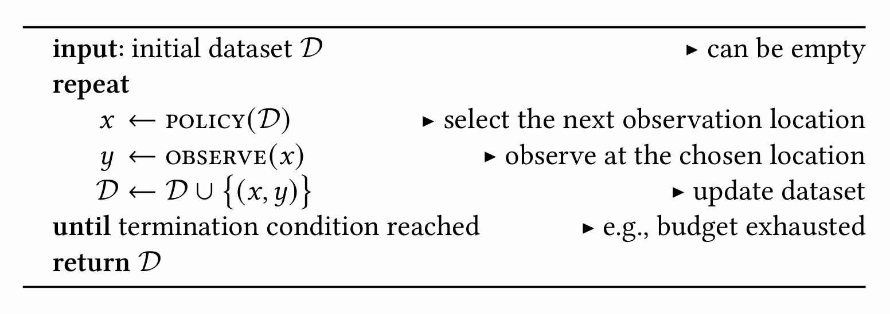
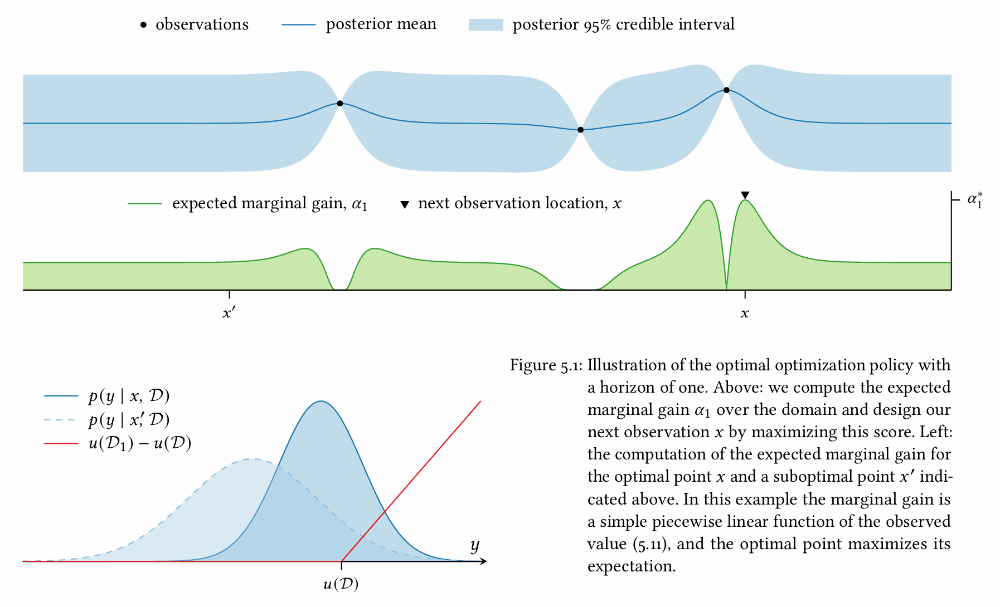

[Back to Main](../main.md)

# 5. Decision Theory for Optimization

### Concept) Sequential Optimization

 

### Concept) Acquisition Function (Infill Function, Figure of Merit)
- Def.)
  - A function that provides a score to each potential observation location commensurate with its propensity for aiding the optimization task.
- Notation)
  - $`\alpha: \mathcal{X}\rightarrow\mathbb{R}`$
    - Assigning a score to each point in the domain
  - $`\alpha(x;\mathcal{D})`$
    - Explicitly showing its dependence on data
      - cf.) Various $`\alpha`$s are defined by deriving the posterior belief of the objective function given the data, i.e. the [model posterior](./04.md#cf-log-posterior) $`p(f\mid\mathcal{D})`$
- Prop.)
  - $`\alpha`$ encodes preferences over potential observation locations.
    - i.e.) $`\alpha(x;\mathcal{D}) \gt \alpha(x';\mathcal{D})`$
  - How to find the next observation point)
    - $`\displaystyle x\in \arg\max_{x'\in\mathcal{X}} \alpha(x';\mathcal{D})`$
      - Question) Why should we solve the above global opt. problem to solve the [global problem of estimating the objective function](#concept-sequential-optimization)?
        - A) $`\alpha`$ is more tractable than the original problem.

 

### Concept) Bayesian Decision Theory
- Def.)
  - A framework for decision making under uncertainty that is flexible enough to handle effectively any scenario
    - cf.)
      - Degroot (1970), Optimal Statistical Decisions
      - Berger (1985), Statistical Decision Theory and Bayesian Analysis

 

### Concept) Isolated Decision
- Settings)
  - $`\mathcal{A}`$ : the action space
    - Props.)
      - We will select an action $`a\in\mathcal{A}`$
      - For the [sequential optimization above](#concept-sequential-optimization), $`\mathcal{X} = \mathcal{A}`$
        - Why?) We are choosing $`\displaystyle x\in \arg\max_{x'\in\mathcal{X}} \alpha(x';\mathcal{D})`$
  - $`\psi`$ : a random variable encompassing any relevant uncertain elements when making and evaluating decisions
  - $`p(\psi\mid\mathcal{D})`$ : posterior belief about $`\psi`$
    - i.e.) Our belief about $`\psi`$ in light of data $`\mathcal{D}`$ 
  - $`u(a,\psi,\mathcal{D})`$ : utility function
    - where $`a\in\mathcal{A}`$ : an action
      - Prop.)
        - It measures the quality of selecting $`a`$.
        - Higher $`u`$ means more favorable outcome.
  - $`\mathbb{E}\left[ u(a,\psi,\mathcal{D}) \mid a,\mathcal{D} \right] = \displaystyle\int u(a,\psi,\mathcal{D}) p(\psi\mid\mathcal{D}) d\psi`$ : expected utility
    - cf.)
      - What we know : $`a,\mathcal{D}`$
      - What we don't know : $`\psi`$
- Expected Utility Optimization
  - $`a\in \displaystyle\arg\max_{a'\in\mathcal{A}} \mathbb{E}\left[ u(a',\psi,\mathcal{D}) \mid a',\mathcal{D} \right]`$

 

### Concept) Sequential Decisions with Fixed Budget
- Settings)
  - The action space $`\mathcal{A}`$ of each decision $`a`$ is the domain $`\mathcal{X}`$.
  - We must act under uncertainty $`(\psi)`$ about the objective function $`f`$.
    - How?)
      - Reason about the result of making an observation at some point $`x\in\mathcal{X}`$ via the posterior predictive distribution $`p(y\mid x,\mathcal{D})`$
  - Ultimate purpose of optimization is to collect and return the dataset $`\mathcal{D}`$.
    - How?)
      - We will maximize $`u(\mathcal{D})`$
      - Make observations that, in expectation, promise the biggest improvement in utility.
    - Prop.)
      - Each observation will update the dataset and impact on the entire remainder of optimization.
  - Fixed observation budget
    - Concept) Decision Horizon $`\tau`$
      - the number of remaining observations
  - Concept) Terminal Utility
    - Def.)
      - $`u(\mathcal{D}_\tau) = u\left( \underbrace{\mathcal{D}}_{\text{known}},\; \underbrace{x}_{\text{action}},\; \underbrace{y,\; x_2,\;y_2,\;\cdots,\;x_\tau,\;y_\tau}_{\text{unknown}}  \right)`$
  - Concept) Expected Terminal Utility
    - Def.)
      - $`\mathbb{E}\left[ u(\mathcal{D}_\tau) \mid x,\mathcal{D} \right]`$
        - cf.) Refer to the [isolated decision](#concept-isolated-decision).
    - Prop.)
      - The expectation over the future data may be written as   
        $`\displaystyle \int\cdots\int u(\mathcal{D}_\tau) p(y\mid x,\mathcal{D}) \prod_{i=2}^\tau p(x_i, y_i \mid \mathcal{D}_{i-1}) dy \; d\left\{(x_i,y_i)\right\}`$
        - which is intractable.
        - Optimal decision making?
- Optimization Problem)
  - When there are $`\tau`$ evaluations are remaining, we may choose $`x`$ s.t.  
    $`x\in\displaystyle\arg\max_{x'\in\mathcal{X}} \mathbb{E} \left[ u(\mathcal{D}_\tau) \mid x',\mathcal{D} \right]`$
  - Concept) the expected increase in utility making an observation at $`x`$
    - $`\alpha_\tau (x;\mathcal{D}) = \mathbb{E}\left[ u(\mathcal{D}_\tau) \mid x,\mathcal{D} \right] - u(\mathcal{D})`$ 

#### 1. One observation remaining case
- Settings)
  - $`\tau = 1`$
    - i.e.)
      - This is the final decision.
- Marginal Gain)
  - $`\alpha_1(x;\mathcal{D}) = \displaystyle\int u(\mathcal{D}_1) \; p(y\mid x,\mathcal{D}) dy - u(\mathcal{D})`$
- Optimal Observation)
  - $`x\in\displaystyle\arg\max_{x'\in\mathcal{X}} \alpha_1 (x';\mathcal{D})`$
- Result)
  - $`u(\mathcal{D}) + \alpha_1^*(\mathcal{D})`$ : Expected Utility
    - where $`\alpha_1^*(\mathcal{D}) = \displaystyle\max_{x'\in\mathcal{X}} \alpha_1(x';\mathcal{D})`$ is... 
      - the expected increase in utility when starting with $`\mathcal{D}`$ and continuing optimally for $`\tau`$ additional observations.
      - the value of the dataset $`\mathcal{D}`$ with a horizon of $`\tau`$
- e.g.)
  - Settings)
    - Objective Function
      - The belief over the objective function $`p(f\mid\mathcal{D})`$ is a GP.
      - Our observations reveal exact values of the objective
    - Utility Function
      - $`u(\mathcal{D}) = f(\mathbf{x})`$ : the maximal objective value contained in the data
      - Then the marginal utility gain can be denoted as
        - $`u(\mathcal{D}_1) - u(\mathcal{D}) = \max\{ y - u(\mathcal{D}),\; 0 \}`$
  - Graphics)   
    

#### 2. Two observation remaining case
- Settings)
  - $`\tau = 2`$
    - i.e.) Making penultimate (second last) observation $`x`$.
- Marginal Gain)    
  $`\begin{aligned}
    \alpha_2(x;\mathcal{D}) &= \mathbb{E}\left[ u(\mathcal{D}_\tau) \mid x,\mathcal{D} \right] - u(\mathcal{D}) \\ 
    &= \int u(\mathcal{D}_2) \; p(y\mid x,\mathcal{D}) \; p(x_2, y_2 \mid \mathcal{D}_1) dy \; d(x_2, y_2) - u(\mathcal{D})
  \end{aligned}`$
  - However, this is too complicated.
  - Instead, assuming that $`(x_2,y_2)`$ will be optimal, we may denote with [the $`\tau=1`$ case above](#1-one-observation-remaining-case) as...   
    $`\begin{aligned}
      \alpha_2(x;\mathcal{D}) &= u(\mathcal{D}_2) - u(\mathcal{D}) \\ 
      &= \left[ u(\mathcal{D}_1) - u(\mathcal{D}) \right] + \left[ u(\mathcal{D}_2) - u(\mathcal{D}_1) \right] \\
    \end{aligned}`$

  

[Back to Main](../main.md)