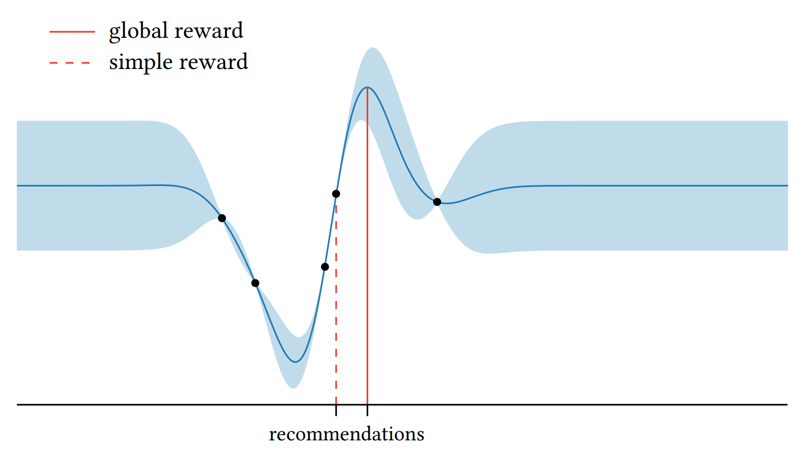

[Back to Main](../main.md)

# 6. Utility Functions for Optimization

### Concept) Terminal Recommendation
- Def.)
  - The final point that we want to observe.
- Ideation)
  - Our goal in [Bayesian Decision Theory](./05.md) was to derive optimal optimization policies using...
    - [Objective function $`f`$](./04.md#concept-model-assessment) that conveys our beliefs in the face of uncertainty
    - [Utility function $`u`$](./05.md#concept-isolated-decision) that expresses our preference over outcomes.
  - The collected data were used to help select the **final** point $`x`$.
    - Selecting a point for permanent use represents a decision.
  - If the sole purpose of optimization is to inform a **final** decision, we should design a policy to maximize the [expected utility](./05.md#concept-isolated-decision) of the **terminal** decision directly.
- Notation)
  - Settings)
    - $`\mathcal{D} = (\mathbf{x,y})`$ : a data set
    - We want to recommend a point $`x\in\mathcal{X}`$.
        - $`\phi = f(x)`$ : the performance of that point determined by the underlying objective function
          - cf.) This represents a decision under uncertainty about $`\phi`$.
              - How?) We may use a predictive distribution of $`p(\phi\mid x,\mathcal{D})`$
    - $`\mathcal{A\subset X}`$ : an action space
      - Types)
        - (Extreme) Restrict choice to only visited points $`\mathbf{x}`$
        - (Extreme) Set entire domain, i.e. $`\mathcal{A=X}`$
        - Compromise between two extremes
          - Osborne et al. (2009) *Gaussian Processes for Global Optimization*
            - $`\mathcal{A}(\epsilon;\mathcal{D}) = \{ x\mid \text{std}[\phi\mid x,\mathcal{D}] \le \epsilon \}`$
              - where
                - $`\epsilon`$ : a threshold specifying the largest acceptable uncertainty
                - $`\text{std}[\phi\mid x,\mathcal{D}]`$ is the quantity of the risk (Refer to $`\sigma`$ in utility function choice below.)
    - $`v(\phi)`$ : a utility function that evaluates a recommendation $`\phi`$
      - Requirements)
        - monotonically increasing in $`\phi`$
          - i.e.) Assumes the maximization problem of the latent function $`f`$.
          - cf.) If we want to find the global minimum of $`f`$, $`v(\phi)`$ should be in a monotonically decreasing shape.
      - Types depending on [Risk](#concept-risk-in-bayesian-decision-theory) Tolerance)
        - Risk-Neutral
          - $`v(\phi) = \phi`$
            - Props.)
              - Expected utility goes $`\mathbb{E}\left[ v(\phi)\mid x,\mathcal{D} \right] = \mu_\mathcal{D}(x)`$
              - Computationally convenient
        - Risk-Averse
          - $`v(\phi') = \mathbb{E}[v(\phi)\mid x,\mathcal{D}] \le v\left(\mathbb{E}[v(\phi)\mid x,\mathcal{D}]\right) = v(\mu_\mathcal{D}(x))`$
          - Another notation using $`\mu,\sigma`$
            - For
              - $`\mu = \mu_\mathcal{D}(x)`$
              - $`\sigma = \text{std}[\phi\mid x,\mathcal{D}]`$ : the amount of risk
            - $`\beta \lt 0`$ for $`\mu+\beta\sigma`$
        - Risk-Seeking
          - $`v(\phi') = \mathbb{E}[v(\phi)\mid x,\mathcal{D}] \ge v\left(\mathbb{E}[v(\phi)\mid x,\mathcal{D}]\right) = v(\mu_\mathcal{D}(x))`$
          - Another notation using $`\mu,\sigma`$
            - $`\beta \gt 0`$ for $`\mu+\beta\sigma`$
  - Optimization)
    - $`x\in\displaystyle\arg\max_{x'\in\mathcal{A}} \mathbb{E}\left[ v(\phi') \mid x',\mathcal{D} \right]`$ : Find $`x`$ that maximizes the expected utility 
      - Prop.) 
        - The expected utility $`\mathbb{E}\left[ v(\phi') \mid x',\mathcal{D} \right]`$ solely depends on $`\mathcal{D}`$
        - $`u(\mathcal{D}) = \displaystyle\max_{{x'\in\mathcal{A}}} \mathbb{E} \left[ v(\phi')\mid x',\mathcal{D} \right]`$ : the natural utility for use in optimization
          - where $`\phi'=f(x')`$

#### Concept) Risk in Bayesian Decision Theory
- Desc.)
  - Recall that the observation is noisy: $`y=f(x)+\epsilon = \phi+\epsilon`$
    - where $`\epsilon`$ is observation noise.
  - From the collected data $`\mathcal{D}`$, we can derive a **posterior belief** over the latent objective function:  
    - $`p(\phi \mid \mathcal{D})`$.
  - However, we still do not know the true $`\phi`$, and we must choose $`x`$ based on this **uncertain belief**.
  - Therefore, there exists a **risk** that the recommended decision $`x`$ may not perform well when evaluated under the true objective function.
    - e.g.) Maximization Problem
      - The recommended $`x^*`$ is not the global maximum point.
      - i.e.) $`\exist \phi\ne f(x^*)`$ s.t. $`\phi = \max\{f(x)\}, \forall x\in\mathcal{A}`$

#### Concept) Certainty Equivalent
- Def.)
  - $`\phi'`$ s.t. $`v(\phi') = \mathbb{E}[v(\phi)\mid x,\mathcal{D}]`$
    - i.e.) the value of a hypothetical risk-free alternative for which our preferences would be indifferent 
- Prop.)
  - Under risk-neutral utility function $`\phi' = \mu_\mathcal{D}(x)`$

 

### Concept) Simple Reward
- Def.)
  - For
    - $`\mathcal{D} = (\mathbf{x,y})`$ : data returned from an optimization routine
  - Simple Reward is the [expected utility](./05.md#concept-isolated-decision) of the recommendation made with
    - $`v(\phi) = \phi`$ 
      - i.e.) a risk neutral utility function
    - $`\mathcal{A} = \mathbf{x}`$
      - i.e.) an action space limited to locations evaluated during optimization $`\mathbf{x}`$
- Notation)
  - $`u(\mathcal{D})=\max \mu_\mathcal{D}(\mathbf{x})`$
- Further assuming the exact observations (i.e. $`\mathbf{y}=f(\mathbf{x})`$), the simple reward is reduced to
  - $`u(\mathcal{D}) = \max \boldsymbol{f(\mathbf{x})} = \max \boldsymbol{\phi}`$

 

### Concept) Global Reward
- Def.)
  - For
    - $`\mathcal{D} = (\mathbf{x,y})`$ : data returned from an optimization routine
  - Global Reward is the [expected utility](./05.md#concept-isolated-decision) of the recommendation made with
    - $`v(\phi) = \phi`$ 
      - i.e.) a risk neutral utility function
    - $`\mathcal{A} = \mathcal{X}`$
      - i.e.) an action space is the entire domain $`\mathcal{X}`$
- Notation)
  - $`u(\mathcal{D}) = \displaystyle\max_{x\in\mathcal{X}} \mu_\mathcal{D}(x)`$
- Comparison with [Simple Reward](#concept-simple-reward)   
  

 

### Concept) Cumulative Reward
- Setting)
  - The value of every individual observation is significant.
    - cf.)
      - This is different from [simple reward](#concept-simple-reward) and [global reward](#concept-global-reward) because they were looking for a single best point.
      - Cumulative reward considers all points for the utility.
  - Find the set of points whose total (or cumulative) value is maximized.
- Def.)
  - $`\displaystyle u(\mathcal{D}) = \sum_i y_i`$
    - where $`\mathcal{D} = (\mathbf{x,y})`$
- Usage)
  - active search

 

### Concept) Information Gain
- Idea)
  - Favor datasets containing more information
- Def. 1)
  - Let
    - $`\omega`$ : a random variable of interest that we wish to determine through teh observation of data
  - We may quantify our initial uncertainty about $`\omega`$ via the entropy of its prior distribution $`p(\omega)`$ as
    - $`H[\omega] = -\displaystyle\int p(\omega) \log p(\omega) \; \text{d}\omega`$
  - Then the information gain can be denoted as
    - $`u(\mathcal{D}) = \underbrace{H[\omega]}_{\text{entropy from prior}} - \underbrace{H[\omega\mid\mathcal{D}]}_{\text{entropy from posterior}}`$
      - where
        - $`H[\omega\mid\mathcal{D}] = -\displaystyle\int p(\omega\mid\mathcal{D})\log p(\omega\mid\mathcal{D}) \text{d}\omega`$ : the differential entropy of the posterior 
- Def. 2)
  - Using the KL-Divergence between the posterior and the prior distribution, we have   
    $`\begin{aligned}
        u(\mathcal{D}) &= D_{\text{KL}} \left[ p(\omega\mid\mathcal{D}) \Vert p(\omega) \right] \\
        &= \displaystyle\int p(\omega\mid\mathcal{D}) \log \left(\frac{p(\omega\mid\mathcal{D})}{p(\omega)}\right) \text{d}\omega
    \end{aligned}`$
    - Prop.)
      - Always non-negative 
      - But cannot capture the surprising observation as Def.1, which highlight this with the negative value. 
- Prop.)
  - The choice of $`\omega`$ is open ended.
  - Optimization problem on both definition leads to identical decisions.
  - One-step lookahead with information gain yields an acquisition function of mutual information.

 

### Concept) Utility's Dependence on Model
- Desc.)
  - Recall that [simple reward](#concept-simple-reward), [global reward](#concept-global-reward), and [information gain](#concept-information-gain) depends on the posterior model.
    - i.e.) the expected utility depends on the model.
  - Thus, we cannot compare the utilities of different models.
    - Why?)
      - Utilities are model-specific
- Sol.)
  - Model averaging
  - Use model-agnostic utility functions like [cumulative reward](#concept-cumulative-reward).

 

### Concept) 

  

[Back to Main](../main.md)