[Back to Main](../main.md)

# 7. Common Bayesian Optimization Policies

### Concept) Multi-Armed Bandit
- Def.)
  - A finite dimensional model of sequential optimization with noisy optimizations
- Desc.)
  - An agent is faced with a finite set of alternatives (arms)
  - This agent should select a sequence of items from this set.
  - Choices yield stochastic reward drawn from unknown distribution associated with that arm.
  - We seek a sequential policy that maximizes the expected [cumulative reward](./06.md#concept-cumulative-reward).
- Notation)
  - Each point $`x\in\mathcal{X}`$ represents an arm 
  - $`\phi = f(x)`$ is the objective function that determines the stochastic reward with each arm $`x`$ 

 

### e.g.) Example GP Model
- Settings)
  - One-dimensional objective function $`f`$ observed without noise
    - Ground Truth of $`f`$   
      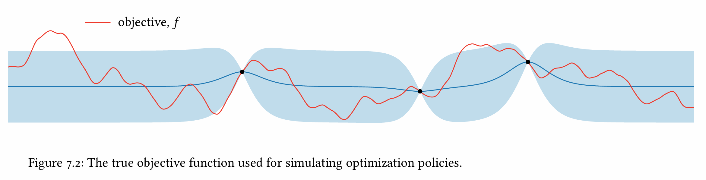
      - Desc.)
        - Numerous local maxima
        - Global maximum on the LHS of the domain
  - GP prior belief about this function
    - Mean : [Constant Function](./03.md#concept-constant-mean-function)
    - Covariance : [Matern with $`v=5/2`$](./03.md#concept-the-matérn-family-covariance-functions)   
      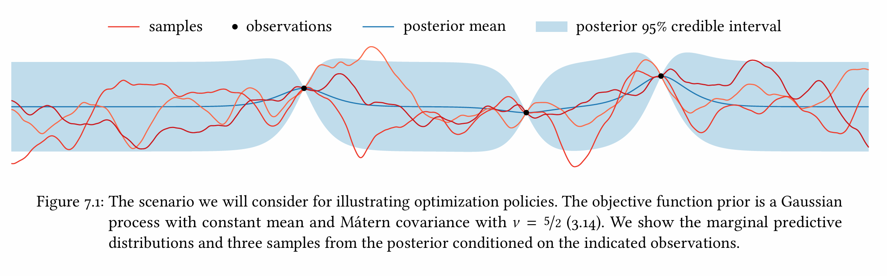
    - Three observation points
      - Two of which are local maxima
- What we need to choose
  - [Utility Function $`u(\mathcal{D})`$](./05.md#concept-isolated-decision)
  - Model : GP chosen above!
  - Policy
    - e.g.) [One-step look ahead](#concept-one-step-lookahead) below
      - Recall that the [limited lookahead](./05.md#tech-limited-lookahead) was myopic, but computationally tractable compared to the [optimal](./05.md#concept-bellman-optimality) case

 

### Concept) One-Step Lookahead
- Def.)
  - Settings)
    - $`\mathcal{D} = (\mathbf{x,y})`$ : the dataset we already have
    - $`u(\mathcal{D})`$ : an arbitrary [utility function](./05.md#concept-isolated-decision) that evaluates the returned dataset $`\mathcal{D}`$
  - Goal)
    - We want to choose a point $`x\in\mathcal{X}`$. 
    - Update our dataset into $`\mathcal{D}' = (\mathbf{x',y'}) = \mathcal{D}\cup\left\{(x,y)\right\}`$
      - where $`y`$ is the corresponding observed value of $`x`$.
      - cf.) Following the notation of the [Bayesian Decision theory](./05.md#concept-bayesian-decision-theory) in the previous chapter we should use $`\mathcal{D}_1`$ to denote the new data set.
        - But, for simplicity, we use $`\mathcal{D}'`$.
  - How?)
    - Consider the [expected marginal gain](./05.md#1-one-observation-remaining-case) in utility after incorporating $`x`$:
      - $`\alpha(x;\mathcal{D}) = \mathbb{E}\left[ u(\mathcal{D}') \mid x,\mathcal{D} \right] - u(\mathcal{D})`$
    - We choose $`x`$ that maximizes this score:
      - $`\displaystyle x\in\arg\max_{x'\in\mathcal{X}} \alpha(x';\mathcal{D})`$

 

### Concept) Expected Improvement (EI)
- Desc.)
  - An [acquisition function](./05.md#concept-acquisition-function-infill-function-figure-of-merit) that adopts
    - Utility Function : [Simple Reward](./06.md#concept-simple-reward)
    - Policy : [One-Step Lookahead](#concept-one-step-lookahead)
- Def.)
  - Adopting the [Simple Reward](./06.md#concept-simple-reward), we have
    - $`u(\mathcal{D}) = \max \mu_\mathcal{D}(\mathbf{x})`$
      - cf.) Recall that $`\mathcal{A} = \mathbf{x}`$
        - i.e.) The action space limited to locations evaluated during optimization!
  - Then, the EI can be defined as
    - $`\alpha_{\text{EI}}(x;\mathcal{D}) = \displaystyle \underbrace{\int \left[ \max \mu_{\mathcal{D}'}(\mathbf{x}') \right] \; p(y\mid x,\mathcal{D}) \text{d}y}_{\text{new utility by choosing } x} - \underbrace{\max \mu_\mathcal{D}(\mathbf{x})}_{\text{previous utility}}`$
      - where $`\mathbf{x}' = \mathbf{x}\cup\{x\}`$
  - Further assuming the exact observation $`y = \phi = f(x)`$, we may get more simple form as below.
    - Let
      - $`\mathcal{D} = (\mathbf{x},\boldsymbol{\phi})`$ : the dataset
      - $`\phi^* = \max\boldsymbol{\phi}`$ : the incumbent
        - i.e.) the maximal objective value yet seen.
    - Then, we may rewrite as
      - $`u(\mathcal{D}) = \phi^*`$
      - $`u(\mathcal{D}') = \max(\phi^*, \phi)`$ 
        - where $`\phi`$ is a new observation
      - $`u(\mathcal{D}')-u(\mathcal{D}) = \max(\phi-\phi^*, 0)`$
    - Thus, the Expected Improvement can be denoted as
      - $`\alpha_{\text{EI}}(x;\mathcal{D}) = \displaystyle\int\max(\phi-\phi^*,0)\; p(\phi\mid x,\mathcal{D})\;\text{d}\phi`$
- Props.)   
  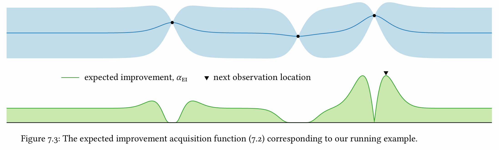
  - The EI vanishes near regions where we have existing observations
  - EI automatically considers the dilemma between exploration and exploitation.
- Application)
  - Sequentially maximizing EI to gather 20 additional observations.   
    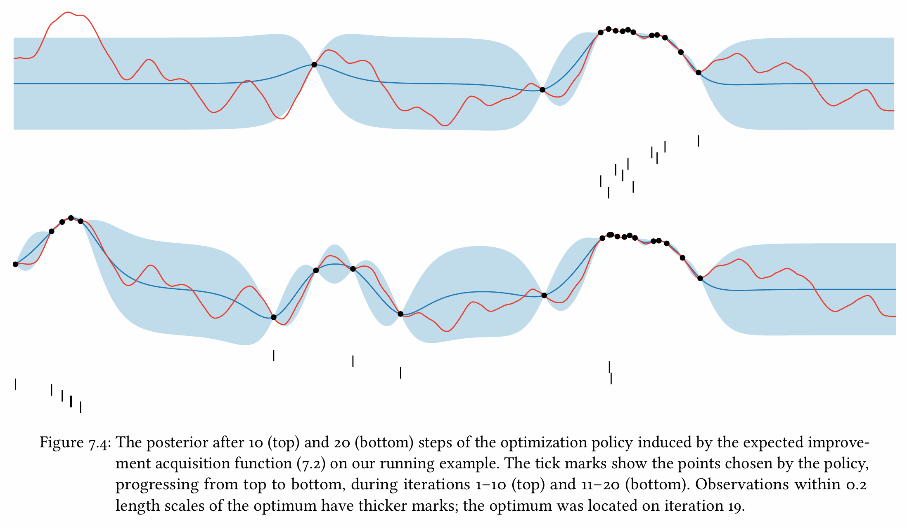
    - Desc.)
      - The first ten observations focused on the exploitation.
        - This may due to the [one-step lookahead](#concept-one-step-lookahead).

 

### Concept) Knowledge Gradient (KG)
- Desc.)
  - An [acquisition function](./05.md#concept-acquisition-function-infill-function-figure-of-merit) that adopts
    - Utility Function : [Global Reward](./06.md#concept-global-reward)
      - cf.) In this context, the global reward is interpreted as the amount of "knowledge" about the global maximum offered by a dataset $`\mathcal{D}`$.
      - Then the knowledge gradient can be interpreted as the expected change in knowledge offered by a measurement at $`x`$.
    - Policy : [One-Step Lookahead](#concept-one-step-lookahead)
- Def.)
  - Adopting the [Global Reward](./06.md#concept-global-reward), we have
    - $`u(\mathcal{D}) = \displaystyle\max_{x\in\mathcal{X}} \mu_\mathcal{D}(x)`$
  - Then, the Knowledge Gradient can be defined as
    - $`\alpha_{\text{KG}}(x;\mathcal{D}) = \displaystyle\int\left[ \max_{x'\in\mathcal{X}} \mu_{\mathcal{D}'}(x') \right] \;p(y\mid x,\mathcal{D}) \text{d}y - \max_{x'\in\mathcal{X}} \mu_\mathcal{D}(x')`$
      - Desc.)
        - Knowledge : the global reward
- Props.)   
  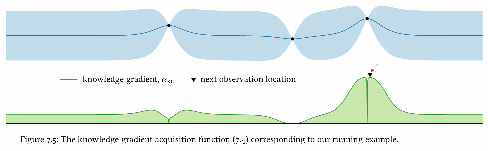
  - The knowledge gradient seeks to maximize the global maximum of the posterior mean, regardless of its location.
    - Why?) It utilizes the [global reward](./06.md#concept-global-reward).
  - Still, KG may seek points in the neighborhood of the best seen point as the relevant local maximum is probably not located precisely at this point.
    - The choice can be the both side of the best seen point.
      - e.g.)   
        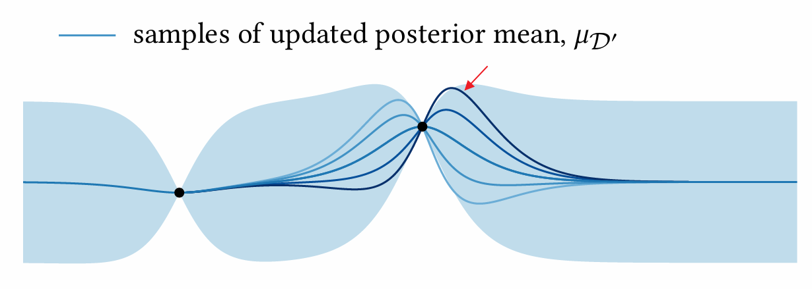
        - Desc.)
          - The dark blue sample corresponds with the next observation point in the image above.
- Application)
  - Sequentially maximizing EI to gather 20 additional observations.   
    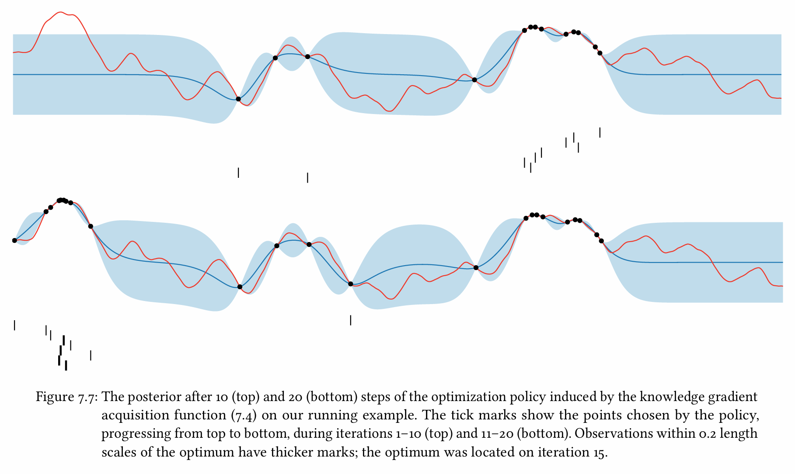
    - Desc.)
      - Somewhat more even exploration of the domain compared to [EI](#concept-expected-improvement-ei).
- Question)
  - Is global reward computationally tractable?

 

### Concept) Probability of Improvement (PI)
- Desc.)
  - PI computes the probability of an observed value to improve upon some chosen threshold, regardless of the magnitude of this improvement.
- Def.)
  - Consider a simple reward of the dataset $`\mathcal{D} = (\mathbf{x,y})`$:
    - $`u(\mathcal{D}) = \max \mu_\mathcal{D}(\mathbf{x})`$
  - Let
    - $`\epsilon`$ : the minimum amount of utility improvement we want
    - $`\tau = u(\mathcal{D}) + \epsilon`$ : the desired utility
  - Then, the PI can be defined as
    - $`\alpha_{\text{PI}}(x;\mathcal{D},\tau) = \text{Pr}\left( u(\mathcal{D}') \gt \tau \mid x,\mathcal{D} \right)`$ 
      - where $`u(\mathcal{D}')`$ is the updated utility. 
  - Further assuming the exact observation $`y = \phi = f(x)`$, we may get more simple form as below.
    - Let
      - $`\phi^* = \max f(\mathbf{x}) = u(\mathcal{D})`$
    - Then, the updated utility can be rewritten as
      - $`u(\mathcal{D}') = \max(\phi^*, \phi)`$
        - where $`\phi`$ is a new observation
    - Then, the PI can be defined as
      - $`\alpha_{\text{PI}}(x;\mathcal{D},\tau) = \text{Pr}\left( \phi \gt \tau \mid x,\mathcal{D} \right)`$ 
- Props.)   
  - In general, PI is more risk-averse than [EI](#concept-expected-improvement-ei).   
    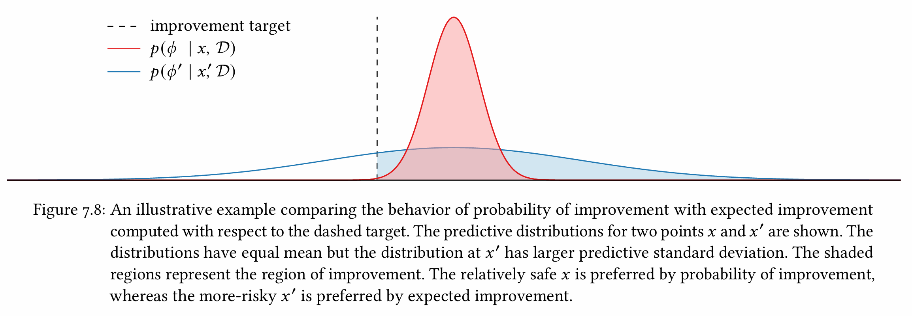
    - Why?)
      - PI prefers a certain improvement of modest magnitude to an uncertain improvement of potentially large magnitude.
      - In the diagram above, the PI will prefer $`x`$ over $`x'`$.
  - The role of improvement target $`\epsilon`$   
    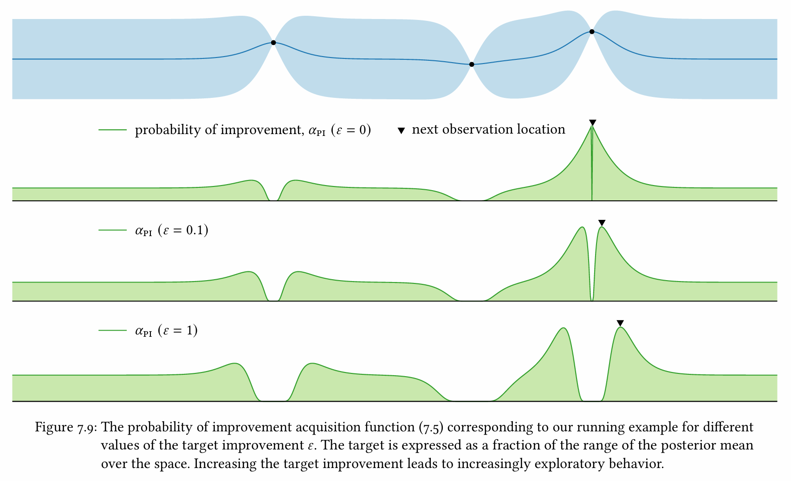
    - Higher $`\epsilon`$ encourages the exploration
    - Lower $`\epsilon`$ encourages the exploitation
  - How to set the improvement target $`\epsilon`$   
    - No fixed rule for choosing the value $`\epsilon`$
    - Simple Data-Driven Method
      - Jones (2001) *A Taxonomy of Global Optimization Methods Based on Response Surfaces*
      - How?)
        - $`\mu^* + \alpha r`$
          - where $`\begin{cases}
            \mu^* &= \displaystyle\max_{x\in\mathcal{X}} \mu_{\mathcal{D}}(x) \\
            r &= \max\mu_{\mathcal{D}}(\mathbf{x}) - \min\mu_{\mathcal{D}}(\mathbf{x}) \\
            \alpha &\ge 0 \\
          \end{cases}`$
- Application)
  - Sequentially maximizing EI to gather 20 additional observations ($`\epsilon=0.1`$).   
    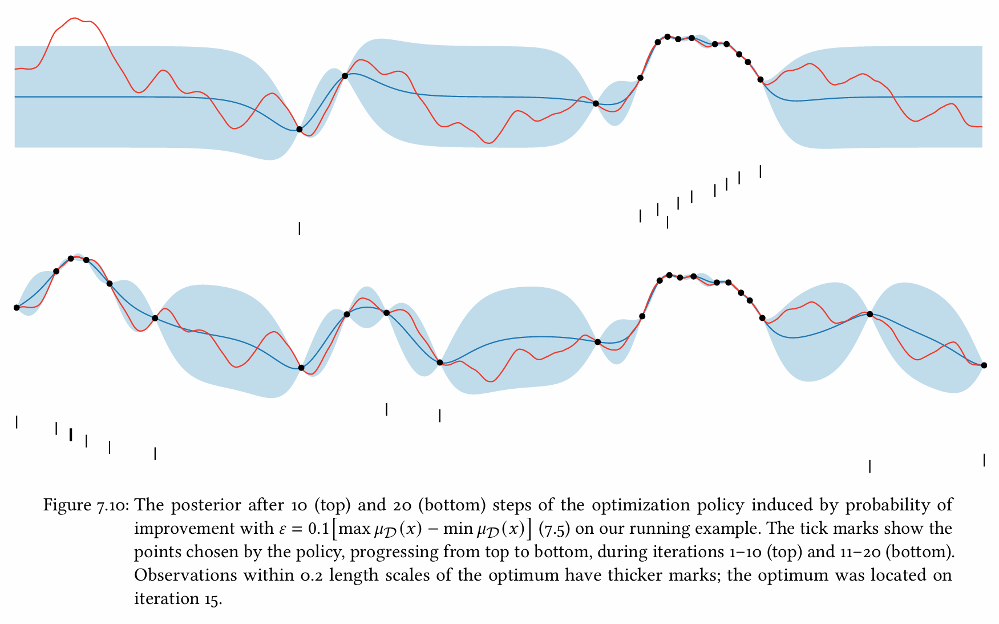
    - Desc.)
      - Somewhat more even exploration of the domain compared to [EI](#concept-expected-improvement-ei).
  - $`\epsilon=0`$ Case   
    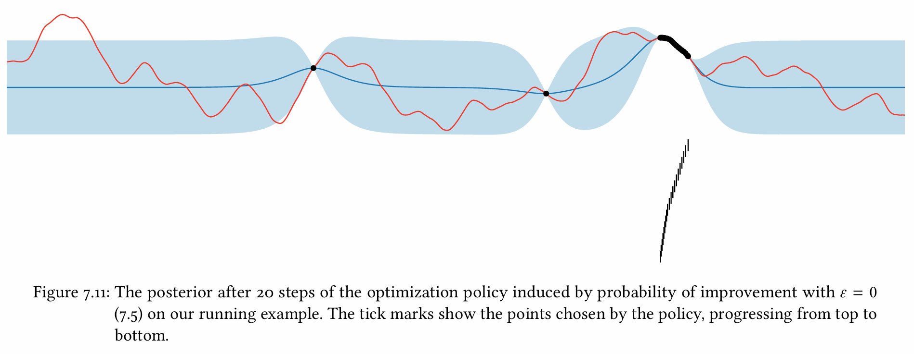
    - Extremely exploitative behavior 
    - Couldn't find the global optimum!

 

### Concept) Entropy Search
- Desc.)
  - A family of information theoretic optimization policies
  - Goal)
    - Maximize the posterior mean function
- Settings)
  - $`\omega`$ : a random variable that represents some unknown feature of the world
  - $`\mathcal{D}`$ : observations that provide considerable information about $`\omega`$
- How it relates to Bayes Opt)
  - We may use [information gain](./06.md#concept-information-gain) to relate the above concepts
    - cf.) Two definitions of the information gain $`u\mathcal{D}`$   
      $`u(\mathcal{D})=\begin{cases}
        H[w] - H[w\mid\mathcal{D}] \\
        D_{\text{KL}} (p(w\mid\mathcal{D}) \Vert p(w))
      \end{cases}`$

 

### Concept) Mutual Information
- Desc.)
  - An acquisition function in the [entropy search](#concept-entropy-search)
- Def.)
  - Let 
    - $`\omega`$ : a random variable with pdf $`p(\omega)`$
    - $`\psi`$ : a random variable with pdf $`p(\psi)`$
  - Then, the **mutual information** between $`\omega`$ and $`\psi`$ can be defined as
    - $`I(\omega;\psi) = \displaystyle\int\int p(\omega,\psi) \; \log\left(\frac{p(\omega,\psi)}{p(\omega)p(\psi)}\right) \text{d}\omega\text{d}\psi`$
      - cf.) This is identical to the [KL Divergence](https://github.com/JoonHyeok-hozy-Kim/ai_paper_study/blob/main/text_books/elmnts_info_theory/ch02/03/note.md#concept-relative-entropy-kullbackleibler-distance) between $`p(\omega,\psi)`$ and $`p(\omega)p(\psi)`$
        - i.e.) $`I(\omega;\psi) = D_{\text{KL}}\left[ p(\omega,\psi) \Vert p(\omega)p(\psi) \right]`$
  - We may condition the mutual information on our dataset as
    - $`I(\omega;\psi \mid \mathcal{D}) = \displaystyle\int\int p(\omega,\psi \mid \mathcal{D}) \; \log\left(\frac{p(\omega,\psi \mid \mathcal{D})}{p(\omega \mid \mathcal{D})p(\psi \mid \mathcal{D})}\right) \text{d}\omega\text{d}\psi`$
- Props.)
  - Symmetry
    - i.e.) $`I(\omega;\psi) = I(\psi;\omega)`$
  - If $`\omega`$ and $`\psi`$ are independent, $`I(\omega;\psi) = 0`$
    - cf.) Consider that $`p(\omega,\psi) = p(\omega)p(\psi)`$
  - The mutual information non negative.
    - Why?)
      - Recall that we recognized the mutual information $`I(\omega;\psi)`$ as the KL-Divergence between $`p(\omega,\psi)`$ and $`p(\omega)p(\psi)`$
      - And, KL Divergence is always non negative.
      - Thus, the case that $`\omega`$ and $`\psi`$ are independent has the minimum mutual information value of 0.
  - $`I(\omega;\psi)`$ is the expected decrease in the differential entropy of $`\omega`$ if we observe $`\psi`$, and vice versa.
    - pf.)   
      $`\begin{aligned}
        I(\omega;\psi) &= \int\int p(\omega,\psi) \; \log\left(\frac{p(\omega,\psi)}{p(\omega)p(\psi)}\right) \text{d}\omega\text{d}\psi \\
        &= \int\int p(\omega,\psi) \; \log\left(\frac{p(\omega,\psi)}{p(\psi)}\right) \text{d}\omega\text{d}\psi - \int\int p(\omega,\psi) \; \log\left(p(\omega)\right) \text{d}\omega\text{d}\psi \\
        &= \int\int p(\omega,\psi) \; \log\left(p(\omega\mid\psi)\right) \text{d}\omega\text{d}\psi \; \underbrace{- \int p(\omega) \; \log\left(p(\omega)\right) \text{d}\omega}_{\text{entropy}} \\
        &= \int\int \left(p(\psi) p(\omega\mid\psi)\right) \; \log\left(p(\omega\mid\psi)\right) \text{d}\omega \text{d}\psi + H[\omega] \\
        &= \int p(\psi) \left[ \int p(\omega\mid\psi) \log\left(p(\omega\mid\psi)\right) \text{d}\omega \right] \text{d}\psi + H[\omega] \\
        &= H[\omega] - \int p(\psi) \left[ -\int p(\omega\mid\psi) \log\left(p(\omega\mid\psi)\right) \text{d}\omega \right] \text{d}\psi \\
        &= H[\omega] -\mathbb{E}_{\psi}\left[ H[\omega\mid\psi] \right] \\
      \end{aligned}`$
    - cf.) Symmetry   
      $`\begin{aligned}
        I(\omega;\psi) &= H[\omega] -\mathbb{E}_{\psi}\left[ H[\omega\mid\psi] \right] \\
        &= H[\psi] -\mathbb{E}_{\omega}\left[ H[\psi\mid\omega] \right] \\
      \end{aligned}`$
  - $`I(\omega;\psi)`$ is the expected marginal [information gain](./06.md#concept-information-gain).
    - Thus, maximizing the mutual information can be a policy!
    - pf.)
      - Recall that the [information gain](./06.md#concept-information-gain) was defined as...
        - Case 1)   
          $`u(\mathcal{D}) = \underbrace{H[\omega]}_{\text{entropy from prior}} - \underbrace{H[\omega\mid\mathcal{D}]}_{\text{entropy from posterior}}`$ 
          - Then, the marginal information gain can be defined as   
            - $`u(\mathcal{D}')-u(\mathcal{D}) = H[\omega\mid\mathcal{D}] - H[\omega\mid\mathcal{D}']`$
              - where $`\mathcal{D}' = \mathcal{D}\cup\{(x,y)\}`$
          - Calculating the expectation over the unknown observation $`y\sim p(y\mid x,\mathcal{D})`$, we may get the expected marginal information gain as   
            $`\begin{aligned}
              \alpha_{\text{MI}}(x;\mathcal{D}) &= \mathbb{E}_{y\sim p(y\mid x,\mathcal{D})} \left[ u(\mathcal{D}')-u(\mathcal{D}) \right] \\
              &= \mathbb{E}_{y\sim p(y\mid x,\mathcal{D})} \left[ H[\omega\mid\mathcal{D}] - H[\omega\mid\mathcal{D}'] \right] \\
              &= H[\omega\mid\mathcal{D}] -\mathbb{E}_{y\sim p(y\mid x,\mathcal{D})} \left[ H[\omega\mid\mathcal{D}'] \right] \\
              &= H[\omega\mid\mathcal{D}] - \mathbb{E}_{y\sim p(y\mid x,\mathcal{D})} \left[ H[\omega\mid\mathcal{D}'] \right] \\
              &= I(\omega;y \mid x,\mathcal{D})
            \end{aligned}`$
        - Case 2)    
          $`\begin{aligned}
              u(\mathcal{D}) &= D_{\text{KL}} \left[ p(\omega\mid\mathcal{D}) \Vert p(\omega) \right] \\
              &= \int p(\omega\mid\mathcal{D}) \log \left(\frac{p(\omega\mid\mathcal{D})}{p(\omega)}\right) \text{d}\omega \\
              &= \int p(\omega\mid\mathcal{D}) \log p(\omega\mid\mathcal{D}) \text{d}\omega - \int p(\omega\mid\mathcal{D}) \log p(\omega) \text{d}\omega \\
              &= -H[\omega\mid\mathcal{D}]- \int p(\omega\mid\mathcal{D}) \log p(\omega) \text{d}\omega \\
          \end{aligned}`$
          - Also, the expected utility of choosing $`(x,y)`$ can be denoted as   
            $`\begin{aligned}
              \mathbb{E}_{y\sim p(y\mid x,\mathcal{D})} \left[ u(\mathcal{D}') \right] &= \mathbb{E}_{y\sim p(y\mid x,\mathcal{D})} \left[ \int p(\omega\mid\mathcal{D}') \log \left(\frac{p(\omega\mid\mathcal{D}')}{p(\omega)}\right) \text{d}\omega \right] \\
              &= \mathbb{E}_{y\sim p(y\mid x,\mathcal{D})} \left[ \int p(\omega\mid\mathcal{D}') \log p(\omega\mid\mathcal{D}') \text{d}\omega \right] - \underbrace{\mathbb{E}_y \left[ \int p(\omega\mid\mathcal{D}') \log p(\omega) \text{d}\omega \right]}_{\text{the cross entropy term}} \\
              &= -\mathbb{E}_y \left[ H[w\mid\mathcal{D}'] \mid  x,\mathcal{D} \right] - \underbrace{\int p(\omega \mid x, \mathcal{D}) \log p(\omega) \, d\omega}_{\text{Refer to the pf. below}}
            \end{aligned}`$
            - The latter cross entropy term can be derived as   
             $`\begin{aligned}
              \mathbb{E}_{y\sim p(y\mid x,\mathcal{D})} \left[ \int p(\omega\mid\mathcal{D}') \log p(\omega) \text{d}\omega \right] &= \int\left[ \int p(\omega\mid\mathcal{D}') \log p(\omega)\text{d}\omega \right] \; p(y\mid x,\mathcal{D}) \text{d}y \\
              &= \int \int \left[ p(\omega\mid\mathcal{D}') p(y\mid x,\mathcal{D}) \text{d}y \right] \log p(\omega)\text{d}\omega \\
              &= \int \int \left[ \frac{p(\omega,y\mid x,\mathcal{D})}{p(y\mid x,\mathcal{D})} p(y\mid x,\mathcal{D}) \text{d}y \right] \log p(\omega)\text{d}\omega \\
              &= \int \int \left[ p(\omega,y\mid x,\mathcal{D}) \text{d}y \right] \log p(\omega)\text{d}\omega \\
              &= \int  p(\omega\mid x,\mathcal{D}) \log p(\omega)\text{d}\omega \\
             \end{aligned}`$
          - Thus, the marginal information gain can be defined as     
            $`\begin{aligned}
              \mathbb{E}_{y\sim p(y\mid x,\mathcal{D})} \left[ u(\mathcal{D}') \right]-u(\mathcal{D}) &= H[\omega\mid\mathcal{D}] -\mathbb{E}_y \left[ H[\omega\mid\mathcal{D}'] \mid  x,\mathcal{D} \right] \\
              &= I(\omega;y \mid x,\mathcal{D})
            \end{aligned}`$
    - Prop.)
      - Symmetry still holds.   
        $`\begin{aligned}
          I(\omega;y \mid x,\mathcal{D}) &= H[\omega\mid\mathcal{D}] -\mathbb{E}_y \left[ H[\omega\mid\mathcal{D}'] \mid  x,\mathcal{D} \right] \\
          &= H[y\mid\mathcal{D}] -\mathbb{E}_\omega \left[ H[y\mid \omega,x,\mathcal{D}] \mid  x,\mathcal{D} \right] \\
        \end{aligned}`$
- Application)
  - We may get various models by selecting various $`\omega`$.
  - Here, we consider to cases $`\omega = x^*`$ and $`\omega=f^*`$   
    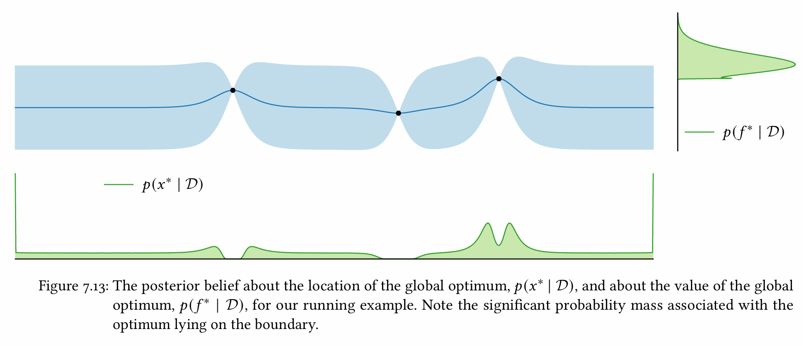   
    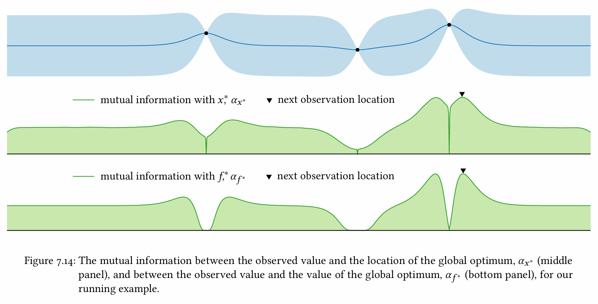   
  - MI with $`x^*`$ (location of global optimum)
    - Settings)
      - Acquisition Function)
        - $`\alpha_{x^*}(x;\mathcal{D}) = I(y;x^*\mid x,\mathcal{D})`$   
          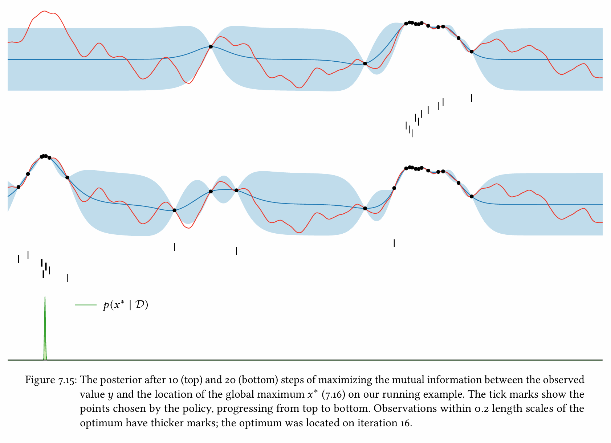   
  - MI with $`f^*`$ (global optimum)
    - Settings)
      - Acquisition Function)
        - $`\alpha_{f^*}(x;\mathcal{D}) = I(y;f^*\mid x,\mathcal{D})`$   
          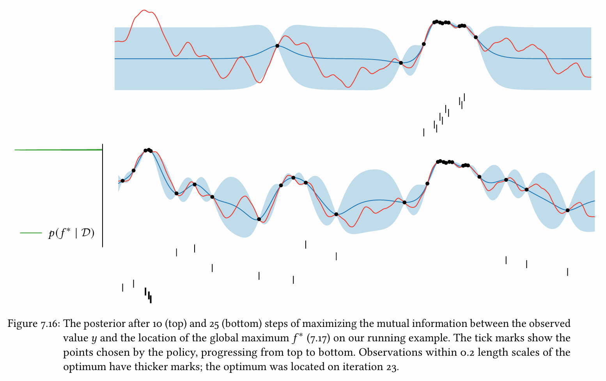   

 

### Concept) Multi-Armed Bandit and Optimization
- Desc.)
  - A model system for sequential decision making under uncertainty
  - A particular finite dimensional analog of sequential optimization
- Settings)
  - $`\mathcal{X}`$ : a finite set of "arms"
  - an agent selects a sequence of $`\{x_1,\cdots,x_n\}\in\mathcal{X}`$
  - $`y`$ : a stochastic reward drawn from an **unknown distribution** $`p(y\mid x)`$ associated with the arm $`x`$
    - where
      - Rewards are independent of time and conditionally independent given the chosen arm.
  - $`\phi = \mathbb{E}[y\mid x]`$ : the expected reward
  - $`\mathbf{f} = \begin{bmatrix} \phi_1 & \cdots & \phi_n \end{bmatrix} = \begin{bmatrix} \mathbb{E}[y_1\mid x_1] & \cdots & \mathbb{E}[y_n\mid x_n] \end{bmatrix} \in\mathbb{R}^n`$
- Model)
  - The agent's goal is to maximize the [cumulative reward](./06.md#concept-cumulative-reward) $`\displaystyle\sum_{i=1}^n y_i`$ 
    - i.e.)
      - $`x^* \in \displaystyle\arg\max_{x\in\mathcal{X}} \mathbb{E}[y\mid x] = \arg\max \mathbf{f}`$ : an arm with maximal expected reward
      - $`f^* = \displaystyle\max_{x\in\mathcal{X}} \mathbb{E}[y\mid x] = \max\mathbf{f}`$ : maximal expected reward
  - Since $`p(y\mid x)`$ is unknown to the agent, it should be learned from observations $`\mathcal{D}`$
    - Exploration-Exploitation Dilemma
      - Exploration : select an arm believed to have high expected reward
      - Exploitation : sample an uncertain arm to better understand its reward distribution
- Methodologies)
  - [Bayesian Perspective](#concept-bayesian-optimal-policy-for-multi-armed-bandit)
  - Frequentist Perspective

 

### Concept) Bayesian Optimal Policy for Multi-Armed Bandit
- Settings)
  - Following the original [Multi-Armed Bandit](#concept-multi-armed-bandit-and-optimization) problem, we have
    - $`\mathcal{X}`$ : a finite action space
    - $`\mathbf{f}`$ : the expected reward vector
  - $`\tau`$ : the number of decisions made
    - $`\mathcal{D}_\tau = (\mathbf{x_\tau, y_\tau})`$ : the dataset
    - $`u(\mathcal{D}_\tau) = \displaystyle\sum y_i`$ : the cumulative reward
- Model)
  - Choose a prior over the expected rewards : $`p(\mathbf{f})`$
  - Identify the observation model
    - $`\phi`$ : an observation model for the observed rewards given the index of an arm
    - $`p(y\mid x,\phi)`$ : the expected reward
  - Then, we may derive a posterior belief about the expected rewards of $`p(\mathbf{f}\mid\mathcal{D})`$
  - Optimal Policy
    - Optimal decision for the last round goes
      - $`x_\tau \in\arg\max\mathbb{E}[\mathbf{f}\mid\mathcal{D}_{\tau-1}]`$
- Limit)
  - The computational cost increases exponentially with the horizon $`\tau`$.
  - Multi-armed bandit assumes the independence between each arms, but the prior in the Bayes Opt assumes the dependence between them.

 

#### Concept) Optimism in the Face of Uncertainty
- Desc.)
  - An effective heuristic for balancing the dilemma between exploration and exploitation for the [bandit](#concept-multi-armed-bandit-and-optimization) algorithms
- How?)
  - Use any available data to both 
    - estimate the expected reward of each arm
    - quantify the uncertainty in theses estimates
  - When faced with a decision, select the arm that would be optimal when allowing the benefit of the doubt.
    - i.e.) Choose the arm with the highest plausible expected reward given the currently available information
      - Unexplored arms are given exploration bonus
- e.g.)
  - [Maximizing a Statistical Upper Bound](#concept-maximizing-a-statistical-upper-bound)

### Concept) Maximizing a Statistical Upper Bound
- Def.)
  - Assume a posterior predictive distribution of the function value $`\phi`$ as
    - $`\phi\sim p(\phi\mid x,\mathcal{D})`$
      - i.e.) the posterior predictive distribution of $`\phi=f(x)`$ given the dataset $`\mathcal{D}`$
  - Define a quantile function $`q:[0,1]\times\mathcal{X}\rightarrow\mathcal{Y}`$ as
    - $`q(\pi;x,\mathcal{D}) = \inf\left\{ \phi' \mid \text{Pr}(\phi\le\phi' \mid x,\mathcal{D}) \ge \pi \right\}`$ 
      - i.e.) 
        - $`q(\pi;x,\mathcal{D})`$ returns the function value $`\phi'`$ that satisfies
          - $`\phi\le q(\pi;x,\mathcal{D})`$ with probability $`\pi`$
      - e.g.)
        - Suppose $`\pi=0.95`$.
        - Consider the cdf of $`p(\phi\mid x,\mathcal{D})`$ .
        - Then $`\exists x'\in\mathcal{X}`$ s.t. $`\text{Pr}(\phi\le\phi'=f(x')\mid x,\mathcal{D}) = 0.95`$   
          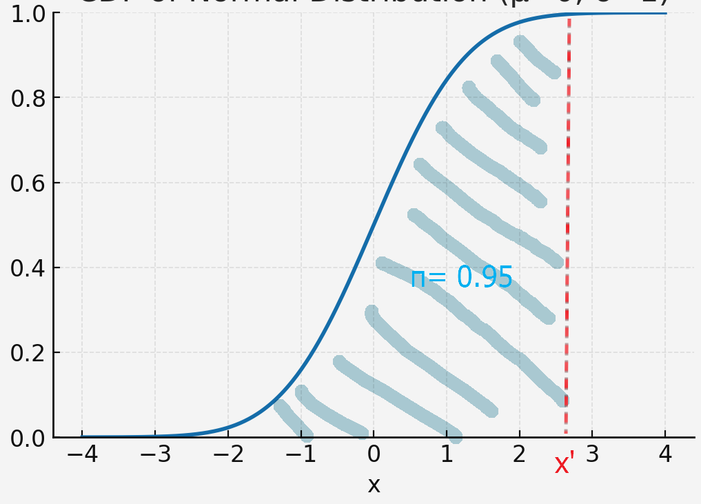
        - $`q(0.95;x,\mathcal{D}) = \phi'`$
    - Props.)
      - We may interpret $`q`$ as 
        - a statistical **upper confidence bound (UCB)** on $`\phi`$
        - an optimistic estimate of the entire objective function $`f`$
- Policy)
  - [Principle of Optimism](#concept-optimism-in-the-face-of-uncertainty) 
    - Observe $`x`$ where the upper confidence bound $`q`$ is maximized!
    - Thus, the acquisition function goes
      - $`\alpha_{\text{UCB}} = q(\pi;x,\mathcal{D})`$
- Application)
  - $`\alpha_{\text{UCB}}`$ for $`\pi=0.8,0.95,0.999`$   
    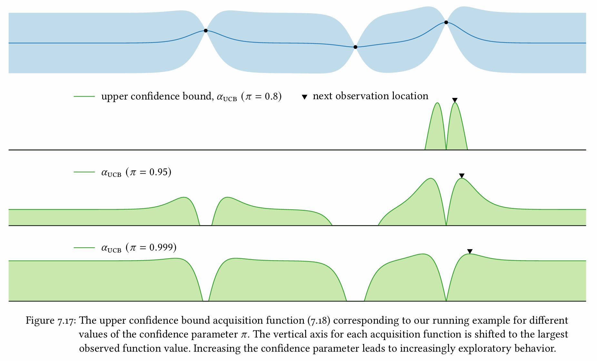
    - Desc.)
      - Low confidence value ($`\pi=0.8`$) gives little credit to locations with high certainty.
        - i.e.) heavily favor the **exploitation**!
      - High confidence value favors the **exploration**.
  - Sequentially maximizing UCB to gather 20 additional observations ($`\pi=0.999`$).   
    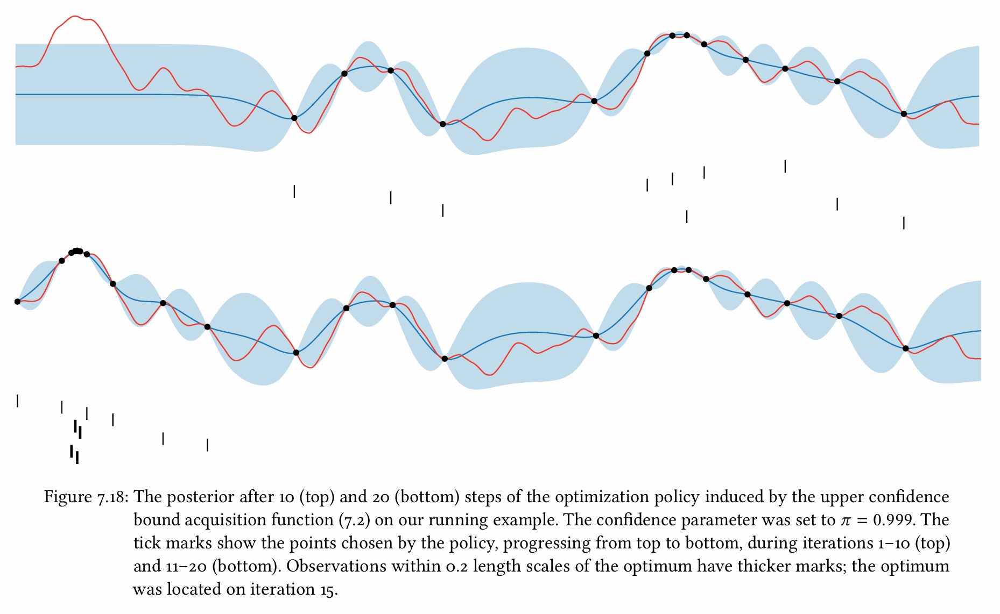
- How to choose $`\pi`$
  - For some objective functions such as GP, a point maximizing the [PI over a given threshold $`\tau`$](#concept-probability-of-improvement-pi) also maximizes an **upper confidence bound** for some confidence parameter $`\pi`$.
  - Most authors select relatively large values in the approximate range $`\pi\in(0.98,1)`$.
    - e.g.) $`\pi\approx0.999`$
- Props.)
  - The policy that sequentially maximizes the UCBs has strong theoretical guarantees.
    - e.g.)
      - Srinivas et al. *Gaussian Process Optimization in the Bandit Setting: No Regret and Experimental Design*
        - For the GP models, this policy is guaranteed to effectively maximize the objective at a nontrivial rate under reasonable assumptions.

 

### Concept) Thompson Sampling
- Goal)
  - We want to find
    - $`x^* = \displaystyle\arg\max_{x\in\mathcal{X}} f(x)`$ : the location of the global maximum
    - $`p(x^*\mid\mathcal{D})`$ : the posterior distribution of $`x^*`$
  - However, we do not know what $`p(x^*\mid\mathcal{D})`$ looks like.
- Model)
  - Sample a random realization of the objective function $`f`$ from its posterior $`p(f\mid\mathcal{D})`$.
  - Set this sample function to be the acquisition function $`\alpha_{\text{TS}}`$ as
    - $`\alpha_{\text{TS}}(x;\mathcal{D}) \sim p(f\mid\mathcal{D})`$
  - Set a policy to maximize this acquisition function as
    - $`x\in\displaystyle\arg\max_{x'\in\mathcal{X}} \alpha_{\text{TS}}(x';\mathcal{D})`$
      - i.e.) Choose the next observation point $`x`$ to be the location that had the maximum value on $`\alpha_{\text{TS}}`$
- Application)
  - Three $`\alpha_{\text{TS}}`$ samples and their values   
    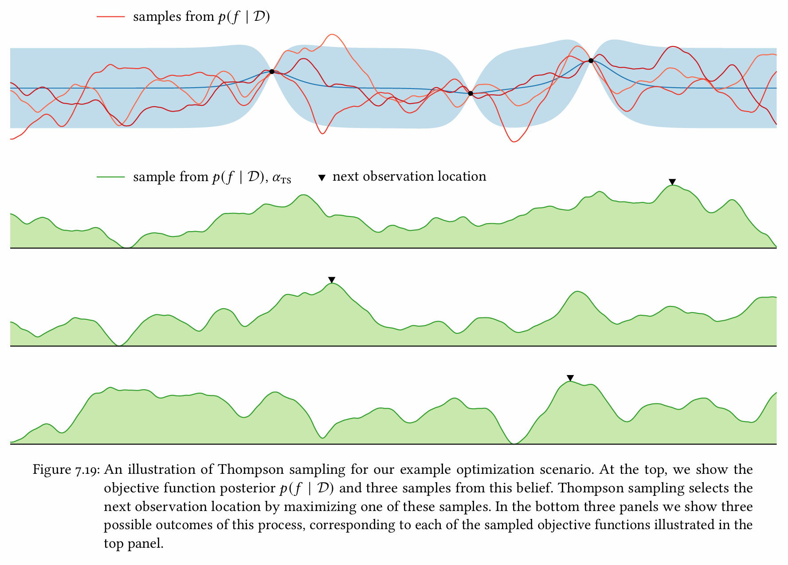
  - Sequentially maximizing TS to gather 15 additional observations.      
    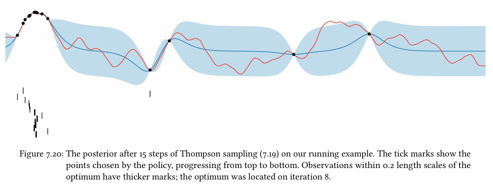

 

### Concept) 

  

[Back to Main](../main.md)