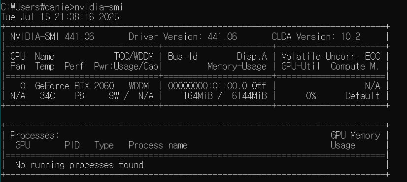
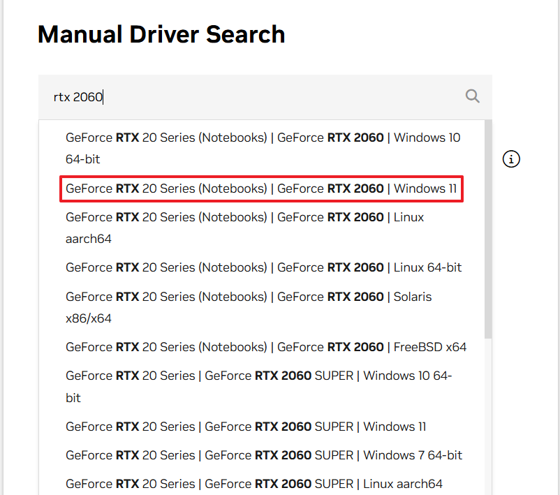
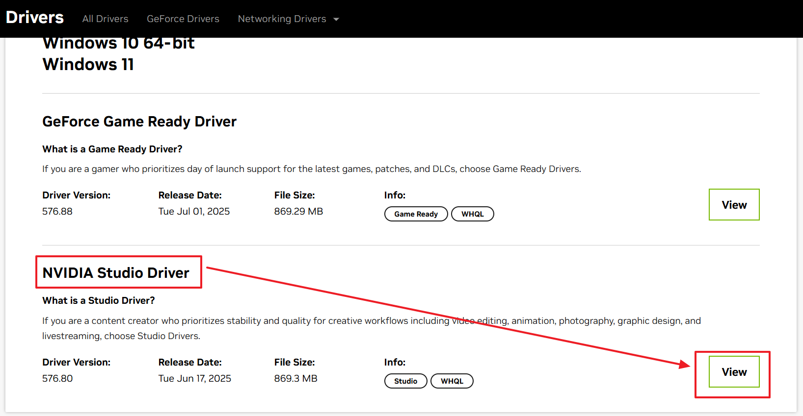
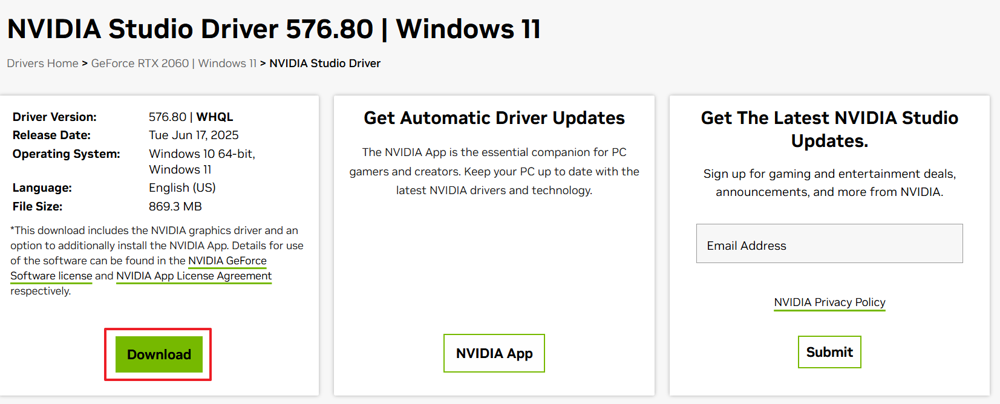
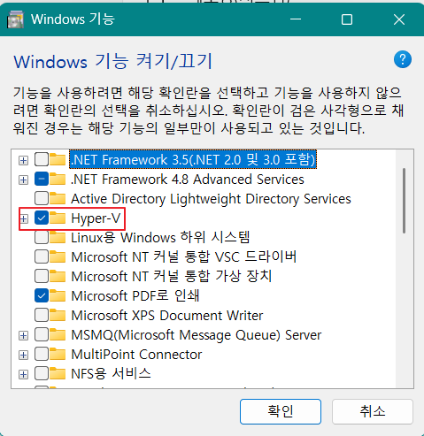
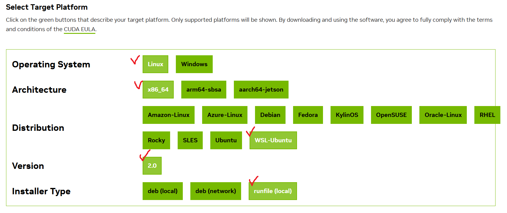
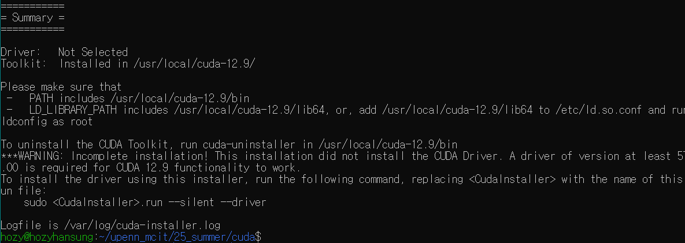
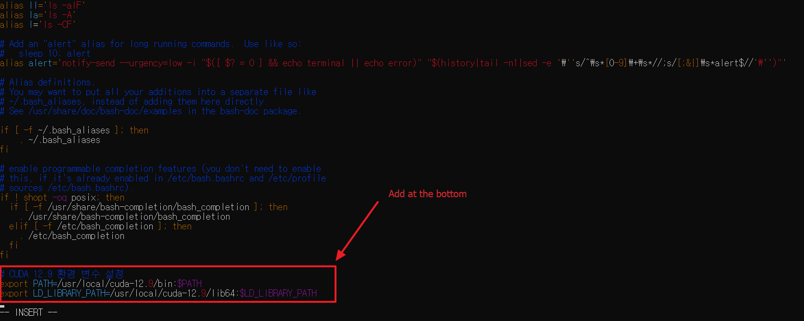
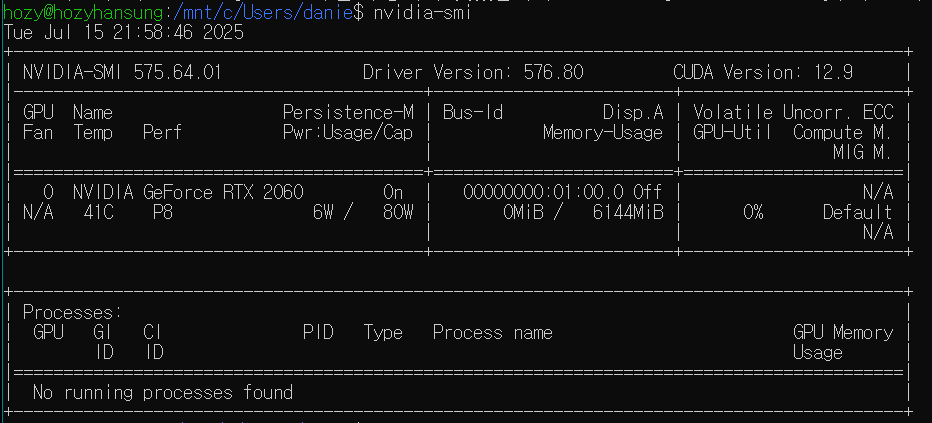

[Back to Main](../main.md)

# CUDA Setup

### 0. Windows Nvidia Driver 확인 및 설치
- Windows cmd에서 쳐보기
  ```sh
  nvidia-smi
  ```
     


- Driver 설치하기 ([여기서](https://developer.nvidia.com/cuda/wsl))   
     
     
       
  - 다운로드 받아서 설치
- 재부팅


### 1. wsl - Ubuntu




```shell
wsl --install Ubuntu-18.04
```

```sh
sudo apt update && sudo apt upgrade -y
```

```sh
sudo apt install wget curl git
```

```sh
sudo apt install python3-pip
```

### 2. CUDA Toolkit

Go to [install page](https://developer.nvidia.com/cuda-downloads)   



```sh
wget https://developer.download.nvidia.com/compute/cuda/12.9.1/local_installers/cuda_12.9.1_575.57.08_linux.run
```

```sh
sudo sh cuda_12.9.1_575.57.08_linux.run
```




Add paths at the bottom of `~/.bashrc`.

```sh
# CUDA 12.9 환경 변수 설정
export PATH=/usr/local/cuda-12.9/bin:$PATH
export LD_LIBRARY_PATH=/usr/local/cuda-12.9/lib64:$LD_LIBRARY_PATH
```

```sh
source ~/.bashrc
```

Compiler nvcc check
```sh
nvcc --version
```

GPU Check
```sh
nvidia-smi
```


<br>

### 3. Check if nvcc is working properly
Create `main.cu` as
```cpp
#include <iostream>

using namespace std;

int main(){
        cout << "Hello world!" << endl;
}
```

Compile it using nvcc as
```sh
nvcc -o main main.cu
```

Run the executable
```sh
./main
```


<br><br>

[Back to Main](../main.md)